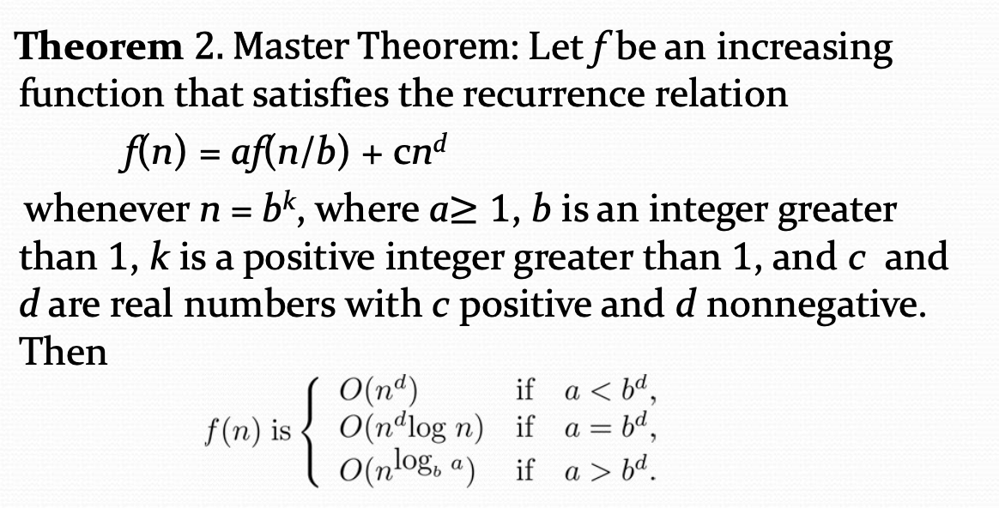
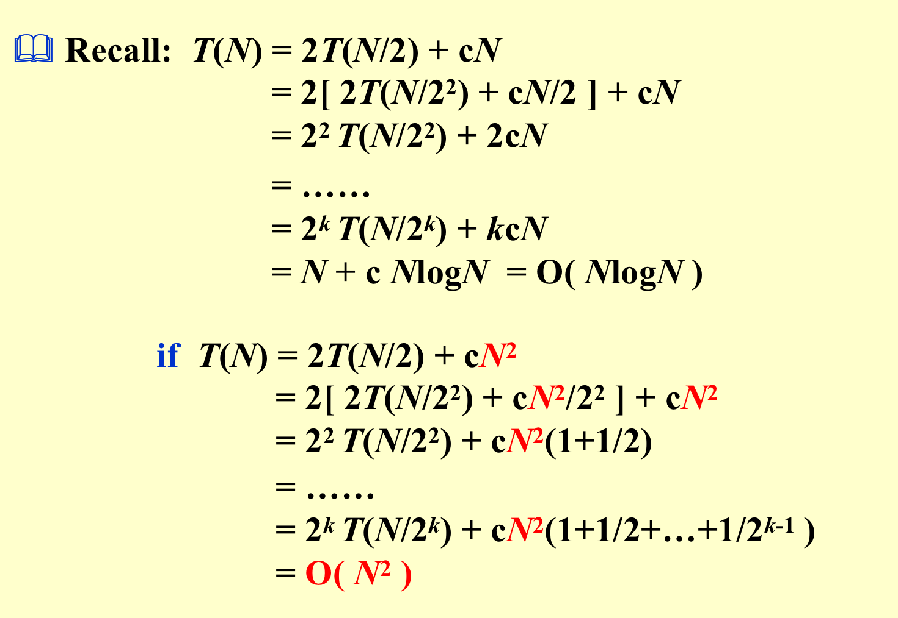
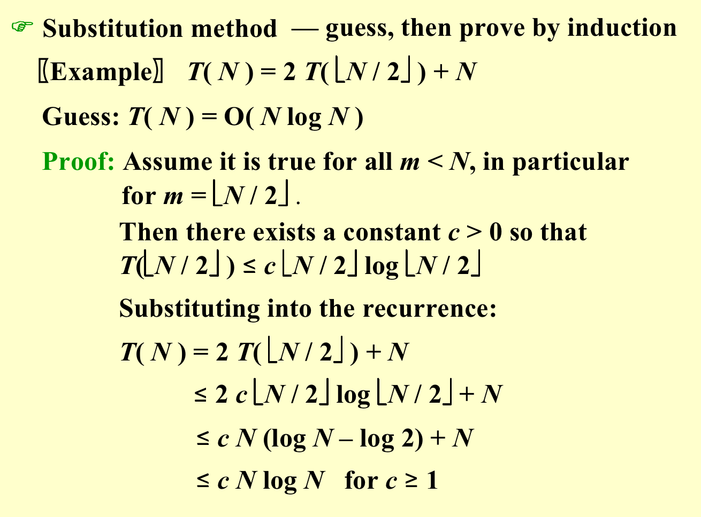
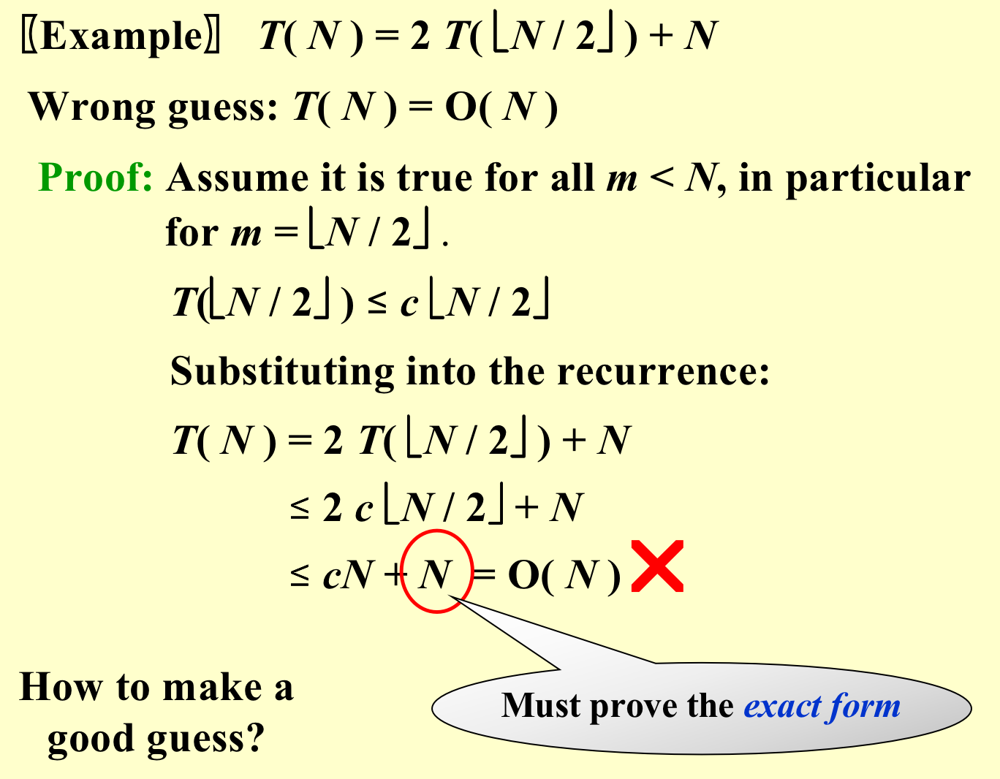
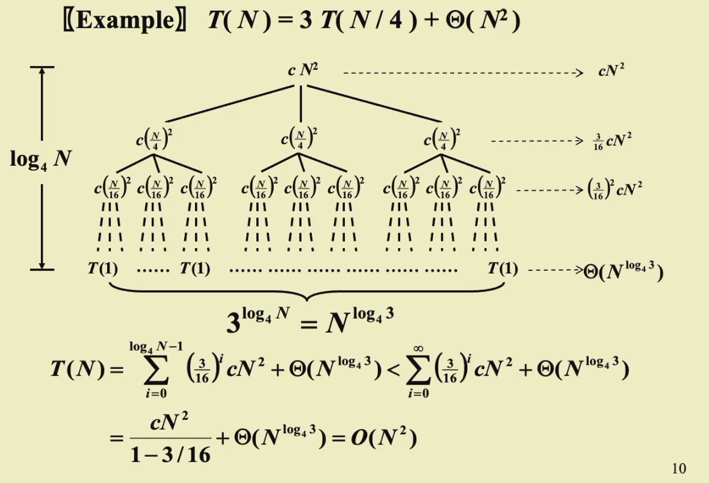
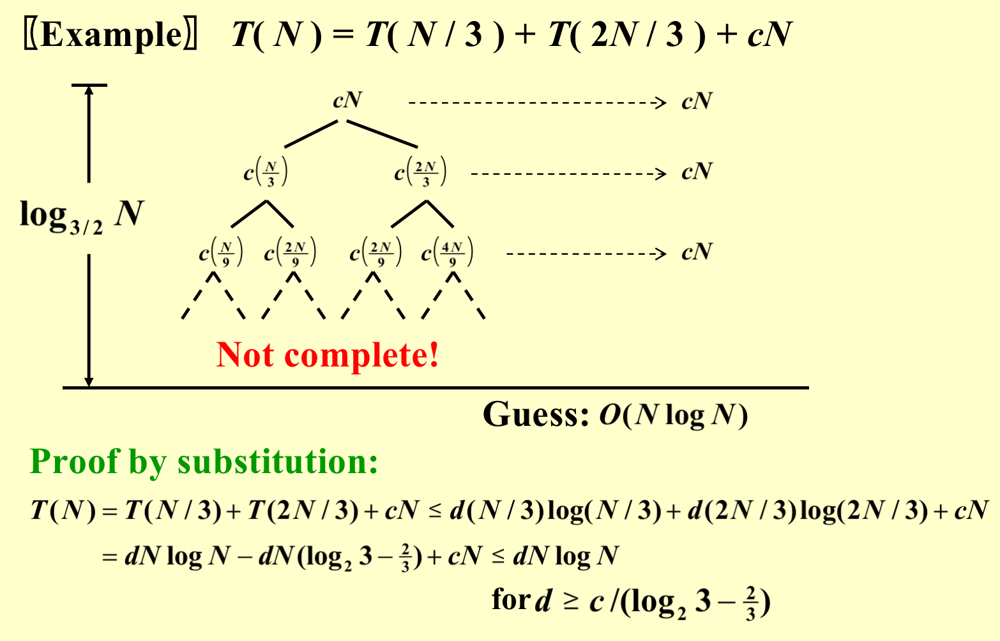
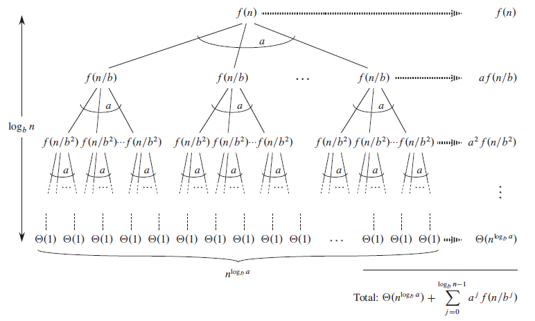
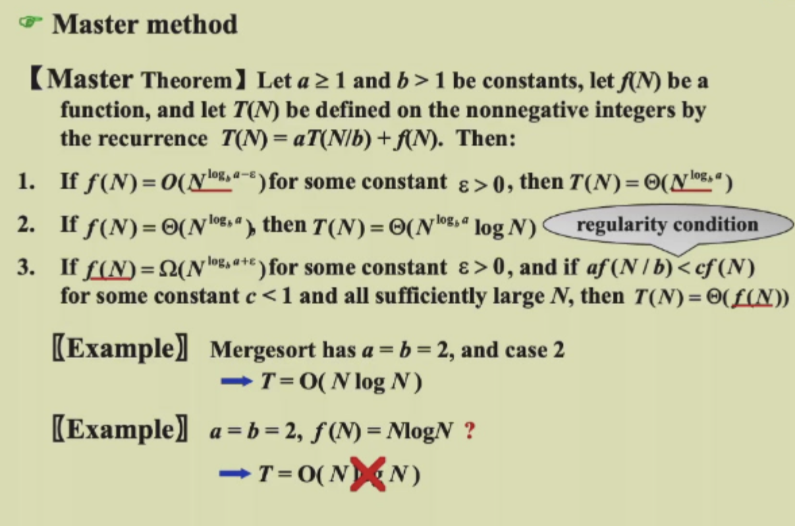

<font face = 'Times New Roman'>

# Divide and Conquer

> Main Idea

* Divide the problem into a number of sub-problems
* Conquer the sub-problems by solving them recursively
* Combine the solutions to the sub-problems into the solution for the original problem

General recurrence:   $T(N) = aT(N/b) + f(N)$





## Example

### Maximum Subsequence Sum Problem

* $O(nlogn)$

```C
static int MaxSubSum(const int A[],int left,int right){
    		int MaxLeftSum, MaxRightSum;
    		int MaxLeftBorderSum, MaxRightBorderSum; 
        int LeftBorderSum, RightBorderSum;
        int Center, i;
        if( left == right ){
            if(A[left]>0){return A[left];}
            else{return 0;}
        }
        Center = ( Left +Right ) / 2;
        MaxLeftSum = MaxSubSum( A, Left, Center ) 
        MaxRightSum = MaxSubSum( A, Center + 1, Right );
        MaxLeftBorderSum = 0; LeftBorderSum = 0;
        for(i=Center+1;i>=left;i--){
            LeftBorderSum += A[i];
            if(leftBorderSum>MaxleftBorderSum){
                MaxleftBorderSum = LeftBorderSum;
            }
        }
        MaxRightBorderSum = 0; 
        RightBorderSum = 0;
        for(i=Center;i<=Right;i++){
            RightBorderSum += A[i];
            if(RightBorderSum > MaxRightBorderSum){
                MaxRightBOrderSum = RightBorderSum
            }
    }
    return Max(MaxLeftSum,MaxRightSum,MaxLeftBorderSum+MaxRightBorderSum);
}
int MaxsubsequenceSum( const int A[],intN) {
    return MaxSubSum( A, 0, N - 1 );}
```

### Tree Traversal

Given a postorder traversal of a binary tree, and an inorder traversal of the same tree, we can reconstruct the tree. 

* Example : 
```
Postorder : DEBFCA
Inorder	  : DBEACF
```
```C
void BuildTree(int postL, int postR, int inL, int inR){
	if(postL>postR){return;}
	int root = postorder[postR];
	int k;
	for(k=inL;k<=inR;k++){
		if(inorder[k]==root){break;}
	}
	int numLeft = k-inL;
	BuildTree(postL,postL+numLeft-1,inL,k-1);
	BuildTree(postL+numLeft,postR-1,k+1,inR);
}
```
### Closest Points Problem

We are given an array of n points in the plane, and the problem is to find out the closest pair of points in the array. This problem arises in a number of applications. For example, in air-traffic control, you may want to monitor planes that come too close together, since this may indicate a possible collision. 

The Brute force solution is $O(n^2)$ , compute the distance between each pair and return the smallest. We can calculate the smallest distance in $O(nlogn)$ time using **Divide and Conquer** strategy.

####  $O(n  (logn)^2)$​ approach

**Input:** An array of n points `P[ ]`

**Output:** The smallest distance between two points in the given array.

As a pre-processing step, the input array is **sorted** according to **x coordinates**.

**1)** Find the middle point in the sorted array, we can take `P[n/2]` as middle point. 
**2)** Divide the given array in two halves. The first subarray contains points from `P[0]` to `P[n/2]`. The second subarray contains points from `P[n/2+1]` to `P[n-1]`.
**3)** Recursively find the smallest distances in both subarrays. Let the distances be $d_l$ and $d_r$. Find the minimum of $d_l$ and $d_r$. Let the minimum be $d$​.

**4)** From the above 3 steps, we have an **upper bound** $d$ of minimum distance. Now we need to consider the pairs such that one point in pair is from the left half and the other is from the right half. Consider the **vertical line** passing through `P[n/2]` and find all points whose **x coordinate** is closer than $d$​ to the middle vertical line. Build an array `strip[ ]` of all such points. 


**5)** Sort the array `strip[ ]` according to $y$ coordinates. 

* This step is $O(nlogn)$. 
* It can be optimized to $O(n)$​​ by recursively sorting and merging. 

**6)** Find the smallest distance in `strip[ ]`. This is tricky. From the first look, it seems to be a $O(n^2)$ step, but it is actually $O(n)$​​. It can be proved geometrically that for every point in the strip, we only need to check **at most 7 points** after it (note that strip is sorted according to Y coordinate). See [this ](http://people.csail.mit.edu/indyk/6.838-old/handouts/lec17.pdf)for more analysis.

<iframe src="https://drive.google.com/viewerng/viewer?url=https://people.csail.mit.edu/indyk/6.838-old/handouts/lec17.pdf&amp;embedded=true" allowfullscreen="" frameborder="0" height="780" width="700" title="" class="eo n ff dy bg" scrolling="no" style="box-sizing: inherit; top: 0px; width: 850px; height: 884px; left: 0px;"></iframe>

**7)** Finally return the minimum of d and distance calculated in the above step **(step 6)**

```C
// A divide and conquer program in C/C++ to find the smallest distance from a
// given set of points.

#include <stdio.h>
#include <float.h>
#include <stdlib.h>
#include <math.h>

// A structure to represent a Point in 2D plane
struct Point{
	int x, y;
};

// Needed to sort array of points according to X coordinate
int compareX(const void* a, const void* b){
	Point *p1 = (Point *)a, *p2 = (Point *)b;
	return (p1->x - p2->x);
}
// Needed to sort array of points according to Y coordinate
int compareY(const void* a, const void* b){
	Point *p1 = (Point *)a, *p2 = (Point *)b;
	return (p1->y - p2->y);
}

// A utility function to find the distance between two points
float dist(Point p1, Point p2){
	return sqrt( (p1.x - p2.x)*(p1.x - p2.x) +
				(p1.y - p2.y)*(p1.y - p2.y)
			);
}
// A Brute Force method to return the smallest distance between two points
// in P[] of size n
float bruteForce(Point P[], int n){
	float min = FLT_MAX;
	for (int i = 0; i < n; ++i)
		for (int j = i+1; j < n; ++j)
			if (dist(P[i], P[j]) < min)
				min = dist(P[i], P[j]);
	return min;
}

// A utility function to find a minimum of two float values
float min(float x, float y)
{
	return (x < y)? x : y;
}

// A utility function to find the distance between the closest points of
// strip of a given size. All points in strip[] are sorted according to
// y coordinate. They all have an upper bound on minimum distance as d.
// Note that this method seems to be a O(n^2) method, but it's a O(n)
// method as the inner loop runs at most 6 times
float stripClosest(Point strip[], int size, float d)
{
	float min = d; // Initialize the minimum distance as d

	qsort(strip, size, sizeof(Point), compareY); 

	// Pick all points one by one and try the next points till the difference
	// between y coordinates is smaller than d.
	// This is a proven fact that this loop runs at most 6 times
	for (int i = 0; i < size; ++i)
		for (int j = i+1; j < size && (strip[j].y - strip[i].y) < min; ++j)
			if (dist(strip[i],strip[j]) < min)
				min = dist(strip[i], strip[j]);

	return min;
}

// A recursive function to find the smallest distance. The array P contains
// all points sorted according to x coordinate
float closestUtil(Point P[], int n)
{
	// If there are 2 or 3 points, then use brute force
	if (n <= 3)
		return bruteForce(P, n);
	// Find the middle point
	int mid = n/2;
	Point midPoint = P[mid];
	// Consider the vertical line passing through the middle point
	// calculate the smallest distance dl on left of middle point and
	// dr on right side
	float dl = closestUtil(P, mid);
	float dr = closestUtil(P + mid, n-mid);
	// Find the smaller of two distances
	float d = min(dl, dr);
	// Build an array strip[] that contains points close (closer than d)
	// to the line passing through the middle point
	Point strip[n];
	int j = 0;
	for (int i = 0; i < n; i++)
		if (abs(P[i].x - midPoint.x) < d)
			strip[j] = P[i], j++;

	// Find the closest points in strip. Return the minimum of d and closest
	// distance is strip[]
	return min(d, stripClosest(strip, j, d) );
}

// The main function that finds the smallest distance
// This method mainly uses closestUtil()
float closest(Point P[], int n)
{
	qsort(P, n, sizeof(Point), compareX);

	// Use recursive function closestUtil() to find the smallest distance
	return closestUtil(P, n);
}

// Driver program to test above functions
int main(){
	Point P[] = { {2, 3}, {12, 30}, {40, 50}, {5, 1}, {12, 10}, {3, 4}};
	int n = sizeof(P) / sizeof(P[0]);
	printf("The smallest distance is %f ", closest(P, n));
	return 0;
}
```
####  $O(nlogn)$​ approach 

## Solving Recurrences

### Substitution method : Guess and prove by induction

> Makeing a good guess





### Recursion-tree method 
* Guess a bound for the substitution method


### Master method
* $N^{\log_ba}$ is "number of leaves" in the recursion tree.




#### Proof
**Case 1**
If $f(N) = O(N^{\log_ba-\epsilon})$ for some $\epsilon > 0$, then $T(N) = \Theta(N^{\log_ba})$
> **Proof:**(Refer to Slides)

$$\begin{align*}\sum_{i=0}^{\log_bN-1}a^if(N/b^i) &= O(N^{log_b{a-\epsilon} }\frac{b^{\epsilon log_bN}-1}{b^\epsilon-1})\\&=O(N^{\log_ba-\epsilon}N^{\epsilon})\\&=O(N^{\log_ba})\end{align*}$$

Therefore : $T(N) = \Theta(N^{\log_ba})+O(N^{\log_ba}) =\Theta(N^{\log_ba})$

**Case 2**
If $f(N) = \Theta(N^{\log_ba})$, then $T(N) = \Theta(N^{\log_ba}\log N)$
> Proof 

$$\begin{align*}\sum_{i=0}^{\log_bN-1}a^if(N/b^i) &= \sum_{i=0}^{\log_bN-1}a^i\Theta((\frac{N}{b^i})^{\log_ba})\\&=\Theta(N^{\log_ba}\sum_{i=0}^{\log_bN-1}(\frac{a}{b^{log_ba} })^i)\\&=\Theta(N^{\log_ba}\sum_{i=0}^{\log_bN-1}(1)\\&=\Theta(N^{\log_ba}\log N)\end{align*}$$

Therefore : $T(N) = \Theta(N^{\log_ba}\log N) + O(N^{\log_ba}) = \Theta(N^{\log_ba}\log N)$
**Case 3**
If $f(N) = \Omega(N^{\log_ba+\epsilon})$ for some $\epsilon > 0$, if $af(N/b) \leq kf(N)$ for some $k<1$ and sufficiently large $N$, then $T(N) = \Theta(f(N))$

> Proof

$$\begin{align*}\sum_{i=0}^{\log_bN-1}a^if(N/b^i) &= \Omega(N^{\log_ba+\epsilon}\frac{b^{\epsilon log_bN}-1}{b^\epsilon-1})\\&=\Omega(N^{\log_ba+\epsilon}N^{\epsilon})\\&=\Omega(N^{\log_ba+\epsilon})\end{align*}$$

Therefore : $T(N) = \Theta(f(N))$
</font>

