<font face = 'Times New Roman'>

* We can build heap by $T_a=O(n)/n=O(1)$ , Therefore , we try to delete/insert the heap with time complexity less. say $T_a=O(1)$​
* HW 4: https://blog.csdn.net/ZJU_fish1996/article/details/50992928
## Leftist Heaps

### Definition

#### Def.1

The null path length, $Npl(X)$, of any node $X$ is the length of the shortest path from $X$ to a node without two children.  Define $Npl(NULL) = –1$.

#### Def.2

The leftist heap property is that for every node $X$​ in the heap, the null path length of the left child is at least **as large as** that of the right child.

#### Theorem.1

A leftist tree with $r$ nodes on the right path must have at least $2^r – 1$​ nodes.

* For right subtree

  **For the tree,left path actually all equals to its roots' NPL**

  1. $r=1$ clearly holds

  2. If $NLP(X)=r\le k$ holds then if $NLP(X)=r=k+1:$​ 

     Its right subtree must have $NLP(X)=k$

     $\because when\ NLP(X)= k \ right \ path \ has \ at\ least\  2^k-1\ nodes$​

     So all the right part at least $2^k-1$

* For left subtree

  1. $r=1$ clearly holds

  2. If $NLP(X)\le k$ holds then if $NLP(X)=k+1:$ 

     Its left subtree's right path must be $\ge k$​

     So at least right path is k, so at least $2^k-1$ for the left part

* Thus $2^k-1+2^k-1+1=2^{k+1}-1$​

* Induction concludes.

### Operations

#### Merge

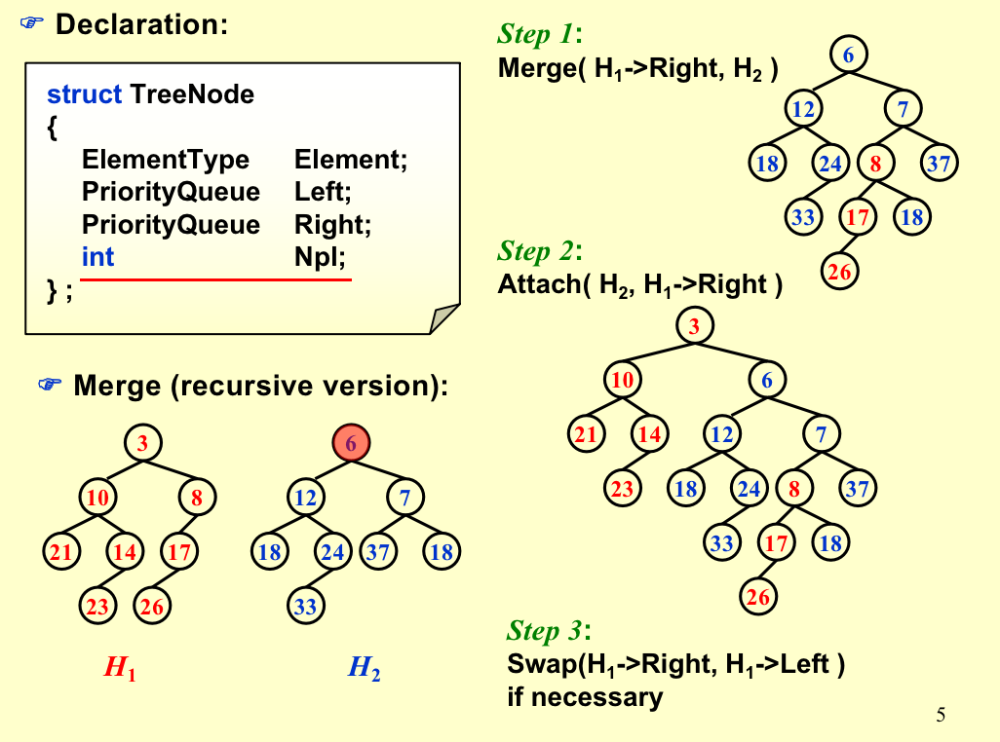

* Recursive Version.

```C
PriorityQueue  Merge ( PriorityQueue H1, PriorityQueue H2 ){ 
	if ( H1 == NULL )   return H2;	
	if ( H2 == NULL )   return H1;	
	if ( H1->Element < H2->Element ){return Merge1( H1, H2 );} 
	else {return Merge1( H2, H1 );}
}
static PriorityQueue
Merge1(PriorityQueue H1,PriorityQueue H2){
  if(H1->Left == NULL){H1->Left = H2;}
  else{
    H1->Right = Merge(H1->Right,H2);
    if(H1->Left->Npl<H1->Right->Npl){
      	swapChildren(H1);
    }
    H1->Npl = H1->Right->Npl+1;
  }
  return H1;
}
```

* $T_p=O(logN)$​

* Iterative Version

  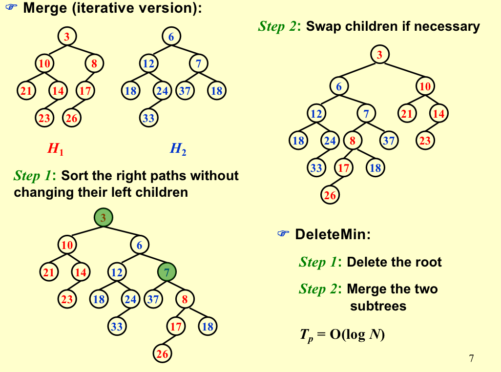

* For **SORTING** $loglogN$ --> $logN * loglogN$

* Only have to maintain two pointers.

## Skew Heaps

Any $M$ consecutive operations take at most $O(M log N)$ time.

* **Merge**:

   Always swap the left and right children except that the largest of all the nodes on the right paths **does not have its children swapped**.  $No Npl.$

  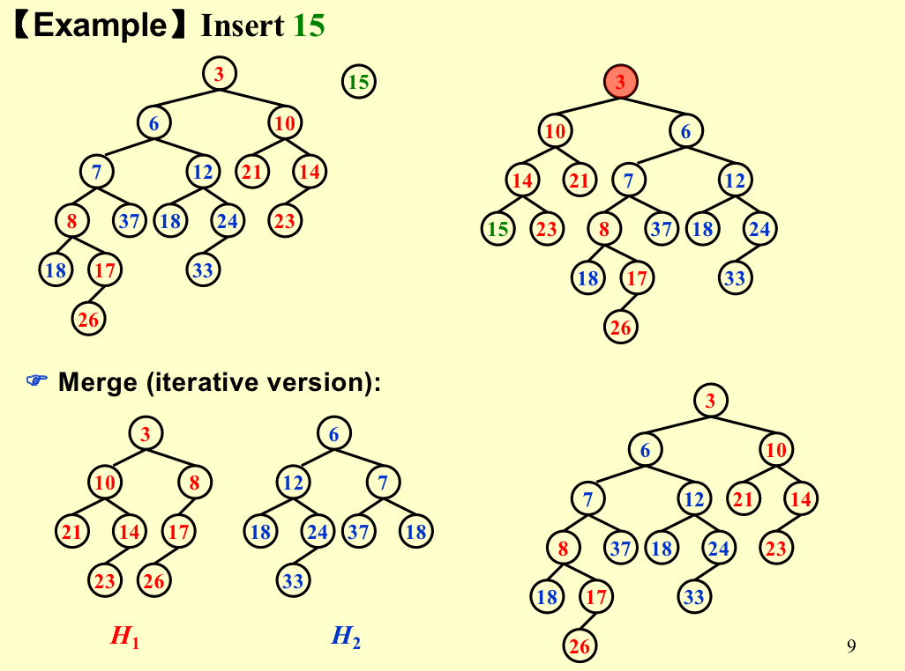

  Skew heaps have the advantage that no extra space is required to maintain path lengths and no tests are required to determine when to swap children.

  It is an open problem to determine precisely the expected right path length of both leftist and skew heaps.

### Amortized Analysis for Skew Heaps

$D_i =$  the root of the resulting tree.

$\Phi(D_i)=$​​​  **number of heavy nodes.**

> $\Phi(D_i) =$number of  right nodes?
>
> No! Think of only operation where num of right nodes will decrease: will not happen because  the largest of all the nodes on the right paths **does not have its children swapped**
>
> So this $\Phi(D_i)$ will always be increasing.

#### Def:

A node $p$ is heavy if the number of descendants of $p$’s right subtree is at least half of the number of descendants of $p$, and light otherwise.  

**Note that the number of descendants of a node includes the node itself.**

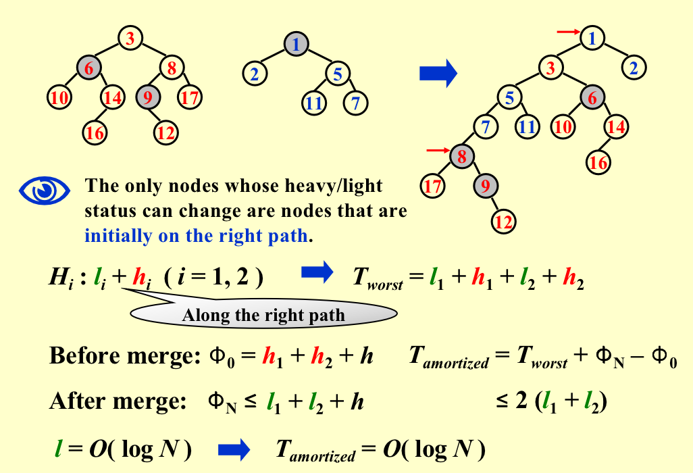

1. $T_{worst}=$all right nodes $=l_1+h_1+l_2+h_2$

2. All heavy points at the right path will **ALWAYS** turn into light points.

3. Original light points **at most** can **ALL turn into heavy nodes**.

   Remember: also need to insert into left subtrees.

4. h is heavy nodes on the left paths,**will note change**,cause its descandents will never **exchange**! .

5. Therefore Credits = $l_1+l_2-h_1-h_2$​​​.

6. $T_{amotized}= T_{worst}+credits \le2(l_1+l_2)$​

7. $l_{right}=O(logN)$​​ ? -- Actually if we want $l_{right}$ to be large ,best almost balanced.

   > 假如root的左subtree 很多，把多出来的给右边来增加右链长，这样左右node一样，且右node的heavy nodes至少不会少.

### Amortized Analysis

* Introduction to Algorithms

## Binomial Queue

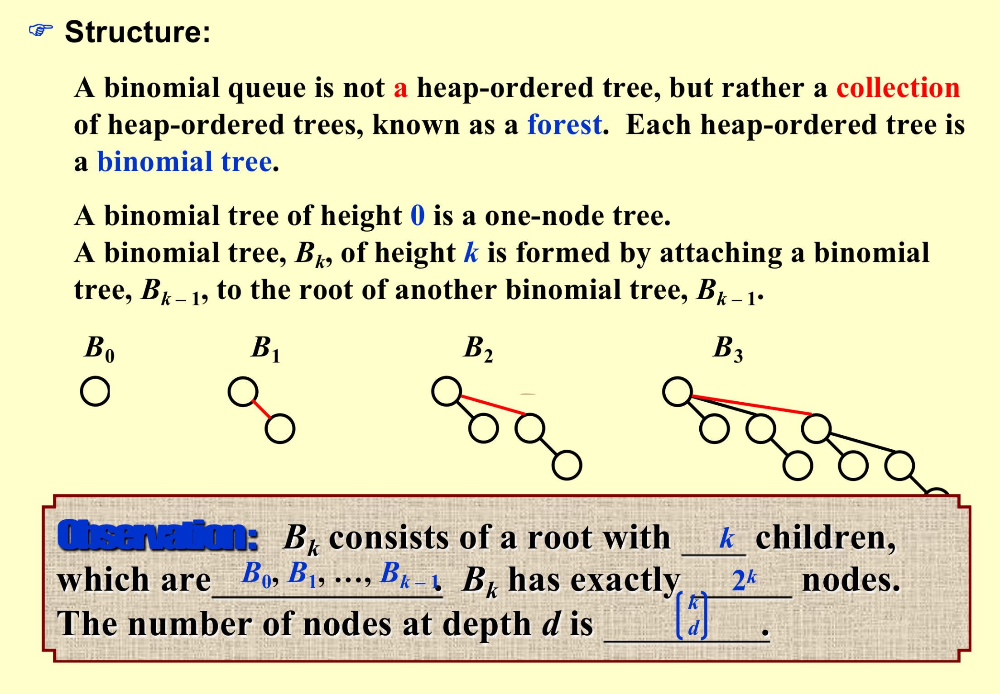

* $B_k$ structure + heap order + one binomial tree for each height

  $\therefore$ A priority queue of **any size** can be uniquely represented by a collection of binomial trees.

  > Example : $13=2^0+2^2+2^3=1101_2$

### Operations

#### FindMin

The minimum key is in one of the roots.

There are at most $「logN$  roots, hence $T_p = O( logN)$​​.

> 二进制分解，所以$logN$

* We can remember the minimum and update whenever it is changed.  

  Then this operation will take $O(1)$​.

#### Merge

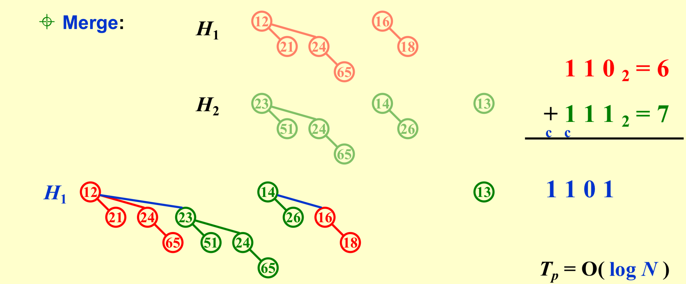

* To combine two trees $O(1)$

* At most $O(logN)$ times

  **! Must keep the trees in the binomial queue sorted by height.**

#### Insert

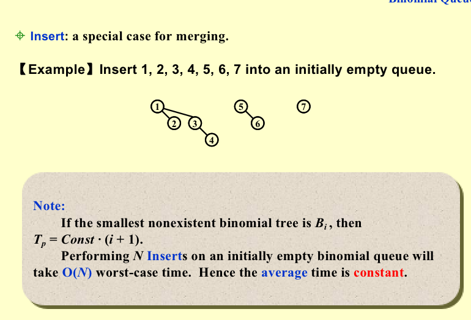

#### DeleteMin

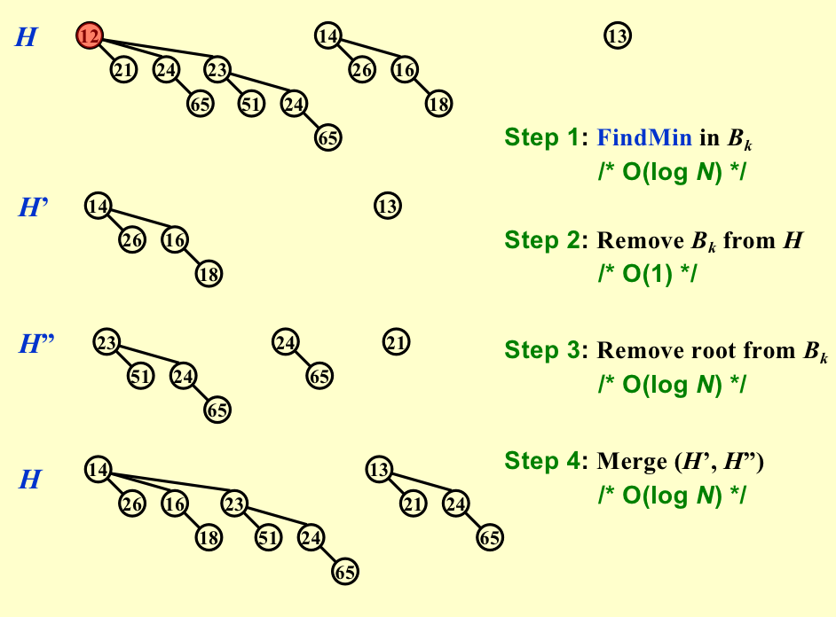

### Implementation

```C++
typedef struct BinNode *Position;
typedef struct Collection *BinQueue;
typedef struct BinNode *BinTree;  /* missing from p.176 */

struct BinNode 
{ 
	ElementType	    Element;
	Position	    LeftChild;
	Position 	    NextSibling;
} ;

struct Collection 
{ 
	int	    	CurrentSize;  /* total number of nodes */
	BinTree	TheTrees[ MaxTrees ];
} ;
```

```C++
BinTree CombineTrees( BinTree T1, BinTree T2 )
{  /* merge equal-sized T1 and T2 */
	if ( T1->Element > T2->Element )
		/* attach the larger one to the smaller one */
		return CombineTrees( T2, T1 );
	/* insert T2 to the front of the children list of T1 */
	T2->NextSibling = T1->LeftChild;
	T1->LeftChild = T2;
	return T1;
}
```

$T_p = O( 1 )$​

```C++
BinQueue  Merge( BinQueue H1, BinQueue H2 )
{	BinTree T1, T2, Carry = NULL; 	
	int i, j;
	if ( H1->CurrentSize + H2-> CurrentSize > Capacity )  ErrorMessage();
	H1->CurrentSize += H2-> CurrentSize;
	for ( i=0, j=1; j<= H1->CurrentSize; i++, j*=2 ) {
	    T1 = H1->TheTrees[i]; T2 = H2->TheTrees[i]; /*current trees */
	    switch( 4*!!Carry + 2*!!T2 + !!T1 ) { 
        case 0: /* 000 */ /* Carry T1 T2 */
        case 1: /* 001 */  break;	
        case 2: /* 010 */  H1->TheTrees[i] = T2; H2->TheTrees[i] = NULL; break;
        case 4: /* 100 */  H1->TheTrees[i] = Carry; Carry = NULL; break;
        case 3: /* 011 */  Carry = CombineTrees( T1, T2 );
                      H1->TheTrees[i] = H2->TheTrees[i] = NULL; break;
        case 5: /* 101 */  Carry = CombineTrees( T1, Carry );
                      H1->TheTrees[i] = NULL; break;
        case 6: /* 110 */  Carry = CombineTrees( T2, Carry );
                      H2->TheTrees[i] = NULL; break;
        case 7: /* 111 */  H1->TheTrees[i] = Carry; 
                      Carry = CombineTrees( T1, T2 ); 
                      H2->TheTrees[i] = NULL; break;
	    } /* end switch */
	} /* end for-loop */
	return H1;
}
```


```C++
BinQueue  Merge( BinQueue H1, BinQueue H2 )
{	BinTree T1, T2, Carry = NULL; 	
	int i, j;
	if ( H1->CurrentSize + H2-> CurrentSize > Capacity )  ErrorMessage();
	H1->CurrentSize += H2-> CurrentSize;
	for ( i=0, j=1; j<= H1->CurrentSize; i++, j*=2 ) {
	  T1 = H1->TheTrees[i]; T2 = H2->TheTrees[i]; /*current trees */
	  switch( 4*!!Carry + 2*!!T2 + !!T1 ) { 
		case 0: /* 000 */
	 	case 1: /* 001 */  break;	
		case 2: /* 010 */  H1->TheTrees[i] = T2; H2->TheTrees[i] = NULL; break;
		case 4: /* 100 */  H1->TheTrees[i] = Carry; Carry = NULL; break;
		case 3: /* 011 */  Carry = CombineTrees( T1, T2 );
			            H1->TheTrees[i] = H2->TheTrees[i] = NULL; break;
		case 5: /* 101 */  Carry = CombineTrees( T1, Carry );
			            H1->TheTrees[i] = NULL; break;
		case 6: /* 110 */  Carry = CombineTrees( T2, Carry );
			            H2->TheTrees[i] = NULL; break;
		case 7: /* 111 */  H1->TheTrees[i] = Carry; 
			            Carry = CombineTrees( T1, T2 ); 
			            H2->TheTrees[i] = NULL; break;
	    } /* end switch */
	} /* end for-loop */
	return H1;
}
```

* 不枚举？

  > 哨兵

```C++
BinQueue  Merge( BinQueue H1, BinQueue H2 ){
  
}
```

* DeleteMin

```C++
ElementType  DeleteMin( BinQueue H ){
  BinQueue DeletedQueue; 
	Position DeletedTree, OldRoot;
	ElementType MinItem = Infinity;  /* the minimum item to be returned */	
	int i, j, MinTree; /* MinTree is the index of the tree with the minimum item */
	if ( IsEmpty( H ) )  {  PrintErrorMessage();  return –Infinity; }
	for ( i = 0; i < MaxTrees; i++) {  /* Step 1: find the minimum item */
	    if( H->TheTrees[i] && H->TheTrees[i]->Element < MinItem ){ 
				MinItem = H->TheTrees[i]->Element;  MinTree = i;    
      } /* end if */
	} /* end for-i-loop */
  
	DeletedTree = H->TheTrees[MinTree];  
	H->TheTrees[MinTree] = NULL;   /* Step 2: remove the MinTree from H => H’ */ 
	OldRoot = DeletedTree;   /* Step 3.1: remove the root */ 
	DeletedTree = DeletedTree->LeftChild;   free(OldRoot);
	DeletedQueue = Initialize();   /* Step 3.2: create H” */ 
	DeletedQueue->CurrentSize = (1<<MinTree ) – 1;  /* 2MinTree – 1 */
	for ( j = MinTree – 1; j >= 0; j – – ) {  
	    DeletedQueue->TheTrees[j] = DeletedTree;
	    DeletedTree = DeletedTree->NextSibling;
	    DeletedQueue->TheTrees[j]->NextSibling = NULL;
	} /* end for-j-loop */
  
	H->CurrentSize  – = DeletedQueue->CurrentSize + 1;
	H = Merge( H, DeletedQueue ); /* Step 4: merge H’ and H” */ 
	return MinItem;
}
```

* A binomial queue of $N$ elements can be built by $N$ successive insertions in $O(N)$​ time.

  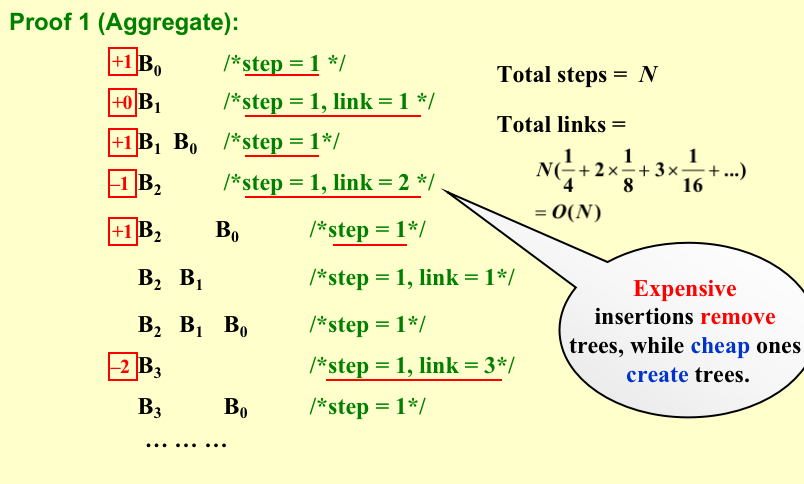

  * $1/2$ no merge
  * $1/4$ one merge
  * $1/8$ two merges..
  * $1/16$ three merges...

  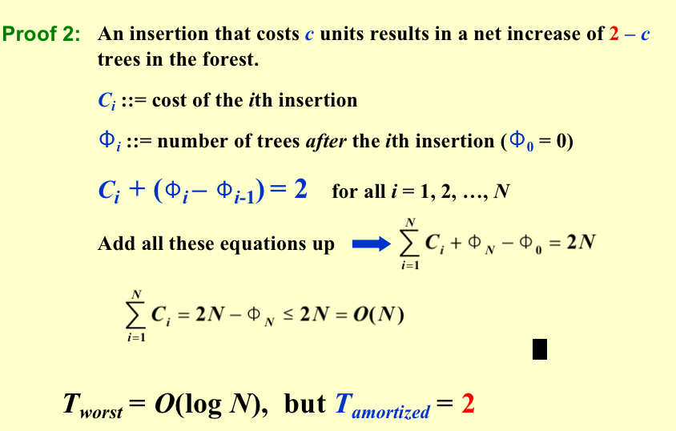

## $Appendix: Amotized\ Analysis$​​
* Reference: https://walkccc.me/CLRS/Chap17/17.2/
* Introduction To Algorithms.
### Aggregate Analysis

In aggregate analysis, we show that for **all** n, a sequence of n operations takes worst-case time $T(n)$ in total. In the worst case, the average cost, or **amortized cost**, per operation is therefore $T(n)/n$. Note that this amortized cost applies to each operation, even when there are several types of operations in the sequence.

**Stack operations**

* $MULTIPOP(S,k)$​

Let us analyze a sequence of n $PUSH, POP$, and $MULTIPOP$​ operations on an initially empty stack

*  The worst-case cost of a MULTIPOP operation in the sequence is $O(n)$​, since the stack size is at most n.

  The worst-case time of any stack operation is therefore $O(n)$, and hence a sequence of n operations costs $O(n^2)$

* Any sequence of n $PUSH, POP$, and $MULTIPOP$ operations on an initially empty stack can cost at most $O(n)$

  We can pop each object from the stack **at most once** for each time we have pushed it onto the stack. 

  Therefore, the number of times that $POP$ can be called on a nonempty stack, including calls within $MULTIPOP$, is at most **the number of PUSH operations**, which is at most **n**. 

  For any value of n, any sequence of n $PUSH, POP$, and $MULTIPOP$ operations takes a total of $O(n)$ time. The average cost of an operation is $O(n)/n = O(1)$​

* We emphasize again that although we have just shown that the average cost, and hence the running time, of a stack operation is $O(1)$, we did not use probabilistic reasoning. 

  We actually showed a worst-case bound of $O(n)$ on a sequence of $n$ operations. Dividing this total cost by $n$​ yielded the average cost per operation, or the amortized cost.

**Incrementing a binary counter**

consider the problem of implementing a k-bit binary counter that counts upward from 0. We use an array $A[0..k-1]$ of bits, where $A.length=k$, as the counter. 

A binary number x that is stored in the counter has its lowest-order bit in $A[0]$ and its highest-order bit in $A[k-1]$so that $x = \sum_{i=0}^{k-1}A[i]·2^i$ Initially, $x=0$ and thus $A[i]=0$ for $i=0,1,... k-1$

To add $1$(modulo $2^k$​) to the value in the counter, we use the following procedure.

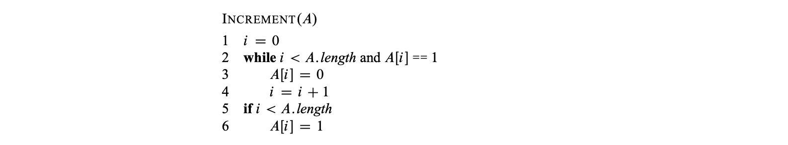

* As with the stack example, a cursory analysis yields a bound that is correct but not tight. A single execution of INCREMENT takes time $\Theta(k)$ in the worst case, in which array A contains all 1s. 

  Thus, a sequence of n INCREMENT operations on an initially zero counter takes time $O(nk)$ in the worst case.

* As Figure below shows, $A[0]$ does flip each time INCREMENT is called. The next bit up, $A[1]$ flips only every other time: a sequence of n INCREMENT operations on an initially zero counter causes $A[1]$ to flip $n/2」times.

  Similarly, bit $A[2]$ flibs only every fourth time or $n/4』$ times in a sequence.

  $\sum_{i=0}^{k-1}\frac{n}{2^i}」<n\sum_{i=0}^{\infty}\frac{1}{2^i}=2n$

* The worst-case time for a sequence of n INCREMENT operations on an **initially zero** counter is therefore $O(n)$. The average cost of each operation, and therefore the amortized cost per operation, is $O(n)/n=O(1)$​

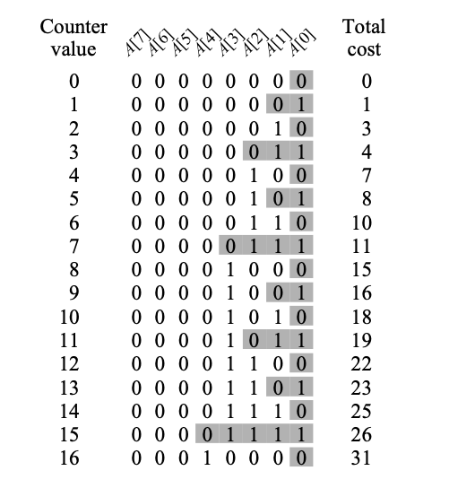

#### Exercises

If the set of stack operations included a MULTIPUSH operation, which pushes $k$ items onto the stack, would the $O(1)$​ bound on the amortized cost of stack operations continue to hold?

* No. The time complexity of such a series of operations depends on the number of pushes (pops vice versa) could be made. 

  Since one MULTIPUSH needs $\Theta(k)$ time, performing n MULTIPUSH operations, each with k elements, would take$Θ(kn)$ time, leading to amortized cost of $\Theta(k)$​.

Show that if a DECREMENT operation were included in the k-bit counter example, n operations could cost as much as $\Theta(nk)$​ time.

* The logarithmic bit flipping predicate does not hold, and indeed a sequence of events could consist of the incrementation of all $1s$ and decrementation of all $0s$ , yielding $Θ(nk)$.

Suppose we perform a sequence of $n$ operations on a data structure in which the i th operation costs i if i is an exact power of 2, and 1 otherwise. 

Use aggregate analysis to determine the amortized cost per operation.
  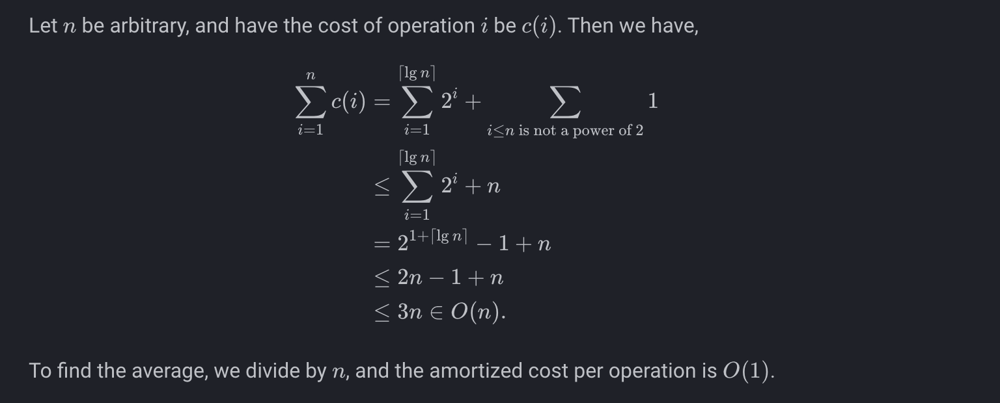
### The accounting method
In the accounting method of amortized analysis, we assign differing charges to different operations, with some operations charged more or less than they actu- ally cost. We call the amount we charge an operation its amortized cost. 
When an operation’s amortized cost exceeds its actual cost, we assign the difference to specific objects in the data structure as credit. 
* Credit can help pay for later oper- ations whose amortized cost is less than their actual cost. 
* If we want to show that in the worst case the average cost per operation is small by analyzing with amortized costs, we must ensure that the total amortized cost of a sequence of operations provides an upper bound on the total actual cost of the sequence.
* this relationship must hold for all sequences of operations.
  Which means $\sum \hat{c}_i\ge\sum c_i$ for all sequences of n operations. 
* The total credit stored in the data structure is the difference between the total amortized cost and the total actual cost, or $\sum \hat{c}_i-\sum c_i$ which must be **non negative** ay **all times**
**Stack operations**
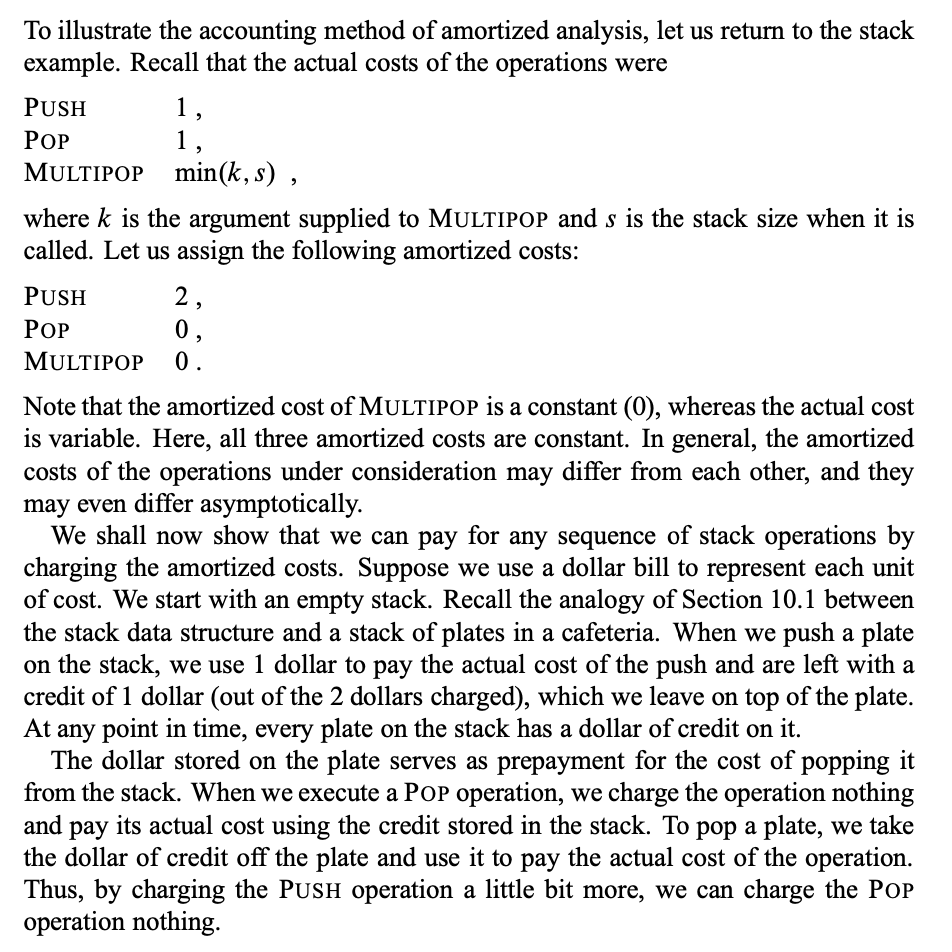
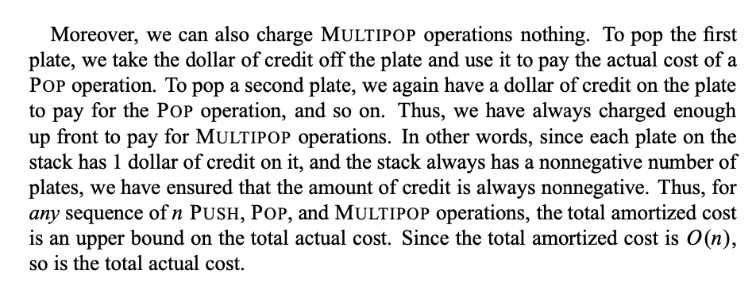
**Incrementing a binary counter**
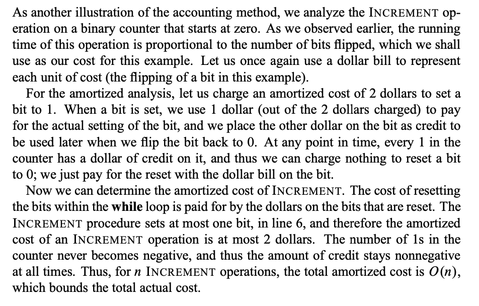
### The potential method
Instead of representing prepaid work as credit stored with specific objects in the data structure, the potential method of amortized analysis represents the prepaid work as “potential energy,” or just “potential,” which can be released to pay for future operations. We associate the potential with the data structure as a whole rather than with specific objects within the data structure.
* We will perform n operations, starting with an initial data structure $D_0$
* For each $i=1,2,...n$, we let $c_i$ be the actual cost of the ith operation and $D_i$ be the data structure that results after applying the ith operation to data structure $D_{i-1}$.
* A potential function $\Phi$ maps each data
structure $D_i$ to a real number $\Phi(D_i)$, which is the potential associated with data
structure $D_i$ . 
* The amortized cost $\hat{c}_i$ of the ith operation with respect to potential function $\Phi$ is defined by $\hat{c}_i=c_i+\Phi(D_i)=\Phi(D_{i-1})$
* the total amortized cost of the n operations is $\sum\hat{c}_i=\sum c_i+\Phi(D_n)-\Phi(D_0)$
* Define a potential function so that $\Phi(D_i)\ge \Phi(D_0)$ for all i!
**Stack operations**
* See Previous Part.
**Incrementing a binary counter**
we define the potential of the counter after the ith INCREMENT operation to be $b_i$ , the number of 1s in the counter after the i th operation.
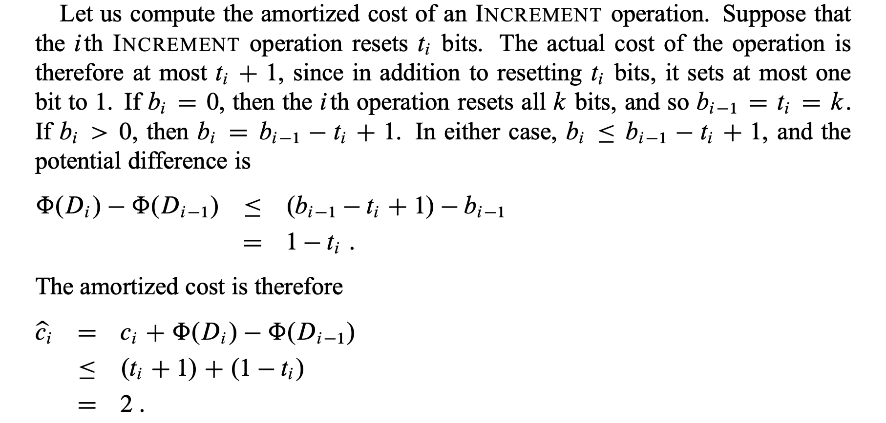
If the counter starts at zero, then $\Phi(D_0)=0$ Since $\Phi(D_i)\ge 0$ for all i , the total amortized cost of a sequence of n INCREMENT operations is an upper bound on the total actual cost, and so the worst-case cost of n INCREMENT operations is $O(n)$.
* The potential method gives us an easy way to analyze the counter even when it does not start at zero. 
The counter starts with b0 1s, and after n INCREMENT operations it has $b_n$ 1s, where $0<b_0, b_n <k$. (Recall that k is the number of bits in the counter.)
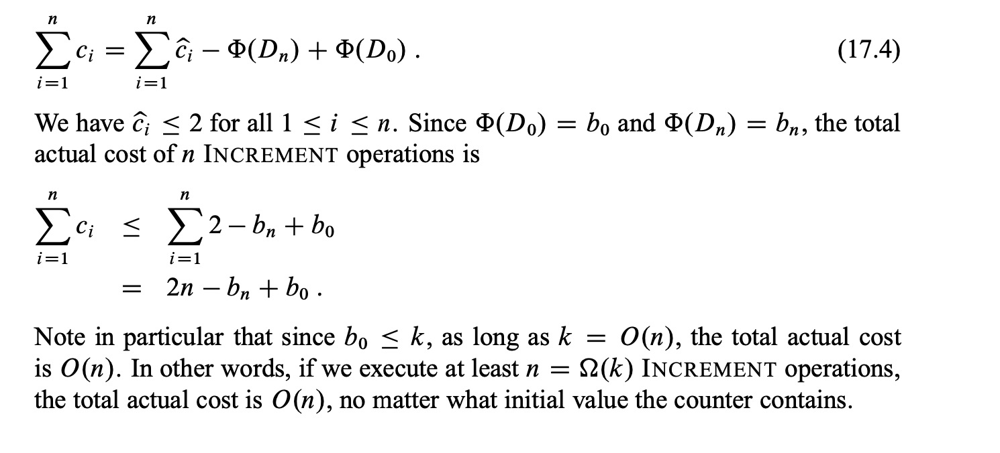
</font>
