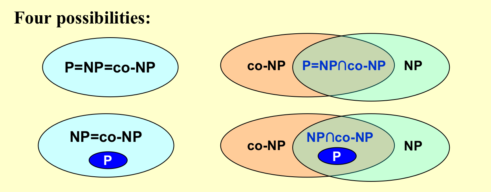

# NP - Completeness

### Turing Machind
- A Turing machine is a mathematical model of computation that defines an abstract machine, which manipulates symbols on a strip of tape according to a table of rules. Despite the model's simplicity, given any computer algorithm, a Turing machine capable of simulating that algorithm's logic can be constructed.
- A Deterministic Turing Machine executes one instruction at each point in time.  Then depending on the instruction, it goes to the next unique instruction.
- A Nondeterministic Turing Machine is free to choose its next step from a finite set.  And if one of these steps leads to a solution, it will always choose the correct one.
### NP NPC 
### NP
**NP: Nondeterministic polynomial-time**
* The problem is NP if we can prove any solution is true in polynomial time.
> **Example** Hamilton cycle problem: Find a single cycle that contains every vertex – does this simple circuit include all the vertices?

> **Note:** Not all decidable problems are in NP.  For example, consider the problem of determining whether a graph **does not have a Hamiltonian cycle.**
> * At present, this cannot be tested in polynomial time.  This is because we would have to check every possible cycle in the graph.

### P
**There is a polynomial time algorithm that can solve the problem.**
$P \subseteq NP$
* Whether it is a true subset?

### NPC
**The most difficult problems in NP.**
* **If we can solve one of these problems in polynomial time, we can solve all problems in NP in polynomial time!**

* 如果A能被规约到B，那么A是更简单的问题（因为可能存在更简单的解法）
* 这里说的简单只探讨是否是多项式时间内可解，而不是说解法的复杂度
**EXAMPLE** Suppose that we already know that the Hamiltonian cycle problem is `NP-complete`.  Prove that the traveling salesman problem is NP-complete as well.
* **Hamiltonian cycle problem:** Given a graph $G=(V, E)$, is there a simple cycle that visits all vertices?
* **Traveling salesman problem:** Given a complete graph $G=(V, E)$, with edge costs, and an integer K, is there a simple cycle that visits all vertices and has total cost $\le K$?

* $|V|=5$

#### NPC
* 任意一个NP问题都可以归约到NPC问题
* 证明一个问题是NPC问题，只要证明一个已知的的NPC问题可以归约到这个问题即可
* 那么我们需要知道第一个NPC问题

>The first problem that was proven to be NP-complete was the Satisfiability problem (Circuit-SAT): Input a boolean expression and ask if it has an assignment to the variables that gives the expression a value of 1.
Cook showed in 1971 that all the problems in NP could be polynomially transformed to Satisfiability.  He proved it by solving this problem on a nondeterministic Turing machine in polynomial time.

### co-NP

#### Abstract Problem
An abstract problem $Q$ is a binary relation on a set $I$ of problem instances and a set $S$ of problem solutions.

#### Formal-language Theory — for decision problem

* `x是解的实例`
* A verification algorithm is a two-argument algorithm A, where one argument is an ordinary input string `x` and the other is a binary string  `y` called a certificate. 
* A two-argument algorithm A verifies an input string `x` if there exists a certificate `y` such that `A(x, y) = 1`. 
* The language verified by a verification algorithm A is  `L = { x ∈ {0, 1}* `: there exists `y ∈ {0, 1}*` such that `A(x, y) = 1}`.

#### $L\in NP ?\to \bar{L} \in NP$
* complexity class co-NP = the set of languages L such that $\bar{L}\in NP$
* co-NP : 该问题和它的补都属于NP

* Some probles can only reach requirement2 but satisfy 1 -- NP-Hard

**0-1 backpack problem**

https://zhuanlan.zhihu.com/p/93857890

* Not Polynomial Time

