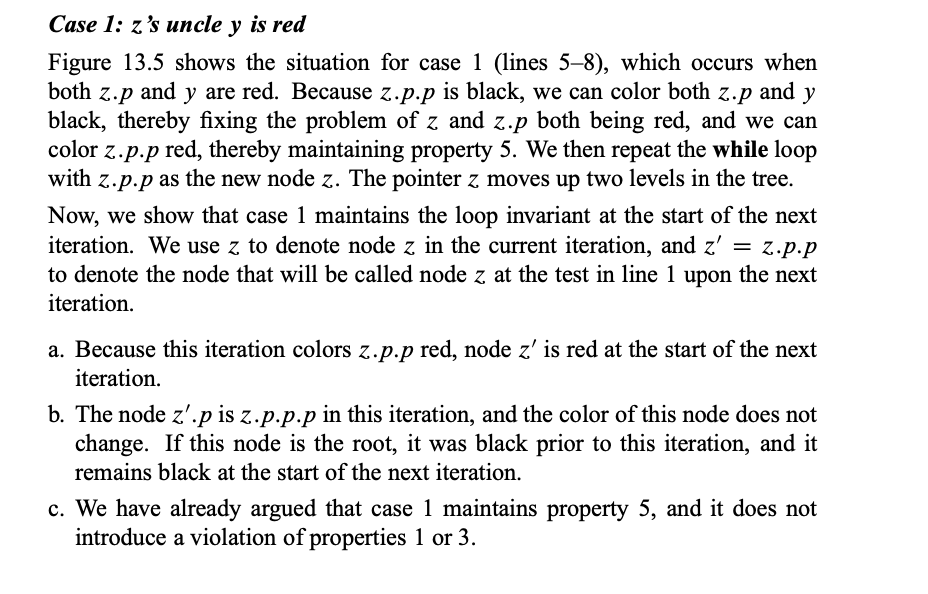

## AVL Tree
* An empty binary tree is height balanced.
* If T is nonempty binary tree with $T_L$ and $T_R$ as its left and right subtrees,then $T$ is height balanced iff
  (1)$T_L$ and $T_R$ are height balanced
  (2)$|h_L-H_R|\le 1$ where $h_l$ and $h_R$ are the heights of $T_L$ and $T_R$
* Balance Factor $BF(node)$ = $h_L$-$h_r$
  In an AVL Tree,$BF(node)$ = $-1,0,or\ 1$
* The height of an empty tree is defined to be $–1$
### Tree Rotation
* Changes Sturcture without intefering 
  
* Time complexity: $O(1)$
### Rotation for AVL Tree
* RR Rotation
* LL Rotation
* RL Rotation
* LR ROtation

勘误 ： $n_h \approx \frac{1}{\sqrt{5}}(\frac{1+\sqrt{5}}{2})^{h+3}$
## Splay Trees
Target :  Any $M$ consecutive tree operations starting from an empty tree take at most $O(M log N)$ time.
* For any nonroot node $X$ , denote its parent by $P$ and grandparent by $G$

* 其实不是Single rotation，也是要两次$(Zig-Zig)$ : 先转 $P$再转$X$
* $Zig-Zag$ only rotate $X$


## Amortized Analysis

* Amotized bound :  Probability is not involved !

  > worst case bound > amortized bound > average case bound

### Aggregate analysis

> Show that for all n, a sequence of n operations takes worst-case time $T(n)$ in total.  
>
> In the worst case, the average cost, or amortized cost, per operation is therefore $T(n)/n$.

### Accounting method

> When an operation’s amortized cost  $\hat{c}_i$ exceeds its actual cost $c_i$ , we assign the difference to specific objects in the data structure as credit. Credit can help pay for later operations whose amortized cost is less than their actual cost.


### Potential Method

* Refer to Book **Potential Function**

## Red-Black Tree

* Technique : Create $"哨兵" \ \ \ "虚拟节点"$

### Def:

* Every node is either red or black.
* The root is black.
* Every leaf ($NIL..哨兵$) is black.
* If a node is red both its children are black.
* For each node,all simple paths from the node the descandent **leaves**(哨兵) contain the same number of black nodes.

> Black-Height

The number of black nodes from the node to its descandent leaves (without counting NIL & itself) 

### Lemma

A red-black tree with **N** internal nodes has **height** at most  $2ln(N +1)$​.


### Operations

#### Insert

Sketch : Insert & Colour red ; Pass Error to Root

* Then Pass **Error** to the Root and turn it to black.


* For case 2 -- **Ensure that the right child of 7 is not red !!**

> Refer to 算法导论 !
>
> * Loop ends when z.p is black
>
> * Color the root black after the loop
>
>   
>
> 
>
> 
>
> 

#### Delete


* Case 3 : To have a red far nephew.

* Case 4 : (1) change colour of ? and w (2) far nephew change black (3) make brother new root

  > Beacuse property 5 holds so descants of w have no black node


* See AVL Deletion

## B+ Tree

### 【Definition】

A B+ tree of order M is a tree with the following structural properties:

* The root is either a leaf or has between 2 and M children.
* All nonleaf nodes (except the root) have between $「M/2$(上取整) and $M$ children.
* All leaves are at the same depth.
* Assume each nonroot leaf also has between $「M/2$（上取整） and M children.

> Root can have less children like when constructing.

```C
Btree  Insert ( ElementType X,  Btree T ) 
{ 
	Search from root to leaf for X and find the proper leaf node;
	Insert X;
	while ( this node has M+1 keys ) {
    		split it into 2 nodes with 「(M+1)/2 and 「(M+1)/2 keys, respectively;
    		if (this node is the root)
        		create a new root with two children;
    		check its parent;
    // Every iteration O(M)
	}
} 
```

$Depth = O(log_{M/2}N)$​

$T_{insert} = O(M* Depth)=O(logN*M/logM)$​ 

$Y_{find} = O(logN)$​

