<font face = "Times New Roman" >

# Approximation 
* Find near-optimal solutions in polynomial time
## Approximation Ratio

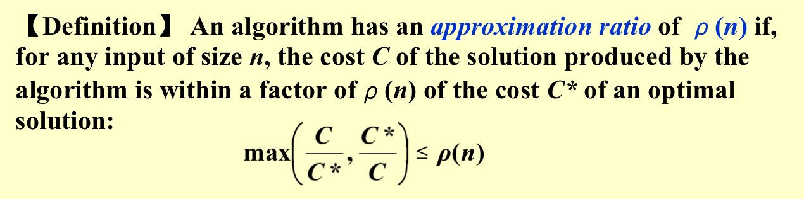
If an algorithm achieves an approximation ratio of $\rho(n)$, we call it a$\rho(n)$-approximation algorithm.
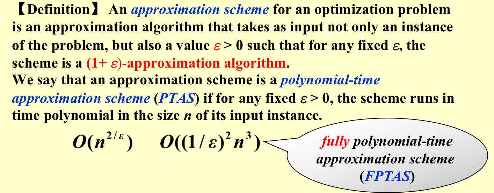

**Approximate Bin Packing**
Given N items of sizes  $S_1 , S_2 , …, S_N$ , such that $0 < S_i \le 1$ for all $1 \le i \le N$ . Pack these items in the fewest number of bins, each of which has **unit capacity**.
**Example** : N = 7; $S_i$ = 0.2, 0.5, 0.4, 0.7, 0.1, 0.3, 0.8

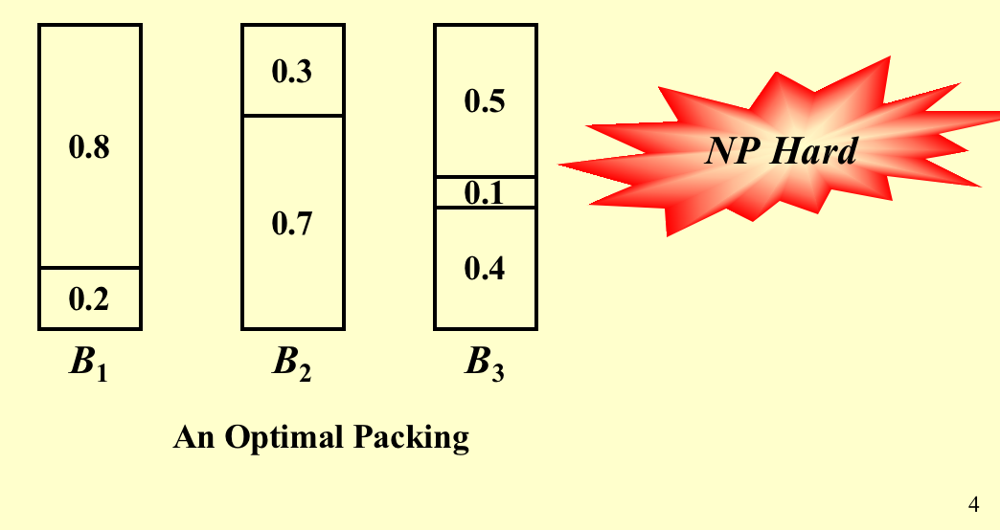

```c
void NextFit ( )
{   read item1;
    while ( read item2 ) {
        if ( item2 can be packed in the same bin as item1 )
	place item2 in the bin;
        else
	create a new bin for item2;
        item1 = item2;
    } /* end-while */
}
```
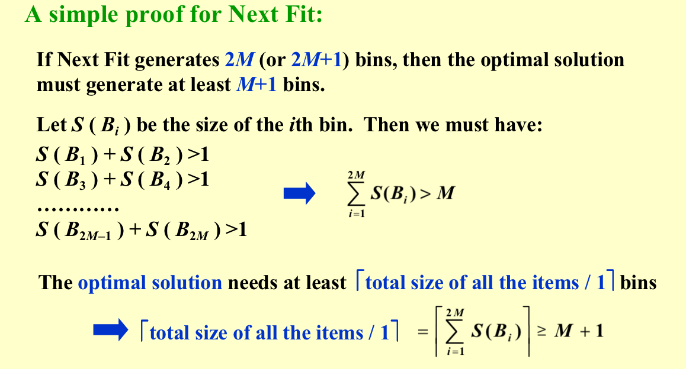
* Therefore the NextFit algorithm is a 2-approximation algorithm for the bin packing problem.[approximation ratio = 2]
```c
void FirstFit ( )
{   while ( read item ) {
        scan for the first bin that is large enough for item;
        if ( found )
	place item in that bin;
        else
	create a new bin for item;
    } /* end-while */
}
```
* Time complexity of  FirstFit is $O(nlogn)$
* But the approximation ratio of FirstFit is 2.
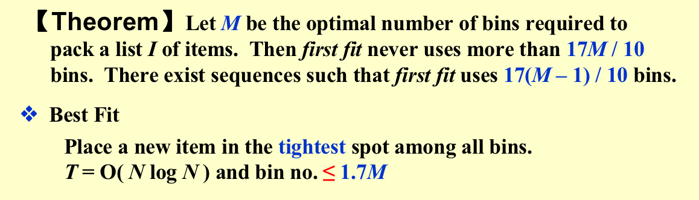


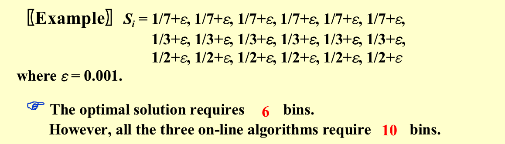

**On-line Algorithms**
Place an item before processing the next one, and can NOT change decision.

**Off-line Algorithms**
View the entire item list before producing an answer.
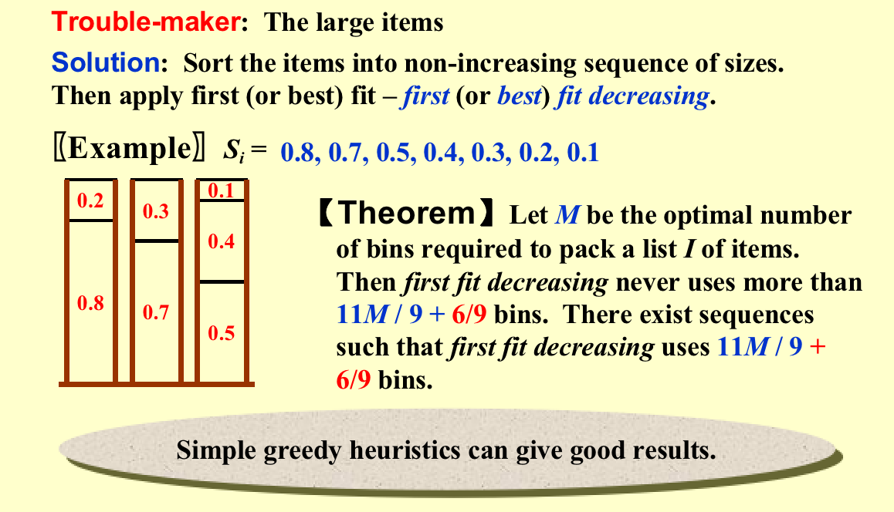

### The Knapsack Problem — fractional version

A knapsack with a capacity  $M$  is to be packed.  Given $N$ items.  Each item  $i$  has a weight  $w_i$  and a profit  $p_i$ .  If  $x_i$ is the percentage of the item $i$  being packed,  then the packed profit will be  $p_ix_i$ .
* An optimal packing is a feasible one with maximum profit.  That is, we are supposed to find the values of $x_i$  such that $\sum\limits_{i=1}^n p_ix_i$ obtains its maximum under the constrains: $\sum\limits_{i=1}^{n}w_ix_i \le M $ and $x\in [0,1] \ for\ 1\le i \le n$

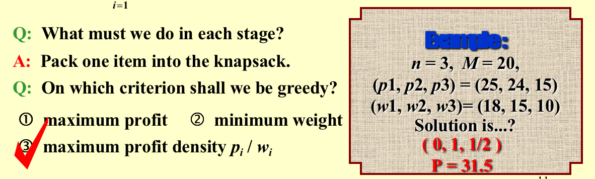

### The Knapsack Problem — 0-1 version

* NPC and NP-hard
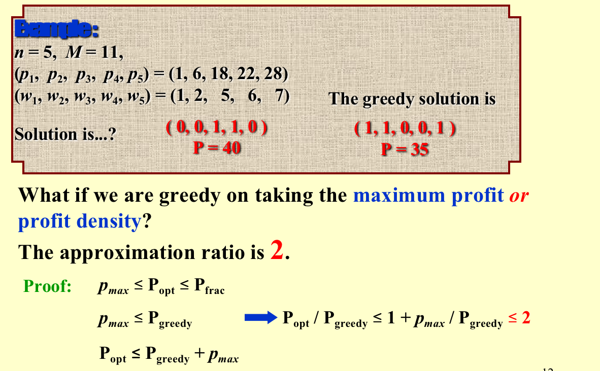

* $p_{opt}$ is the optimal solution for the frac version
* For the 0-1 problem, difference lies in the last object(may not be put into the package),and this last item has cost $\le p_{max}$
* Therefore $p_{opt}\le p_{greedy}+p_{max}$

#### Solve in Dynamic Programming
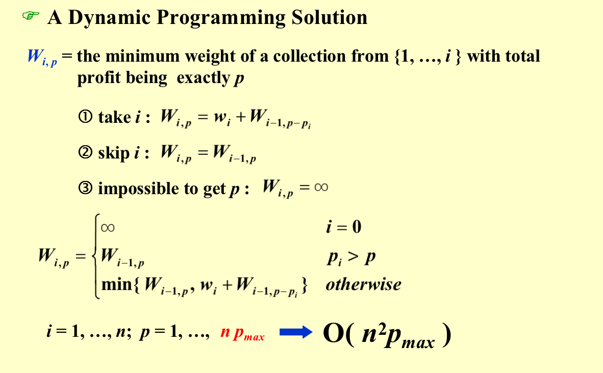

* Another Solution(just search)

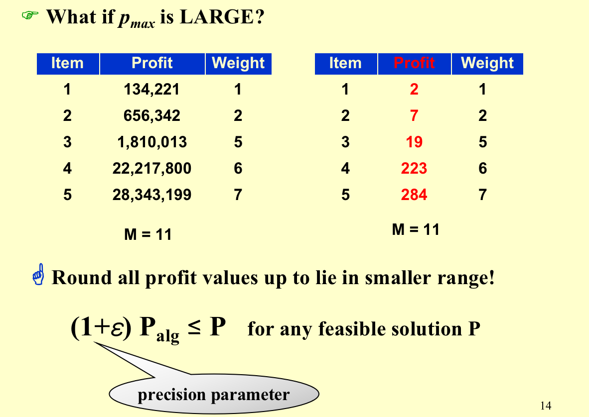

### The K-center Problem
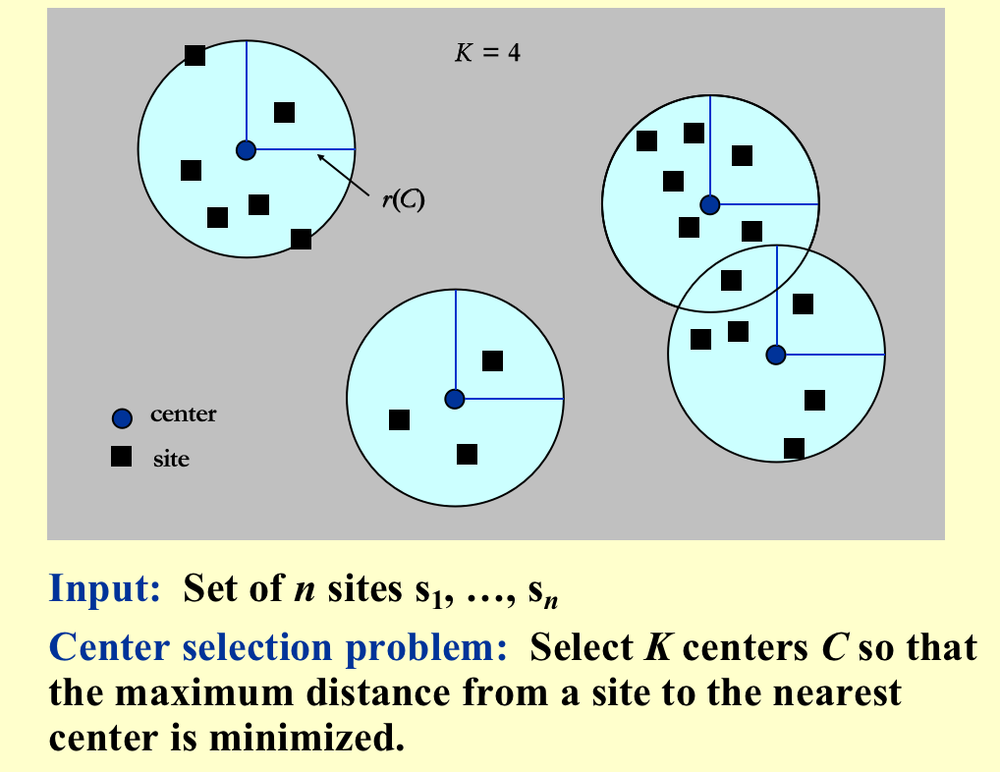
> Refer to Slides.


</font>