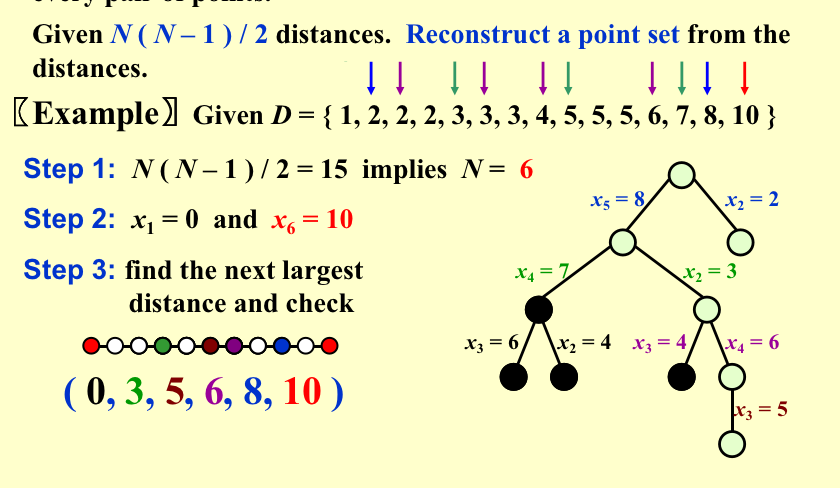

<font face = "Times New Roman">
## Backtracking

The basic idea is that suppose we have a partial solution $( x_1, ... , x_i )$ where each $x_k \in S_k$ for  $1 \le k \le i < n$.   First we add  $x_{i+1} \in S_{i+1}$ and check if $( x_1, ... , x_i, x_{i+1} )$ satisfies the constrains.  If the answer is $“yes”$ we continue to add the next $x$, else we delete $x_i$ and backtrack to the previous partial solution $( x_1, ... , x_{i-1} )$​.

### Example

#### Eight Queens

#### The Turnpike Reconstruction Problem

Given $N$ points on the x-axis with coordinates $x_1 <  x_2 < …< x_N$ .  Assume that $x_1 = 0$.  There are $N ( N – 1 ) / 2$ distances between every pair of points.

Given $N ( N – 1 ) / 2$ distances.  Reconstruct a point set from the distances.

**Example**



> Complexity : $2^n$

```C
bool Reconstruct ( DistType X[ ], DistSet D, int N, int left, int right )
{ /* X[1]...X[left-1] and X[right+1]...X[N] are solved */
    bool Found = false;
    if ( Is_Empty( D ) )
        return true; /* solved */
    D_max = Find_Max( D );
    /* option 1：X[right] = D_max */
    /* check if |D_max-X[i]|D is true for all X[i]’s that have been solved */
    OK = Check( D_max, N, left, right ); /* pruning */
    if ( OK ) { /* add X[right] and update D */
        X[right] = D_max;
        for ( i=1; i<left; i++ )  Delete( |X[right]-X[i]|, D);
        for ( i=right+1; i<=N; i++ )  Delete( |X[right]-X[i]|, D);
        Found = Reconstruct ( X, D, N, left, right-1 );
        if ( !Found ) { /* if does not work, undo */
            for ( i=1; i<left; i++ )  Insert( |X[right]-X[i]|, D);
            for ( i=right+1; i<=N; i++ )  Insert( |X[right]-X[i]|, D);
        }
    }
    /* finish checking option 1 */
  if ( !Found ) { /* if option 1 does not work */
        /* option 2: X[left] = X[N]-D_max */
        OK = Check( X[N]-D_max, N, left, right );
        if ( OK ) {
            X[left] = X[N] – D_max;
            for ( i=1; i<left; i++ )  Delete( |X[left]-X[i]|, D);
            for ( i=right+1; i<=N; i++ )  Delete( |X[left]-X[i]|, D);
            Found = Reconstruct (X, D, N, left+1, right );
            if ( !Found ) {
                for ( i=1; i<left; i++ ) Insert( |X[left]-X[i]|, D);
                for ( i=right+1; i<=N; i++ ) Insert( |X[left]-X[i]|,D);
            }
        }
        /* finish checking option 2 */
    } /* finish checking all the options */
    
    return Found;
}

```

* A Template

  ```C
  bool Backtracking ( int i )
  {   Found = false;
      if ( i > N )
          return true; /* solved with (x1, …, xN) */
      for ( each xi in Si ) { 
          /* check if satisfies the restriction R */
          OK = Check((x1, …, xi) , R ); /* pruning */
          if ( OK ) {
              Count xi in;
              Found = Backtracking( i+1 );
              if ( !Found )
                  Undo( i ); /* recover to (x1, …, xi-1) */
          }
          if ( Found ) break; 
      }
      return Found;
  }
  ```

> 注：回溯的效率跟S的规模、约束函数的复杂性、满足约束条件的结点数相关。约束函数决定了剪枝的效率，但是如果函数本身太复杂也未必合算。满足约束条件的结点数最难估计，使得复杂度分析很难完成。

### Different Construction Methods


> In practice , we use the first tree more.

#### Stick Problem

George had a number of small sticks of the same length,whcih he cut into random sections. He wanted to know if he could reconstruct the original sticks from the sections.Given the lengths of the sections,help him to find the minimum possible length of the original sticks.

**Example**
Sample Input
```
9
5 2 1 5 2 1 5 2 1
```
Sample Output
```
6
```
Idea:
1.Enumerate the length of the original sticks.
2.Check by enumerate a permutation by backtracking.
> Everytime devcide a stick section should belong to which original stick.

* prunning
  - Current remaining longest stick section can be put nowhere.
    - Further improvement : sort the sections in descending order.Because longer sections have less choices.
  - Already forms N-1 sticks, just sum the remaining sections to get the last stick.
  

#### Games – how did AlphaGo win 

**Example:Tic-tac-toe**

* More: Refer to Monte Carlo Tree Search
* https://aistudio.baidu.com/projectdetail/3773997?channelType=0&channel=0

</font>