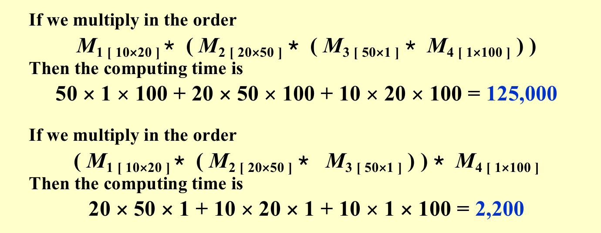
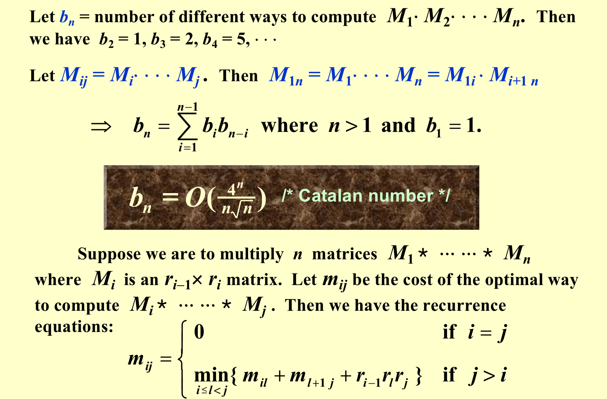
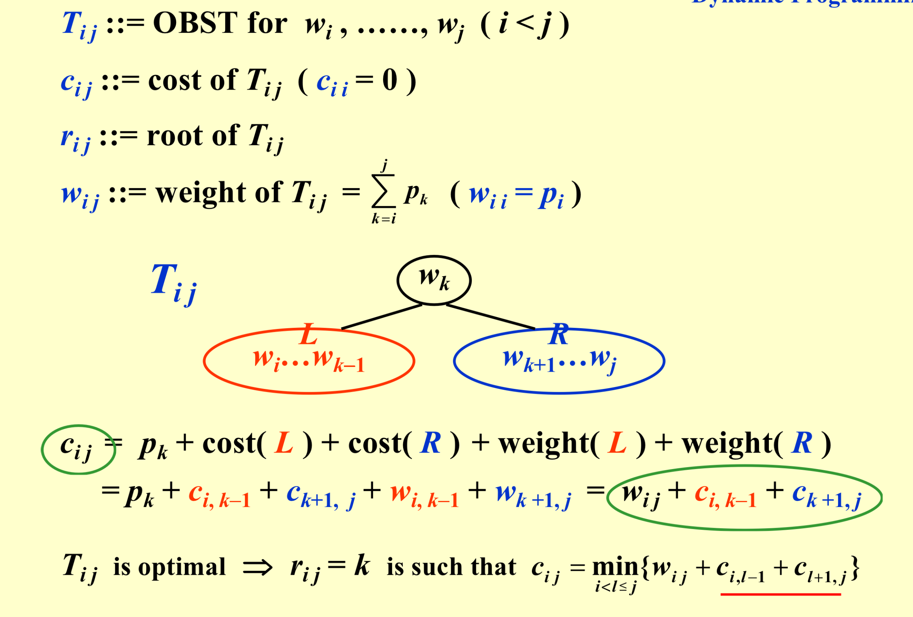
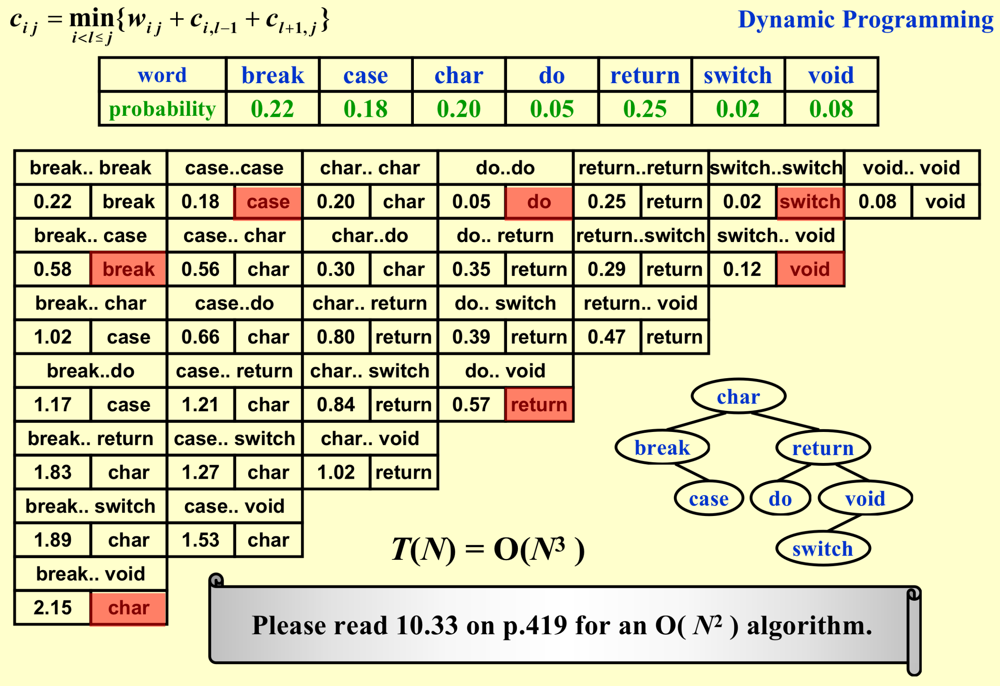
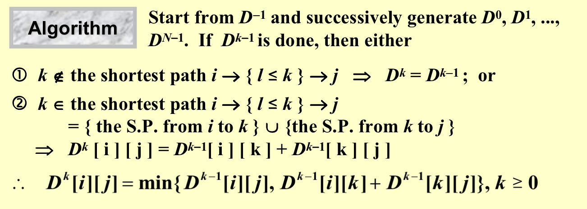
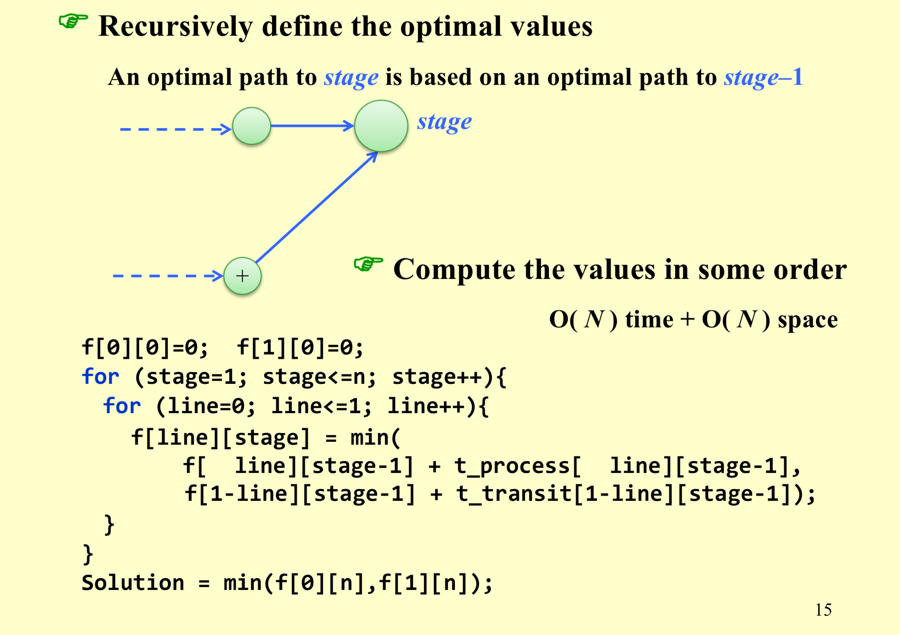
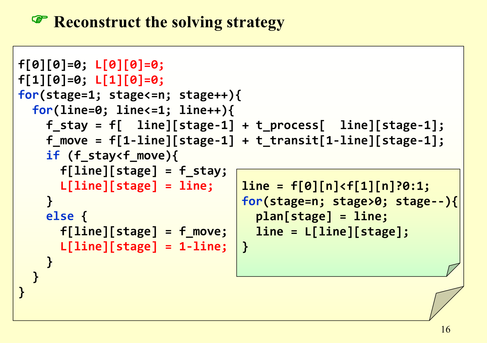

<font face = "Times New Roman">

# Dynamic Programming

## Example:
### 1. Fibonacci numbers

```C
int fib(int n) {
    if (n <= 1) return n;
    return fib(n-1) + fib(n-2);
}
```

* Time complexity: $O(2^n)$

If we use dynamic programming, we can reduce the time complexity to $O(n)$.
```C
int fib(int n) {
    int f[n+1];
    f[0] = 0;
    f[1] = 1;
    for (int i = 2; i <= n; i++) {
        f[i] = f[i-1] + f[i-2];
    }
    return f[n];
}
```
### 2. Ordering Matrix Multiplications
* Suppose we are to multiply 4 matrice $M_1, M_2, M_3, M_4$.
  $M_{1[10\times20]}, M_{2[20\times 50]}, M_{3[50\times 1]}, M_{4[1\times100]}$


*  In which order can we compute the product of n matrices with minimal computing time?



* Satisfy the optimal substructure property
* Time complexity: 
  (1) Go through l : $O(n)$
  (2) Computer m[i][l] : $O(1)$
  (3) Compute m[i+1][j] : $O(1)$
  (4) $r_{i-1} \times r_l \times r_j$ : $O(1)$

Total time complexity: $O(n^3)$ -- compute all m[i][j]

```C
void OptMatrix( const long r[ ], int N, TwoDimArray M ) 
{   int  i, j, k, L; 
    long  ThisM; 
    for( i = 1; i <= N; i++ )   M[ i ][ i ] = 0; 
    for( k = 1; k < N; k++ ) /* k = j - i */ 
        for( i = 1; i <= N - k; i++ ) { /* For each position */ 
	j = i + k;    M[ i ][ j ] = Infinity; 
	for( L = i; L < j; L++ ) { 
	    ThisM = M[ i ][ L ] + M[ L + 1 ][ j ] 
		    + r[ i - 1 ] * r[ L ] * r[ j ]; 
	    if ( ThisM < M[ i ][ j ] )  /* Update min */ 
		M[ i ][ j ] = ThisM; 
	}  /* end for-L */
        }  /* end for-Left */
}
```

* More suitable way : Find a order that is increasing.
> $F[N][i] = min_{k}(F[k-i][i]+F[N-k-i][k+1]+r_{k-i-1} \times r_i \times r_{N-i})$ ?


### 3. Optimal Binary Search Trees
Given  N  words  $w_1, w_2, \cdots, w_N$  and their search probabilities  $p_1, p_2, \cdots, p_N$ .  We want to arrange these words in a binary search tree in a way that minimize the expected total access time : $\sum_{i=1}^{N} (d_i+1) \times p_i$ , where  $d_i$  is the depth of the node containing  $w_i$  in the binary search tree.



* **Note: ordered by Alphabetical order!**



### 4. All Pairs Shortest Paths
* Given a graph  $G = (V, E)$  with edge weights  $w(u, v)$  for  $(u, v) \in E$ , we want to compute the shortest path between **every pair** of vertices in  $V$ .

Method 1: Use single source shortest path algorithm  $N$  times.

**Method 2: Floyd-Warshall Algorithm**
Define  $D^k[i][j]$= $min\{ length\ of\ path\ i \to {l \le k }\to j\}$ and $D^{-1}[ i ] [ j ] = Cost [ i ] [ j ]$. 

Then the length of the shortest path from i to j  is $D^{N-1}[ i ] [ j ]$.



```C
/* A[ ] contains the adjacency matrix with A[ i ][ i ] = 0 */ 
/* D[ ] contains the values of the shortest path */ 
/* N is the number of vertices */ 
/* A negative cycle exists iff D[ i ][ i ] < 0 */ 
void AllPairs( TwoDimArray A, TwoDimArray D, int N ) 
{   int  i, j, k; 
    for ( i = 0; i < N; i++ )  /* Initialize D */ 
         for( j = 0; j < N; j++ )
	 D[ i ][ j ] = A[ i ][ j ]; 
    for( k = 0; k < N; k++ )  /* add one vertex k into the path */
         for( i = 0; i < N; i++ ) 
	 for( j = 0; j < N; j++ ) 
	    if( D[ i ][ k ] + D[ k ][ j ] < D[ i ][ j ] ) 
		/* Update shortest path */ 
		 D[ i ][ j ] = D[ i ][ k ] + D[ k ][ j ]; 
}
```

$T(N) = O(N^3)$, but faster in a dense graph.

**How to design a DP method?**
1. Characterize the structure of an optimal solution.
2. Recursively define the value of an optimal solution.
3. Compute the value of an optimal solution in some order.
4. Reconstruct an optimal solution from computed information.

### 5. Product Assembly

* Two assembly lines for the same car
* Different technology (time) for each stage
* One can change lines between stages
* Minimize the total assembly time
  
  

</font>
