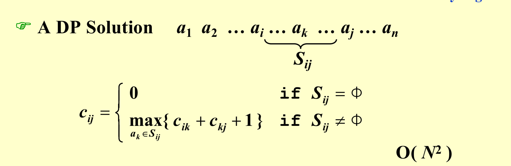
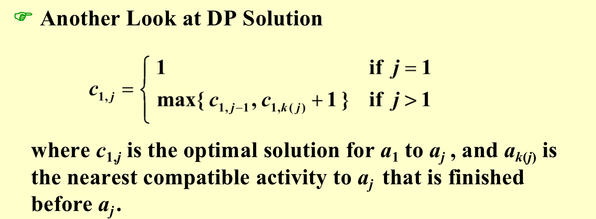
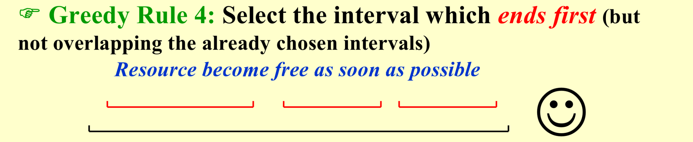
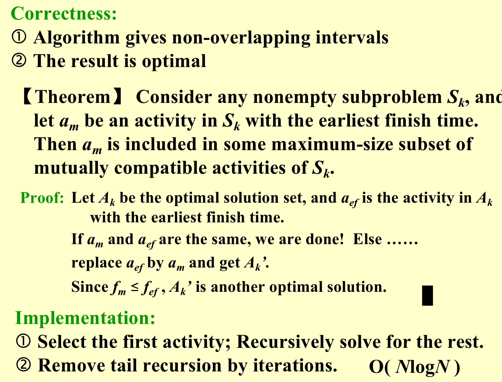
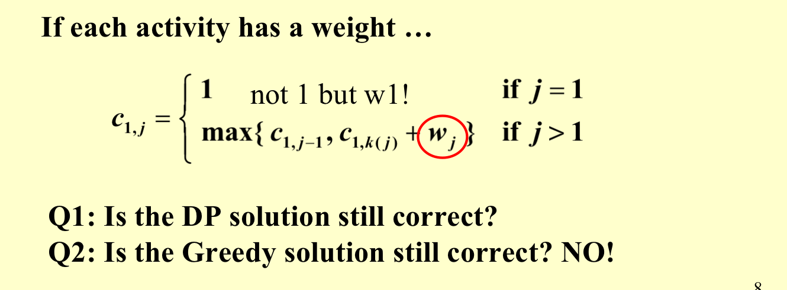
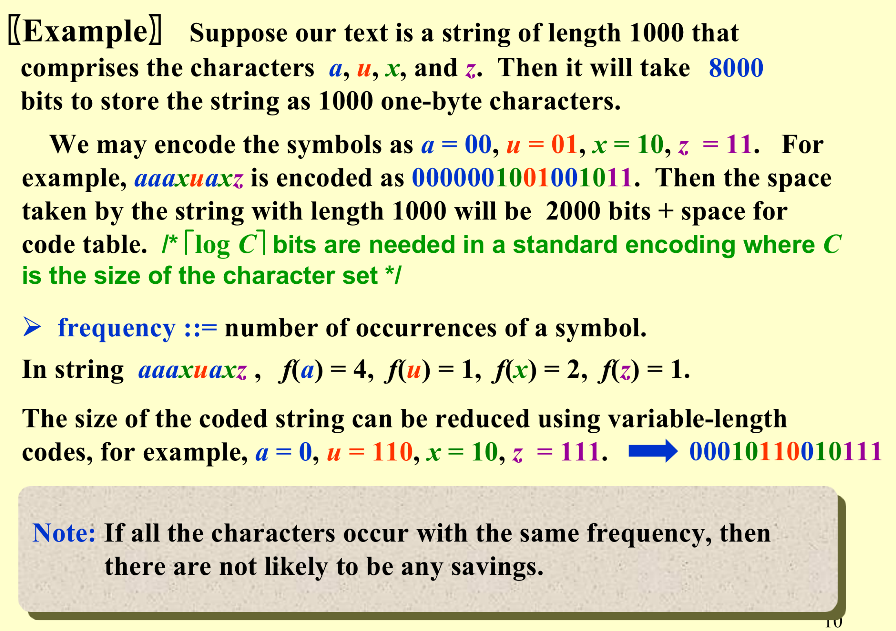
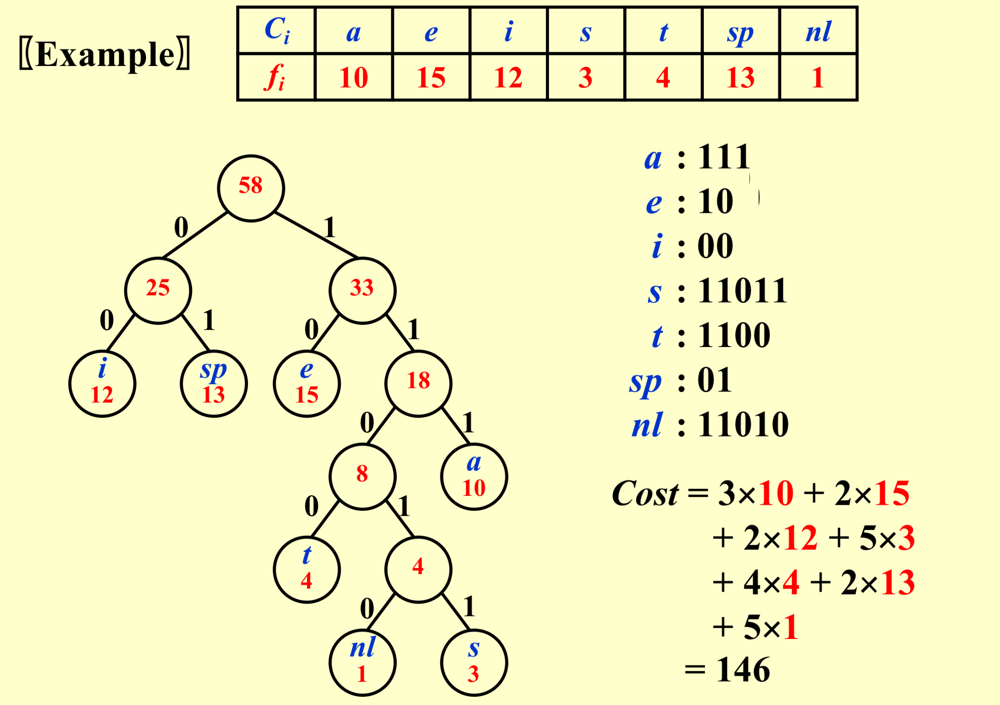
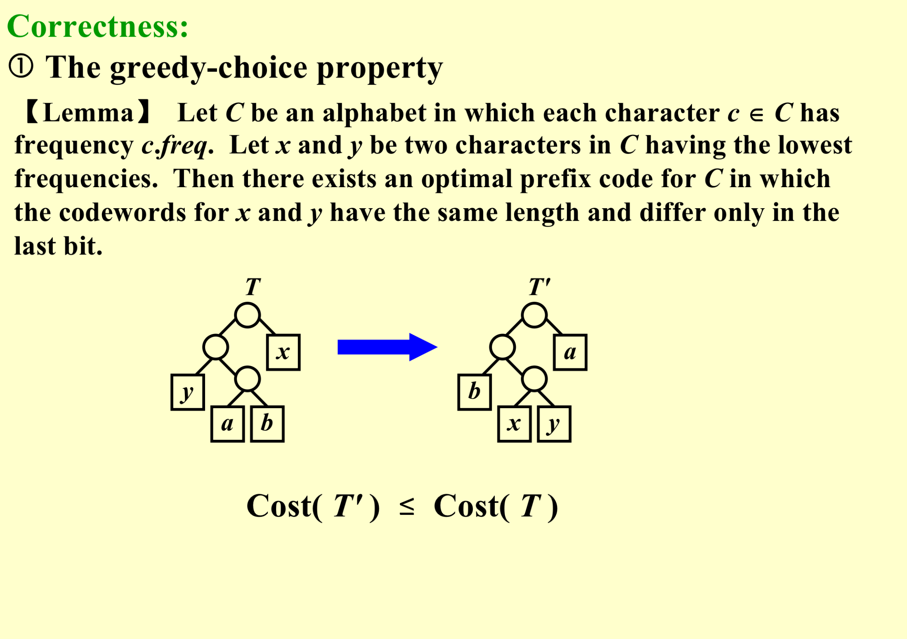
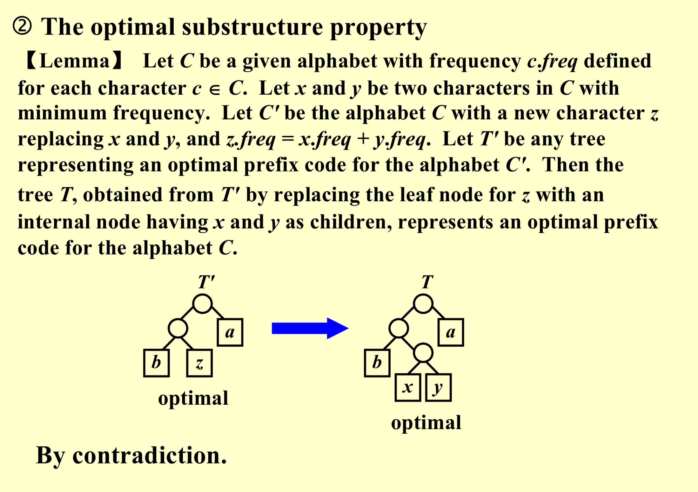

<font face = "Times New Roman">

# Greedy Algorithm

## Activities Arrangements

Given a set of activities $S = \{ a_1, a_2, …, a_n \}$ that wish to use a resource (e.g. a classroom). 

Each $a_i$ takes place during a time interval $[s_i, f_i)$.Activities ai and aj are compatible if $s_i \ge f_j$ or $s_j \ge f_i$​​ (i.e. their time intervals do not overlap).

#### Dynamic Programming

* A DP Solution



`c[i][k] :  i is start activity j is end activity and i j not included.`

```C
//记忆保存搜索结果
if S[i][j] == NULL : return 0;
for k
  if (c[i][k]==-1) c[i][k] = dfs(i,k)
```

* Better Solution



#### Greedy Algorithm

1. Cast the optimization problem as one in which we **make a choice** and are left with one subproblem to solve.

2. Prove that there is always an **optimal solution** to the original problem that makes the greedy choice, so that the greedy choice is **always safe**.

   > First choice can always be included !

3. Demonstrate optimal substructure by showing that, having made the greedy choice, what remains is a subproblem with the property that if we combine an optimal solution to the subproblem with the greedy choice we have made, we arrive at an optimal solution to the original problem. 

> Greedy algorithm works only if the local optimum is equal to the global optimum. 





 #### Change



## Huffman Codes



 The trick is:**No code is a prefix of another!!**   

* All characters are at leaves!
* Full Tree !

> Or it will cause ambiguity when decoding!

#### Huffman's algorithm



```C
void Huffman ( PriorityQueue  heap[ ],  int  C )
{   consider the C characters as C single node binary trees,
     and initialize them into a min heap;
     for ( i = 1; i < C; i++ ) { 
        create a new node;
        /* be greedy here */
        delete root from min heap and attach it to left_child of node;
        delete root from min heap and attach it to right_child of node;
        weight of node = sum of weights of its children;
        /* weight of a tree = sum of the frequencies of its leaves */
        insert node into min heap;
   }
}
/*T = O(ClogC)*/
```





* $T^{*'} = T^*-freq(x)-freq(y)\\(T^{*'} = cost + d*freq(x+y)),T^* = cost + (d+1)*(freq(x)+freq(y))$​


</font>
