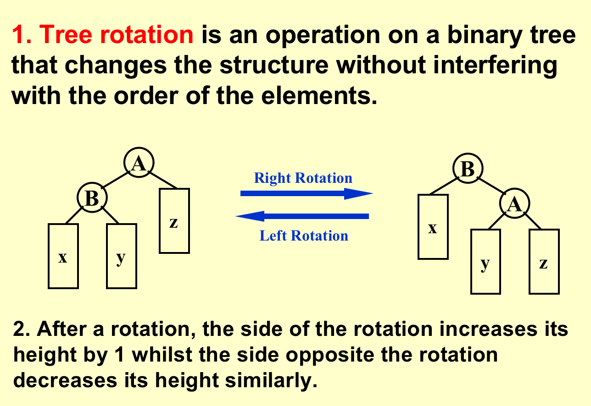

## AVL Tree
* An empty binary tree is height balanced.
* If T is nonempty binary tree with $T_L$ and $T_R$ as its left and right subtrees,then T is height balanced iff
  (1)$T_L$ and $T_R$ are height balanced
  (2)$|h_L-H_R|\le 1$ where $h_l$ and $h_R$ are the heights of $T_L$ and $T_R$
* Balance Factor BF(node) = $h_L$-$h_r$
  In an AVL Tree,$BF(node)$ = -1,0,or 1
* The height of an empty tree 
is defined to be –1
### Tree Rotation
* Changes Sturcture without intefering 
  
* Time complexity: $O(1)$
### Rotation for AVL Tree
* RR Rotation
* LL Rotation
* RL Rotation
* LR ROtation

勘误 ： $n_h \approx \frac{1}{\sqrt{5}}(\frac{1+\sqrt{5}}{2})^{h+3}$
## Splay Trees
Target :  Any $M$ consecutive tree operations starting from an empty tree take at most $O(M log N)$ time.
* For any nonroot node $X$ , denote its parent by $P$ and grandparent by $G$

* 其实不是Single rotation，也是要两次(Zig-Zig) : 先转 P再转X
* Zig-Zag only rotate X

## Amortized Analysis
