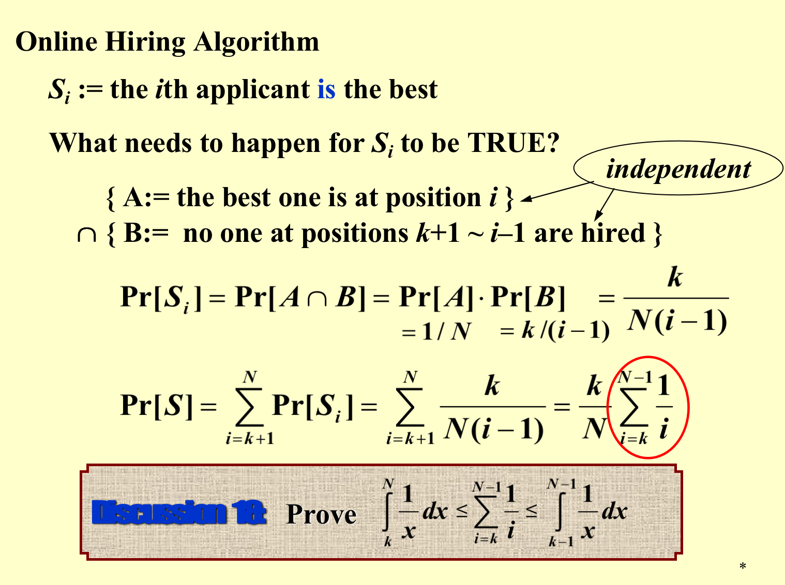
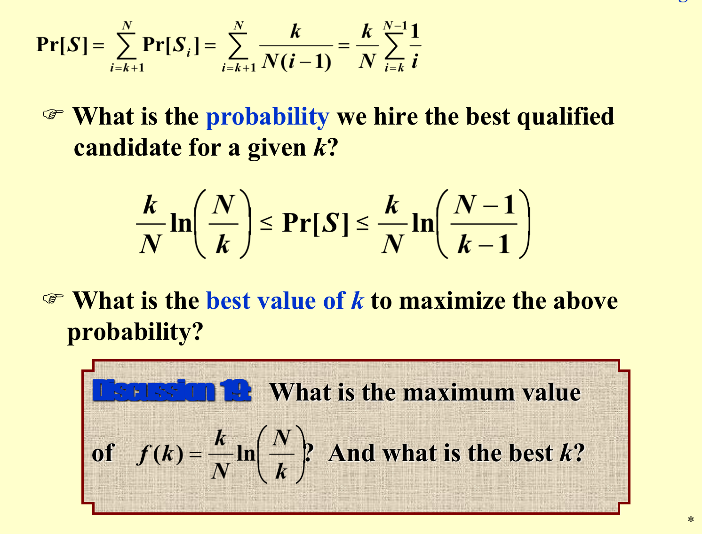
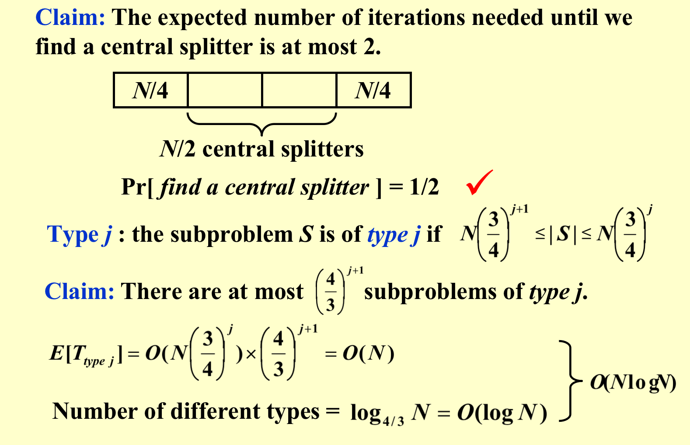

<font face = "Times New Roman" >

## Randomized Algorithms
### [Example] The Hiring Problem
* Hire an office assistant from headhunter 
* Interview a different applicant per day for N days
* Interviewing $Cost = C_i$  <<  $Hiring Cost = C_h$
* Analyze interview & hiring cost instead of running time

Assume M people are hired.Total Cost: $C = O(NC_i + MC_h)$

#### Naïve Solution
```c++
int Hiring ( EventType C[ ], int N )
{   /* candidate 0 is a least-qualified dummy candidate */
    int Best = 0;
    int BestQ = the quality of candidate 0;
    for ( i=1; i<=N; i++ ) {
        Qi = interview( i ); /* Ci */
        if ( Qi > BestQ ) {
            BestQ = Qi;
            Best = i;
            hire( i );  /* Ch */
        }
    }
    return Best;
}
```
Worst Case: $O(N)$ interviews, $O(N)$ hires, $O(N)$ comparisons

> Assume candidates are randomly ordered.  
* X = number of hires. E[X] = $\sum\limits_{i=1}^{N} i·Pr[X=i]$
* $ X_i = \begin{array}{ll} 1\ if\ i\ is\ hired \\ 0\ otherwise \end{array}$
* $Pr[X_i = 1] = \frac{1}{i}$
* E[X] = Expected number of hires = $E[\sum\limits_{i=1}^{N} X_i] = \sum\limits_{i=1}^{N} E[X_i] = \sum\limits_{i=1}^{N} \frac{1}{i} = O(\log N) +O(1)$
* $O(C_h \log N + NC_i)$

#### Randomized Solution
```c++
int RandomizedHiring ( EventType C[ ], int N )
{   /* candidate 0 is a least-qualified dummy candidate */
    int Best = 0;
    int BestQ = the quality of candidate 0;

    randomly permute the list of candidates;

    for ( i=1; i<=N; i++ ) {
        Qi = interview( i ); /* Ci */
        if ( Qi > BestQ ) {
            BestQ = Qi;
            Best = i;
            hire( i );  /* Ch */
        }
    }
}
```

#### Radomized Permutation Algorithm

* Target : Permute array A[ ]
> Assign each element A[ i ] a random priority P[ i ],and sort
```c++
void PermuteBySorting ( ElemType A[ ], int N )
{
    for ( i=1; i<=N; i++ )
        A[i].P = 1 + rand()%(N3); 
        /* makes it more likely that all priorities are unique */
    Sort A, using P as the sort keys;
}
```
* What's the possibility of no two priorities being the same?
 $\frac{A_{N^3}^N }{(N^3)^N}$

#### online Hiring Algorithm
```c++
int OnlineHiring ( EventType C[ ], int N, int k )
{
    int Best = N;
    int BestQ = - infinity ;
    for ( i=1; i<=k; i++ ) {
        Qi = interview( i );
        if ( Qi > BestQ )   BestQ = Qi;
    }
    for ( i=k+1; i<=N; i++ ) {
        Qi = interview( i );
        if ( Qi > BestQ ) {
            Best = i;
            break;
        }
    }
    return Best;
}
```




### [Example] Quicksort
* Central splitter := the pivot that divides the set so that each side contains at least $n/4$
* Modified Quicksort := always select a central splitter before recursions



</font>