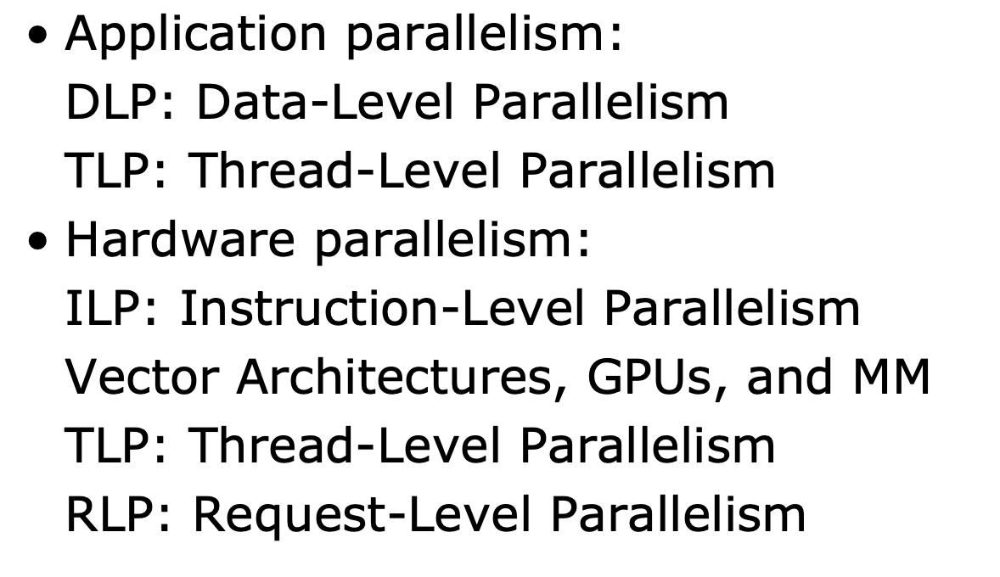
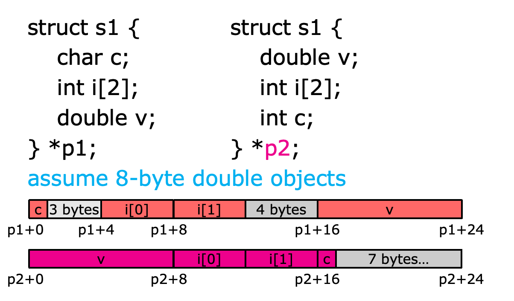

# Lecture 1: Introduction to Computer Architecture

## 1.1 Parallelism

### Application Parallelism

* DLP: Data-Level Parallelism : **many data items being operated** on **at the same time** ; **distribute the same data across different processors**;

* TLP: Task-Level Parallelism : tasks of work created to operate independently and largely in parallel

### Hardware Parallelism

#### ILP: Instruction-Level Parallelism

exploits data-level parallelism at modest levels – **pipelining**

#### Vector Architectures, GPUs, and MM

exploit data-level parallelism;

* apply a single instruction to **a collection of data in parallel**

#### TLP: Thread-Level Parallelism

exploits **either DLP or TLP**, in a tightly coupled hardware model that allows for interaction **among parallel threads**;

#### RLP: Request-Level Parallelism

exploits parallelism among largely decoupled tasks specified by the programmer or the OS

### Classes of Parallel Architectures

#### SISD

SISD works on **single instruction stream** and **single data stream.** It can exploit **only instruction-level parallelism**.

(use techniques such as superscalar and speculative execution)
Superscalar: in which multiple execution units are used to execute multiple instructions in parallel

#### SIMD

Single instruction stream, **multiple data stream**

The same instruction is **executed by multiple processors** using **different data streams**.

Each processor has a data memory of its own, while all processors share **a single instruction memory** and control processor, which fetches and dispatches instructions.

> Chapter 4 covers DLP and three different architectures that exploit it: **vector architectures**, **multimedia extensions** to standard instruction sets, and GPUs. 

#### MISD

Multiple instruction streams, single data stream

> hard to exploit data-level parallelism

No commercial multiprocessor of this type yet

#### MIMD

MIMD works on multiple instruction streams and multiple data streams.
Each processor fetches its own instructions and operates on its own data.

**It exploits task-level parallelism.**

> Chapter 5 covers tightly coupled MIMD architectures, which exploit thread-level parallelism because multiple cooperating threads operate in parallel. 

> Chapter 6 covers loosely coupled MIMD architectures—specifically, clusters and warehouse-scale computers—that exploit request-level parallelism, where many independent tasks can proceed in parallel naturally with little need for communication or synchronization. 

## ISA Instruction Set Architecture

### Class of ISA

Most instruction set architectures are general-purpose register architectures.
Their operands are either registers or memory locations.
Tow popular versions of general-purpose register architectures are register-memory ISA and load-store ISA.

* 80 ex 86 belongs to register-memory ISA. It allows **many instructions to access memory**.
* ARM and MIPS belong to load-store ISA. It allows **only load and store instructions to access memory**.

### Memory addressing

* smallest accessible data unit is **one byte** each byte has a unique address

### Operations

> data transfer; arithmetic/logical; control; floating point

### Control flow instructions

> conditional branches; unconditional jumps; procedure calls; returns

## Module Reliability

A measure of continuous service accomplishment (or of the time to failure) from a reference initial instant

	MTTF: mean time to failure 
	MTTR: mean time to repair
	MTBF: mean time between failures
	MTBF = MTTF + MTTR

Modlue Availability = MTTF / (MTTF + MTTR)

## RAID

### RAID6

