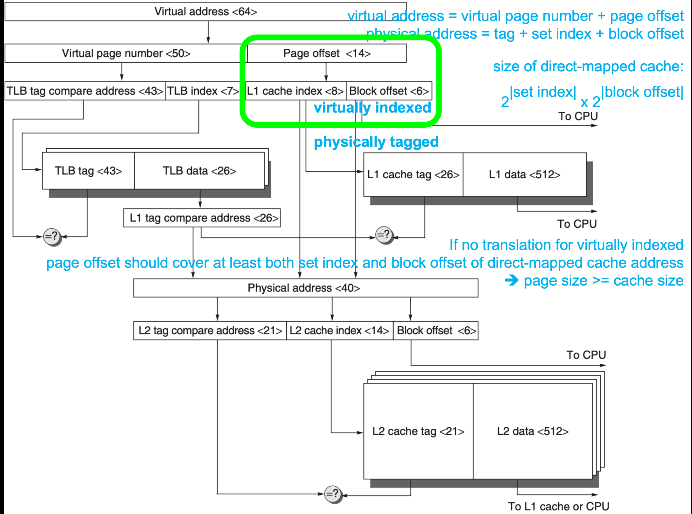
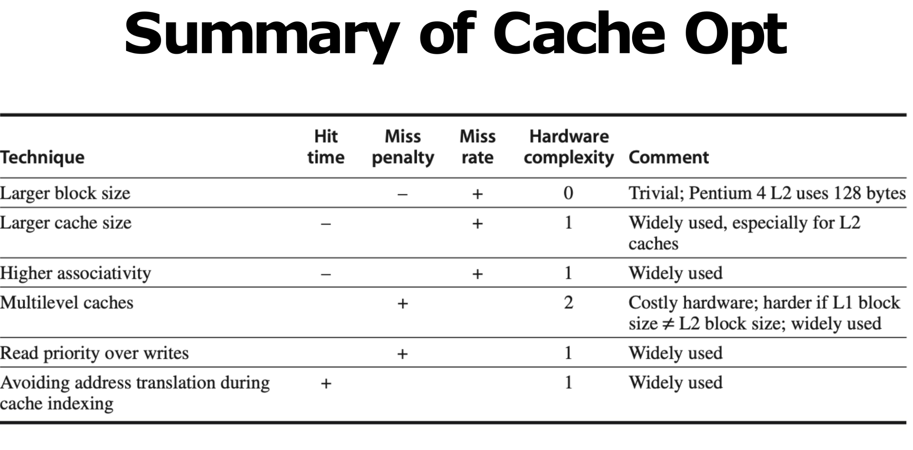
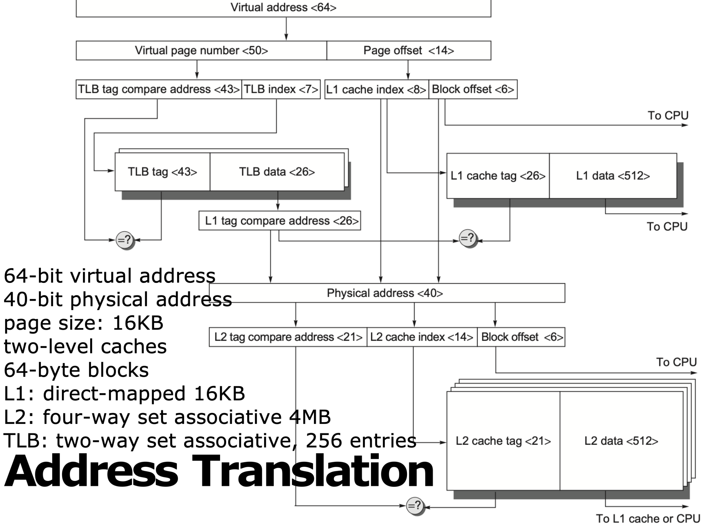
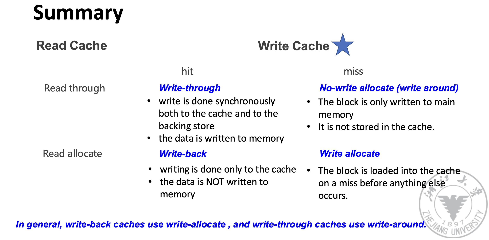
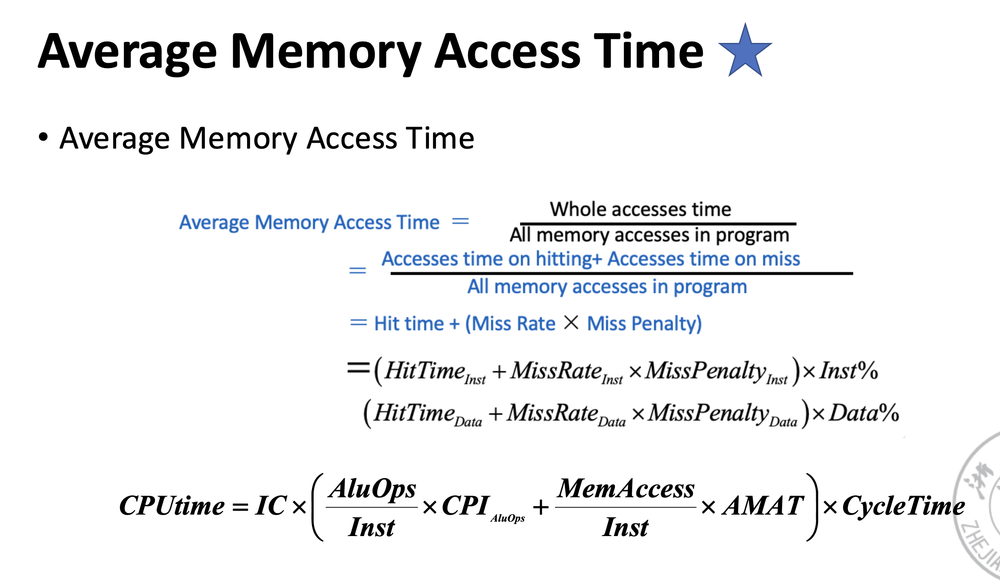

# Lecture 2: Memory Hierarchy

* SRAM for cache

> Static Random Access Memory (SRAM) is a type of semiconductor memory that uses bistable latching circuitry to store each bit. SRAM is volatile memory; data is lost when power is removed.

Don’t need to refresh, **so access time is very close to cycle time**

* DRAM for main memory

## Mapping

### Direct Mapped Cache

### Set Associative Cache

### Fully Associative Cache

## DRAM

* Dynamic Random Access Memory
* Single transistor per bit
* Reading destroys the information
* Refresh periodically 
* cycle time > access time

* 26 = 40 - 14

