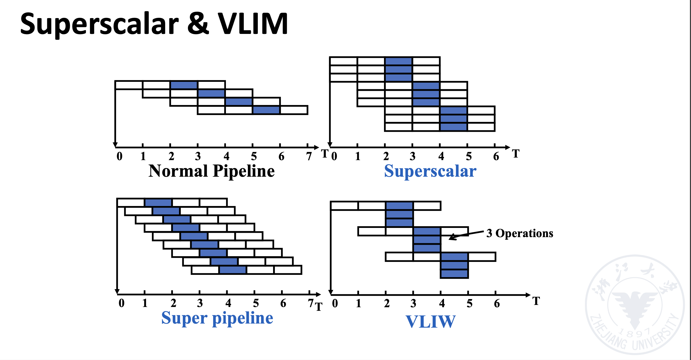

# Lecture 3: Instruction Level Parallelism

## Static Scheduling

### Pipeline Schedule

### Loop Unrolling

* Resolve loop overhead

### Branch Prediction

* Static branch prediction
* Dynamic branch prediction

## Dynamic Scheduling

### Scoreboarding

### Tomasulo's Algorithm

### Hardware Speculation

> 保证了精确异常

### Multiple Issue

我们要进行结构冒险和数据冒险的检测。需要注意的是，如果遇到了分支跳转指令，那么只流出这一条，不能和其他指令一起流出。如果处理器有分支预测，那么下一个周期就可以根据预测结果进行发射；如果不带预测，我们就需要等待分支结果，然后再发射。

#### Superscalar

* The number of instructions which are issued in each clock cycle is not fixed. It depends on the specific circumstances of the code. (1-8, with upper limit)
* Suppose this upper limit is n, then the processor is called n-issue.
* It can be statically scheduled through the compiler, or dynamically scheduled based on the Tomasulo algorithm.
* This method is the most successful method for general computing
at present.

#### VLIW

* The number of instructions which are issued in each clock cycle is **fixed (4-16)**, and these instructions constitute a long instruction or an instruction packet.
* In the instruction packet, the parallelism between instructions is explicitly expressed through instructions.
* Instruction scheduling is done statically by the compiler.
* It has been successfully applied to digital signal processing and multimedia applications.

### Multi-issue technology based on static scheduling

### Multi-issue technology based on VLIW (very long instruction word) 
### Multi-issue technology based on dynamically scheduled superscalar proc

#### Superpipelining processor

