<font face = "Times New Roman" >

# DLP

* A pipeline processor, in which the vector data representation and the corresponding vector instructions are set, is called the vector processor.
* A pipeline processor that **does not have vector data** representation and corresponding vector instructions is called a **scalar** processor.

## Vector Execution Time

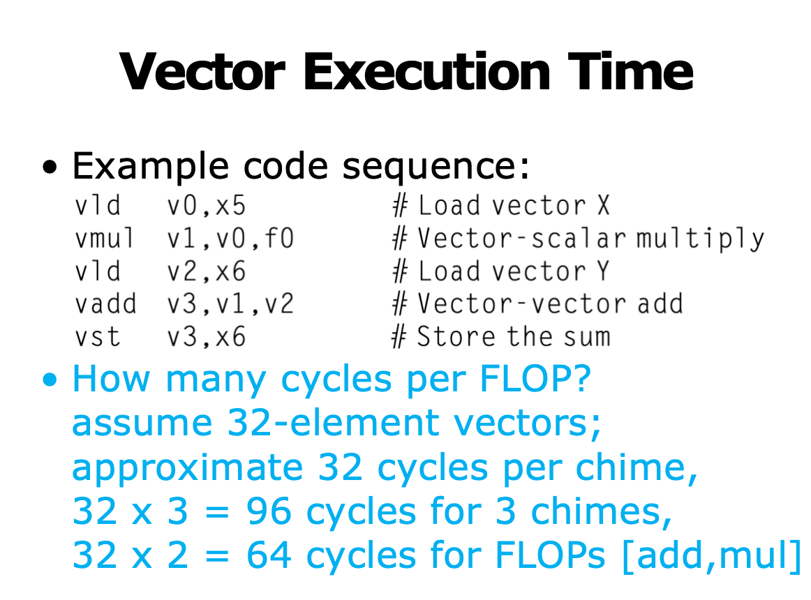

For a sequence of vector operations: 

* length of operand vectors?        
* structual hazards among operations?  
* data hazards?

For a single vector instruction:       

* vector length?                             
* initiation rate? (the rate at which a vector unit consumes new operands and produces new results)


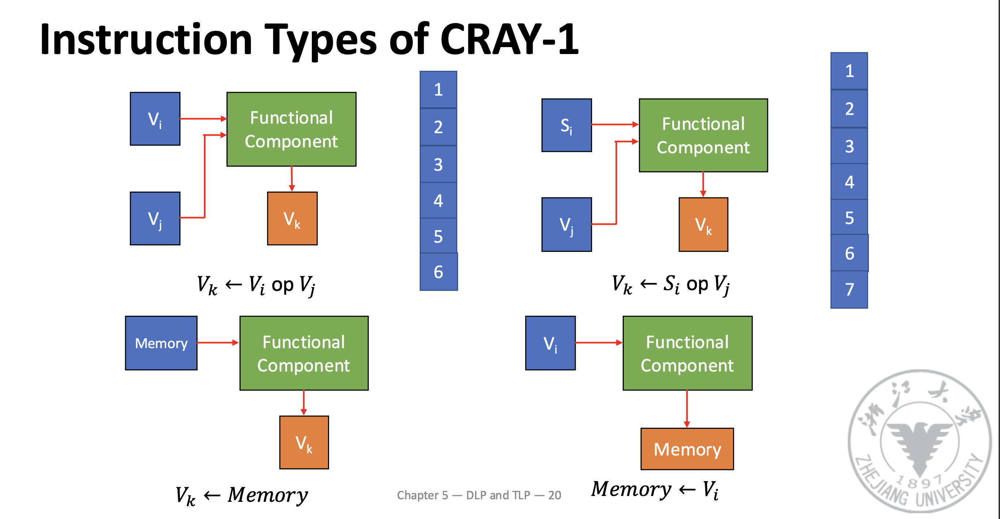

Convoy:                                           

* the set of vector instructions that could potentiallay execute together;            
* co-convoy instructions must not contain any structural hazards;                   
* RAW is allowed in the same convoy;

Chime:                                             

* the unit of time taken to execute the convoy

Cross-convoy instructions are serialized

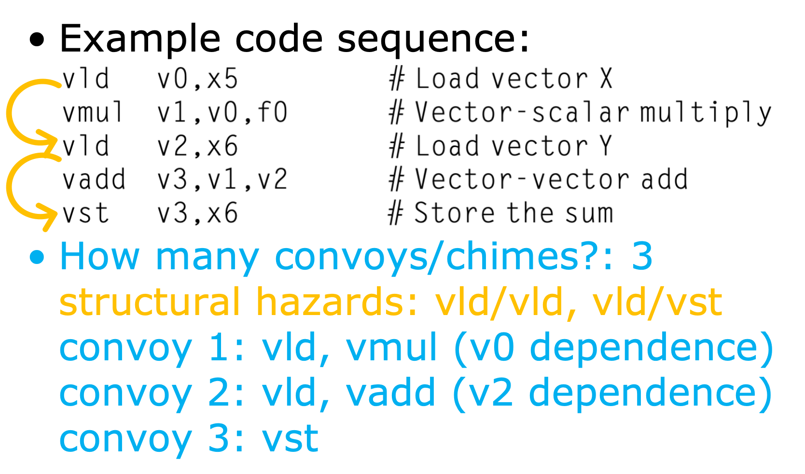

## Improve the Performance of Vector Processor

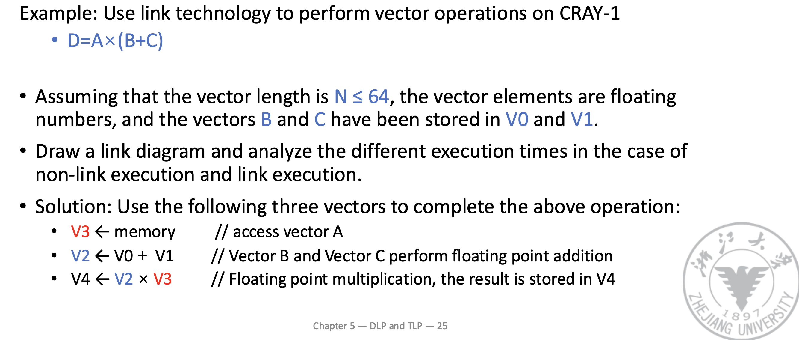

Hypothesis: It takes **one beat** to send vector data elements to the vector function unit and to store the result in the vector register, and **one beat** time to send data from the memory to the fetch function unit.

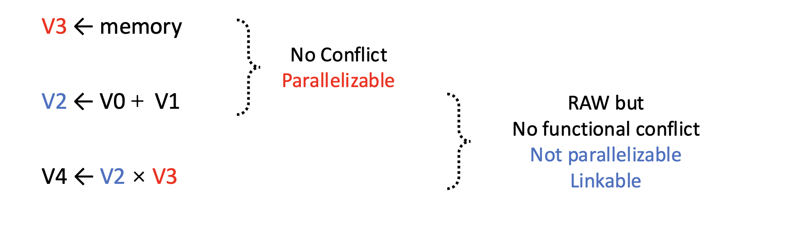

> 通过链接的方式，可以实现更高的并行度

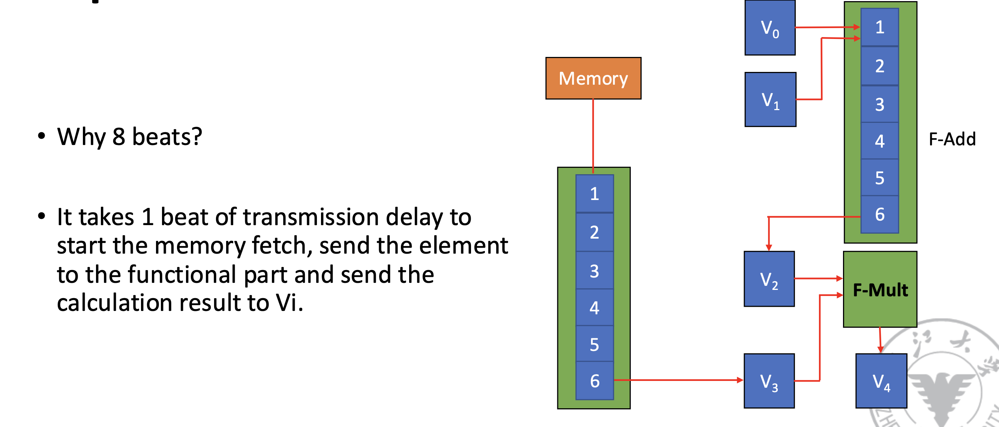

> See cr SLIDES!

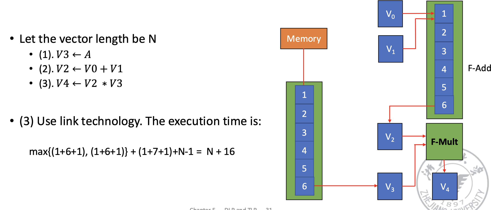

## DAXPY Example

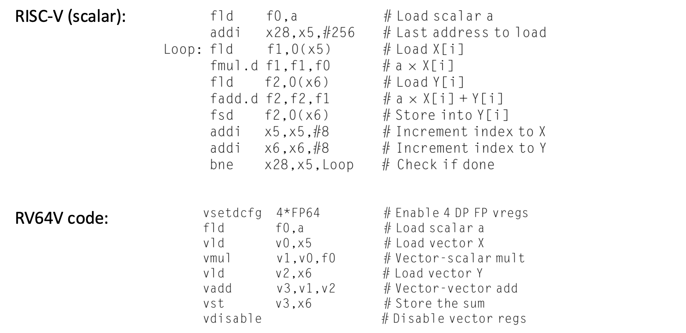

## Multiple Lanes: Beyond One Element per Clock Cycle

Use **multiple functional units** to improve vector performance;process several elements per clock cycle;

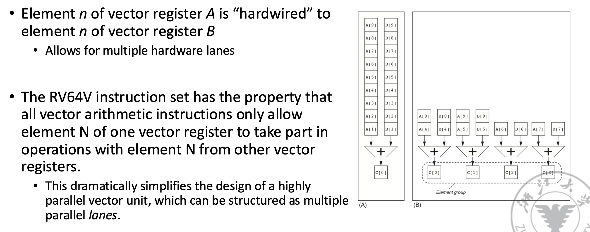

## Gather-Scatter Example

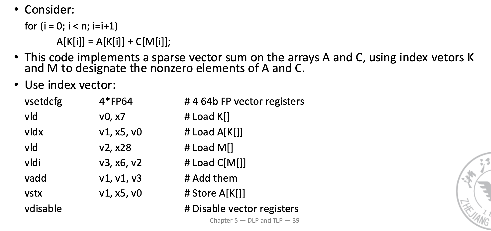


## Multimedia SIMD

## GPU

> Actually, GPUs are really just **multithreaded** SIMD Processors.

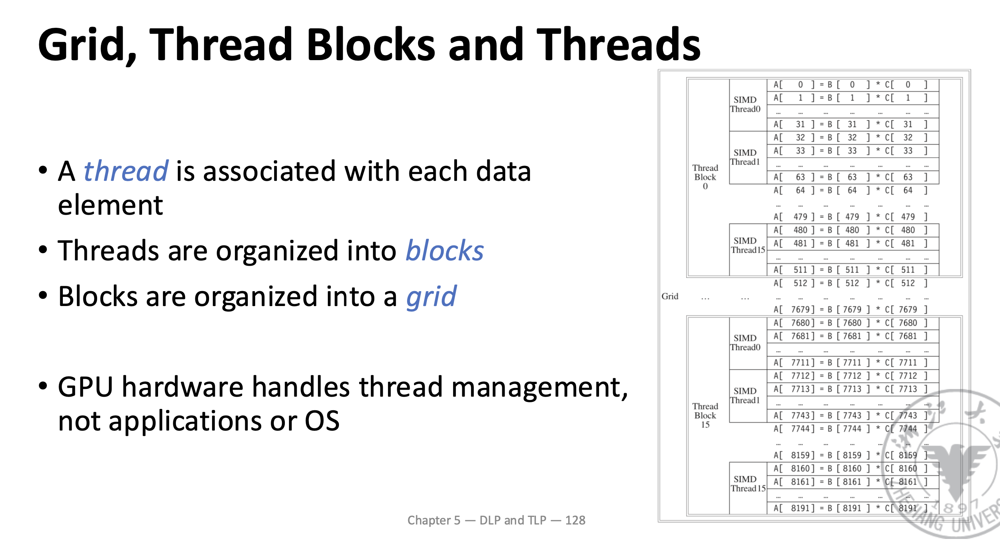
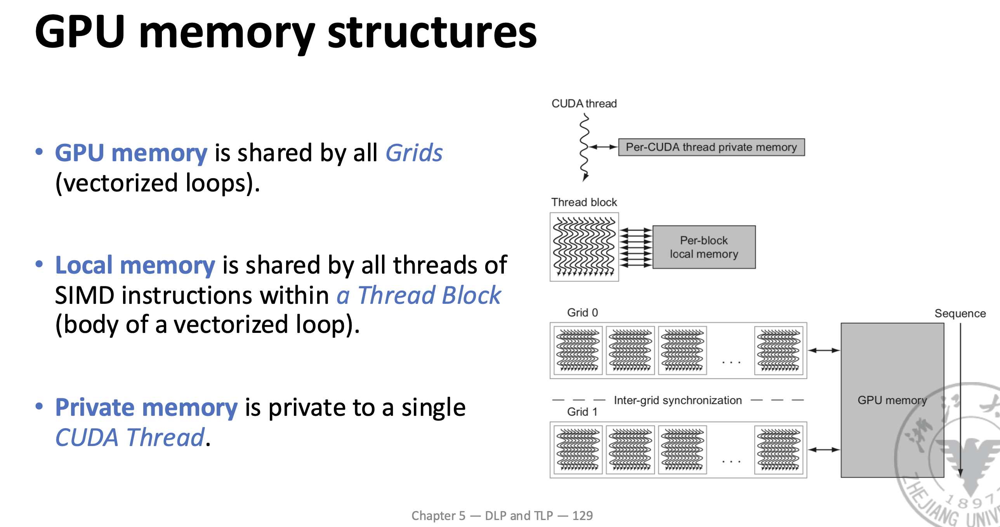

Support various types of parallelism:   multithreading, MIMD, SIMD, ILP

Challenge for programming:                

* not only getting good performance on GPU, but also in coordinating the scheduling of computation on the system processor and the GPU and the transfer of data between system memory and GPU memory

### Compare GPU with Vector Processor

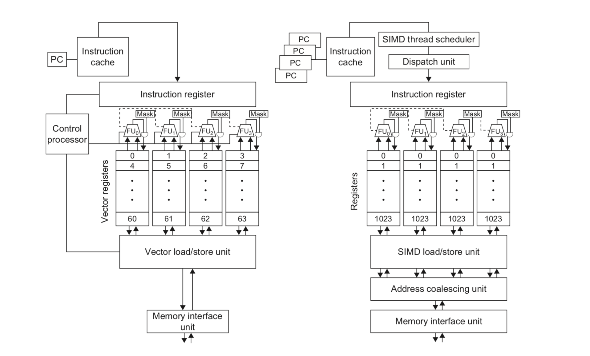

Similarities to vector machines:

* Works well with data-level parallel problems
* Scatter-gather transfers
* Mask registers
* Large register files

Differences:

* No scalar processor
* Uses multithreading to hide memory latency
* Has many functional units, as opposed to a few deeply pipelined units like a vector processor

> 向量处理器：通常拥有少量深度流水线的功能单元，可以对一个向量进行高度优化的计算。
> 多线程处理器：具有大量独立的功能单元，可以同时处理多个线程的任务，减少等待时间。

## Loop Level Parallelism

* in-iteration dependence ✅ still Parallel

```cpp
for (i=0, i<100, i=i+1)
	   X[i] = Y[i] + Z[i];
```
* cross-iteration dependence ❌ not Parallel

```cpp
for (i=0, i<100, i=i+1)
     A[i+1] = A[i] + C[i];            /* S1 */         
     B[i+1] = B[i] + A[i+1];        /* S2 */

```

* in-iteration dependence of A[i+1];
* cross-iteration dependences: A[i], B[i] with that produced in the earlier iteration 

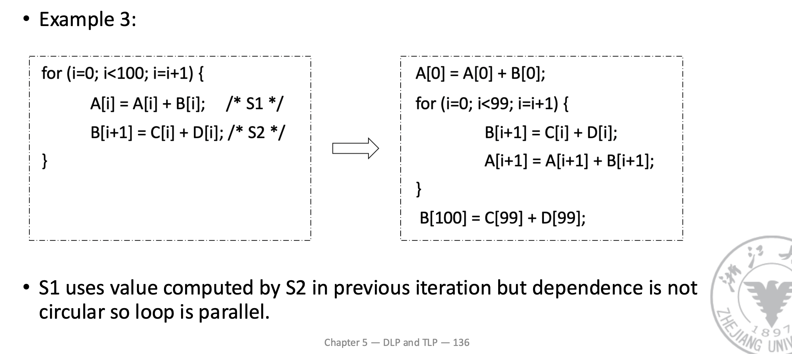

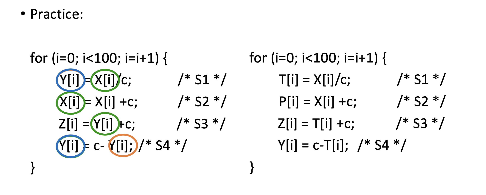


</font>