m

# Lecture 5 - TLP

> See lec13 Amdahl's Law

## MIMD [multiple instruction streams multiple data streams]

### Shared Memory

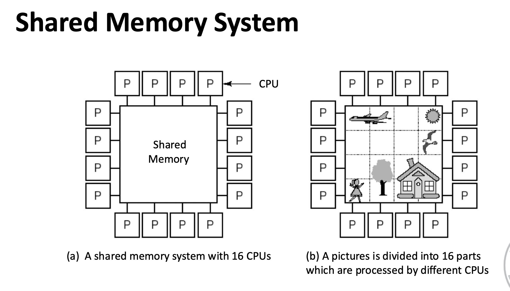
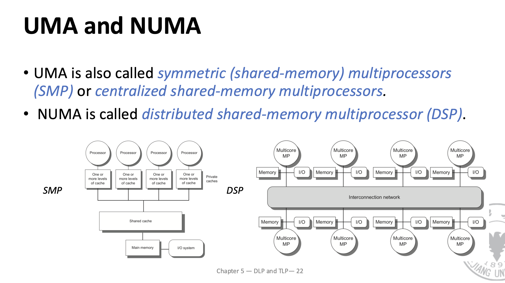

#### UMA Centralized Shared Memory Processor

> Also called symmetric (shared-memory) multiprocessors

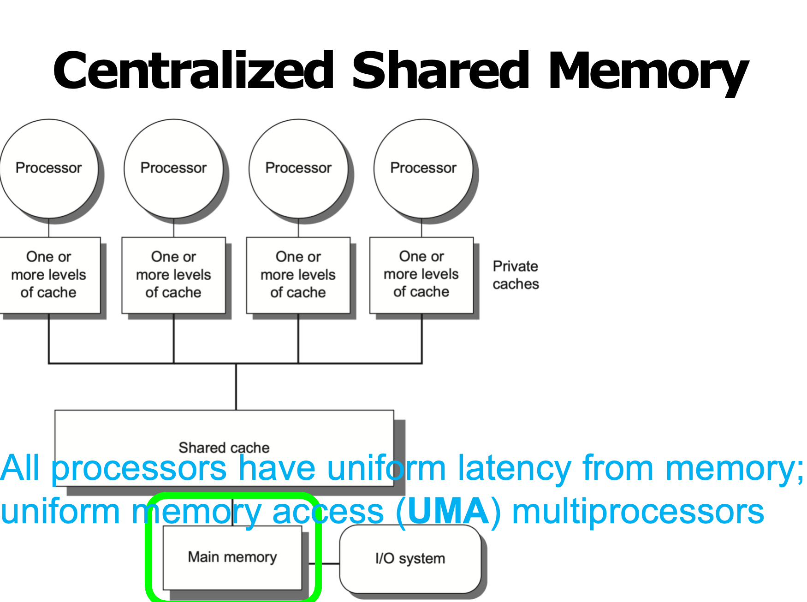

* Share a single centralized memory; All processors have equal access
* All processors have uniform latency from memory uniform memory access (UMA) multiprocessors 
* shared data used by multiple processors may be replicated in multiple caches to reduce access latency, required mem bw, contention
* w/o additional precautions different processors can have different values f**or the same memory location**

#### NUMA Distributed Shared Memory Processor

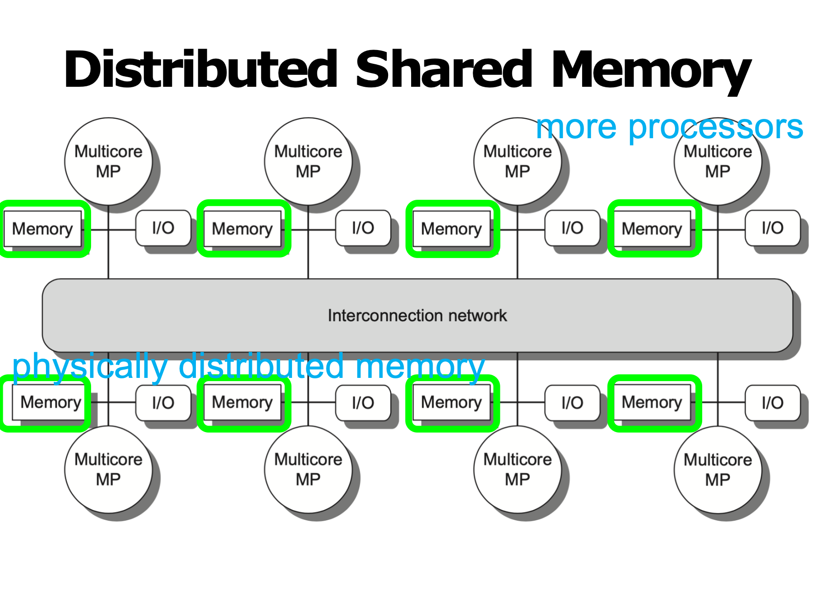

* Distributing memory among the nodes increases bandwidth & **reduces local-mem latency**
* NUMA: nonuniform memory access access time depends on data word loc in mem 

**NC-NUMA and CC-NUMA**

* The NUMA system without Cache is called the NC-NUMA multiprocessor system, which means that the remote memory access time is not hidden in this system. 
* If Cache is used, the system will be called a CC-NUMA
multiprocessor system.

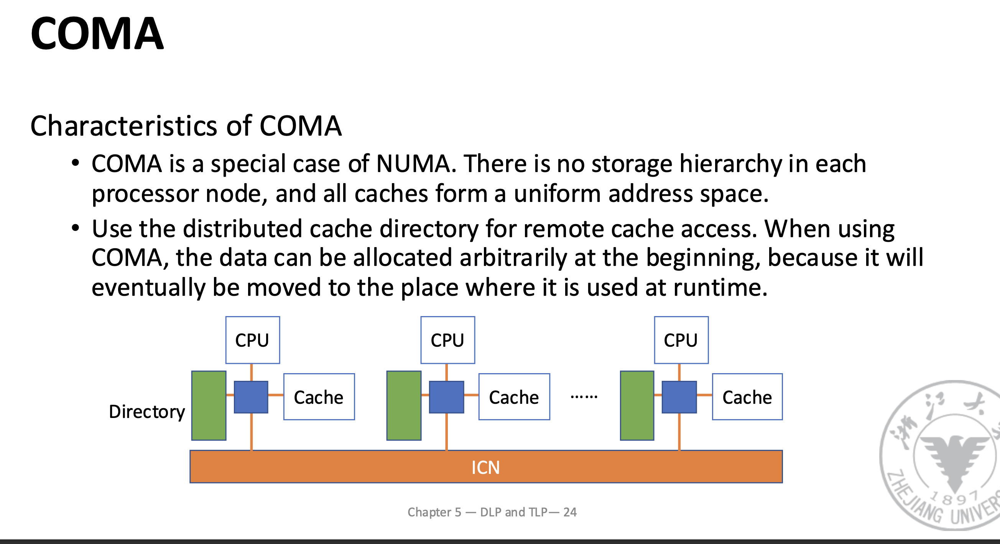

## *Cache Coherence* Problem
> Consistency 
> Example: a write of X on one processor precedes a read of X on another processor by a very small time, it may be impossible to ensure that the read returns the value of the data written,since the written data may not even have left the processor at that point

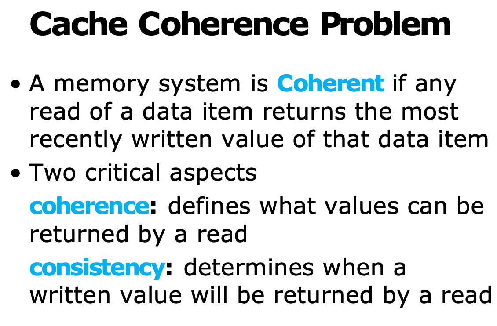

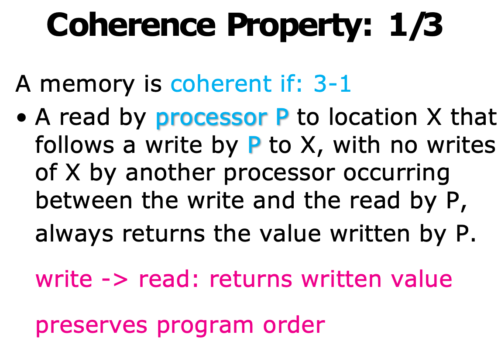
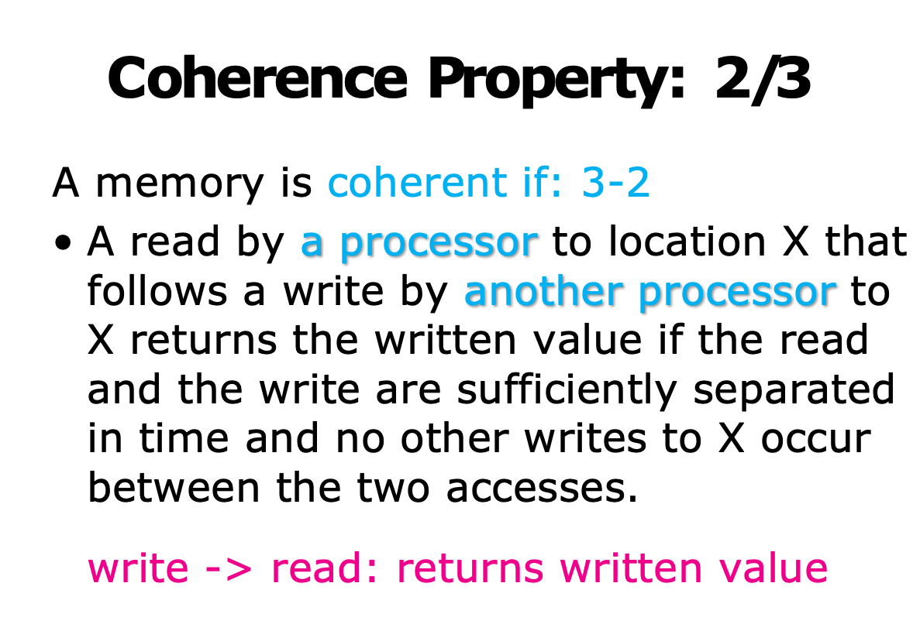
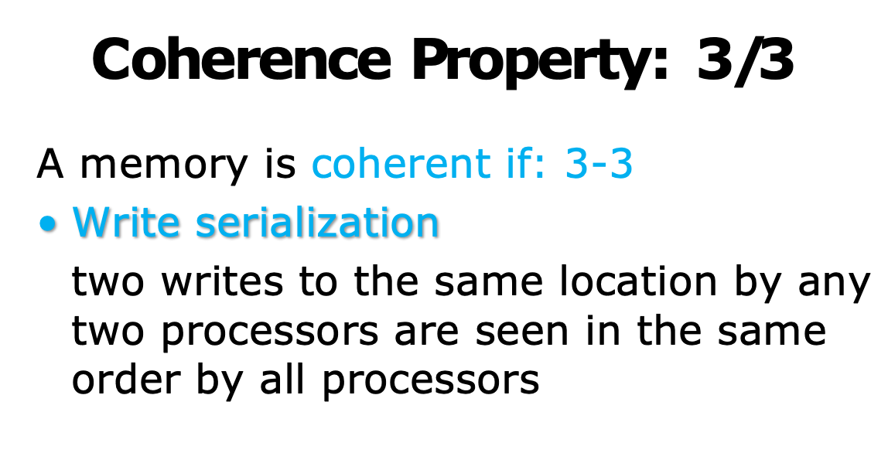

### Cache Coherence Protocols

**For UMA: Snoopy coherence protocols**

* In the snoopy coherence protocols, all processors **snoop the bus**. When a processor modifies the data in the private cache, it **broadcasts** invalid information or updated data on the bus to invalidate or update other copies.

**For NUMA: Directory protocol**

* The directory protocol uses a directory to record which processors in the system **have copies of certain storage blocks** in the cache. When a** processor wants to write a shared block,** it sends an invalid signal to those processors that have **copies of the block through the directory in a "point-to-point” way**, so that all other copies are invalidated.

#### Bus snooping protocol

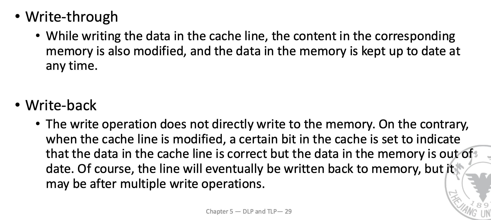

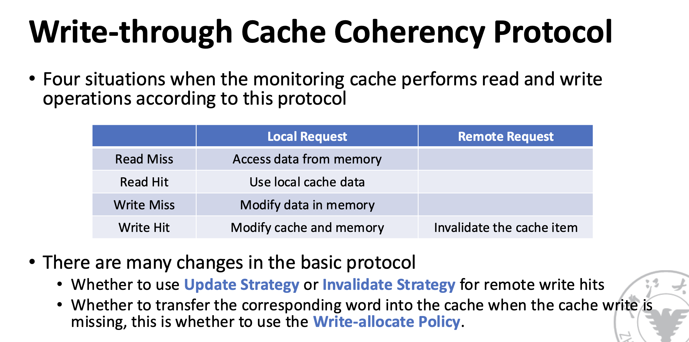

##### Write Invalidation Protocol

three block states (MSI protocol)

* Invalid 
* Shared
* indicates that the block in the private cache is potentially shared
* Modified

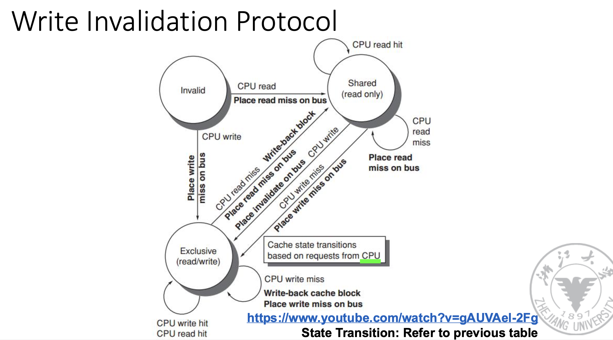

> Write Allocate: When a write miss occurs, the block is loaded into the cache and the cache is updated with the new value.
> No Write Allocate: When a write miss occurs, the block is not loaded into the cache and the w**rite is done directly to the memory**.

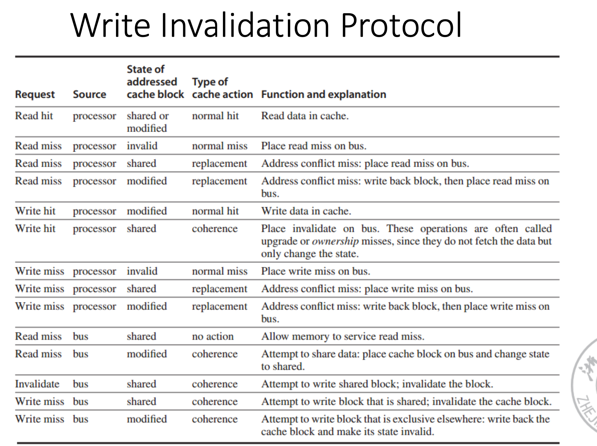
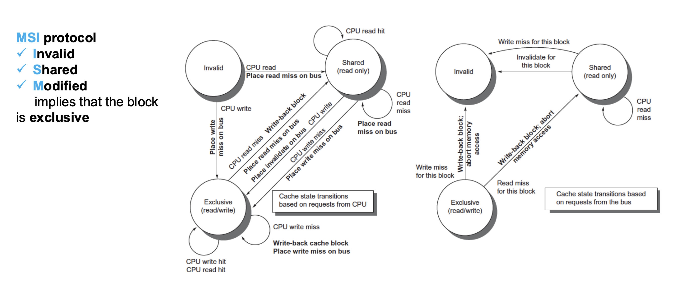

#### Directory based protocol

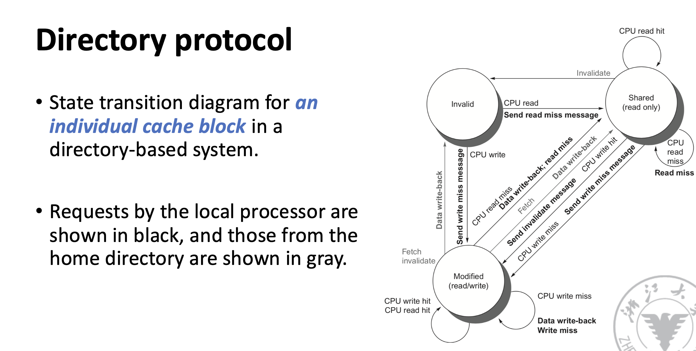

## Memory Consistency

### Relaxed Consistency Models
### 

