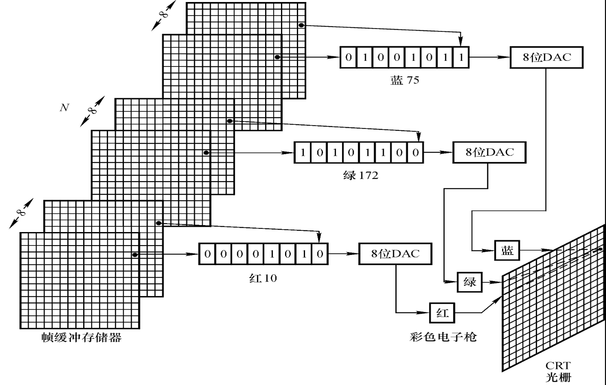
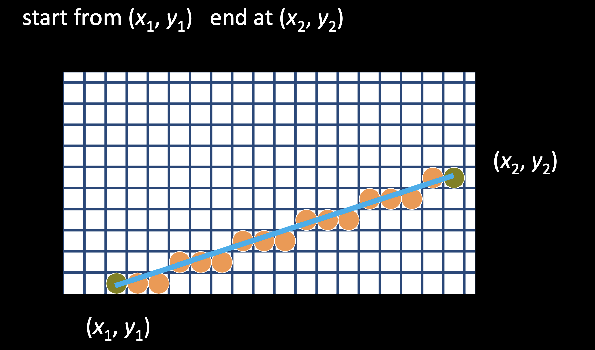
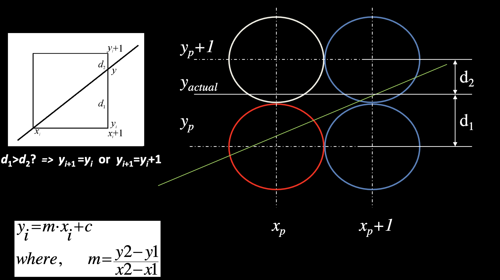
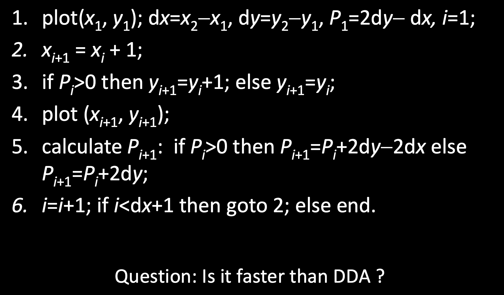
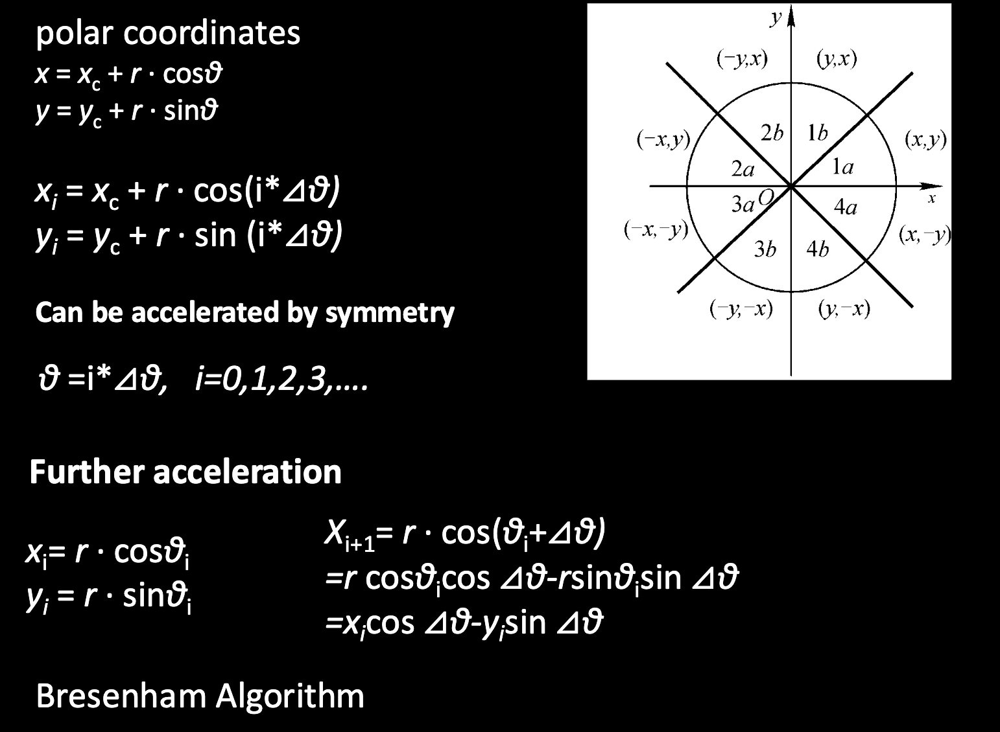
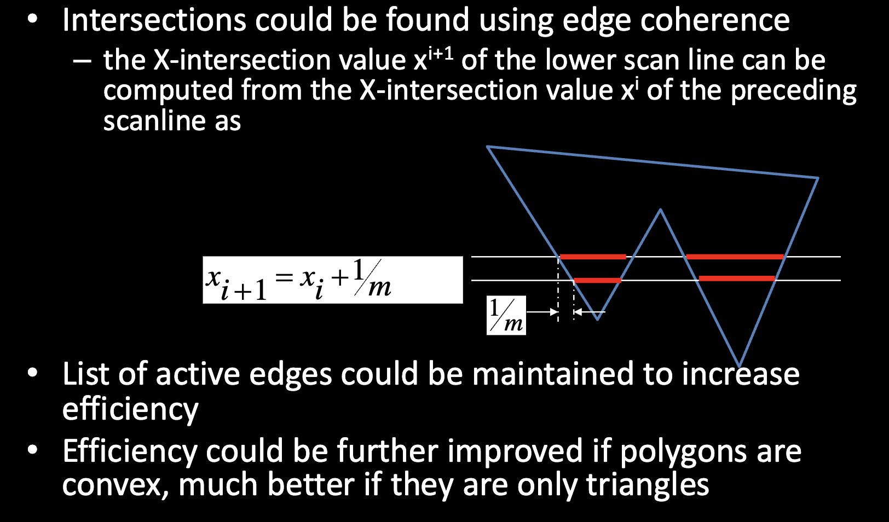
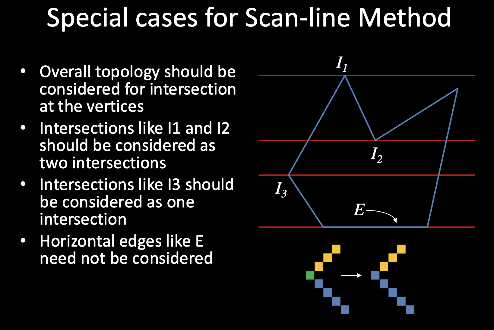

<font face = "Times New Roman" size = 4>

# Lecture 1 - 2D Graphics

## Rasterization
### Scan Conversion


#### Scan converting a line segment


* Calculate Slop : $m = \frac{y_2-y_1}{x_2-x_1}=\frac{\Delta y}{\Delta x}$
* Digital Differential Analyzer (DDA) Algorithm
  * We consider the line **in the first octant**. 
  * Other cases can be easily derived.
  * $x_{i+1} = x_i + 1$
  * $y_{i+1} = y_i + m$
  * plot the point $(x_{i+1}, \text{round}(y_{i+1}))$
  * The algorithm uses floating point operations, which are very cleverly avoided in an algorithm first proposed by **J. Bresenhamof IBM**
  
**Bresenham's Line Drawing Algorithm**



* Derivation

$$
\begin{aligned}
& dx = x_2 - x_1\ dy = y_2 - y_1\ m = \frac{dy}{dx}\\
& y = m(x_{i + 1}) + b \ (1)\\
& d_1 = y - y_i \ (2)\\
& d_2 = y_i +1 - y \ (3)\\
\end{aligned}
$$

* if $d_1 - d_2 < 0$, then $y_{i+1} = y_i$, else $y_{i+1} = y_i + 1$.
* Substitute (1), (2) & (3) into $d_1−d_2$
* we get $d_1 - d_2 = 2y-2y_i-1 = 2\frac{dy}{dx}x_i + 2\frac{dy}{dx} - 2y_i - 1 + 2b$
* Multiply by $dx$ on both sides, we get $P_i = dx(d_1 - d_2) = 2dyx_i + 2dy - 2y_idx + (2b - 1)dx$
* sign$(d_1−d_2)=sign(P_i)$ : If $P_i >0$，then $y_{i+1}=y_i+1$，else $y_{i+1}=y_i$.
$$
\begin{aligned}
& P_i = 2dyx_i + 2dy - 2y_idx + (2b - 1)dx\\
& P_{i+1} = 2dyx_{i+1} + 2dy - 2y_{i+1}dx + (2b - 1)dx\\
& P_{i+1} =P_i+2dy−2(y_{i+1}−y_i) dx
\end{aligned}
$$

**Algorithm**


```C
void Bresenham(int x1, int y1, int x2, int y2) {
    int b = 0; //or a given value
    int dx = x2 - x1;
    int dy = y2 - y1;
    int x = x1, y = y1;
    int P0 = 2 * dy * x1 - 2 * dx * y1 + 2 * dy + (2 * b - 1) * dx;
    for (int i = 0; i < dx; i++) {
        if (P0 > 0) {
            y++;
            P0 += 2 * dy - 2 * dx;
        } else {
            P0 += 2 * dy;
        }
        x++;
        plot(x, y);
    }

}
```

#### Scan converting a circle

* A circle is defined by its center $(x_c, y_c)$ and radius $r$.
  $(x-x_c)^2 + (y-y_c)^2 = r^2$
* $y = y_c + \sqrt{r^2 - (x-x_c)^2}$



* However, the error accumulates quickly when we use the above formula.
## Polygons
### Polygon Filling
#### Text every pixel to see if it is inside the polygon.
**Method 1: Even-Odd Test**

* Draw a horizontal line from the point to the right.
* Count the number of intersections with the polygon.   
  1. If the number is odd, the point is inside the polygon.
  2. If the number is even, the point is outside the polygon.
  3. If the number is zero, the point is on the boundary of the polygon.
  

**Method II Scan Line Polygon Filling Algorithm**

* Use intersections between region boundaries and scan lines to identify pixels that are inside the area.
* Advantages:
   1. The algorithm is efficient
   2.  Each pixel is visited only once
   3.  Shading algorithms could be easily integrated to obtain shaded region
#### Steps
1. Sort the edges of the polygon by their minimum y-coordinate.
2. Initialize an empty edge table.
3. For each scan line, do the following:
    1. Add edges that intersect the scan line to the edge table.
    2. Sort the edge table by x-coordinate.
    3. Fill the polygon between **pairs of edges** in the edge table.
#### Efficiency in Scan-line Method




### Seed Fill Algorithm

* Assumes that at least one pixel inside the polygon is known
* The algorithm fills the polygon by starting from the known pixel and moving outwards.

## Clipping
* Removal of content that is not going to be displayed
* Usually done before scan converting primitives
  
</font>