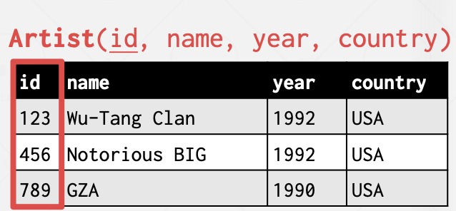
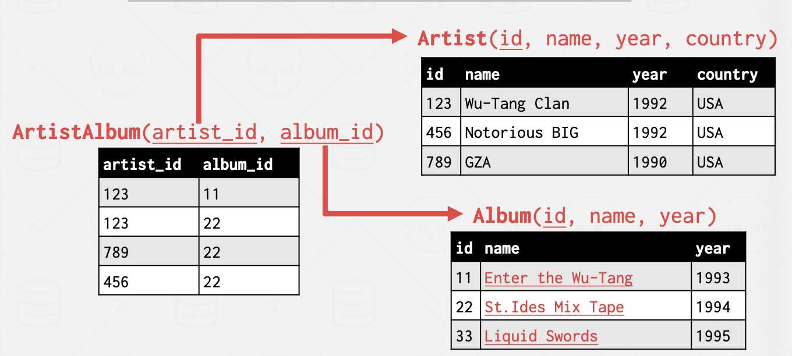
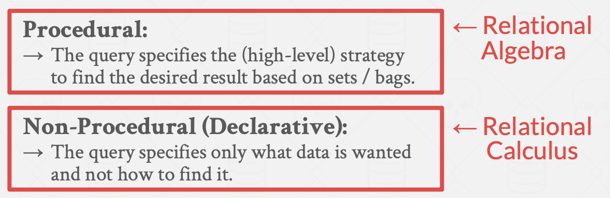
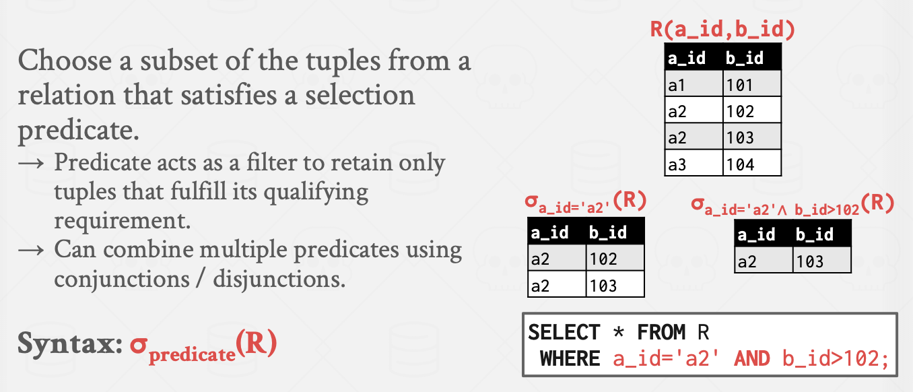
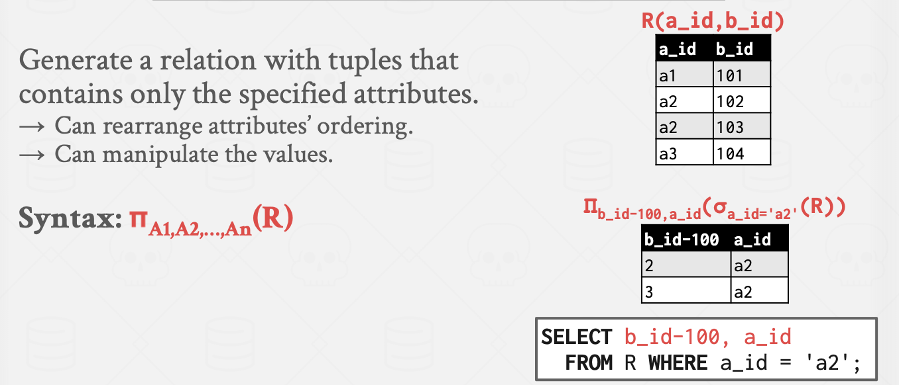
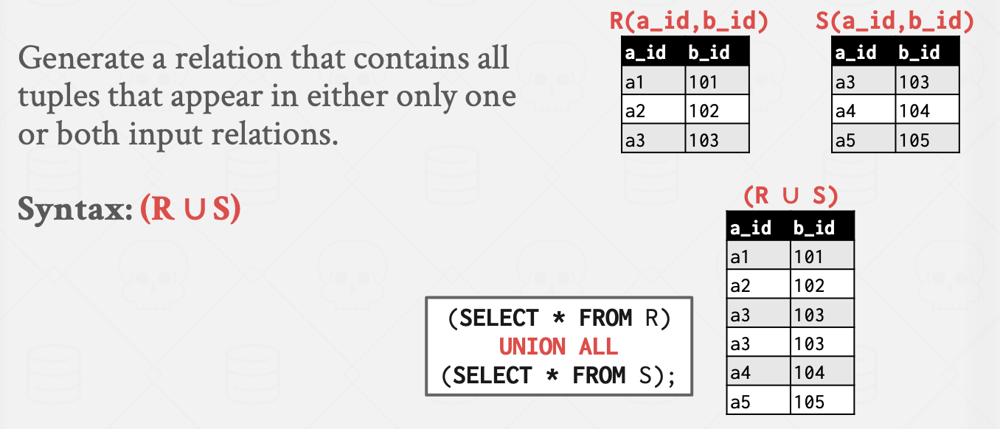
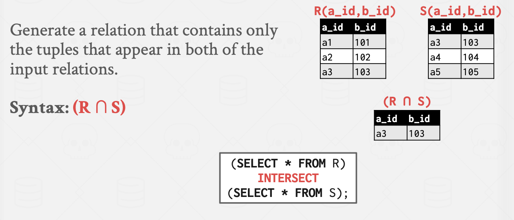
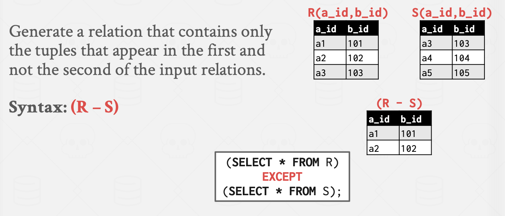
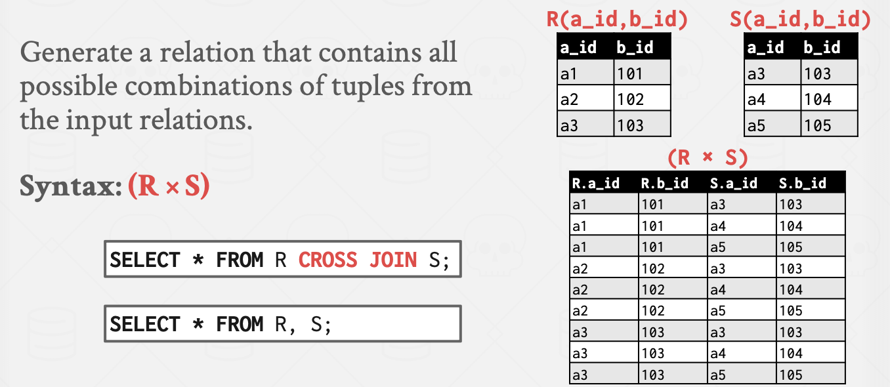
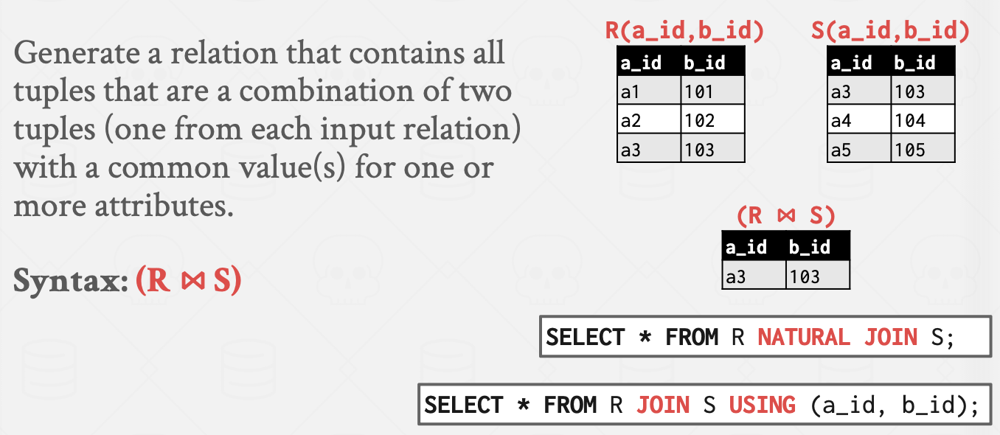

# Relational

## Relational Model

* Store database in simple data structures (relations).

* Physical storage **left up** to the DBMS implementation.

*  Access data through high-level language, **DBMS figures out best execution strategy**.

### Concepts

**A relation** is an unordered set that contain the relationship of attributes that represent entities.

**A tuple** is a set of attribute values (also known as its domain) in the relation.

* Values are (normally) atomic/scalar. --(a single integer/float... )
* The special value **NULL** is a member of every domain (if allowed). 

**n-ary Relation** :Table with n columns

#### Keys

> Primaray Keys

A relation's **primary key** uniquely identifies a single tuple

* Some DBMSs automatically create an internal primary key if a table does not define one.

> Foriegn Keys

A foreign key specifies that an attribute from one relation has to map to a tuple in another relation.

#### Data Manipulation Languages (DML)

Methods to store and retrieve information from a database.

## Relational Algebra

### Fundamental Operations

* $\sigma -- Select$​​  

* $\pi -- Projection$​

* $\cup--Union$​

* $\cap -- Intersection$​

* $- \ --Difference$​

* $\times --Product$​

* $⋈-- Join$​

### Extra Operators

> Example : Refer to ZJU course slides

* Rename (**ρ**)
* Assignment (R←S)
* Duplicate Elimination (**δ**)
* Aggregation (**γ**)
* Sorting (**τ**)
* Division (R÷S)

### Insights

A better approach is to state the high-level answer that you want the DBMS to compute.

* Faced with different situation of data(say ,small amout vs large amout),if considered in a lower level,we have to implement different methods for different circumstances.
* We expect that ,even the situation changes, we do not have to change our queries.

