<font face = "Times New Roman" >


# Join Algorithms
## Nested Loop Join
### Naive Nested Loop Join
### Block Nested Loop Join
### Index Nested Loop Join
* All Above refer to Slides.
## Sort Merge Join
```python
sort R,S on join keys
cursorR ← Rsorted, cursorS ← Ssorted
while cursorR and cursorS:
    if cursorR > cursorS:
        increment cursorS
    if cursorR < cursorS:
        increment cursorR (and possibly backtrack cursors)
    elif cursorR and cursorS match:
    emit
    increment cursorS
```

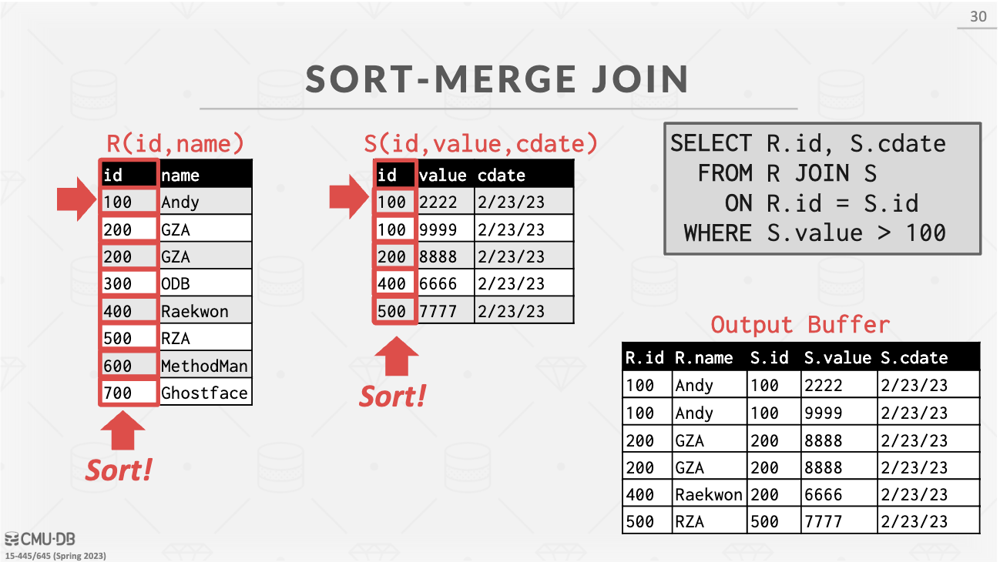

Sort cost(R):$2M∙ (1 + ⌈log_{B-1}⌈M/ B⌉⌉)$
Sort cost(S):$2N∙ (1 + ⌈log_{B-1}⌈N/ B⌉⌉)$
Merge cost:$(M + N)$
Total cost:$2M∙ (1 + ⌈log_{B-1}⌈M/ B⌉⌉) + 2N∙ (1 + ⌈log_{B-1}⌈N/ B⌉⌉) + (M + N)$

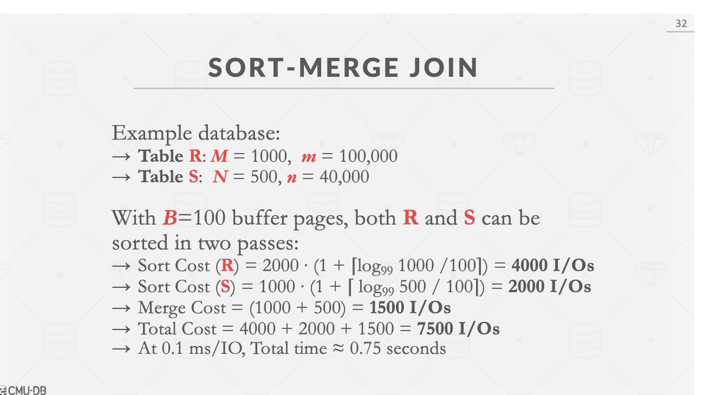
> The worst case for the merging phase is when the join attribute of  all the tuples in both relations contains the same value

Cost: (M ∙ N) + (sort cost)

**WHEN IS SORT-MERGE JOIN USEFUL?**
* One or both tables are already sorted on join key.
* Output must be sorted on join key.
* The input relations may be sorted either by an explicit sort operator, or by scanning the relation using an index on the join key.

## Hash Join
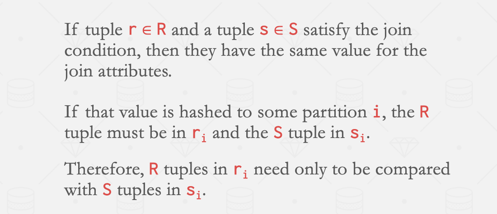
### Simple Hash Join
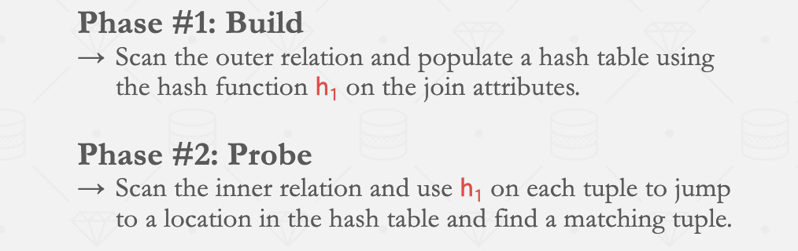
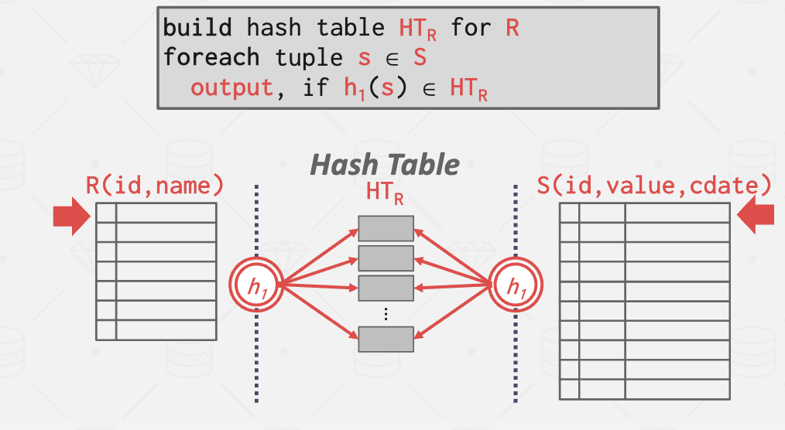

#### Optimization:Probe Filter
* Create a probe filter.
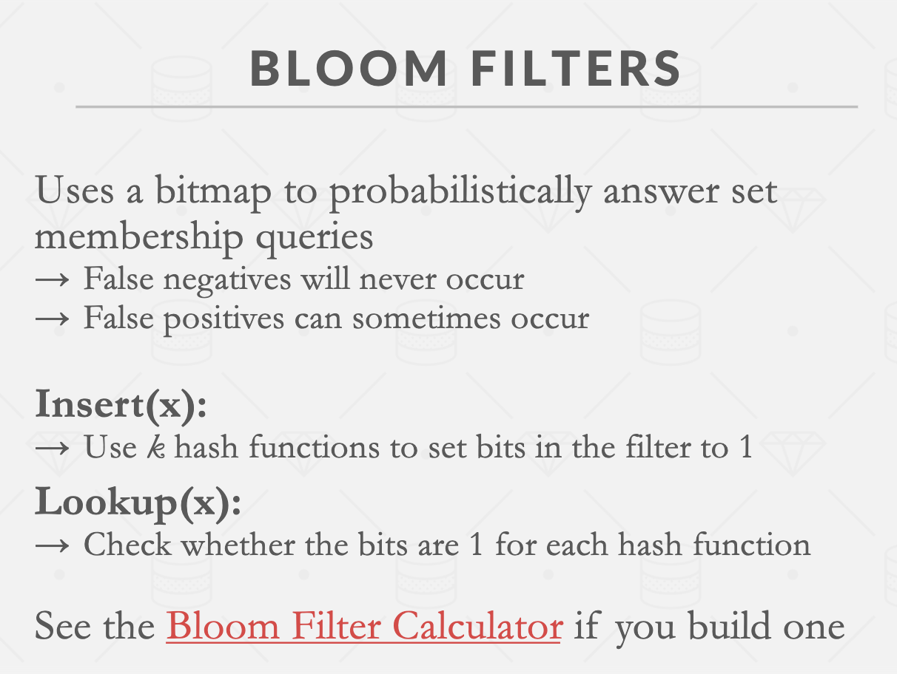

* First look in Bloom filter then check hash(because bloom filter is in cache,so it's faster!)

### GRACE：PARTITIONED HASH JOIN
**Partition Phase:** Hash both tables on the join attribute into partitions
**Probe Phase**: Compares tuples in corresponding partitions for each table
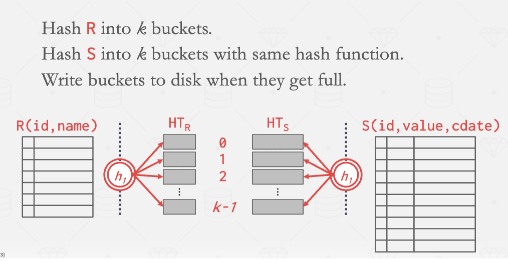
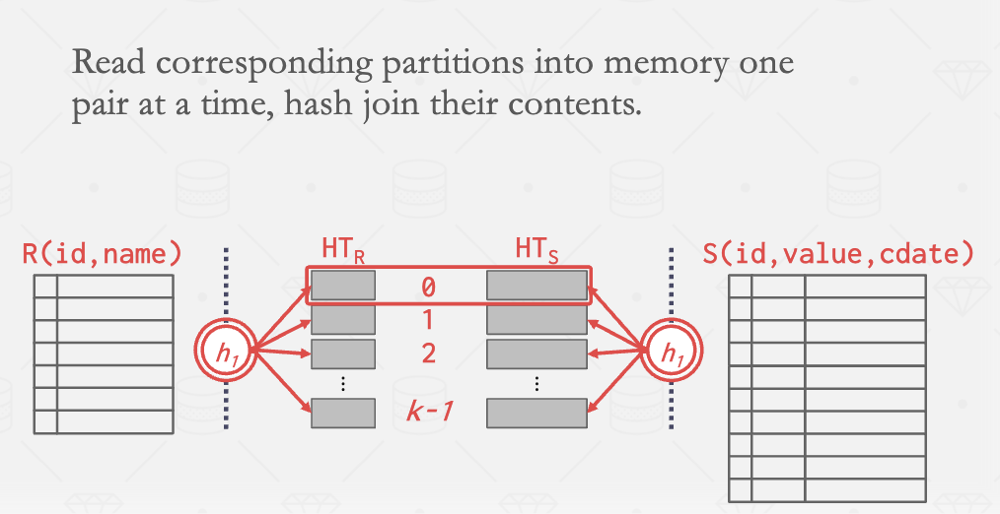
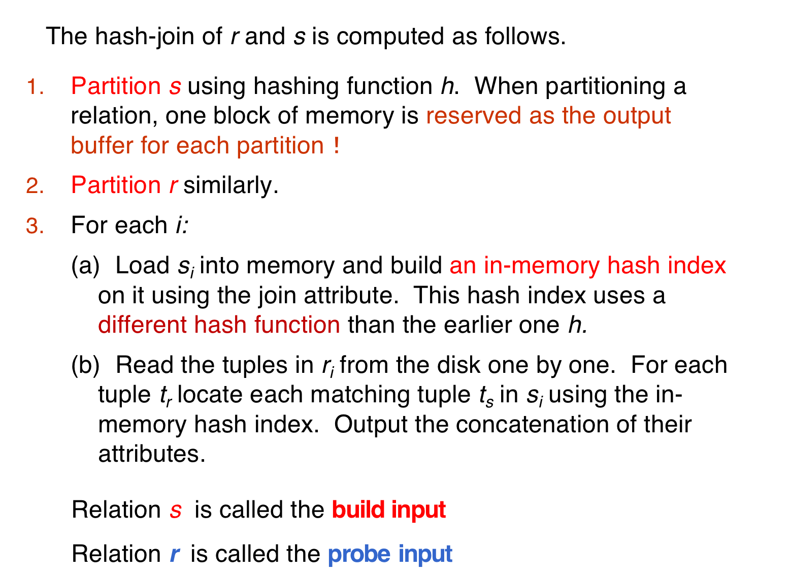
#### Partitioned HASH JOIN EDGE CASES
If a partition does not fit in memory,recursively partition it with a different hash function
* Repeat as needed
* Eventually hash join the corresponding (sub-)partitions

If a single join key has so many matching records that they don’t fit in memory, use a block nested loop join for that key
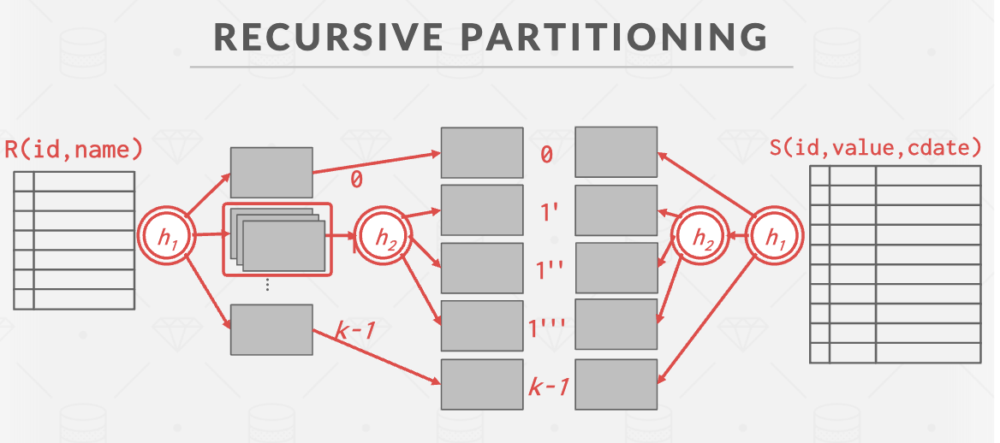
* Worst case: attribute are all the same then recursive hash is not useful.
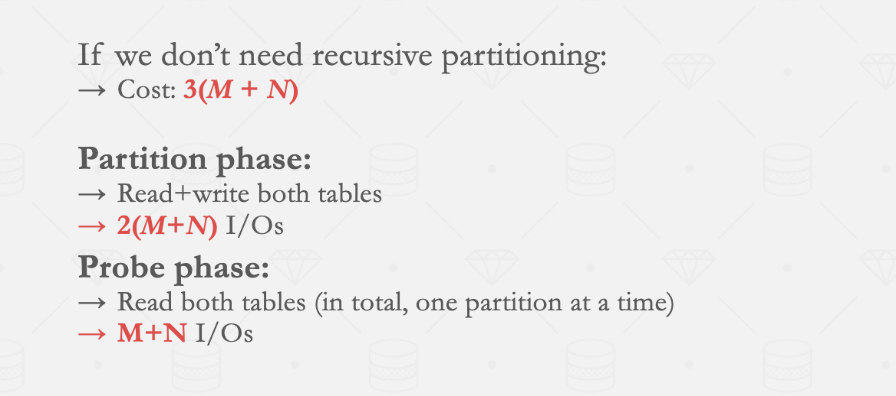
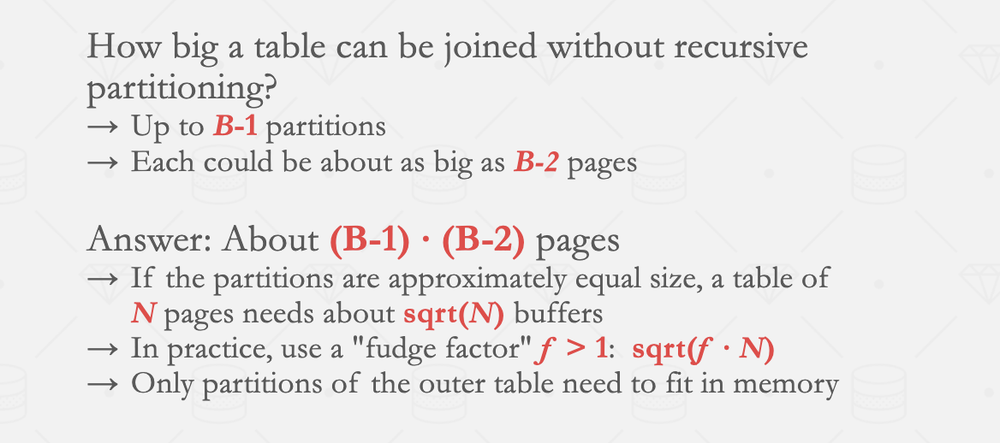
* A relation does not need recursive partitioning if $M > n_h + 1$, or equivalently $M > (b_s/M) + 1$, which simplifies (approximately) to $M > \sqrt{b}_s$.


### Hybrid Hash Join

</font>