## Pre-Knoledge

Reference to https://runoob.com/sql/sql-update.html

### Fundamentals

#### Create Table Construct

```mysql
create table instructor(
  ID char(5)
  name varchar(20) not null,
  dept_name varchar(20)，
  salary numeric(8,2)default 0，
  primary key(ID),
  foreign key(dept_name)references department
)；
```

* `foreign key`这意味着"dept_name"列中的值必须存在于"department"表中的关联列中，否则插入或更新操作将被拒绝.

```mysql
foreign key (dept_name) references department) 
                on delete cascade  |set null |restrict|set default
                on update cascade |set null |restrict |set default,
```

#### Drop and Alter Table Constructs

* `drop table student.` : Deletes the table and its contents.

* `delete from student` : Deletes all contents of table, but retains table.

* `alter table` : 

  `alter table r add A D`

  ```mysql
  alter table student add resume varchar(256);
  ```

  `alter table r drop A`

#### SQL SELECT

```sql
SELECT column1, column2, ...
	FROM table_name;
SELECT column1, column2, ...
	FROM table_name;
SELECT DISTINCT column1, column2, ...
	FROM table_name;

```

#### SQL WHERE

```sql
SELECT column1, column2, ...
	FROM table_name WHERE condition;
SELECT column1, column2, ...
	FROM table_name
	ORDER BY column1, column2, ... ASC|DESC;
```

#### SQL INSERT

* id 列是自动更新的，表中的每条记录都有一个唯一的数字。

```sql
INSERT INTO table_name (column1,column2,column3,...)
VALUES (value1,value2,value3,...);
```

* 批量

```mysql
INSERT INTO student
SELECT ID,name,dept_name,0
FROM instructor
```

#### SQL Update

```sql
UPDATE table_name
SET column1 = value1, column2 = value2, ...
WHERE condition;
```


#### SQL DELETE

```sql
DELETE FROM table_name WHERE condition;
DELETE FROM table_name;
```


#### Natural Join

```mysql
select name, course_id
from instructor, teaches
where instructor.ID = teaches.ID;

select name, course_id
from instructor natural join teaches;
```

```mysql
course(course_id,title, dept_name,credits
teaches(ID, course_id,sec_id,semester, year)
instructor(ID, name, dept_name,salary） 
Department has different meanings.
select name, title from (instructor natural join teaches）join course using(course_id); 即规定连接的属性，对应于Find students who takes courses across his/her department.
or:
select distinct student.id
    from (student natural join takes)join course using (course_id） 
    where student.dept_name <> course.dept_name
```

#### Rename

```mysql
select ID, name, salary/12 as monthly_salary
from instructor

select distinct T. name
from instructor as T, instructor as S
where T.salary > S.salary and S.dept_name = ‘Comp. Sci.’
```

* Keyword as is optional and may be omitted

  ```mysql
  instructor as T ≡ instructor T
  ```

#### String operations

```mysql
like ‘100 \%'  escape  '\' 
like ‘100 \%'  
like ‘100  #%'  escape  ‘#' 
```

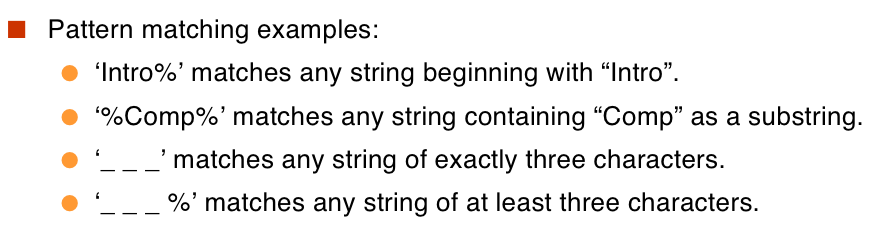

#### Order

```mysql
order by name desc
```

#### Limit

```mysql
 select  name
 from    instructor
 order by salary desc
 limit 3；   //  limit 0,3 
```

#### Set Operations

* Set operations union, intersect, and except 

  Each of the above operations automatically eliminates duplicates

* To retain all duplicates use the corresponding multiset versions union **all**, intersect all and except all.

* Suppose a tuple occurs m times in r and n times in s, then, it occurs:

  `m  + n times in r union all s `

  `min(m,n) times in r intersect all s`

  `max(0, m – n) times in r except all s`

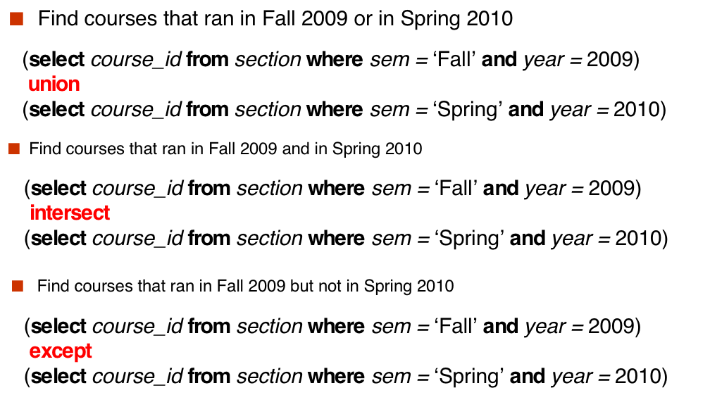

#### Null Values

* null signifies an unknown value or that a value does not exist.

* The result of any arithmetic expression involving null is nul

  `5 + null  returns null`

* The predicate  is null can be used to check for null values

  Find all instructors whose salary is null.		

  ```mysql
  select name	
  from instructor	
  where salary is null
  ```

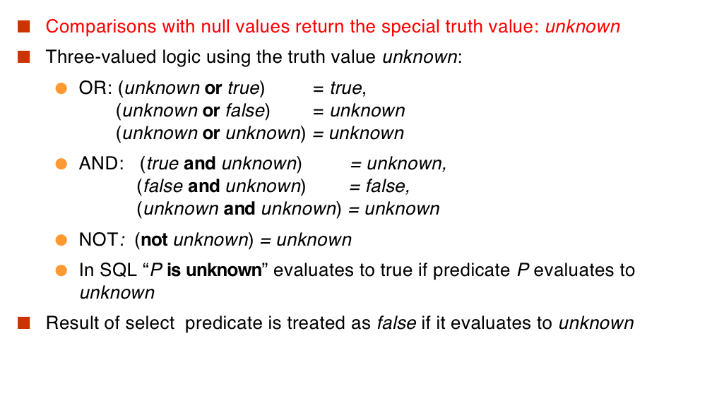

## Aggregations + Group By

#### Aggregations

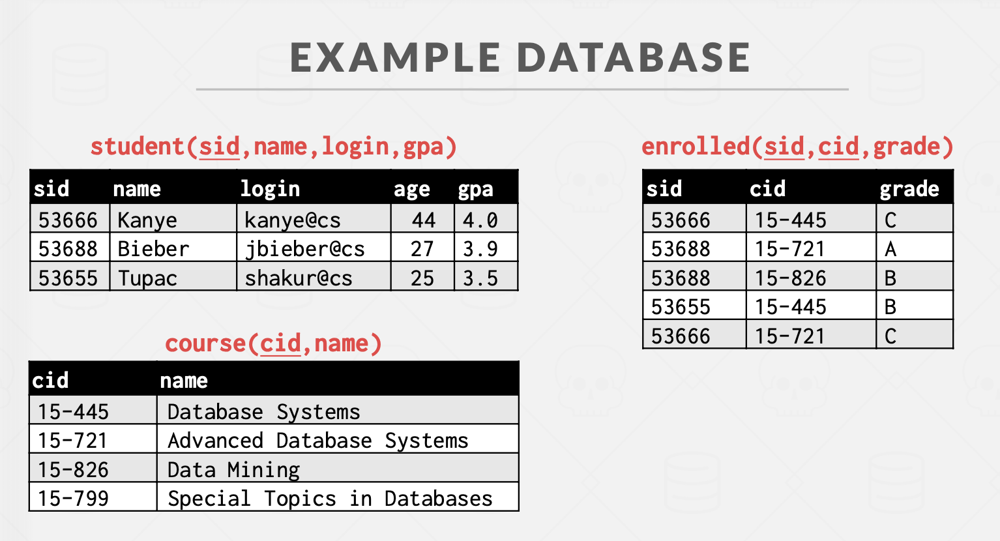

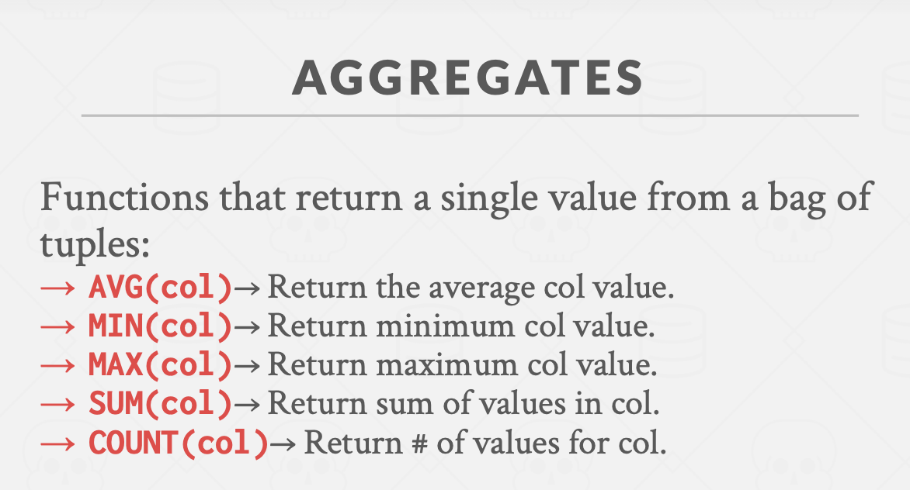

* Aggregate functions can (almost) only be used in

  the **SELECT** output list.

* COUNT, SUM, AVGsupport DISTINCT

```sql
SELECT COUNT(DISTINCT login)
	FROM student WHERE login LIKE "%@cs"
```

* Multiple Aggregates

```sql
SELECT AVG(gpq),COUNT(sid)
	FROM student WHERE login LIKE '%@cs'
```

* Output of other columns outside of an aggregate is

  undefined.

Cause ERROR

```sql
SELECT AVG(s.gpa), e.cid
	FROM enrolled AS e JOIN student AS s
		ON e.sid = s.sid
```

* To fix it -- Group By

#### Group By
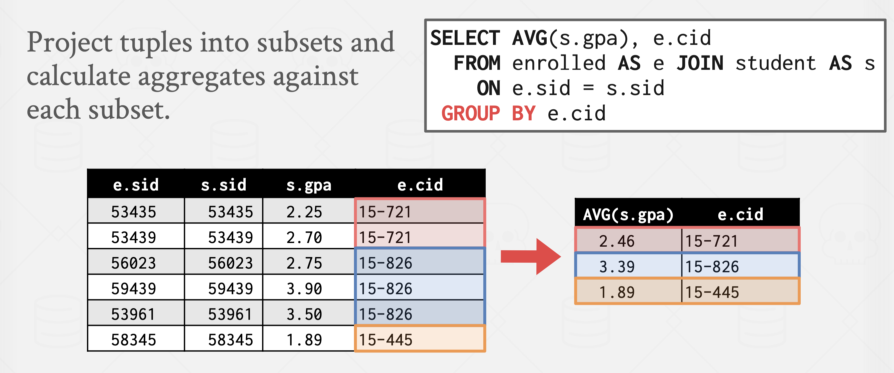
```sql
SELECT AVG(s.gpa), e.cid
	FROM enrolled AS e JOIN student AS s
		ON e.sid = s.sid
	GROUP BY e.cid
```

#### Having

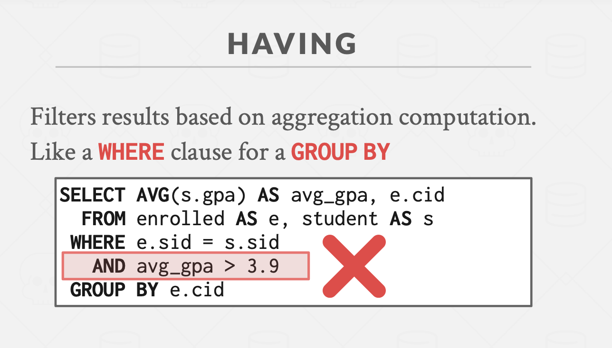
* We cannot use **Aggregations** to FILTER tuples because we have not computed it yet

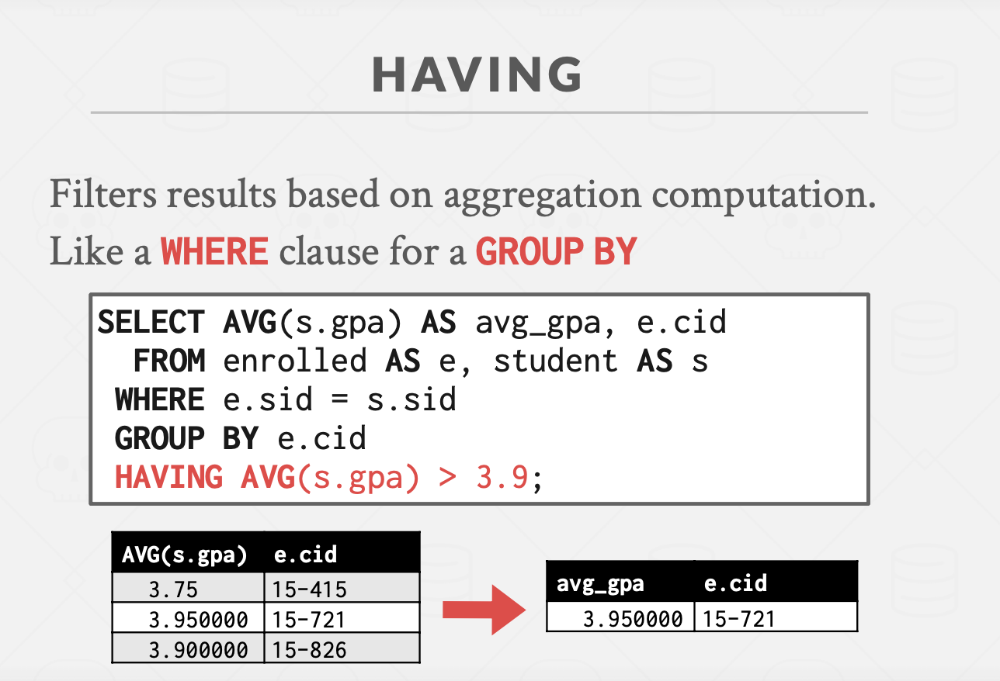

#### Examples

* Find departments in which there is no duplicate name of students.

  ```mysql
  select dept_name
  from student
  group by dept_name
  having count(distinct name)= count(id)
  ```

  ```mysql
   select dept_name
  from student
  group by dept_name
  having 1-count(distinct name)/ count(id)<0.001 ;
  ```

## Nested Subqueries

### Set Membership

* Find courses offered in Fall 2009 and in Spring 2010

  ```mysql
  select distinct course_id
  from section
  where semester = "Fall" and year = 2009 and
  	course_id in (select course_id from section
                 where semester = 'Spring' and year = 2010);
  ```

* Find courses offered in Fall 2009 but not in Spring 2010

  ```mysql
  select distinct course_id
  from section
  where semester = ’Fall’ and year= 2009 and            course_id  not in (select course_id
                                   from section
                                   where semester = ’Spring’ and year= 2010);
  ```

* Find the total number of (distinct) students who have taken course sections taught by the instructor with ID 10101

  ```mysql
  select count(distinct ID)
  from takes
  where (couse_id,sec_id,semester,year)in
  (select course_id,sec_id,semester,year from teaches 
  	where teaches.ID = '10101')
  ```

### Set Comparison

* Find names of instructors with salary greater than that of some (at least one) instructor in the Biology department.

  ```mysql
  select distinct T.name
  from instructor as T,instructor as S
  where T.salary > S.salary and S.dept_name = 'Biology'
  ```

* Same query using > some clause

  ```mysql
  select name
  from instructor
  where salary > some (select salary
              from instructor
              where dept_name = ’Biology’);
  ```

* Find the names of all instructors whose salary is greater than the salary of all instructors in the Biology department.

  ```mysql
  select name
  from instructor
  where salary > all (select salary
                  from instructor
                  where dept_name = ’Biology’);
  ```

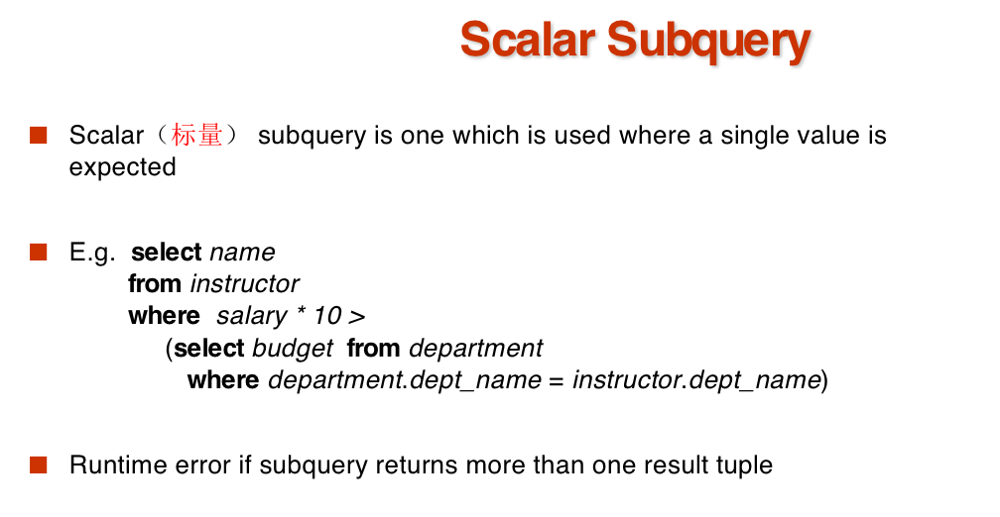

#### Test for Empty Relations

* Yet another way of specifying the query “Find all courses taught in both the Fall 2009 semester and in the Spring 2010 semester”

  ```mysql
  select course_id
  from section as S
  where = 'Fall' and year = 2009 and
  exists(select * from section as T
        where semester = 'Spring' and year = 2010
        and S.course_id = T.course_id)
  ```

* Find all students who have taken all courses offered in the Biology department.

  $Note\ that\ X – Y = \emptyset \Rightarrow X\subset Y$

  ```mysql
  select distinct S.ID,S.name
  from student as S
  where not exists(
    (select course_id from course where dept_name = 'Biology')
    except
    (select T.course_id from takes as T
    where S.ID = T.ID)
  )
  ```

* The unique construct tests whether a subquery has any duplicate tuples in its result.

* Find all courses that were offered at most once in 2009

  ```mysql
  select T.couse_id
  from course as T
  where unique(select R.course_id 
              from section as R
              where T.course_id = R.course_id and R.year = 2009)
  ```

* Find all courses that were offered once in 2009

  ```mysql
  select T.course_id
  from courses as T
  where unique(select R.course_id
              from section as R
              where T.course_id = R.course_id 
              and R.year = 2009)
        and exists(select R.course_id
                  from section as R
                  where T.course_id = R.course_id 
              and R.year = 2009)
  ```

  ```mysql
  and course_id  in (select course_id                              from section
              where year = 2009) ;
  ```

* Find all courses that were offered once in every semester

  ```mysql
  select T.course_id
  from course as T
  where unique(select R.course_id,year,semester
              from section as R
              where T.course_id = R.course_id)
        and exists(select R.course_id,year,semester
              from section as R
              where T.course_id = R.course_id)
  ```

* 也可以用 `group by count(*) > 1` 实现

### Other Operations

#### Subqueries in the From Clause

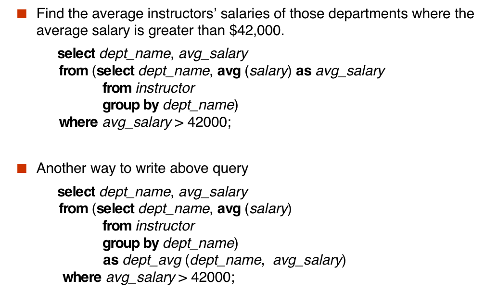

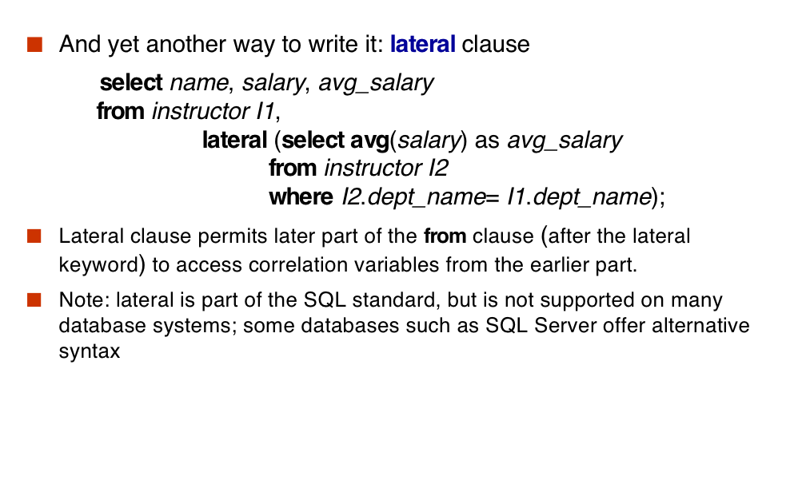

#### With Clause

* The with clause provides a way of defining a temporary view whose definition is available only to the query in which the with clause occurs. 

* Find all departments with the maximum budget 

  ```mysql
  with max_budget(value) as
  	(select max(budget
               from department)
    select dept_name
    from department,max_budget
    where department.budget = max_budget.value)
    
  select dept_name
  from department
  where budget = (select (max(budget) from department))
  ```

**Complex Queries using With Clause**

* Find all departments where the total salary is greater than the average of the total salary at all departments

  ```mysql
  with dept_total(dept_name,value)as
  (select dept_name,sum(salary)from instructor
  group by dept_name),
  	deot_total_avg(value)as
  (select avg(value)from dept_total)
  select dept_name
  from dept_total,dept_total_avg
  where dept_total.value >= dept_total_ang.value;
  ```

  

## Modification of the Database

### Delete

```mysql
delete from instructor
where dept_name in (select dept_name                                         from department
                  where building = ’Watson’);
                  
delete from instructor
where salary< (select avg (salary) from instructor);
'''
Problem:  as we delete tuples from deposit, the average salary changes
Solution used in SQL:
1.   First, compute avg salary and find all tuples to delete
2.   Next, delete all tuples found above (without ecomputing avg or retesting the tuples)
'''
```

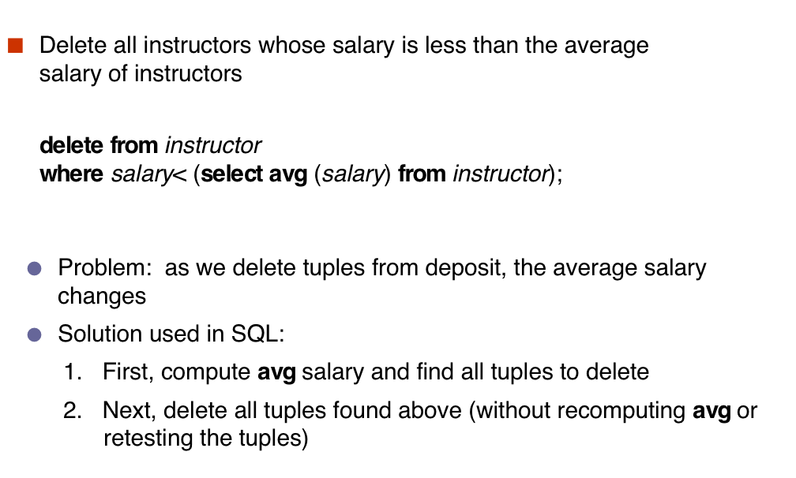

### Insert

```mysql
insert into course
values (’CS-437’, ’Database Systems’, ’Comp. Sci.’, 4);
insert into course (course_id, title, dept_name, credits)
values (’CS-437’, ’Database Systems’, ’Comp. Sci.’, 4);
insert into student
values (’3003’, ’Green’, ’Finance’, null);
```

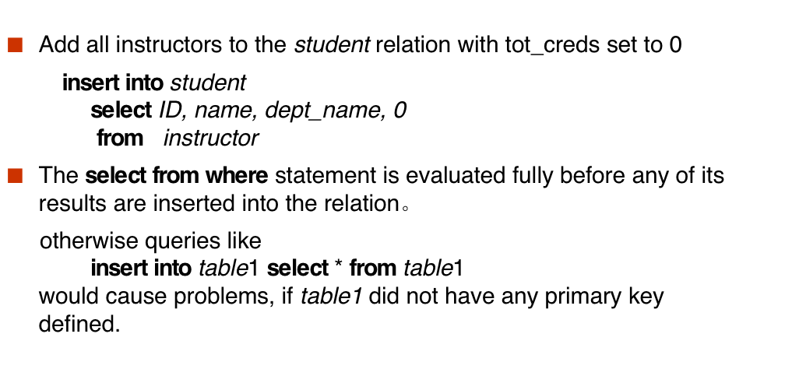

### Update

* Increase salaries of instructors whose salary is over $100,000 by 3%, and all others receive a 5% raise

  ```mysql
   update instructor
   set salary = salary * 1.03
   where salary > 100000;
   update instructor
   set salary = salary * 1.05
   where salary <= 100000;
  ```

  * The order is importantCan be done better using the case statement (next slide)

* Case Statement for Conditional Updates

  ```mysql
  update instructor
  set salary = case                                     	when salary <= 100000 then salary * 1.05
  else salary * 1.03 
  end
  ```

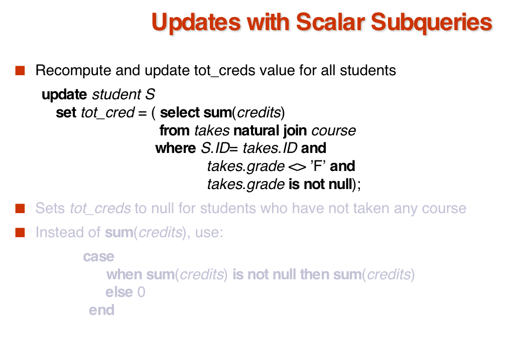

* Must be a scaler (for set from select.)

## String / Date / Time Operations

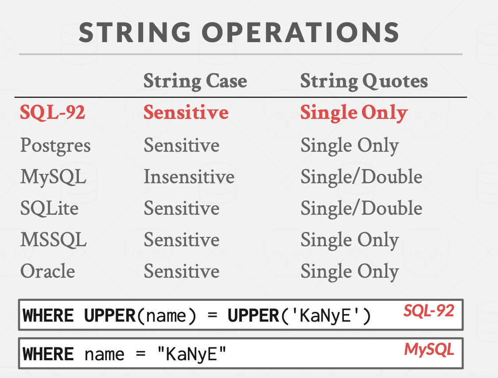

### String Operations

#### LIKE

* LIKE is used for string matching.

* String-matching operators
	>`%` matches any sequence of characters, including zero characters.  Any substring.
	In other words, `%` can match any string of any length, including an empty string.  Any character.
	* For example, `'15%'` matches any string starting with "15", `'%15'` matches any string ending with "15", and `'%15%'` matches any string containing "15" anywhere.

```sql
SELECT * FROM enrolled AS e
	WHERE e.cid LIKE '15_%'
```

> `_` matches any single character. 
> It's used to specify that at a particular position, any character must match, but it doesn't matter which character. For example, `'15_'` matches "150", "151", "152", etc., but not "15" etc.
```sql
SELECT * FROM student AS s
	WHERE s.login LIKE '%@c_'
```
#### SUBSTRING
```sql
SELECT SUBSTRING(name,1,5) AS abbrv_name
	FROM student WHERE sid = 53688
```
#### UPPER

```sql
SELECT * FROM student AS s
	WHERE UPPER(s.name) LIKE 'KAN%'
```

#### `||`
* SQL standard says to use ||operator to concatenate two or more strings together.

`SQL-92`
```sql
SELECT name FROM student
	WHERE login = LOWER(name) || '@cs'
```

`MSSQL`
```sql
SELECT name FROM student
	WHERE login = LOWER(name) + '@cs'
```

`MySQL`
```sql
SELECT name FROM student
	WHERE login = CONCAT(LOWER(name), '@cs')
```

* Also like `'Li''ly'`  will automatically concatenate

### Date/Time Operations
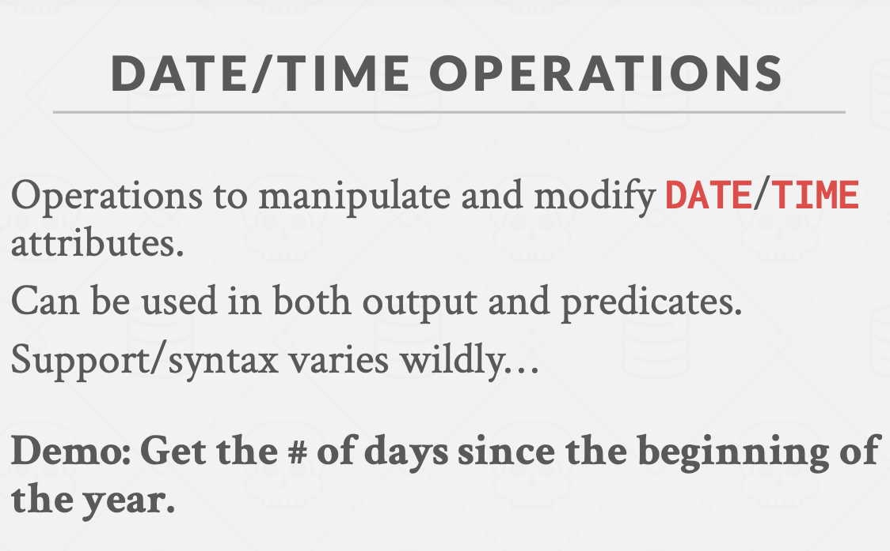

```mysql
 SELECT NOW();
 SELECT CURRENT_TIMESTAMP();
 SELECT CURRENT_TIMESTAMP();
 SELECT EXTRACT(DAY FROM DATE('2018-08-29'));
 //SELECT DATE('2018-08-29')-DATE('2018-01-01');
 SELECT ROUND((UNIX_TIMESTAMP(DATE('2018-08-29'))-UNIX_TIMESTAMP(DATE('2018-01-01')))/(60*60*24),0) AS days;
 SELECT DATEDIFF(DATE('2018-08-29'),DATE('2018-01-01')) AS days;
```


## Output Control + Redirection

### Output Redirection
Store query results in another table:
→ Table must not already be defined.
→ Table will have the same # of columns with the same types as the input.
```sql
CREATE TABLE CourseIds (
SELECT DISTINCT cid FROM enrolled);
```
Insert tuples from query into another table:

→ Inner SELECTmust generate the same columns as the

target table.

→ DBMSs have different options/syntax on what to do with

integrity violations (e.g., invalid duplicates).

```mysql
INSERT INTO CourseIds
(SELECT DISTINCT cid FROM enrolled);
```

### Output Control

* ORDER BY $<column*> [ASC|DESC]$
```sql
SELECT sid FROM enrolled
WHERE cid = '15-721'
ORDER BY grade DESC,1,sid ASC
```
* LIMIT $<count> [offset]$
→ Limit the $\#$​​ of tuples returned in output.
→ Can set an offset to return a “range”
* `offset -- skip` -- should combine with `oredered by` clause
```mysql
SELECT sid, name FROM student
WHERE login LIKE '%@cs'
LIMIT 20 OFFSET 10  
```

## Nested Queries
```sql
select name from student
	Where sid in(
		select sid from enrolled
			where cid = '14-445 '
	)
```
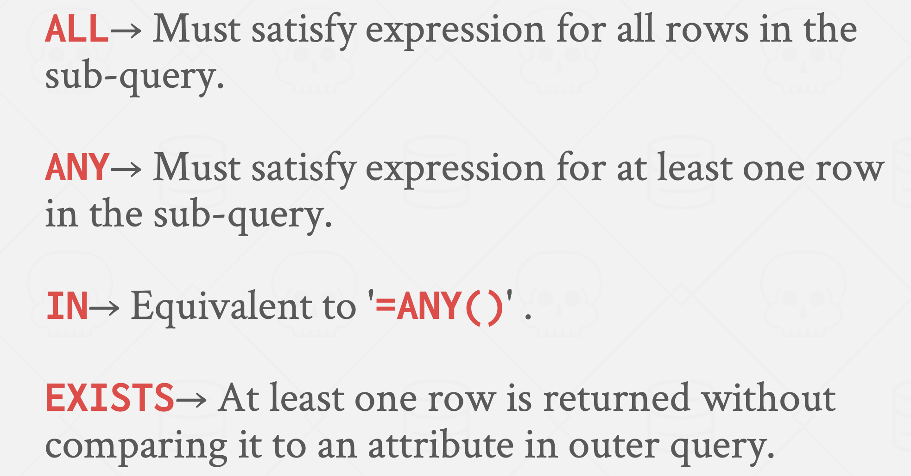

```mysql
SELECT name FROM student
WHERE sid = ANY(
SELECT sid FROM enrolled
WHERE cid = '15-445'
)
```

```mysql
SELECT (SELECT S.name from student as S where S.sid = E = sid) as sname
FROM enrolled as E
where cid = '15-445'
```

> Find student record with the highest id that is enrolled in at least one course.

```sql
SELECT sid,name FROM student
WHERE sid IN(
SELECT MAX(sid)FROM enrolled
)
```

```sql
SELECT sid, name FROM student
WHERE sid IN (
SELECT sid FROM enrolled
ORDER BY sid DESC LIMIT 1
)
```

```sql
SELECT student.sid, name
	FROM student
	JOIN (SELECT MAX(sid) AS sid
	FROM enrolled) AS max_e
		ON student.sid = max_e.sid;
```

>Find all courses that have no students enrolled in it.
>
>* Through outer quiries , we can access inner queries

```mysql
SELECT * FROM course
	WHERE NOT EXISTS(
  SELECT * FROM enrolled
  	WHERE course.cid = enrolled.cid
  )
```

## Window Functions

* **Still See the Original Tuples**

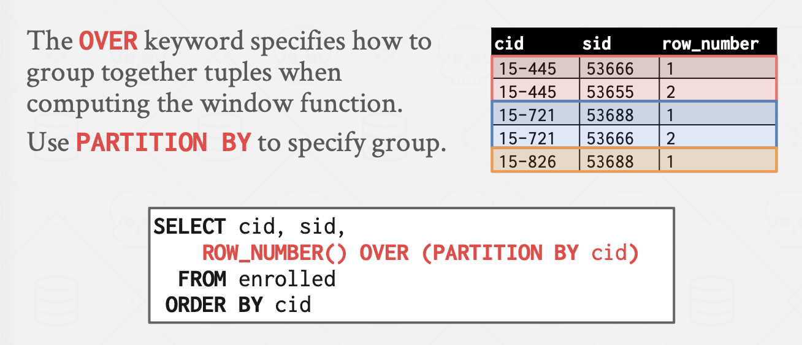

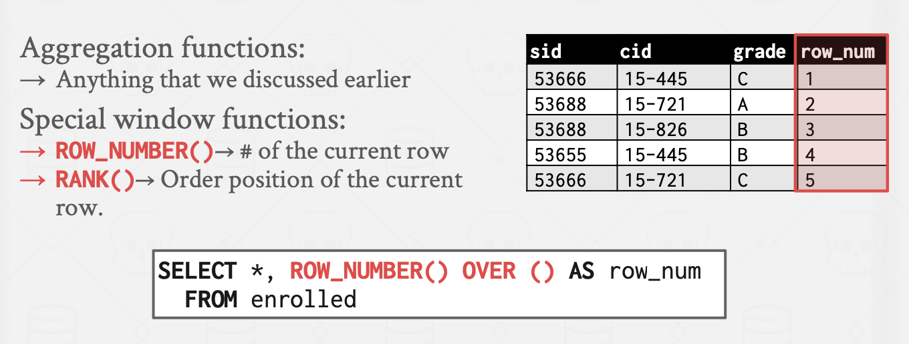

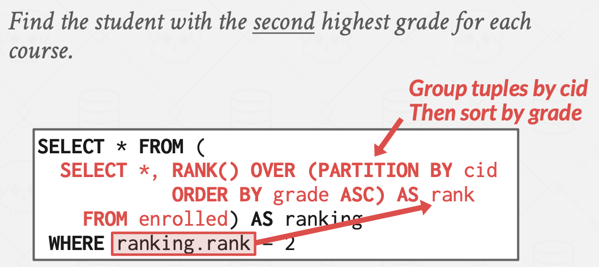

## Common Table Expressions

Provides a way to write auxiliary statements for use in a larger query.

> Think of it like a temp table just for one query.

Alternative to nested queries and views.

```mysql
WITH cteName AS (
SELECT 1
)
SELECT * FROM cteName
```

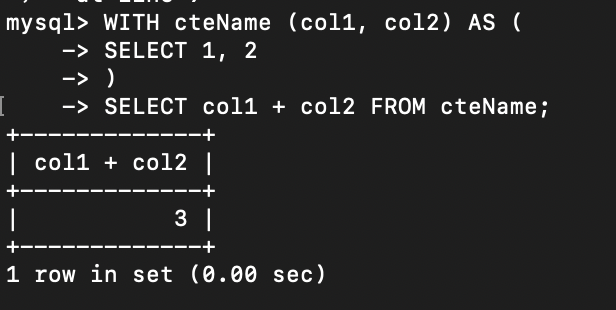

```mysql
WITH cteSource (maxId) AS (
SELECT MAX(sid) FROM enrolled
)
SELECT name FROM student, cteSource
WHERE student.sid = cteSource.maxId
```

* Recursion！

  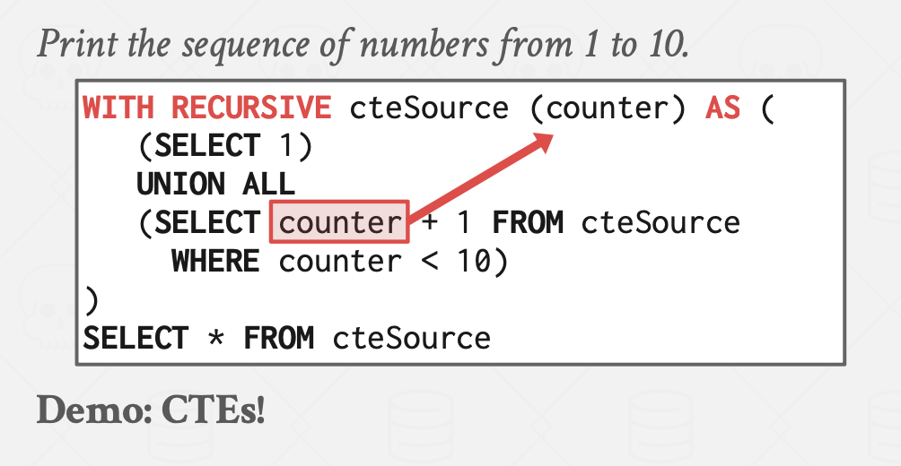

  > At each iteration, that SELECT produces a row with a new value one greater than the value of n from the previous row set. The first iteration operates on the initial row set (1) and produces 1+1=2; the second iteration operates on the first iteration’s row set (2) and produces 2+1=3; and so forth. This continues until recursion ends, which occurs when n is no longer less than 5.
  >

* https://blog.csdn.net/mjfppxx/article/details/124879326
