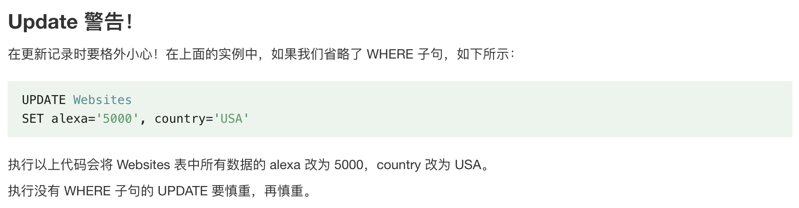

## Pre-Knoledge

Reference to https://runoob.com/sql/sql-update.html

### Fundamentals

#### SQL SELECT

```sql
SELECT column1, column2, ...
	FROM table_name;
SELECT column1, column2, ...
	FROM table_name;
SELECT DISTINCT column1, column2, ...
	FROM table_name;

```

#### SQL WHERE

```sql
SELECT column1, column2, ...
	FROM table_name WHERE condition;
SELECT column1, column2, ...
	FROM table_name
	ORDER BY column1, column2, ... ASC|DESC;
```

#### SQL INSERT

* id 列是自动更新的，表中的每条记录都有一个唯一的数字。

```sql
INSERT INTO table_name (column1,column2,column3,...)
VALUES (value1,value2,value3,...);
```

#### SQL Update

```sql
UPDATE table_name
SET column1 = value1, column2 = value2, ...
WHERE condition;
```



#### SQL DELETE

```sql
DELETE FROM table_name WHERE condition;
DELETE FROM table_name;
```

## Aggregations + Group By

#### Aggregations


* Aggregate functions can (almost) only be used in

  the **SELECT** output list.

* COUNT, SUM, AVGsupport DISTINCT

```sql
SELECT COUNT(DISTINCT login)
	FROM student WHERE login LIKE "%@cs"
```

* Multiple Aggregates

```sql
SELECT AVG(gpq),COUNT(sid)
	FROM student WHERE login LIKE '%@cs'
```

* Output of other columns outside of an aggregate is

  undefined.

Cause ERROR

```sql
SELECT AVG(s.gpa), e.cid
	FROM enrolled AS e JOIN student AS s
		ON e.sid = s.sid
```

* To fix it -- Group By

#### Group By

```sql
SELECT AVG(s.gpa), e.cid
	FROM enrolled AS e JOIN student AS s
		ON e.sid = s.sid
	GROUP BY e.cid
```

#### Having


* We cannot use **Aggregations** to FILTER tuples because we have not computed it yet


## String / Date / Time Operations


### String Operations

#### LIKE

* LIKE is used for string matching.

* String-matching operators
	>`%` matches any sequence of characters, including zero characters. 
	In other words, `%` can match any string of any length, including an empty string. 
	* For example, `'15%'` matches any string starting with "15", `'%15'` matches any string ending with "15", and `'%15%'` matches any string containing "15" anywhere.

```sql
SELECT * FROM enrolled AS e
	WHERE e.cid LIKE '15-%'
```

> `_` matches any single character. 
> It's used to specify that at a particular position, any character must match, but it doesn't matter which character. For example, `'15_'` matches "150", "151", "152", etc., but not "15" etc.
```sql
SELECT * FROM student AS s
	WHERE s.login LIKE '%@c_'
```
#### SUBSTRING
```sql
SELECT SUBSTRING(name,1,5) AS abbrv_name
	FROM student WHERE sid = 53688
```
#### UPPER

```sql
SELECT * FROM student AS s
	WHERE UPPER(s.name) LIKE 'KAN%'
```

#### `||`
* SQL standard says to use ||operator to concatenate two or more strings together.

`SQL-92`
```sql
SELECT name FROM student
	WHERE login = LOWER(name) || '@cs'
```

`MSSQL`
```sql
SELECT name FROM student
	WHERE login = LOWER(name) + '@cs'
```

`MySQL`
```sql
SELECT name FROM student
	WHERE login = CONCAT(LOWER(name), '@cs')
```

* Also like `'Li''ly'`  will automatically concatenate

### Date/Time Operations


```mysql
 SELECT NOW();
 SELECT CURRENT_TIMESTAMP();
 SELECT CURRENT_TIMESTAMP();
 SELECT EXTRACT(DAY FROM DATE('2018-08-29'));
 //SELECT DATE('2018-08-29')-DATE('2018-01-01');
 SELECT ROUND((UNIX_TIMESTAMP(DATE('2018-08-29'))-UNIX_TIMESTAMP(DATE('2018-01-01')))/(60*60*24),0) AS days;
 SELECT DATEDIFF(DATE('2018-08-29'),DATE('2018-01-01')) AS days;
```


## Output Control + Redirection

### Output Redirection
Store query results in another table:
→ Table must not already be defined.
→ Table will have the same # of columns with the same types as the input.
```sql
CREATE TABLE CourseIds (
SELECT DISTINCT cid FROM enrolled);
```
Insert tuples from query into another table:

→ Inner SELECTmust generate the same columns as the

target table.

→ DBMSs have different options/syntax on what to do with

integrity violations (e.g., invalid duplicates).

```mysql
INSERT INTO CourseIds
(SELECT DISTINCT cid FROM enrolled);
```

### Output Control

* ORDER BY $<column*> [ASC|DESC]$
```sql
SELECT sid FROM enrolled
WHERE cid = '15-721'
ORDER BY grade DESC,1,sid ASC
```
* LIMIT $<count> [offset]$
→ Limit the $\#$​​ of tuples returned in output.
→ Can set an offset to return a “range”
* `offset -- skip` -- should combine with `oredered by` clause
```mysql
SELECT sid, name FROM student
WHERE login LIKE '%@cs'
LIMIT 20 OFFSET 10  
```

## Nested Queries
```sql
select name from student
	Where sid in(
		select sid from enrolled
			where cid = '14-445 '
	)
```


```mysql
SELECT name FROM student
WHERE sid = ANY(
SELECT sid FROM enrolled
WHERE cid = '15-445'
)
```

```mysql
SELECT (SELECT S.name from student as S where S.sid = E = sid) as sname
FROM enrolled as E
where cid = '15-445'
```

> Find student record with the highest id that is enrolled in at least one course.

```mysql
SELECT sid,name FROM student
WHERE sid IN(
SELECT MAX(sid)FROM enrolled
)
```

```mysql
SELECT sid, name FROM student
WHERE sid IN (
SELECT sid FROM enrolled
ORDER BY sid DESC LIMIT 1
)
```

```mysql
SELECT student.sid, name
	FROM student
	JOIN (SELECT MAX(sid) AS sid
	FROM enrolled) AS max_e
		ON student.sid = max_e.sid;
```

>Find all courses that have no students enrolled in it.
>
>* Through outer quiries , we can access inner queries

```mysql
SELECT * FROM course
	WHERE NOT EXISTS(
  SELECT * FROM enrolled
  	WHERE course.cid = enrolled.cid
  )
```

## Window Functions

* **Still See the Original Tuples**


## Common Table Expressions

Provides a way to write auxiliary statements for use in a larger query.

> Think of it like a temp table just for one query.

Alternative to nested queries and views.

```mysql
WITH cteName AS (
SELECT 1
)
SELECT * FROM cteName
```


```mysql
WITH cteSource (maxId) AS (
SELECT MAX(sid) FROM enrolled
)
SELECT name FROM student, cteSource
WHERE student.sid = cteSource.maxId
```

* Recursion！

  

  > At each iteration, that SELECT produces a row with a new value one greater than the value of n from the previous row set. The first iteration operates on the initial row set (1) and produces 1+1=2; the second iteration operates on the first iteration’s row set (2) and produces 2+1=3; and so forth. This continues until recursion ends, which occurs when n is no longer less than 5.
  >

* https://blog.csdn.net/mjfppxx/article/details/124879326
