## Intermediate SQL

### Joined Relations

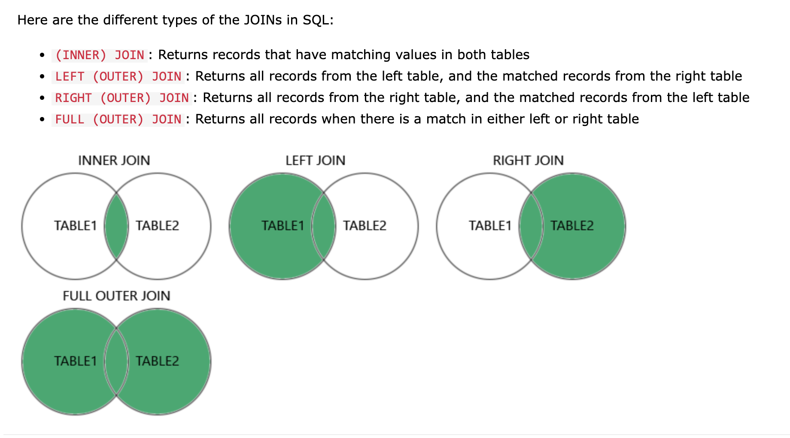

* join默认是 inner join
* Natural Join 和 Inner Join 在连接两个表时的结果是相同的，但是它们的实现方式不同

https://blog.csdn.net/yiyelanxin/article/details/86593473

**Join operations** take two relations and return as a result another relation.

* Join operations are typically used as subquery expressions in the from clause

**Join condition** defines which tuples in the two relations match, and what attributes are present in the result of the join.

**Join type**  defines how tuples in each relation that do not match any tuple in the other relation (based on the join condition) are treated.

#### Examples

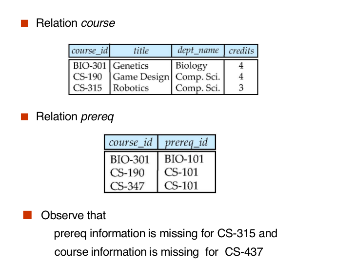

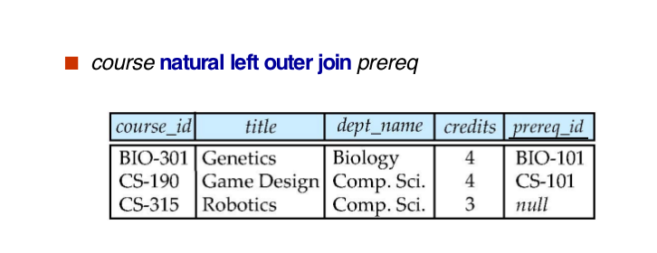

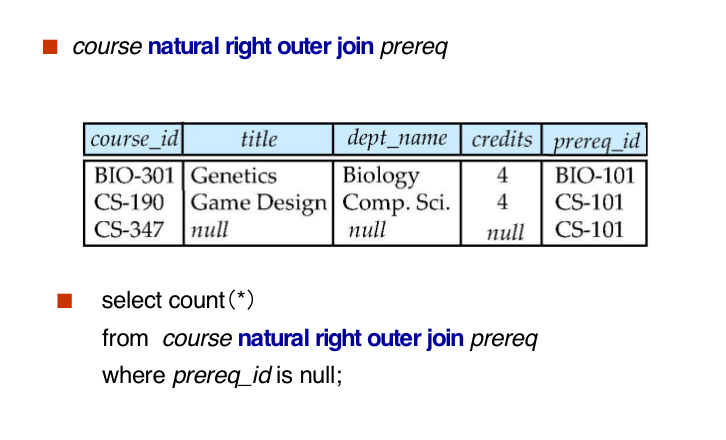


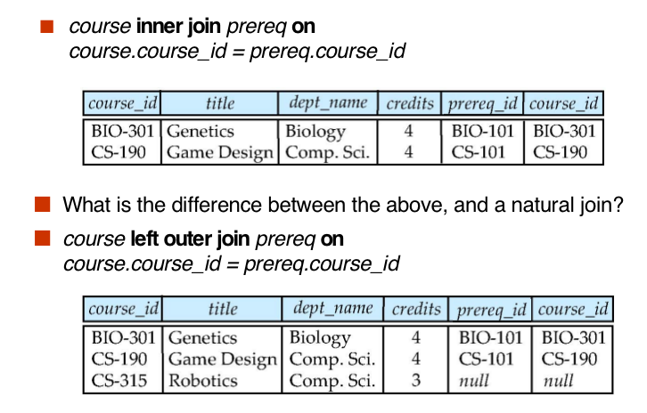

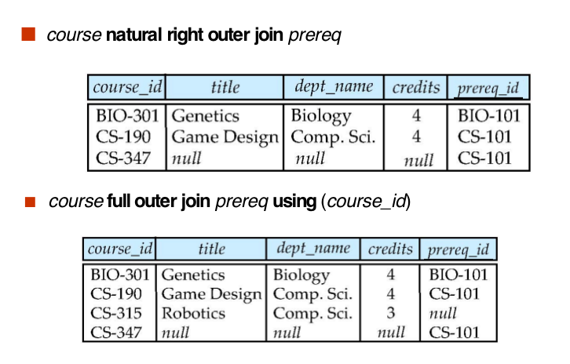

### Types.

#### Built-in Data Types in SQL 

* `date ‘2005-7-27’`

* `time ‘09:00:30.75’`

* `timestamp  ‘2005-7-27 09:00:30.75’`

* `interval  ‘1’ day`

  Subtracting a date/time/timestamp value from another gives an interval value

  Interval values can be added to date/time/timestamp values

* date, time functions: 

  `current_date(), current_time()`

  `year(x), month(x), day(x), hour(x), minute(x), second(x)`

#### User-Defined Types

```mysql
create type Dollars as numeric (12,2) final
create table department(
  dept_name varchar (20),
  building varchar (15),
  budget Dollars);
```

#### Domains

```mysql
create domain person_name char(20) not null
```

* Types and domains are similar.  

  Domains can have constraints, such as not **null**, specified on them.

```mysql
create domain degree_level varchar(10)
constraint degree_level_test
check (value in (’Bachelors’, ’Masters’, ’Doctorate’));
```

#### Large-Object Types

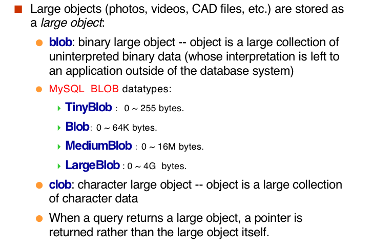

#### Integrity Constraints

Integrity constraints guard against accidental damage to the database, by ensuring that authorized changes to the database do not result in a loss of data consistency. 

* A checking account must have a balance greater than $10,000.00$
* A salary of a bank employee must be at least $4.00 an hour
* A customer must have a (non-null) phone number

##### For a single relation

* `not null`

  ```mysql
  name varchar(20) not null
  budget numeric(12,2) not null
  ```

*  `primary key` 

*  `unique` 

*  `check (P), where P is a predicate` 

  ```mysql
  create table section (
      course_id varchar (8),
      sec_id varchar (8),
      semester varchar (6),
      year numeric (4,0),
      building varchar (15),
      room_number varchar (7),
      time slot id varchar (4), 
      primary key (course_id, sec_id, semester, year),
      check (semester in (’Fall’, ’Winter’, ’Spring’, ’Summer’))
  );
  ```

  ```mysql
  check (semester in (’Fall’, ’Winter’, ’Spring’, ’Summer’))
  ```

*  `foreign key`

* Cascading Actions

  ```sql
  create table course (
  course_id   char(5) primary key,
  title       varchar(20),
  dept_name varchar(20) references department
  )
  create table course (
    ...
  dept_name varchar(20),
  foreign key (dept_name) references department
    on delete cascade,
    on update cascade,
  	...)
  ```

* Integrity Constraint Violation During Transactions

```sql
create table person (
  ID  char(10),
  name char(40),
  mother char(10),
  father  char(10),
  primary key (ID),
  foreign key (father) references person,
  foreign key (mother) references  person);
```

How to insert a tuple without causing constraint violation ?

* insert father and mother of a person before inserting person
* OR, set father and mother to null initially, update after inserting all persons (not possible if father and mother attributes declared to be not null) 
* OR defer constraint checking to transaction end.

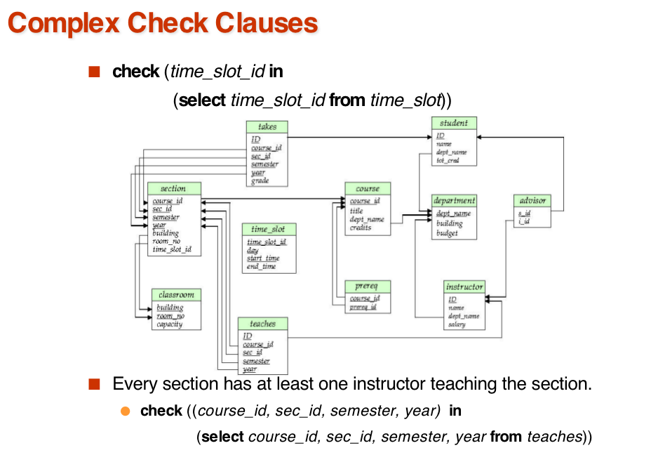

* Unfortunately:  subquery in check clause not supported by pretty much any databaseAlternative: **triggers**

**Assertion**

```sql
create assertion <assertion-name> check <predicate>;
create assertion credits_earned_constraint check
(not exists 
		(select ID 
      from student
      where tot_cred <> (
              select sum(credits)
              from takes natural join course
              where student.ID=takes.ID
                         and grade is not null 
                         and grade<>’F’)))
```

### View

* A view provides a mechanism to hide certain data from the view of certain users. 
* Consider a person who needs to know an instructors name and department, but not the salary.  This person should see a relation described, in SQL, by 

```sql
create view faculty as 
select ID, name, dept_name
from instructor
```

```sql
select name
from faculty
where dept_name = ‘Biology’
```

```sql
create view departments_total_salary(dept_name, total_salary) as
select dept_name, sum (salary)
from instructor
group by dept_name;
```

```sql
create view physics_fall_2009 as
select course.course_id, sec_id, building, room_number
from course, section
where course.course_id = section.course_id
and course.dept_name = ’Physics’
and section.semester = ’Fall’
and section.year = ’2009’;
```

```sql
create view physics_fall_2009_watson as
select course_id, room_number
from physics_fall_2009
where building= ’Watson’;
```

* 直接对view的定义进行嵌入

#### Update

```mysql
create view faculty as
select ID, name, dept_name
from instructor

insert into faculty values (’30765’, ’Green’, ’Music’);
```

* This insertion must be represented by the insertion of the tuple`(’30765’, ’Green’, ’Music’, null)`into the instructor relation  insert into  instructor values `(’30765’, ’Green’, ’Music’, null);`

* Some Updates cannot be Translated Uniquely

  ```mysql
  create view instructor_info a
  select ID, name, building
  from instructor, department
  where instructor.dept_name= department.dept_name;
  insert into instructor_info values (’69987’, ’White’, ’Taylor’);
  ```

  * which department, if multiple departments in Taylor?

* Most SQL implementations allow updates only on simple views(updatable views) 

  The from clause has only one database relation.

  The select clause contains only attribute names of the relation, and does not have any expressions, aggregates, or distinct specification.

  Any attribute not listed in the select clause can be set to null.

  The query does not have a group by or having clause.

#### Materialized View

* 有对应的临时表..

create a physical table containing all the tuples in the result of the query defining the view

If relations used in the query are updated, the materialized view result becomes out of date

* Need to **maintain** the view, by updating the view whenever the underlying relations are updated.

```sql
create materialized view departments_total_salary(dept_name, total_salary) as
	select dept_name, sum (salary)
	from instructor
	group by dept_name;
select dept_name
from departments_total_salary
where total_salary > (select avg(total_salary) from departments_total_salary );
```

#### View and Logical Data Indepencence

If  relation $S(a, b, c)$ is split into two sub relations $S_1(a,b)$ and $S_2(a,c)$​. How to realize the logical data independence? 

```sql
create table S1...;
create table S2...;
insert into S1 select a,b from S;
insert into S2 select a,c from S;
drop table S;
create view S(a,b,c)as select a,b,c from Sq natural join S2;
```

* `create view S(a,b,c)as select a,b,c from Sq natural join S2;`实现对原表的查询，对用户来说无区别.

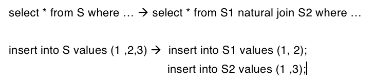

### Indexes

```sql
create table student
(	ID varchar (5),
 name varchar (20) not null,
 dept_name varchar (20),
 tot_cred numeric (3,0) default 0,
 primary key (ID) 
)
create index studentID_index on student(ID)
```

* Indices are data structures used to speed up access to records with specified values for index attributes

```sql
 select *
 from  student
 where  ID = ‘12345’
```

* can be executed by **using the index** to find the required record, without looking at all records of student

### Transactions

* `AUTOCOMMIT=1;` -- Everytime auto commit

```sql
SET AUTOCOMMIT=0;
UPDATE account SET balance=balance -100 WHERE ano=‘1001’;
UPDATE account SET balance=balance+100 WHERE ano=‘1002’;
COMMIT;
```

```sql
UPDATE account SET balance=balance -200 WHERE ano=‘1003’;
UPDATE account SET balance=balance+200 WHERE ano=‘1004’;     COMMIT;
```

```sql
UPDATE account SET balance=balance+balance*2.5%;
COMMIT;
```

#### ACID Properties

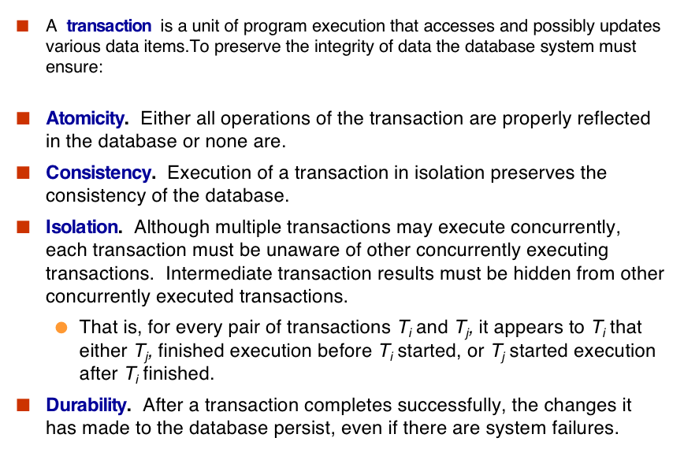

#### Authorization

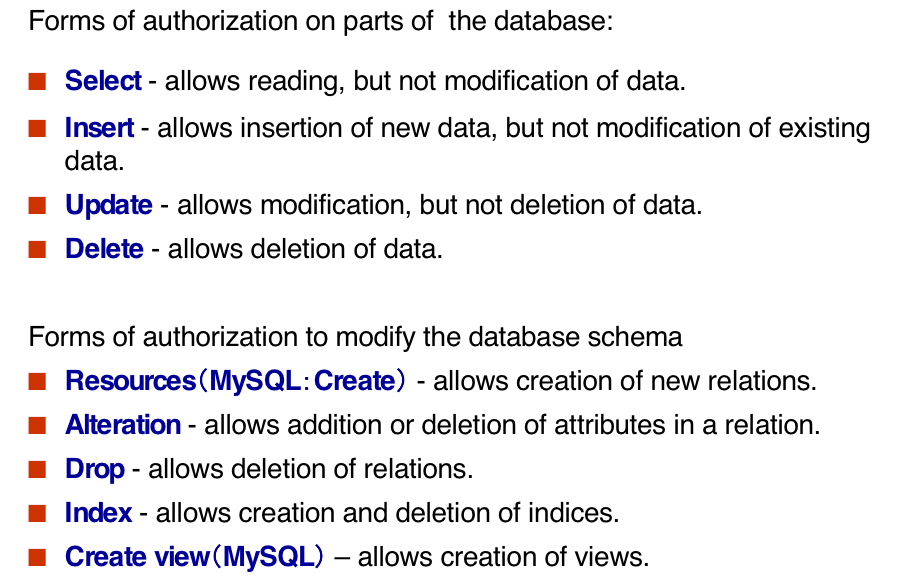

```mysql
grant <privilege list>  // privilege：权限
on <relation name or view name> to <user list>
```

* \<user list\> is:

  a user-id

  public, which allows all valid users the privilege granted

  A role (more on this later)

* Granting a privilege on a view does not imply granting any privileges on the underlying relations.
* The grantor of the privilege must already hold the privilege on the specified item (or be the database administrator).

```sql
grant select on instructor  to U1, U2, U3
grant select on department  to public
grant update (budget) on department  to U1,U2
grant all privileges on department   to U1
```

#### Revoking Authorization in SQL

```sql
revoke <privilege list>
on <relation name or view name> 
from <user list>
revoke select on branch  from U1, U2, U3
```

* \<privilege-list\> may be all to revoke all privileges the revokee may hold.
* If \<revokee-list\> includes public, all users lose the privilege except those **granted it explicitly**.
* If the same privilege was granted twice to the same user by different grantees, the user may retain the privilege **after the revocation**.
* All privileges that depend on the privilege being revoked are also revoked.

## Advanced sql
API (application-program interface) for a program to interact with a database server
* ODBC (Open Database Connectivity) works with C, C++, C#
* JDBC (Java Database Connectivity) works with Java
* Embedded SQL in C
* SQLJ - embedded SQL in Java
* JPA(Java Persistence API)  - OR mapping of Java

### JDBC Code

```java
public static void JDBCexample(String dbid, String userid, String passwd){ 
     try { 
   Connection conn = DriverManager.getConnection(     
       "jdbc:oracle:thin:@db.yale.edu:2000:univdb", userid, passwd); 
          Statement stmt = conn.createStatement(); 
              ... Do Actual Work ....
          stmt.close();
          conn.close();
     }
     catch (SQLException sqle) { 
          System.out.println("SQLException : " + sqle);
     }
        }
```
* Update to database

```java
try {
     stmt.executeUpdate(
          "insert into instructor values(’77987’, ’Kim’, ’Physics’, 98000)");
} catch (SQLException sqle)
{
    System.out.println("Could not insert tuple. " + sqle);
}
```
* Execute query and fetch and print results
```java
ResultSet rset = stmt.executeQuery(
                                "select dept_name, avg (salary)
                                 from instructor
                                 group by dept_name");
while (rset.next()){
       System.out.println(rset.getString("dept_name") + " " +
                                              rset.getFloat(2));
}
```

* Prepared Statement
```java
PreparedStatement pStmt = conn.prepareStatement( 
                                "insert into instructor values(?,?,?,?)");
pStmt.setString(1, "88877");      pStmt.setString(2, "Perry");
pStmt.setString(3, "Finance");   pStmt.setInt(4, 125000);
pStmt.executeUpdate();    
pStmt.setString(1, "88878");
pStmt.executeUpdate();
```
**WARNING: always use prepared statements when taking an input from the user and adding it to a query**
* NEVER create a query by concatenating strings which you get as inputs
```java
"insert into instructor values(’ " + ID + " ’, ’ " + name + " ’, " + 
                                            " ’ " + dept name + " ’, " + salary + ")"
```                                           
* What if name is “D’Souza”?

#### SQL Injection  
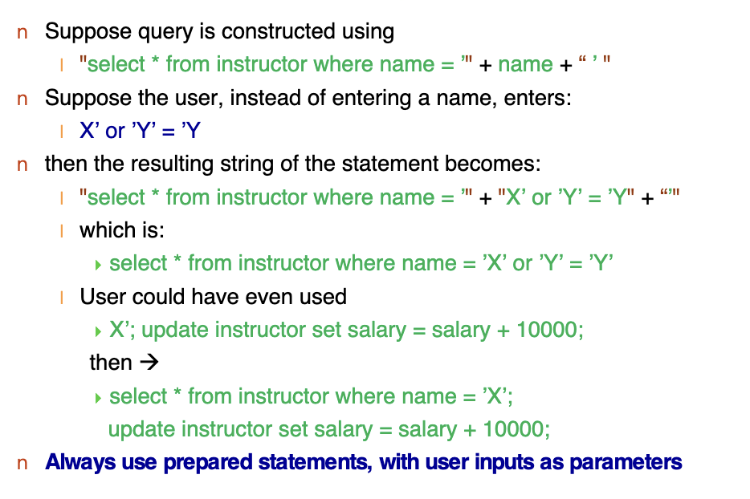

#### Metadata
```java
ResultSetMetaData rsmd = rs.getMetaData();
     for(int i = 1; i <= rsmd.getColumnCount(); i++) {
           System.out.println(rsmd.getColumnName(i));
                  System.out.println(rsmd.getColumnTypeName(i));
       }
```
### ODBC
```C
int ODBCexample()
{
  RETCODE error;
  HENV    env;     /* environment */ 
  HDBC    conn;  /* database connection */ 
  SQLAllocEnv(&env);
  SQLAllocConnect(env, &conn);
  SQLConnect(conn, 'db.yale.edu', SQL_NTS, 'avi', SQL_NTS,'avipasswd',SQL_NTS); 
  { .... Do actual work ... }
  SQLDisconnect(conn); 
  SQLFreeConnect(conn); 
  SQLFreeEnv(env); 
}
```


### Procedural Constructs in SQL
#### SQL Functions
```sql
 create function dept_count (dept_name varchar(20))
 returns integer
 begin
    declare d_count integer;
    select count (* ) into d_count
    from instructor
    where instructor.dept_name = dept_name

    return d_count;
 end
```
```sql
select dept_name, budget
from department
where dept_count (dept_name ) > 1
```
#### Table Functions
```sql
create function instructors_of (dept_name char(20) )
returns table ( ID varchar(5),
                name varchar(20),
                dept_name varchar(20),
                salary numeric(8,2))
return table
(select ID, name, dept_name, salary
 from instructor
 where instructor.dept_name = instructors_of.dept_name)
```
```sql
select *
from table (instructors_of (‘Music’))
```
#### SQL Procedures
* The dept_count function could instead be written as procedure:
```sql
create procedure dept_count_proc (in dept_name varchar(20), 
                                  out d_count integer)
begin
  select count(*) into d_count
  from instructor
  where instructor.dept_name = dept_count_proc.dept_name
     end
```
* Procedures can be invoked either from an SQL procedure or from embedded SQL, using the call statement
```sql
declare d_count integer;
call dept_count_proc( ‘Physics’, d_count)
```
* Procedures and functions can be invoked also from dynamic SQL
* While and repeat statements 
```sql
declare n integer default 0;
while n < 10 do
  set n = n + 1
end while              
repeat
  set n = n  – 1
  until n = 0
end repeat
```
* For loop
```sql
declare n  integer default 0;
   for r  as
          select budget from department
          where dept_name = ‘Music’
    do
       set n = n - r.budget
    end for
```
* Conditional statements  (if-then-else)
```sql
if boolean  expression 
    then statement or compound statement 
elseif boolean  expression 
    then statement or compound statement 
    else statement or compound statement 
end if
```
* SQL:1999 also supports a case statement similar to C case statement
* EXAMPLE
```sql
CREATE FUNCTION registerStudent(
  IN s_id VARCHAR(5),
  IN s_courseid VARCHAR(8),
  IN s_secud VARCHAR(8),
  IN s_semester VARCHAR(6),
  in s_year NUMERIC(4.0),
  OUT errorMsg VARCHAR(100)
)
RETURNS INTEGER
BEGIN
  DECLARE currEnrol INT;
  SELECT COUNT(*) INTO currEnrol
    FROM takes
    WHERE course_id = s_courseid AND sec_id = s_secid AND semester = s_semester AND year = s_year;
  DECLARE LIMIT INT;
  SELECT capacity INTO limit
    FROM classroom NATURAL JOIN section
    WHERE course_id = s_courseid AND sec_id = s_secid AND semester = s_semester AND year = s_year;
  IF(currEnrol<limit)
    BEGIN
      INSET INTO takes VALUES
        (s_id,s_course,s_secid,s_semester,s_year,null);
      RETURN(0);
    END
  SET errorMsg = 'Enrollment limit reached for course'||'s_course_id'||'section'||s_secid;
  RETURN(-1);
END;
```
#### External Language Functions/Procedures
```sql
create procedure dept_count_proc(in dept_name varchar(20),out count integer)
language C
external name '/usr/avi/bin/dept_count_proc'
create function dept_count(dept_name varchar(20))
returns integer
language C
external name '/usr/avi/bin/dept_count'
```
* Benefits of external language functions/procedures:  
more efficient for many operations, and more expressive power.
* Drawbacks
Code to implement function may need to be loaded into 
database system and executed in the database system’s 
address space.
  * risk of accidental corruption of database structures
  * security risk, allowing users access to unauthorized data
There are alternatives, which give good security at the cost of potentially worse performance.
Direct execution in the database system’s space is used when 
efficiency is more important than security.
### Triggers
```sql
CREATE TRIGGER account_trigger AFTER UPDATE of account ON balance 
referencing NEW ROW AS nrow                                                                       
referencing OLD ROW AS orow 
FOR EACH ROW
  WHEN nrow.balance - orow.balance > =200000 OR
       orow.balance - nrow.balance >=50000 
  BEGIN
  INSERT INTO account_log VALUES (nrow.account-number, nrow.balance-orow.balance , current_time() )
END
```
```sql
create trigger timeslot_check1 after insert on section
referencing new row as nrow
for each row
when (nrow.time_slot_id not in (
                 select time_slot_id
                 from time_slot)) /* time_slot_id not present in time_slot */
begin
     rollback
end;
```
```sql
create trigger timeslot_check2 after delete on timeslot
referencing old row as orow
for each row
when (orow.time_slot_id not in (
               select time_slot_id
               from time_slot) 
                         /* last tuple for time slot id deleted from time slot */
          and orow.time_slot_id in (
               select time_slot_id
               from section))
                 /* and time_slot_id still referenced from section*/
begin
    rollback
end;
```
```sql
create trigger credits_earned after update of takes on grade
referencing new row as nrow
referencing old row as orow
for each row
when nrow.grade <> ’F’ and nrow.grade is not null
    and (orow.grade = ’F’ or orow.grade is null)
begin atomic
     update student
     set tot_cred= tot_cred + 
           (select credits
            from course
            where course.course_id= nrow.course_id)
     where student.id = nrow.id;
end;
```
#### Statement Level Triggers
```sql
create trigger grade_trigger after update of takes on grade
      referencing new table as new_table                                                                          
      for each statement
      when  exists( select avg(grade)
                             from new_table
                             group by course_id, sec_id, semester, year
                             having avg(grade)< 60 )
      begin 
 rollback
      end

```
