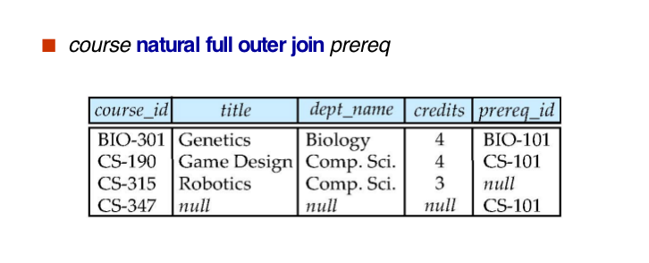

## Intermediate SQL

### Joined Relations


* join默认是 inner join
* Natural Join 和 Inner Join 在连接两个表时的结果是相同的，但是它们的实现方式不同

https://blog.csdn.net/yiyelanxin/article/details/86593473

**Join operations** take two relations and return as a result another relation.

* Join operations are typically used as subquery expressions in the from clause

**Join condition** defines which tuples in the two relations match, and what attributes are present in the result of the join.

**Join type**  defines how tuples in each relation that do not match any tuple in the other relation (based on the join condition) are treated.

#### Examples





### Types.

#### Built-in Data Types in SQL 

* `date ‘2005-7-27’`

* `time ‘09:00:30.75’`

* `timestamp  ‘2005-7-27 09:00:30.75’`

* `interval  ‘1’ day`

  Subtracting a date/time/timestamp value from another gives an interval value

  Interval values can be added to date/time/timestamp values

* date, time functions: 

  `current_date(), current_time()`

  `year(x), month(x), day(x), hour(x), minute(x), second(x)`

#### User-Defined Types

```mysql
create type Dollars as numeric (12,2) final
create table department(
  dept_name varchar (20),
  building varchar (15),
  budget Dollars);
```

#### Domains

```mysql
create domain person_name char(20) not null
```

* Types and domains are similar.  

  Domains can have constraints, such as not **null**, specified on them.

```mysql
create domain degree_level varchar(10)
constraint degree_level_test
check (value in (’Bachelors’, ’Masters’, ’Doctorate’));
```

#### Large-Object Types


#### Integrity Constraints

Integrity constraints guard against accidental damage to the database, by ensuring that authorized changes to the database do not result in a loss of data consistency. 

* A checking account must have a balance greater than $10,000.00$
* A salary of a bank employee must be at least $4.00 an hour
* A customer must have a (non-null) phone number

##### For a single relation

* `not null`

  ```mysql
  name varchar(20) not null
  budget numeric(12,2) not null
  ```

*  `primary key` 

*  `unique` 

*  `check (P), where P is a predicate` 

  ```mysql
  create table section (
      course_id varchar (8),
      sec_id varchar (8),
      semester varchar (6),
      year numeric (4,0),
      building varchar (15),
      room_number varchar (7),
      time slot id varchar (4), 
      primary key (course_id, sec_id, semester, year),
      check (semester in (’Fall’, ’Winter’, ’Spring’, ’Summer’))
  );
  ```

  ```mysql
  check (semester in (’Fall’, ’Winter’, ’Spring’, ’Summer’))
  ```

*  `foreign key`

* Cascading Actions

  ```mysql
  create table course (
  course_id   char(5) primary key,
  title       varchar(20),
  dept_name varchar(20) references department
  )
  create table course (
    ...
  dept_name varchar(20),
  foreign key (dept_name) references department
    on delete cascade,
    on update cascade,
  	...)
  ```

* Integrity Constraint Violation During Transactions

```mysql
create table person (
  ID  char(10),
  name char(40),
  mother char(10),
  father  char(10),
  primary key (ID),
  foreign key (father) references person,
  foreign key (mother) references  person);
```

How to insert a tuple without causing constraint violation ?

* insert father and mother of a person before inserting person
* OR, set father and mother to null initially, update after inserting all persons (not possible if father and mother attributes declared to be not null) 
* OR defer constraint checking to transaction end.


* Unfortunately:  subquery in check clause not supported by pretty much any databaseAlternative: **triggers**

**Assertion**

```mysql
create assertion <assertion-name> check <predicate>;
create assertion credits_earned_constraint check
(not exists 
		(select ID 
      from student
      where tot_cred <> (
              select sum(credits)
              from takes natural join course
              where student.ID=takes.ID
                         and grade is not null 
                         and grade<>’F’))
```

### View

* A view provides a mechanism to hide certain data from the view of certain users. 
* Consider a person who needs to know an instructors name and department, but not the salary.  This person should see a relation described, in SQL, by 

```mysql
create view faculty as 
select ID, name, dept_name
from instructor
```

```mysql
select name
from faculty
where dept_name = ‘Biology’
```

```mysql
create view departments_total_salary(dept_name, total_salary) as
select dept_name, sum (salary)
from instructor
group by dept_name;
```

```mysql
create view physics_fall_2009 as
select course.course_id, sec_id, building, room_number
from course, section
where course.course_id = section.course_id
and course.dept_name = ’Physics’
and section.semester = ’Fall’
and section.year = ’2009’;
```

```mysql
create view physics_fall_2009_watson as
select course_id, room_number
from physics_fall_2009
where building= ’Watson’;
```

* 直接对view的定义进行嵌入

#### Update

```mysql
create view faculty as
select ID, name, dept_name
from instructor

insert into faculty values (’30765’, ’Green’, ’Music’);
```

* This insertion must be represented by the insertion of the tuple`(’30765’, ’Green’, ’Music’, null)`into the instructor relation  insert into  instructor values `(’30765’, ’Green’, ’Music’, null);`

* Some Updates cannot be Translated Uniquely

  ```mysql
  create view instructor_info a
  select ID, name, building
  from instructor, department
  where instructor.dept_name= department.dept_name;
  insert into instructor_info values (’69987’, ’White’, ’Taylor’);
  ```

  * which department, if multiple departments in Taylor?

* Most SQL implementations allow updates only on simple views(updatable views) 

  The from clause has only one database relation.

  The select clause contains only attribute names of the relation, and does not have any expressions, aggregates, or distinct specification.

  Any attribute not listed in the select clause can be set to null.

  The query does not have a group by or having clause.

#### Materialized View

* 有对应的临时表..

create a physical table containing all the tuples in the result of the query defining the view

If relations used in the query are updated, the materialized view result becomes out of date

* Need to **maintain** the view, by updating the view whenever the underlying relations are updated.

```mysql
create materialized view departments_total_salary(dept_name, total_salary) as
	select dept_name, sum (salary)
	from instructor
	group by dept_name;
select dept_name
from departments_total_salary
where total_salary > (select avg(total_salary) from departments_total_salary );
```

#### View and Logical Data Indepencence

If  relation $S(a, b, c)$ is split into two sub relations $S_1(a,b)$ and $S_2(a,c)$​. How to realize the logical data independence? 

```mysql
create table S1...;
create table S2...;
insert into S1 select a,b from S;
insert into S2 select a,c from S;
drop table S;
create view S(a,b,c)as select a,b,c from Sq natural join S2;
```

* `create view S(a,b,c)as select a,b,c from Sq natural join S2;`实现对原表的查询，对用户来说无区别.


### Indexes

```mysql
create table student
(	ID varchar (5),
 name varchar (20) not null,
 dept_name varchar (20),
 tot_cred numeric (3,0) default 0,
 primary key (ID) 
)
create index studentID_index on student(ID)
```

* Indices are data structures used to speed up access to records with specified values for index attributes

```mysql
 select *
 from  student
 where  ID = ‘12345’
```

* can be executed by **using the index** to find the required record, without looking at all records of student

### Transactions

* `AUTOCOMMIT=1;` -- Everytime auto commit

```mysql
SET AUTOCOMMIT=0;
UPDATE account SET balance=balance -100 WHERE ano=‘1001’;
UPDATE account SET balance=balance+100 WHERE ano=‘1002’;
COMMIT;
```

```mysql
UPDATE account SET balance=balance -200 WHERE ano=‘1003’;
UPDATE account SET balance=balance+200 WHERE ano=‘1004’;     COMMIT;
```

```mysql
UPDATE account SET balance=balance+balance*2.5%;
COMMIT;
```

#### ACID Properties


#### Authorization


```mysql
grant <privilege list>  // privilege：权限
on <relation name or view name> to <user list>
```

* \<user list\> is:

  a user-id

  public, which allows all valid users the privilege granted

  A role (more on this later)

* Granting a privilege on a view does not imply granting any privileges on the underlying relations.
* The grantor of the privilege must already hold the privilege on the specified item (or be the database administrator).

```mysql
grant select on instructor  to U1, U2, U3
grant select on department  to public
grant update (budget) on department  to U1,U2
grant all privileges on department   to U1
```

#### Revoking Authorization in SQL

```mysql
revoke <privilege list>
on <relation name or view name> 
from <user list>
revoke select on branch  from U1, U2, U3
```

* \<privilege-list\> may be all to revoke all privileges the revokee may hold.
* If \<revokee-list\> includes public, all users lose the privilege except those **granted it explicitly**.
* If the same privilege was granted twice to the same user by different grantees, the user may retain the privilege **after the revocation**.
* All privileges that depend on the privilege being revoked are also revoked.

