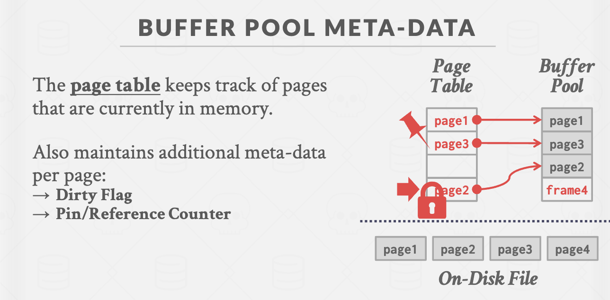
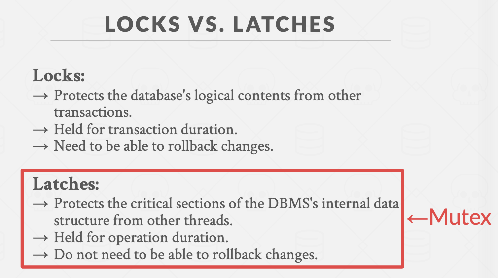
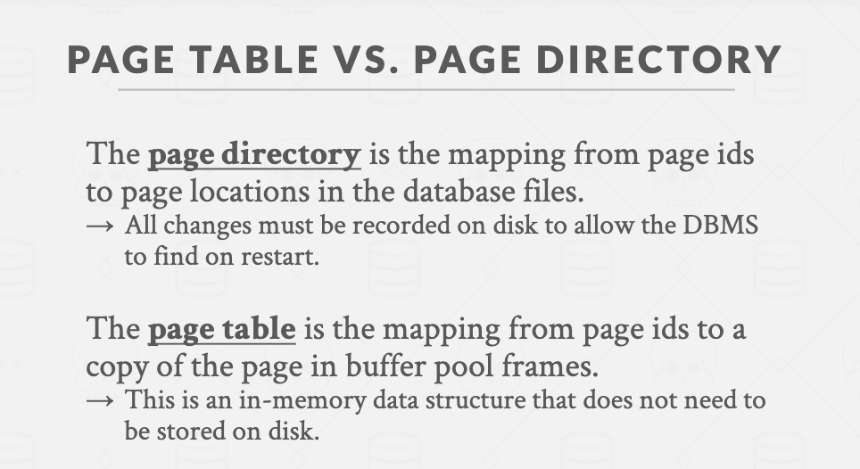
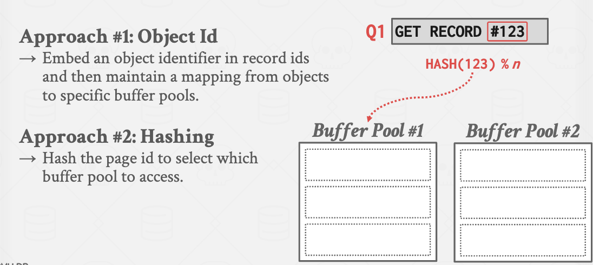
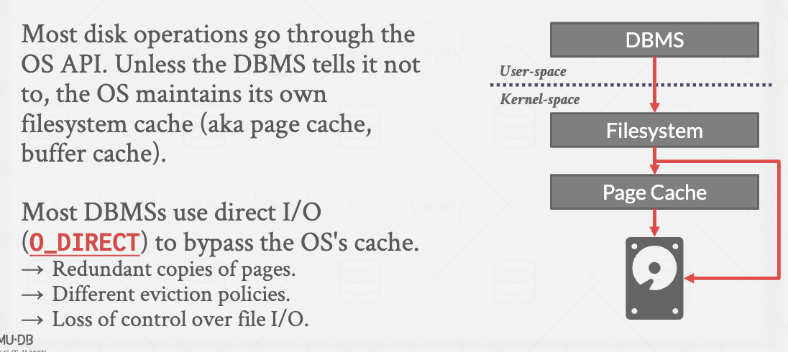
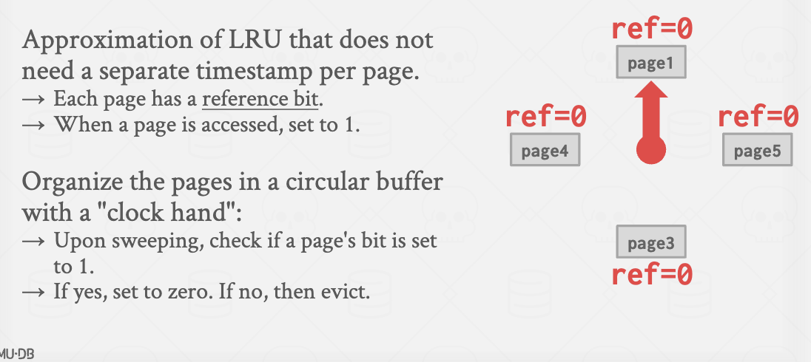
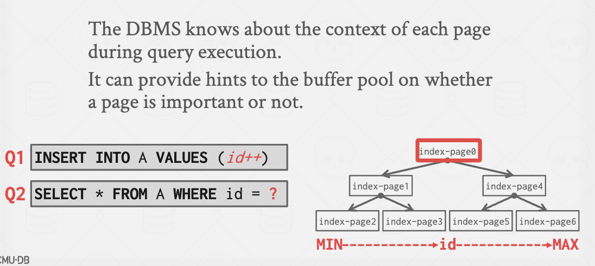

# Problem #2: How the DBMS manages its memory and move data back-and-forth from disk.
* DBMS can't manage data directly in disk, it needs to move data to memory to work with it.
* We dicuss based on the Disk-Oriented DBMS,not the Log-Oriented DBMS.
  
## Buffer Pool Manager
### Buffer Pool Organization
Memory region organized as an array of fixed-size pages.
An array entry is called a frame.
* When the DBMS requests a page, an exact copy is placed into one of these frames.
Dirty pages are buffered and notwritten to disk immediately
* → Write-Back Cache
#### Page Table
> Hash Table

* The page table keeps track of pages that are currently in memory.
* Also maintains additional meta-data per page:
  → Dirty Flag
  → Pin/Reference Counter
* Prevent other page to overwrite the current processing page.

### Buffer Pool Optimizations
#### Multiple Buffer Pools
* Partitioning memory across multiple pools helps reduce latch contention and improve locality.

#### Pre-Fetching
> See Slides
#### Scan Sharing
If a query wants to scan a table and another query is already doing this, then the DBMS will attach the second query's cursor to the existing cursor.
> See Slides and Lectures
#### Buffer Pool Bypass
> See Slides

### OS Page Cache
Most disk operations go through the OS API.
Unless you tell it not to, the OS maintains its own filesystem cache (i.e., the page cache)

## Replacement Policies
When the DBMS needs to free up a frame to make room for a new page, it must decide which page to evict from the buffer pool.

### LRU : Least Recently Used

Maintain a single timestamp of when each page was last accessed.
When the DBMS needs to evict a page, select the one with the oldest timestamp.

* Keep the pages in sorted order to reduce the search time on eviction.
### Clock
* Approximation of LRU that does not need a separate timestamp per page.

### Problems:
LRU and CLOCK replacement policies are **susceptible** to sequential flooding.

* A query performs a sequential scan that reads every page.
* This pollutes the buffer pool with pages that are read once and then never again.
In some workloads the **most recently used page** is the most unneeded page
### Better Policies : LRU-K
Track the history of last $K$ references to each page as timestamps and compute the interval between subsequent accesses.
The DBMS then uses this history to estimate the next time that page is going to be accessed.
### Better Policies : Localization
The DBMS chooses which pages to evict on a per txn/query basis. This minimizes the pollution of the buffer pool from each query.

* Keep track of the pages that a query has accessed.

Example: Postgres maintains a small ring buffer that is private to the query.

### Better Policies : Proority Hints

### Dirty Pages
**Fast Path**: If a page in the buffer pool is not dirty, then the DBMS can simply "drop" it.
**Slow Path**: If a page is dirty, then the DBMS must write back to disk to ensure that its changes are persisted.

* Trade-off between fast evictions versus dirty writing pages that will not be read again in the future.

### Background Writing
The DBMS can periodically walk through the page table and write dirty pages to disk.
When a dirty page is safely written, the DBMS can either evict the page or just unset the dirty flag.
Need to be careful that the system doesn't write dirty pages before their log records are written...
## Other Memory Pools
