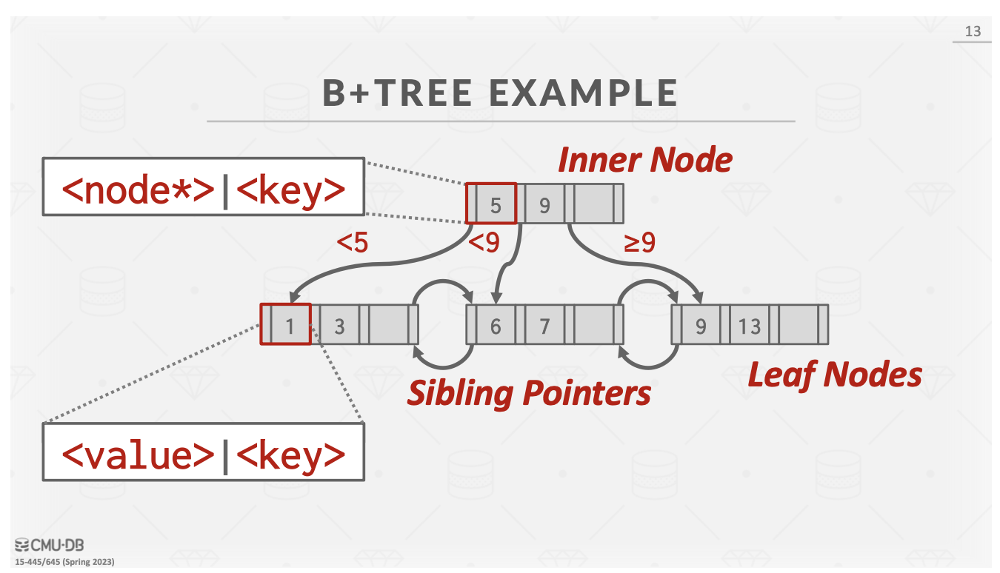
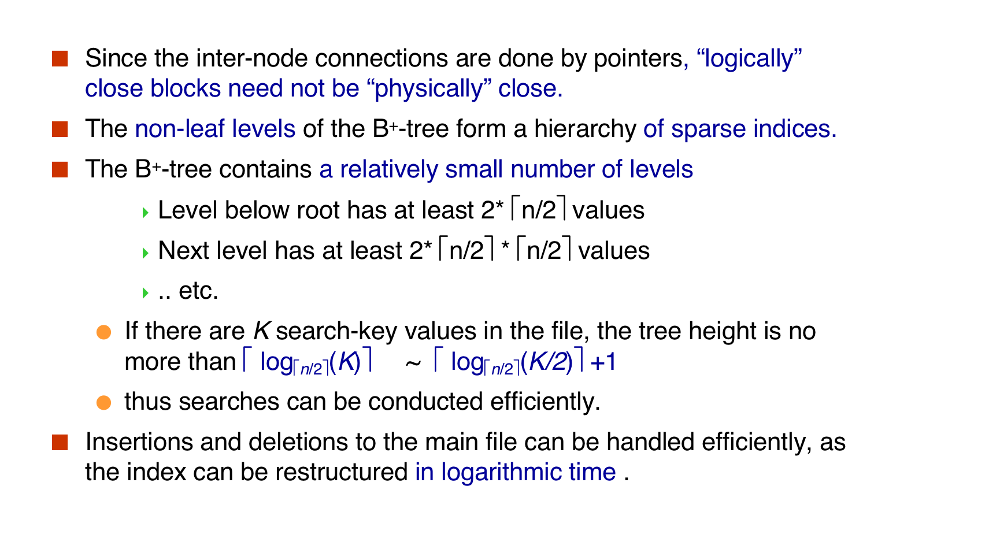

> Index Types see Inclass Slide.(Chapter 14)

## B+ Tree Indexes

A **B+Tree** is a self-balancing, ordered tree data structure that allows searches, sequential access,Insertions, and deletions in **O(log n)**.

* Generalization of a binary search tree, since a node can have more than two children.
* Optimized for systems that read and write large blocks of data.

### Properties

A B+Tree is an **M**-way search tree with the following properties:

* It is perfectly balanced (i.e., every leaf node is at the same depth in the tree)
* Every node other than the root is at **least half-full** $M/2-1 ≤ \#keys ≤ M-1$
* Every inner node with $k$ keys has $k+1$ non-null children

* Visialization : https://www.cs.usfca.edu/~galles/visualization/BPlusTree.html

> Root can have only 2 branches.

