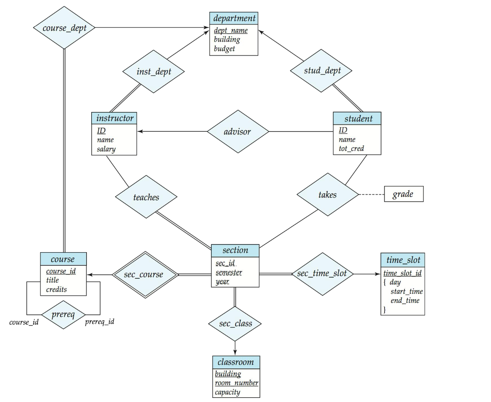

## Entity-Relationship Model

## Modeling

> 双横线表示每个对象都必须参与关系，而单横线则表示对象可以不参与关系

* Section is a weak entity. -- Dependent on a strong entity.
* instructor can have no sections : `-----`
* section must have instructors: `====`
* `=== ---->` one to many
* `==== ------` many to many
* `<--->` one to one

* `relationship` 带属性. :  如 `takes` 上的 `grade`.

**A database can be modeled as**: 

* a collection of entities
* relationship among entities.

An **entity** is an object that exists and is distinguishable from other objects.

Entities have **attributes**

An **entity set** is a set of entities of the same type that share the same

properties.

## Constraints
## Weak Entity Sets

## Reduction to Relation Schemas n Design Issues
## Extended E-R Features
## UML

