

## Entity-Relationship Model

## Modeling

> 双横线表示每个对象都必须参与关系，而单横线则表示对象可以不参与关系

* Section is a weak entity. -- Dependent on a strong entity.
* instructor can have no sections : `-----`
* section must have instructors: `====`
* `<--->` one to one

* `relationship` 带属性. :  如 `takes` 上的 `grade`.

**A database can be modeled as**: 

* a collection of entities
* relationship among entities.

An **entity** is an object that exists and is distinguishable from other objects.

An **entity set** is a set of entities of the same type that share the same

properties.

### Relationship

#### Attributes

Entities have **attributes**.

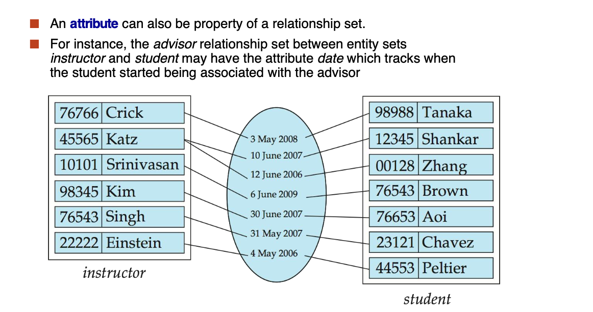

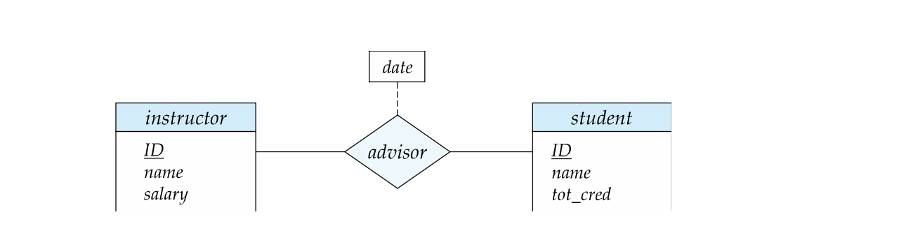

**Attribute types:**

* **Simple** (简单)and **composite**(复合) attributes.
* **Single-valued**(单值) and **multivalued**(多值) attributes
* Example: multivalued attribute: phone_numbers 

**Derived**(派生) attributes

* Can be computed from other attributes 
* Example: age, given `date_of_birth`

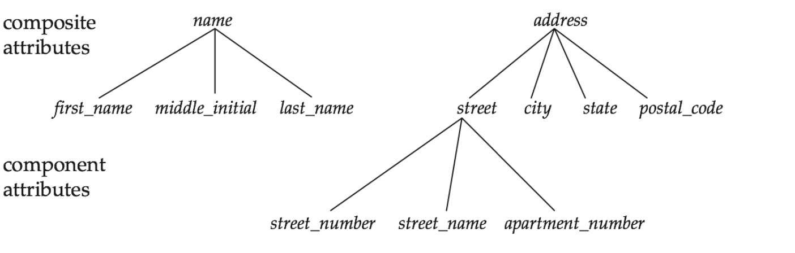

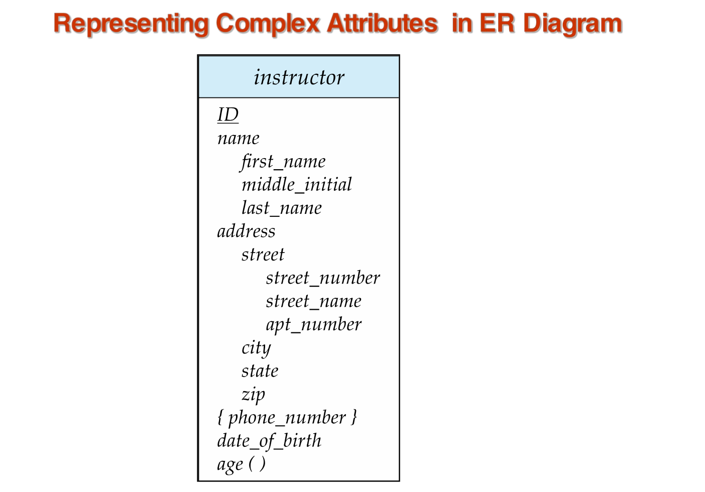

`{phone_number}` multiple phone numbers.

> If implemented , have to import using another new entity.

### Mapping Cardinality Constraints

We express cardinality constraints by drawing either a directed line $(\to)$, signifying “one,” or an undirected line $(—)$, signifying “many,” between the relationship set and the entity set.

#### One to one

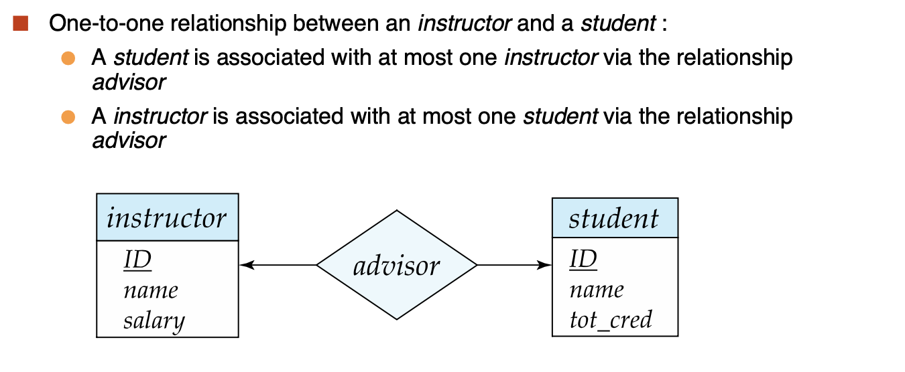

#### One to many

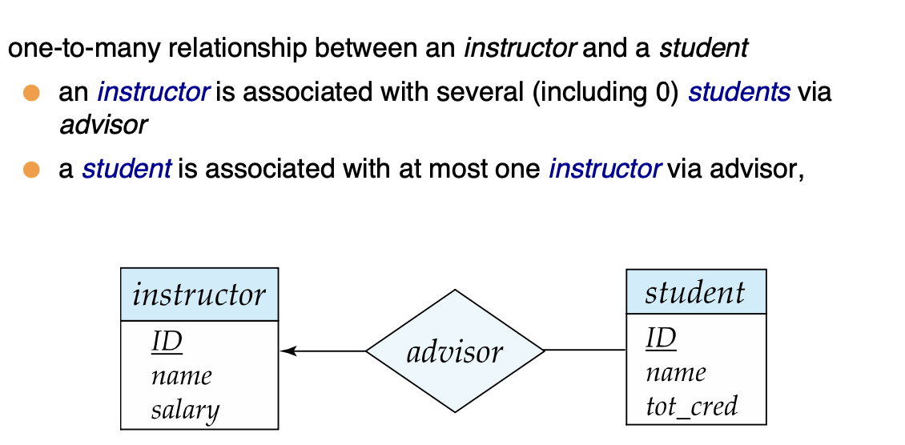

#### Many to one 

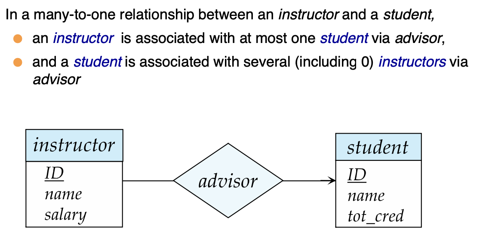

#### Many to many

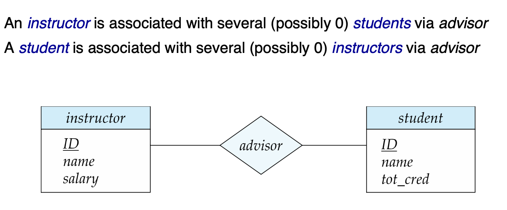

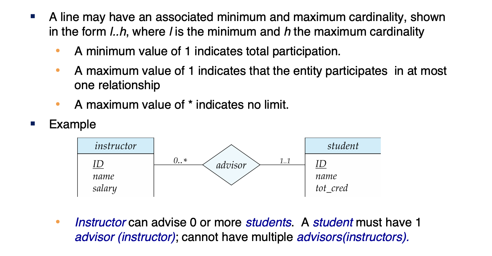

* We allow at most one arrow out of a ternary (or greater degree) relationship to indicate a cardinality constraint
* For example, an arrow from `proj_guide` to instructor indicates each student has at most one guide for a project
* To avoid confusion we outlaw(禁止) more than one arrow.

## Constraints

### Primary Key

* For Entity Sets.

* For Relationship Sets.

  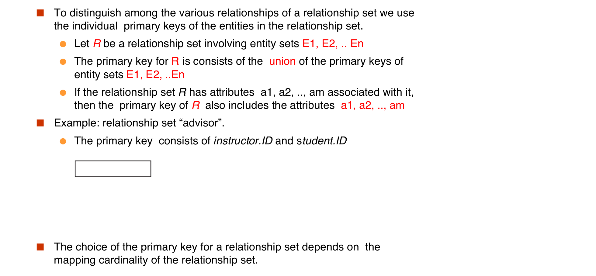

  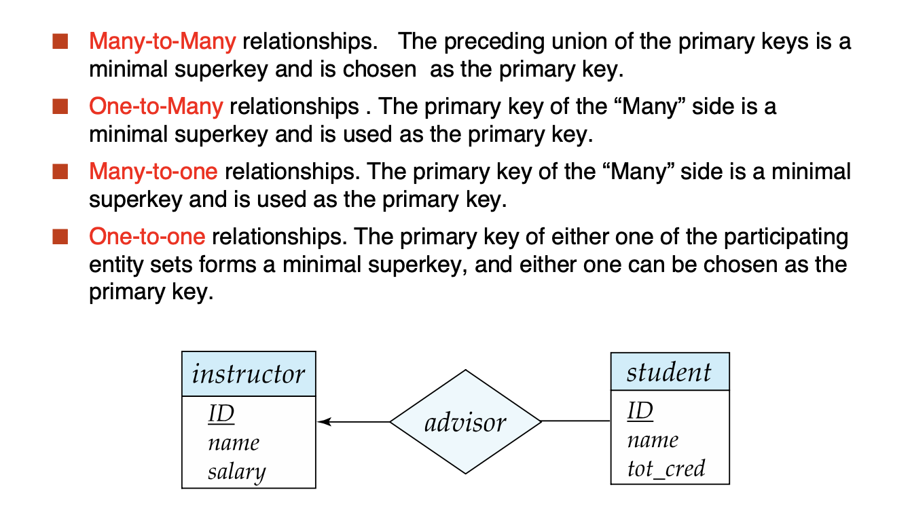

## Weak Entity Sets

An entity set that does not have a primary key is referred to as a **weak entity set**.

The existence of a weak entity set depends on the existence of a **identifying entity set**(标识性实体集)

* It must relate to the identifying entity set via a total, **one-to-many relationship** set from the identifying to the weak entity set
* **Identifying relationship**(标识性联系) depicted using a double diamond

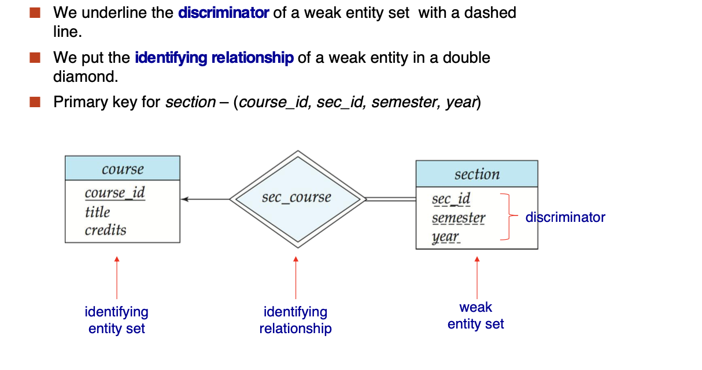

**Note**: the primary key of the strong entity set is not explicitly stored with the weak entity set, since it is implicit in the identifying relationship.

If `course_id` were explicitly stored, section could be made a strong entity, but then the relationship between section and course would be **duplicated** by an implicit relationship defined by the attribute `course_id` common to course and section.

#### Redundant Attributes

Suppose we have entity sets:

* student, with attributes: ID, name, tot_cred, dept_name
* department, with attributes: dept_name, building, budget

We model the fact that each student has an associated department using a relationship set stud_dept

The attribute dept_name in student below replicates information present in the relationship and is therefore **redundant** and needs to be removed.

BUT: when **converting back to tables**, in some cases the attribute gets reintroduced, as we will see later.

## Reduction to Relation Schemas 

* refer to slides

## Design Issues

* Refer to slides

  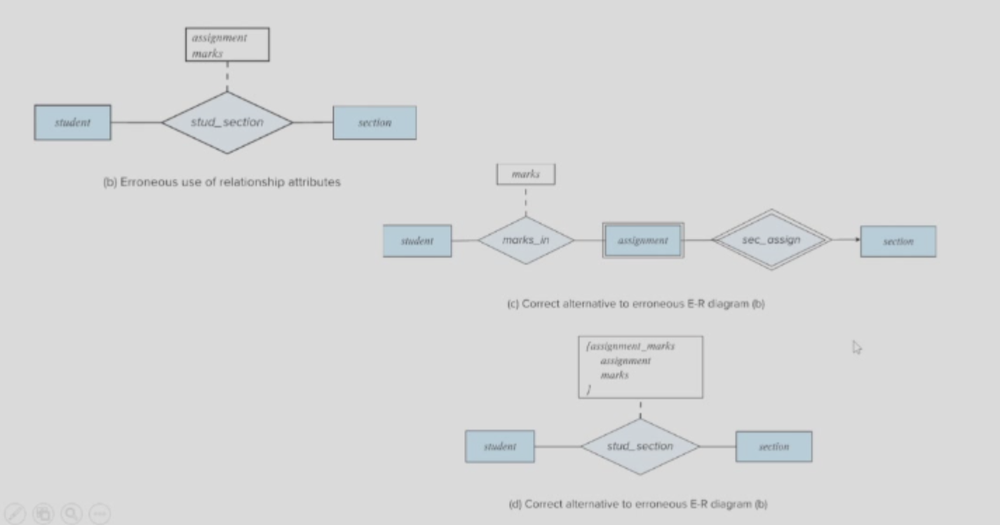

## Extended E-R Features

* Refer to Slides

## UML

* Refer to Slides.

