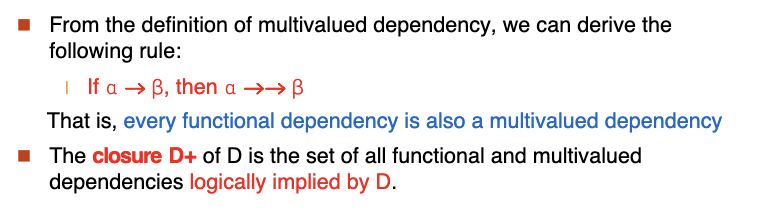

# Chap 7: Relational Database Design
## 7.1 Introduction
### Smaller Schemas
* Suppose we had started with 
```sql
inst_dept(id,name,salary,dept_name, building, budget)
```
* We could have decomposed it into
```sql
instructor(id,name,salary,dept_name)
department(dept_name,building,budget)
```
* If there was a schema `instructor(id,name,salary,dept_name,building,budget)`, then `dept_name` would be a candidate key.
* In `inst_dept`, `dept_name` is not a candidate key.The `building` and `budget` of a department are not determined by the department name alone,may have to be repeated.

* Lossy Decomposition: If we decompose a relation into smaller relations, we may lose information.


#### Lossless Join Decomposition
* A decomposition of a relation schema R into a set of smaller relation schemas is a **lossless decomposition** if:
    * r = π<sub>X</sub>(r) ⨝ π<sub>Y</sub>(r) where X and Y are the sets of attributes of R.
* And,conversely a decomposition is **lossy** if :
    * r $\in$ π<sub>X</sub>(r) ⨝ π<sub>Y</sub>(r)
    * Note: more tuples implies more uncertainty (less information)
* A decomposition of R into $R_1$ and $R_2$ is lossless join if at least one of the following dependencies holds:
    * $R_1$ ∩ $R_2$ → $R_1$
    * $R_1$ ∩ $R_2$ → $R_2$

#### First Normal Form (1NF)

* A relation schema R is in 1NF if the domains of all attributes of R are atomic.
* That is, the values of each attribute are indivisible.

**Goal : Devise a Theory for the Following**

* Decide whether a particular relation R is in “good” form.
* In the case that a relation R is not in “good” form, decompose it into a set of relations {R1, R2, ..., Rn} such that 
  * each relation is in good form 
  * the decomposition is a lossless-join decomposition
* Our theory is based on:
  * functional dependencies
  * multivalued dependencies

### 7.2 Functional Dependencies
#### Constraints on Relations
A **constraint** is a condition that must be true for any instance of the database.

* Example:
  * Students are uniquely identified by their ID.
  * Each  student has only one name.  
  * Each student is (primarily) associated with only one department.
  * Each department has only one value for its budget, and only one associated building
* An instance of a relation that satisfies all such real-world constraints is  called a  legal instance of the relation;
* A legal instance of a database is one where all the relation instances 
are legal instances

Functional Dependencies  are constraints on the set of legal relations.

* Require that certain attributes have unique values given the values of certain other attributes.
* Functional Dependencies  are constraints on the set of legal relations

Let R be a relation schema $\alpha \in R$ and $\beta \in R$.
The functional dependency $\alpha\to\beta$ holds on R **if and only if**:

* For any legal relation r(R), if two tuples t1 and t2 agree on the attributes $\alpha$, then they must also agree on the attributes $\beta$.
* That is, if t1[α] = t2[α], then t1[β] = t2[β].

#### Key
* A set of attributes K is a **superkey** of R if, in any legal relation r(R), for any two tuples t1 and t2, if t1[K] = t2[K], then t1 = t2.
  * K $\to$ R
* K is a candidate key of R if K is a superkey and no proper subset of K is a superkey.
  * K $\to$ R 
  * for no $\alpha$ $\subset$ K, $\alpha$ $\to$ R
* Functional dependencies allow us to express constraints that cannot be expressed using superkeys.

A functional dependency is trivial if $\beta$ is a subset of $\alpha$.

* Example: A $\to$ A is trivial.
* Example: AB $\to$ A is not trivial.
In general : $\alpha \to \beta$ is trivial if $\beta \subset \alpha$.

#### Closure of a Set of Functional Dependencies

Given a set F of functional dependencies, there are certain other 
functional dependencies that are logically implied by F.

* If $A\to B$ and $B\to C$ , then $A\to C$ is logically implied
The set of all functional dependencies logically implied by F is called the closure of F, denoted **F+**.

Example:

* F = {A $\to$ B, B $\to$ C}
* F+ = {A $\to$ B, B $\to$ C, A $\to$ C,AB $\to$ C,AC $\to$ B,ABC $\to$ C,ABC $\to$ B,ABC $\to$ A...}

**Armstrong’s Axioms**

* Armstrong’s Axioms are a set of rules that allow us to infer all the functional dependencies that hold on a relation.

* The axioms are:
  * **Reflexivity**: If $\beta$ $\subset$ $\alpha$, then $\alpha$ $\to$ $\beta$.
  * **Augmentation**: If $\alpha$ $\to$ $\beta$, then $\alpha\gamma$ $\to$ $\beta\gamma$.
  * **Transitivity**: If $\alpha$ $\to$ $\beta$ and $\beta$ $\to$ $\gamma$, then $\alpha$ $\to$ $\gamma$.

* These rules are:
  * Sound
  * Complete


**Additional Rules** (can be derived from Armstrong’s Axioms)

* **Union**: If $\alpha$ $\to$ $\beta$ and $\alpha$ $\to$ $\gamma$, then $\alpha$ $\to$ $\beta\gamma$.

* **Decomposition**: If $\alpha$ $\to$ $\beta\gamma$, then $\alpha$ $\to$ $\beta$ and $\alpha$ $\to$ $\gamma$.

* **Pseudotransitivity**: If $\alpha$ $\to$ $\beta$ and $\gamma\beta$ $\to$ $\delta$, then $\alpha\gamma$ $\to$ $\delta$.


Given a set of attributes X, the closure of X under F, denoted X+, is the set of all attributes that are functionally determined by X.

Example:

* R = {A,B,C,D}
* F = {A $\to$ B, B $\to$ C, B$\to$ D}\
* A+ = {A,B,C,D}
* B+ = {B,C,D}
* C+ = {C}
Algorithm to compute $\alpha$+, the closure of $\alpha$ under F
```pseudo
result := alpha;
while (changes to result) do
    for each beta -> gamma in F do
        begin
            if beta in result then result := result Union gamma 
        end
```

#### Use of Attribute Closure

* Testing for superkeys : A set of attributes K is a superkey of R if K+ = R 
* Testing Fuctional Dependencies : To test if $\alpha$ $\to$ $\beta$ holds on R, check if $\alpha$+ contains $\beta$.
* Computing the closure of F: 
  
  

### 7.3 Canonical Cover

* Redundant dependencies:
  * F = {A $\to$ B, A $\to$ C, B $\to$ C}
  * A $\to$ C is redundant because it can be inferred from A $\to$ B and B $\to$ C.


Intuitively, a canonical cover of F is a “minimal” set of functional dependencies equivalent to F, having no redundant dependencies or redundant parts of dependencies 

#### Extraneous Attributes


* A canonical cover for F is a set of functional dependencies $F_c$ such that:
    * $F$ logically implies all dependencies in $F_c$
    * $F_c$ logically implies all dependencies in $F$
    * No functional dependency in $F_c$ has an extraneous attribute
    * Each left side of a functional dependency in $F_c$ is unique

#### Computing a Canonical Cover
* To compute a canonica cover for F:


### Boyce-Codd Normal Form (BCNF)
* A relation schema R is in BCNF with respect to a set F of functional dependencies if, for all functional dependencies in F+ of the form $\alpha$ $\to$ $\beta$, at least one of the following holds:
  * $\alpha$ $\to$ $\beta$ is a trivial functional dependency
  * $\alpha$ is a superkey for schema R
* 任何非平凡的函数依赖的左边都是一个 key


#### BCNF and Dependency Preservation
Constraints, including functional dependencies, are costly to check in practice unless they pertain to only one relation.
If it is sufficient to test only those dependencies on each individual  relation of a decomposition in order to ensure that all functional dependencies hold, then that decomposition is **dependency preserving**
* Because it is not always possible to achieve both BCNF and dependency preservation, we consider a weaker normal form, known as third normal form.


* It is not always possible to get a BCNF decomposition that is 
dependency preserving
* It is always possible to get a 3NF decomposition that is dependency preserving

### 7.4 Third Normal Form (3NF)
* A relation schema R is in 3NF with respect to a set F of functional dependencies if, for all functional dependencies in F+ of the form $\alpha$ $\to$ $\beta$, at least one of the following holds:
  * $\alpha$ $\to \beta$ is a trivial functional dependency
  * $\alpha$ is a superkey for schema R
  * **Each attribute A in $\beta$ - $\alpha$ is contained in a candidate key for R**
* If a relation is in BCNF it is in 3NF (since in BCNF one of the first two conditions above must hold).
* **Third condition is a minimal relaxation of BCNF to ensure dependency preservation.**


* It is always possible to decompose a relation into a set of relations that are in 3NF such that:
  * the decomposition is lossless
  * the dependencies are preserved
* It is always possible to decompose a relation into a set of relations that are in BCNF such that:
  * the decomposition is lossless
  * it may not be possible to preserve dependencies.

### 7.5 Modeling and Normal Forms


### 7.6 Multivalued Dependencies


Let R be a relation schemma with a set of attributes that are partitioned into 3 nonempty subsets Y,Z,W.

We say that Y->->Z if and only if for all possible relations r(R)
<y1,z1,w1>$\in$ r and <y1,z2,w2>$\in$ r then we have <y1,z1,w2>$\in$ r and <y1,z2,w1>$\in$ r 
* Note:we can also get Y->->W



#### Fourth Normal Forth


**Example**


