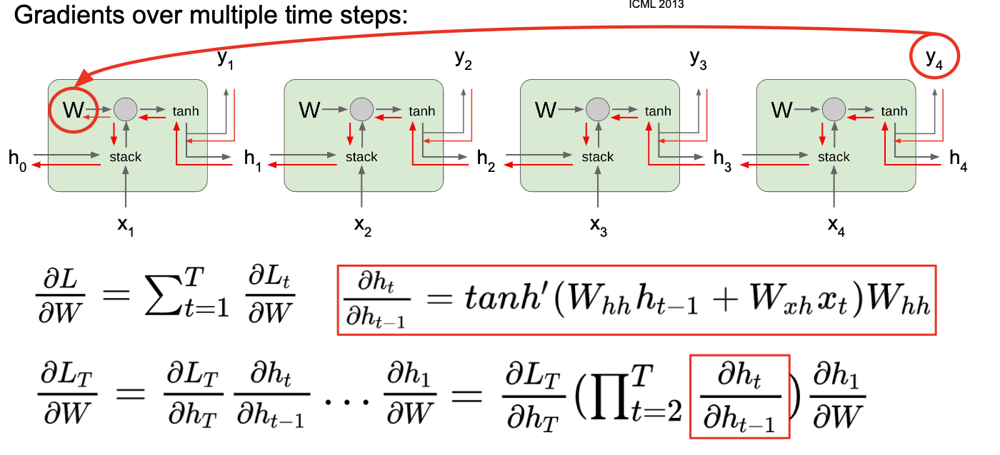

# Lecture 8: Recurrent Neural Networks
## (Vanilla) Recurrent Neural Network

The state consists of a single *“hidden”* vector **h**:

$h_t = f_W(h_{t-1},x_t)$

$h_t = tanh(W_{hh}h_{t-1}+W_{xh}x_t)$

$y_t = W_{hy}h_t$​

* $f_W$​ is the same **ALL THE TIME**

  So Backward time, we need to **sum** over because $f_W$ is repeatedly used many times.


### Many to Many


### Many to One


### One to Many


### Sequence to Sequence: Many-to-one + one-to-many

* Number of output tokens might be different from the number of input tokens.


### Example : Character-level Language Model

* Vocabulary: `[h,e,l,o]`

* Example training sequence: **“hello”**

* At test-time sample characters one at a time, feed back to model

  

* If only **one-hot**, **not** that **effectively**, so we insert an "embedding layer between input and hiddne layses"

  

### Backpropagation through time

* Forward through entire sequence to **compute loss**, then backward through **entire sequence** to compute gradient ： Takes a lot of memory of long sequences!
* Run forward and backward through **chunks of the sequence** instead of whole sequence 

#### **Truncated** Backpropagation through time

* Take subsets of the sequence.
* Carry hidden states forward in time forever, but only backpropagate for **some smaller number of steps**


* Only `112` lines withoud using pytorch.

```python
"""
Minimal character-level Vanilla RNN model. Written by Andrej Karpathy (@karpathy)
BSD License
"""
import numpy as np

# data I/O
data = open('input.txt', 'r').read() # should be simple plain text file
chars = list(set(data))
data_size, vocab_size = len(data), len(chars)
print 'data has %d characters, %d unique.' % (data_size, vocab_size)
char_to_ix = { ch:i for i,ch in enumerate(chars) }
ix_to_char = { i:ch for i,ch in enumerate(chars) }

# hyperparameters
hidden_size = 100 # size of hidden layer of neurons
seq_length = 25 # number of steps to unroll the RNN for
learning_rate = 1e-1

# model parameters
Wxh = np.random.randn(hidden_size, vocab_size)*0.01 # input to hidden
Whh = np.random.randn(hidden_size, hidden_size)*0.01 # hidden to hidden
Why = np.random.randn(vocab_size, hidden_size)*0.01 # hidden to output
bh = np.zeros((hidden_size, 1)) # hidden bias
by = np.zeros((vocab_size, 1)) # output bias

def lossFun(inputs, targets, hprev):
  """
  inputs,targets are both list of integers.
  hprev is Hx1 array of initial hidden state
  returns the loss, gradients on model parameters, and last hidden state
  """
  xs, hs, ys, ps = {}, {}, {}, {}
  hs[-1] = np.copy(hprev)
  loss = 0
  # forward pass
  for t in xrange(len(inputs)):
    xs[t] = np.zeros((vocab_size,1)) # encode in 1-of-k representation
    xs[t][inputs[t]] = 1
    hs[t] = np.tanh(np.dot(Wxh, xs[t]) + np.dot(Whh, hs[t-1]) + bh) # hidden state
    ys[t] = np.dot(Why, hs[t]) + by # unnormalized log probabilities for next chars
    ps[t] = np.exp(ys[t]) / np.sum(np.exp(ys[t])) # probabilities for next chars
    loss += -np.log(ps[t][targets[t],0]) # softmax (cross-entropy loss)
  # backward pass: compute gradients going backwards
  dWxh, dWhh, dWhy = np.zeros_like(Wxh), np.zeros_like(Whh), np.zeros_like(Why)
  dbh, dby = np.zeros_like(bh), np.zeros_like(by)
  dhnext = np.zeros_like(hs[0])
  for t in reversed(xrange(len(inputs))):
    dy = np.copy(ps[t])
    dy[targets[t]] -= 1 # backprop into y. see http://cs231n.github.io/neural-networks-case-study/#grad if confused here
    dWhy += np.dot(dy, hs[t].T)
    dby += dy
    dh = np.dot(Why.T, dy) + dhnext # backprop into h
    dhraw = (1 - hs[t] * hs[t]) * dh # backprop through tanh nonlinearity
    dbh += dhraw
    dWxh += np.dot(dhraw, xs[t].T)
    dWhh += np.dot(dhraw, hs[t-1].T)
    dhnext = np.dot(Whh.T, dhraw)
  for dparam in [dWxh, dWhh, dWhy, dbh, dby]:
    np.clip(dparam, -5, 5, out=dparam) # clip to mitigate exploding gradients
  return loss, dWxh, dWhh, dWhy, dbh, dby, hs[len(inputs)-1]

def sample(h, seed_ix, n):
  """ 
  sample a sequence of integers from the model 
  h is memory state, seed_ix is seed letter for first time step
  """
  x = np.zeros((vocab_size, 1))
  x[seed_ix] = 1
  ixes = []
  for t in xrange(n):
    h = np.tanh(np.dot(Wxh, x) + np.dot(Whh, h) + bh)
    y = np.dot(Why, h) + by
    p = np.exp(y) / np.sum(np.exp(y))
    ix = np.random.choice(range(vocab_size), p=p.ravel())
    x = np.zeros((vocab_size, 1))
    x[ix] = 1
    ixes.append(ix)
  return ixes

n, p = 0, 0
mWxh, mWhh, mWhy = np.zeros_like(Wxh), np.zeros_like(Whh), np.zeros_like(Why)
mbh, mby = np.zeros_like(bh), np.zeros_like(by) # memory variables for Adagrad
smooth_loss = -np.log(1.0/vocab_size)*seq_length # loss at iteration 0
while True:
  # prepare inputs (we're sweeping from left to right in steps seq_length long)
  if p+seq_length+1 >= len(data) or n == 0: 
    hprev = np.zeros((hidden_size,1)) # reset RNN memory
    p = 0 # go from start of data
  inputs = [char_to_ix[ch] for ch in data[p:p+seq_length]]
  targets = [char_to_ix[ch] for ch in data[p+1:p+seq_length+1]]

  # sample from the model now and then
  if n % 100 == 0:
    sample_ix = sample(hprev, inputs[0], 200)
    txt = ''.join(ix_to_char[ix] for ix in sample_ix)
    print '----\n %s \n----' % (txt, )

  # forward seq_length characters through the net and fetch gradient
  loss, dWxh, dWhh, dWhy, dbh, dby, hprev = lossFun(inputs, targets, hprev)
  smooth_loss = smooth_loss * 0.999 + loss * 0.001
  if n % 100 == 0: print 'iter %d, loss: %f' % (n, smooth_loss) # print progress
  
  # perform parameter update with Adagrad
  for param, dparam, mem in zip([Wxh, Whh, Why, bh, by], 
                                [dWxh, dWhh, dWhy, dbh, dby], 
                                [mWxh, mWhh, mWhy, mbh, mby]):
    mem += dparam * dparam
    param += -learning_rate * dparam / np.sqrt(mem + 1e-8) # adagrad update

  p += seq_length # move data pointer
  n += 1 # iteration counter 
```

### RNN Tradeoffs

**RNN Advantages:**

- \-  Can process any length input
- \-  Computation for step *t* can (in theory) use information from many steps back
- \-  Model size doesn’t increase for longer input
- \-  Same weights applied on every timestep, so there is symmetry in how inputs are processed. 

**RNN Disadvantages:**

- \-  Recurrent computation is slow
- \-  In practice, difficult to access information from many steps back

### Image Captioning


## Long Short Term Memory (LSTM)


### Vanilla RNN Fradient Flow




* Multiply $W_{hh}$​ many times ! -- Really Bad !

  * Largest singular value > 1:**Exploding gradients**
  * Largest singular value < 1:**Vanishing gradients**

  **Gradient Clipping **: scale it if the norm is too big -- exploding gradients

  ```python
  grad_norm = np.sum(grad*grad)
  if grad_norm > threshold:
    grad*=(threshold/gram_norm)
  ```

* Largest singular value < 1:**Vanishing gradients**

>  Change RNN architecture !

### Long Short Term Memory (LSTM)


#### Gradient Flow

* Backpropagation from $c_t$ to $c_{t-1}$ only elementwise multiplication by $f$, no matrix multiply by $W$

**Do LSTMs solve the vanishing gradient problem?**

The LSTM architecture makes it easier for the RNN to preserve information over many timesteps

- \-  e.g. **if the f = 1 and the i = 0**, then the information of that cell is preserved indefinitely.

- \-  By contrast, it’s harder for vanilla RNN to learn a recurrent weight matrix $W_h$ that preserves info in hidden state

  LSTM **doesn’t guarantee** that there is no vanishing/exploding gradient, but it does provide an easier way for the model to learn long-distance dependencies
