# Video Understanding

## Late Fusion Approach
* Fusing the features from different modalities at the end of the network.
> FC layers may result in overfitting

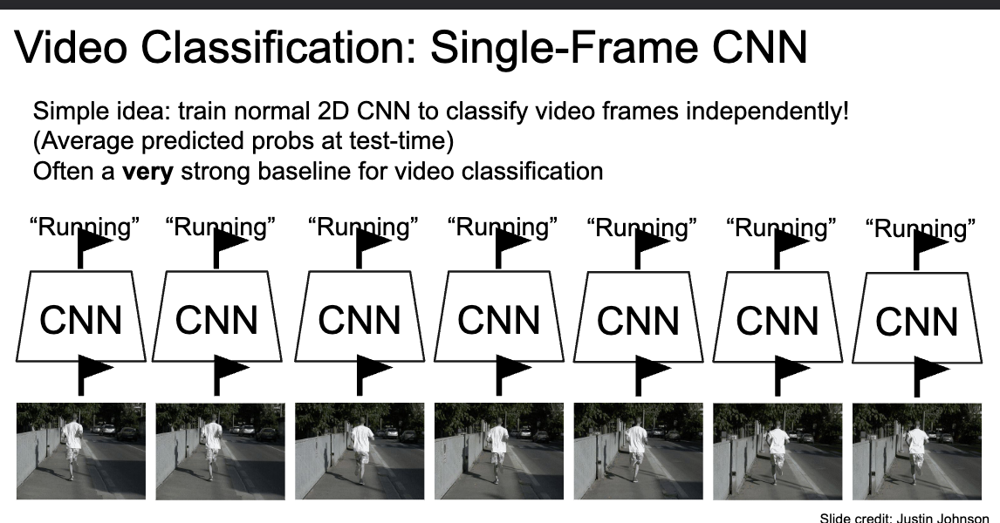
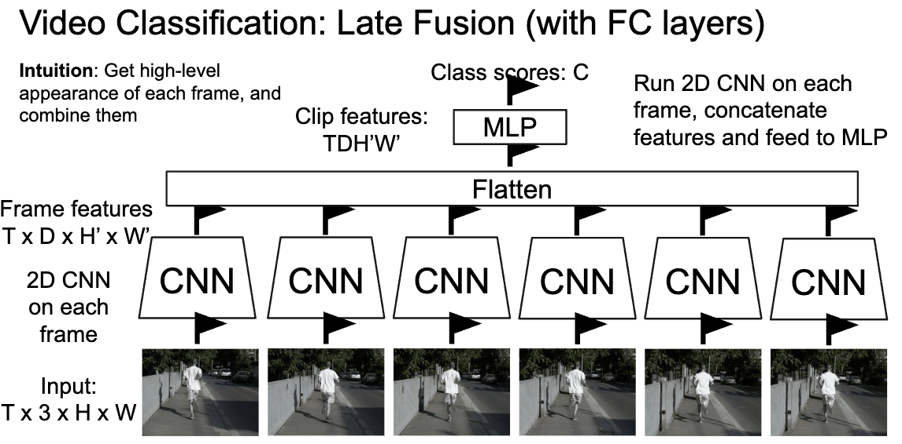
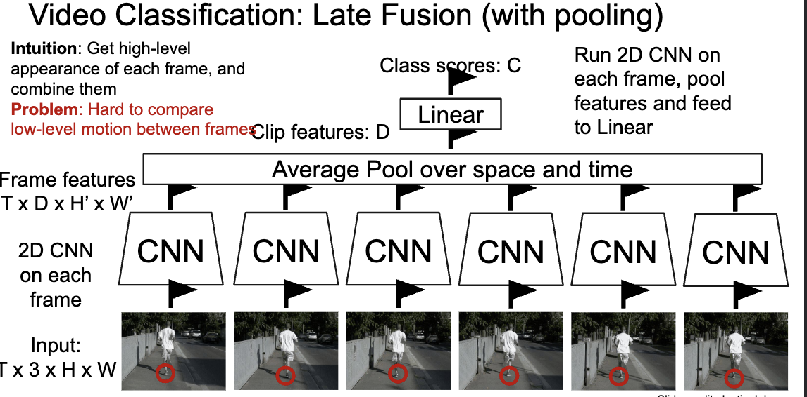

## Early Fusion Approach
* Stakcing through channel dimension.
* Fuse the features Using 2D convolutions.($3T\times D$ )

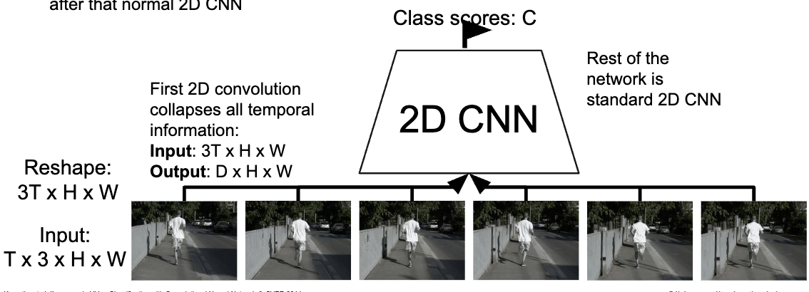
* One layer of temporal processing may not be enough!
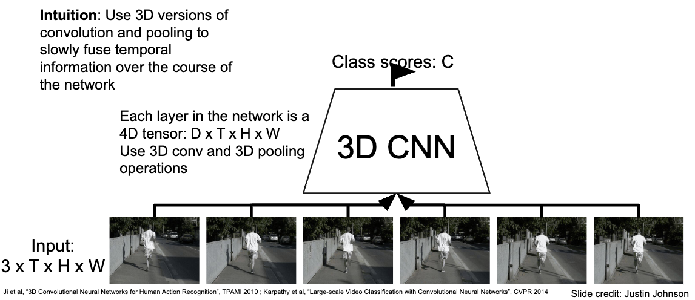

## **Comparison**
### General Comparison
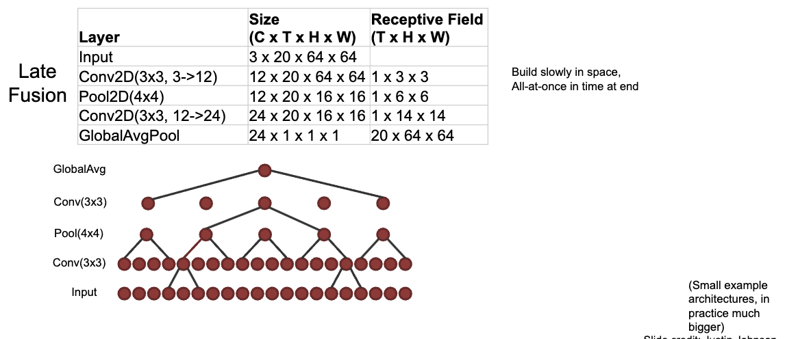
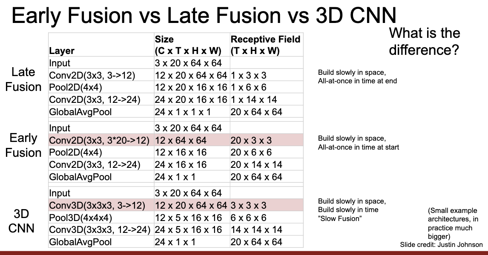

### 2D Conv (Early Fusion) vs 3D Conv (3D CNN)
> Details see Slides.
* 2D : perceptive of features of time at once and slide over the space feature. No temporal shift-invariance! Needs to learn separate filters for the same motion at different times in the clip.

* 3D : Temporal shift-invariant since each filter slides **over time !**

### C3D : The VGG of 3D CNNs
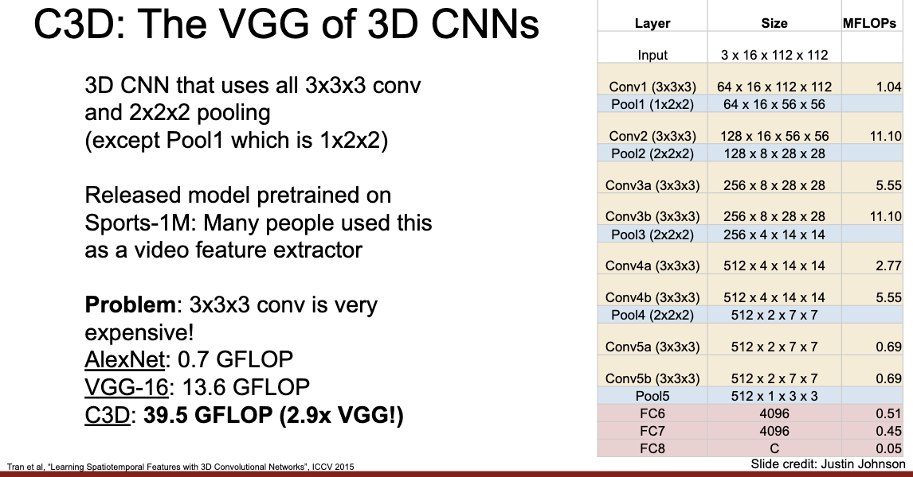

### Measuring Motion : Optical Flow
#### Two Stream Networks
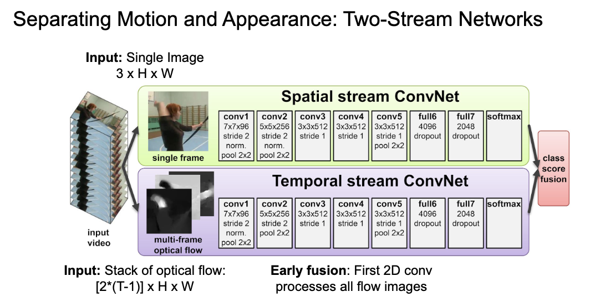
#### Modeling long-term temporal structure
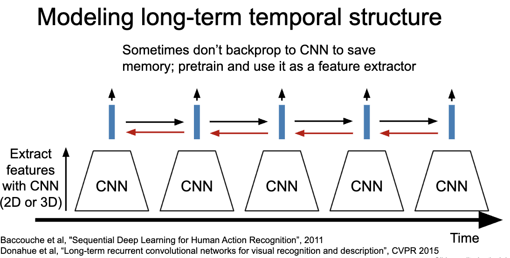
* Sometimes don’t backprop to CNN to save memory; pretrain and use it as a feature extractor : Like using pretrained C3D as a feature extractor.
#### Recurrent Convolutional Network
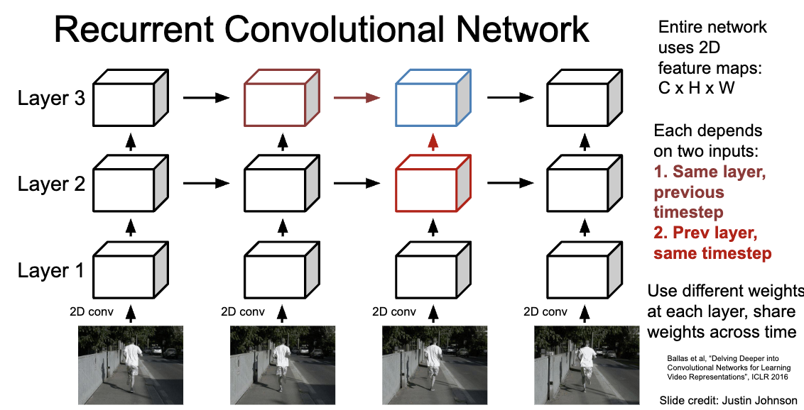
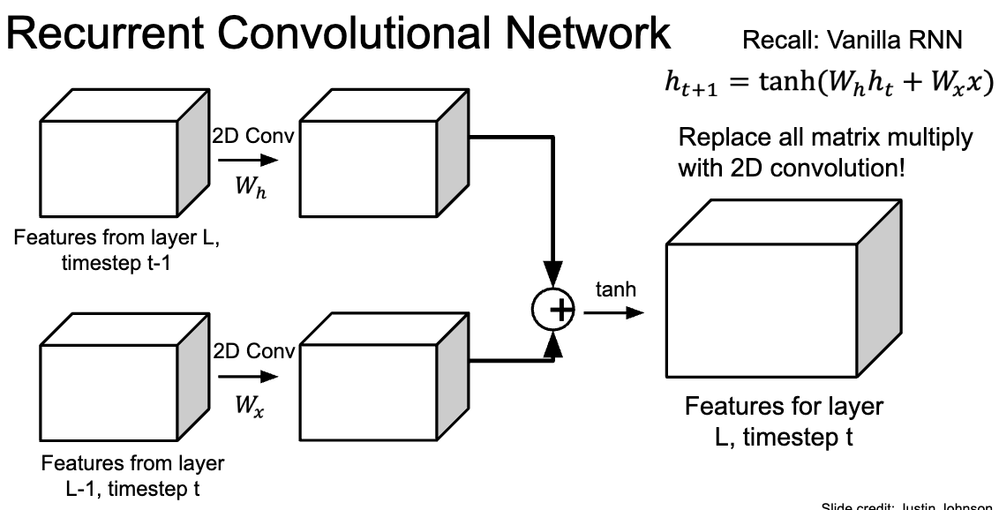
> Actually not too much used because of the time complexity.(Not good for parallelization) 
>**Sequential processing is not good for parallelization.**

#### Spatio-Temporal Self-Attention (Non Local Block)

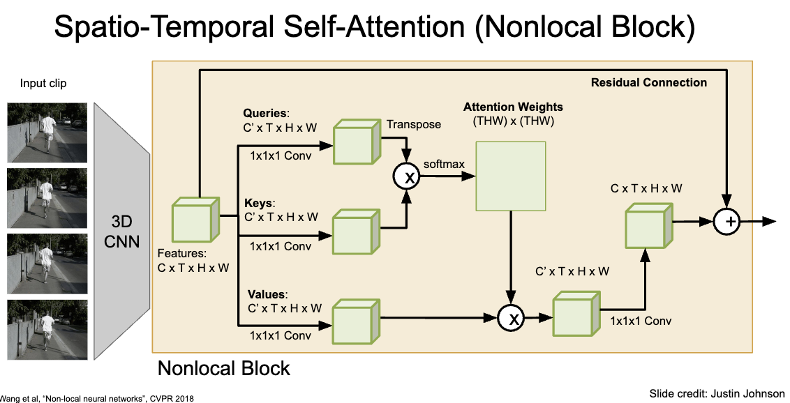

> Trick:Add non-local blocks to 3D CNNs , initilize the weights of the non-local block with all zeros, and fine-tune the network. 
> 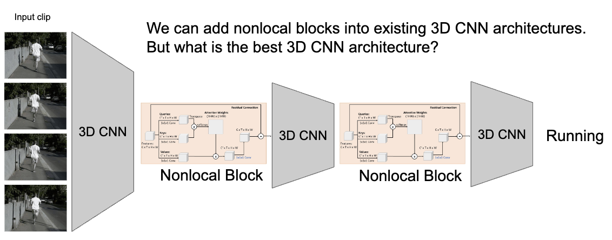

#### Inflating 2D Networks to 3D (I3D)
> Refer to the slides for details.
> Trick: Pretrain 2D CNNs and inflate them to 3D CNNs by repeating the weights along the temporal dimension.

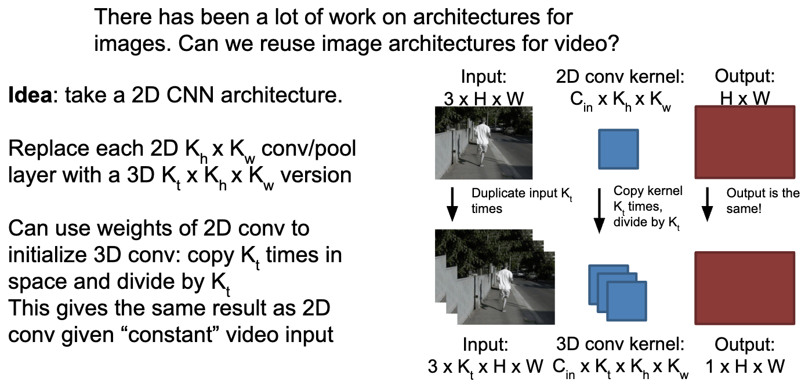

