# Visualizing and Understanding

## **Visualizing what models have learned:**

### Visualizing filters

### Visualizing final layer features

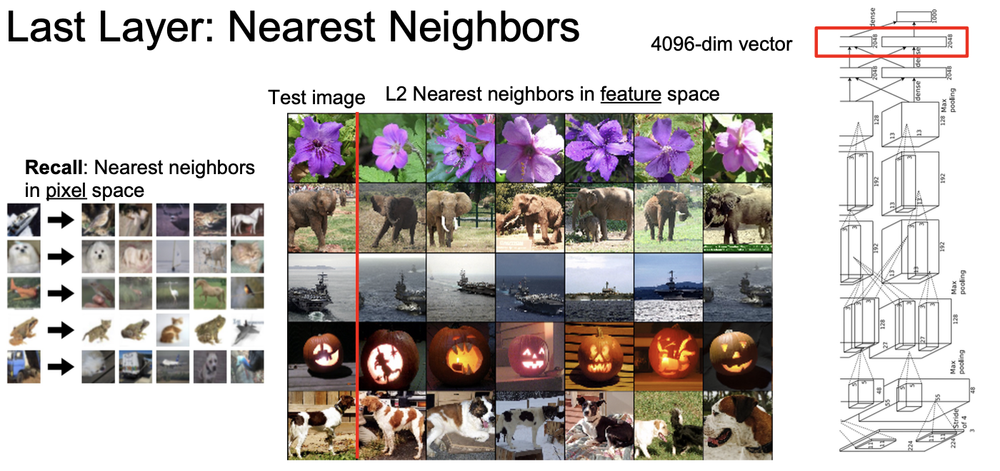

* Somehow , the 4096-vectors computed by the net can really learn the features !

#### Dimensionality Reduction

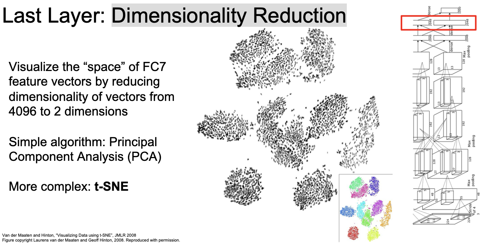

* `PCA`

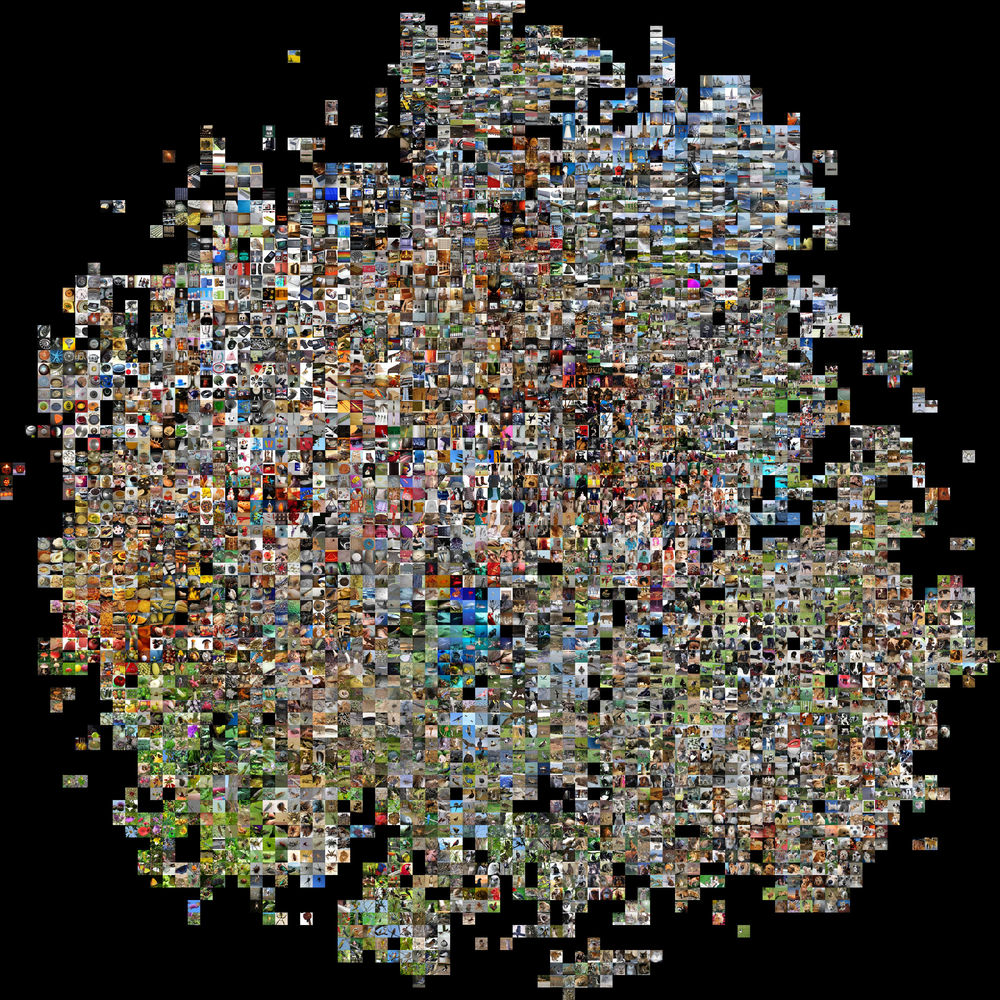

* `t-SNE`

### Visualizing activations

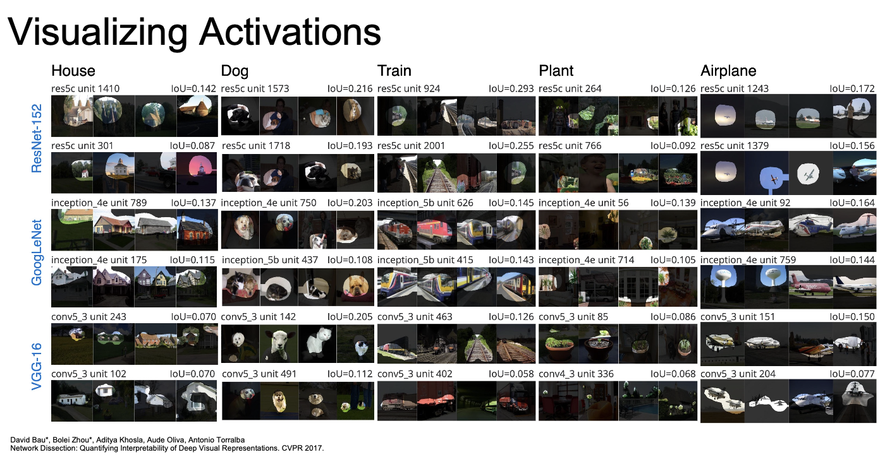

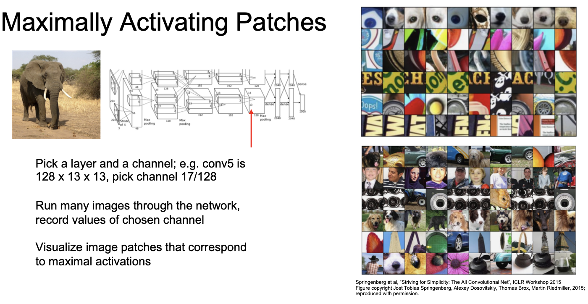

## Understanding input pixels

### Identifying important pixels

#### Saliency via Occlusion

* Mask part of the image before feeding to CNN, check how much predicted probabilities change
* Computational Expensive

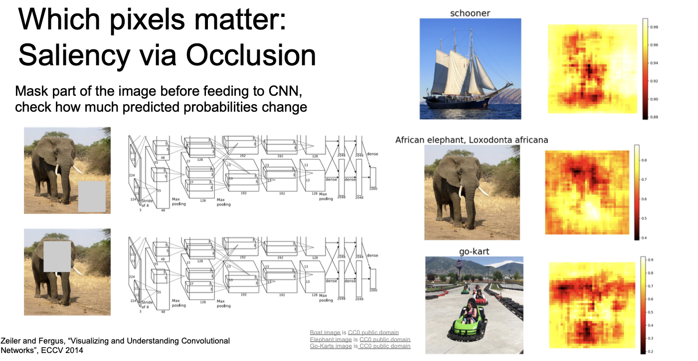

#### Saliency via Backprop

* How much changing the val of a point can affect the result (**Gradient!**)

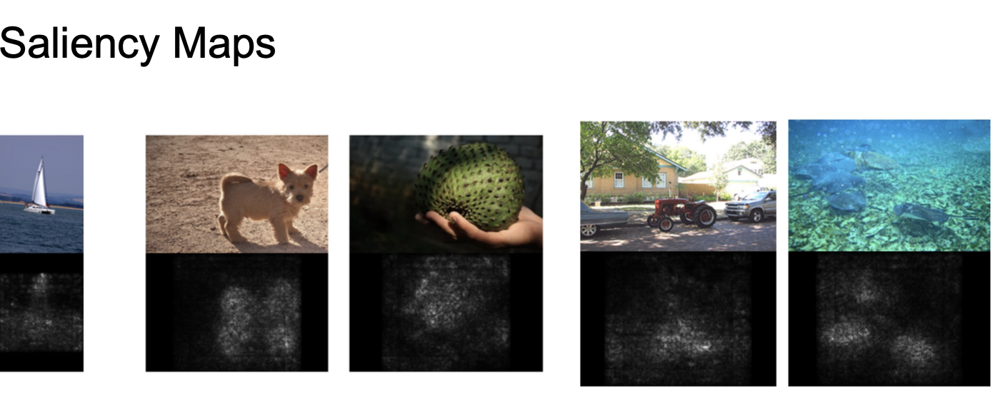

* Such methods also find biases!

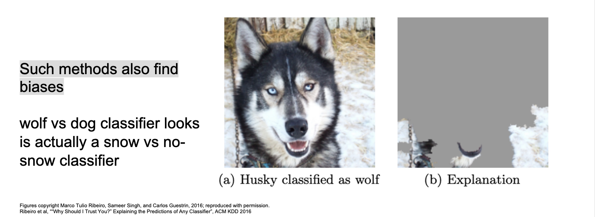

#### Intermediate features via (guided) backprop

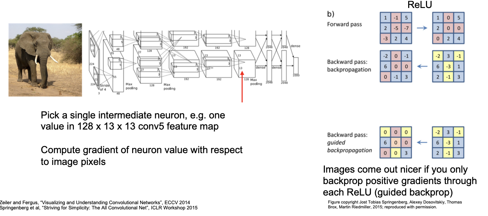

* For intermediate result, normal methods tend to produce bad pics.
* Images **come out nicer** if you only backprop positive gradients through each ReLU (guided backprop)

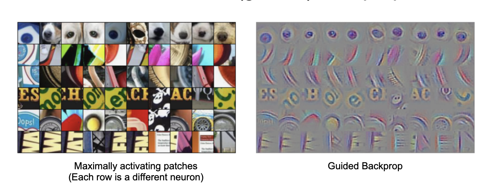

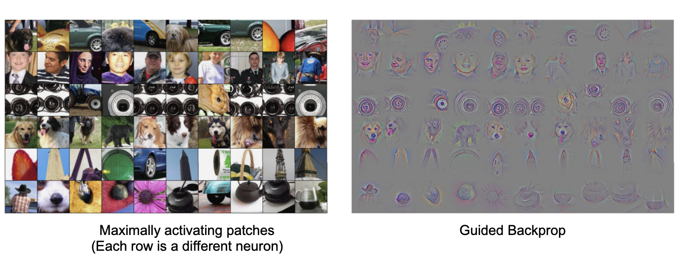

### Gradient ascent to visualize features

* Generate a synthetic image that maximally activates a neuron.

> Like Train A Best Image

$I^* = argmax_I f(I)+R(I)$

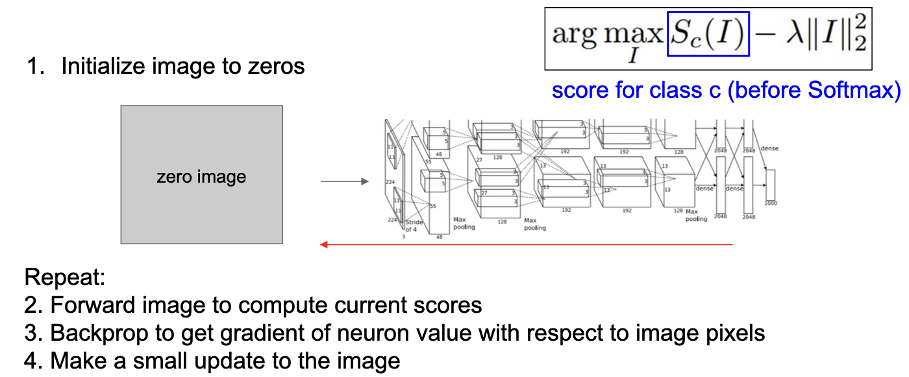

$argmax_IS_c(I)-\lambda||I||_2^2$

> Simple regularizer: Penalize L2 norm of generated image

**Better regularizer**: Penalize L2 norm of image , also during optimization periodically

(1) Gaussian blur image

(2) Clip pixels with small values to 0 

(3) Clip pixels with small gradients to 0

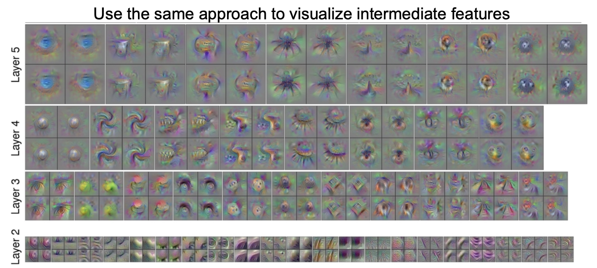

## Adversarial perturbations

## Style transfer

### Features inversion

Given a CNN feature vector for an image, find a new image that:

-  Matches the given feature vector
-   “looks natural” (image prior regularization)

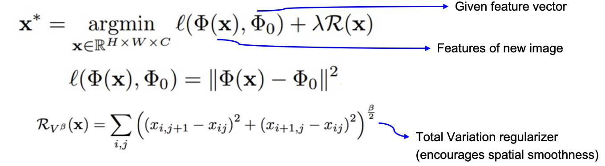

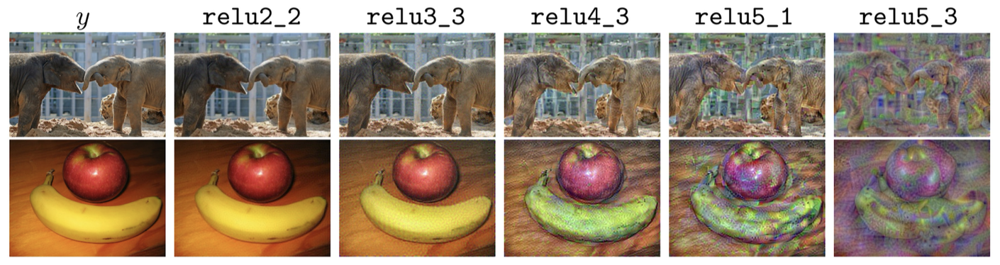

### Deep dream

https://github.com/google/deepdream

### Texture synthesis

> See Slides

### Neural style transfe

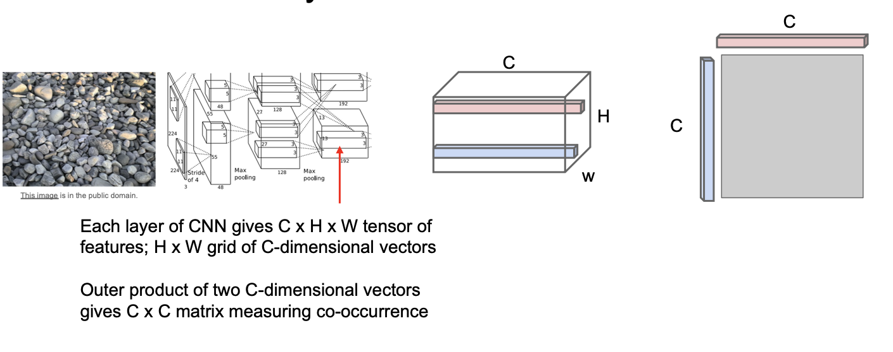

* Average over all pairs of vectors, giving **Gram matrix** of shape `C x C`

* Efficient to compute; reshape features from CxHxW to =CxHW then compute G = FFT

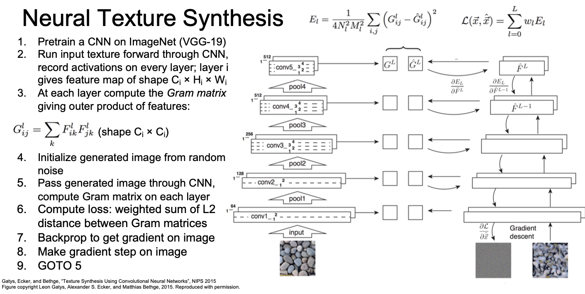

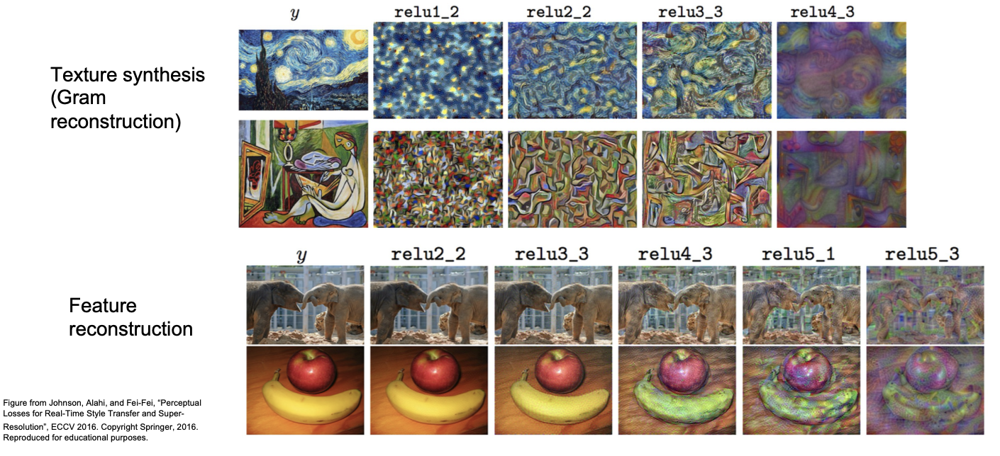

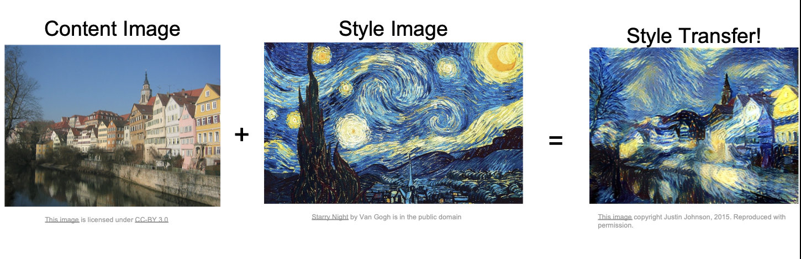

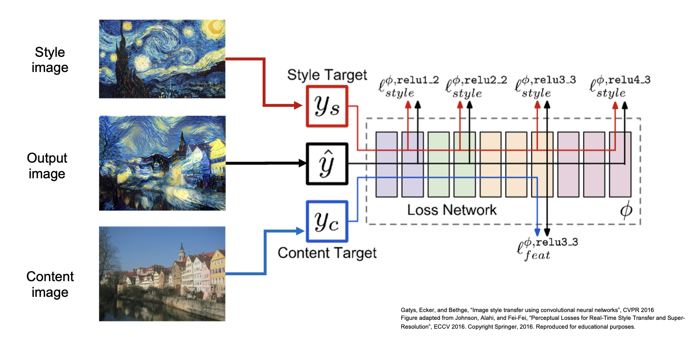

> Details see Slides.

* **Problem:** Style transfer requires many forward / backward passes through VGG; very slow!

* **Solution**: Train another neural network to perform style transfer for us!

https://github.com/jcjohnson/fast-neural-style

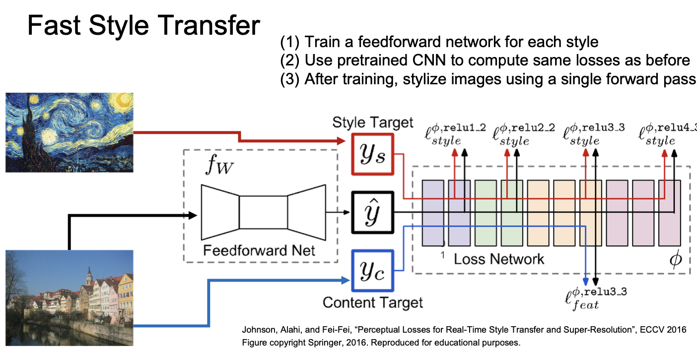

* Instance Normalization was developed for style transfer!

* Network only for **a single style.**

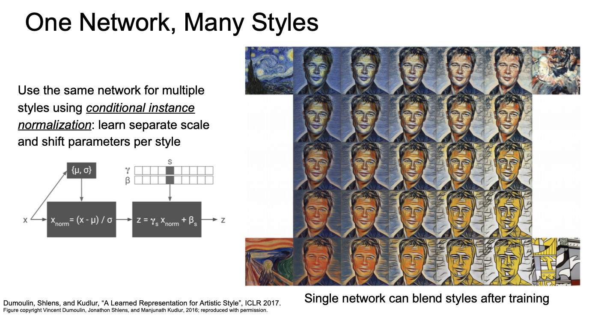

