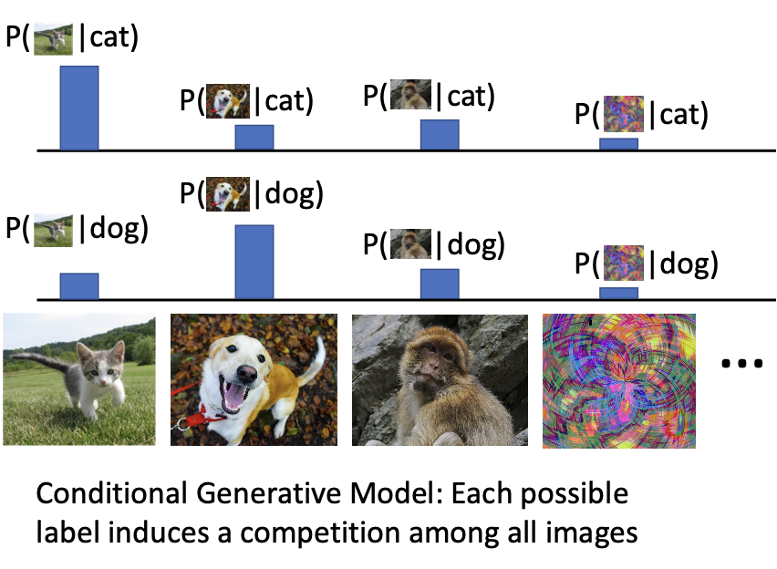
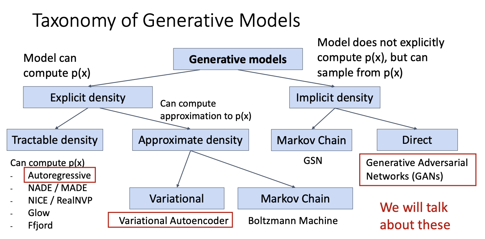
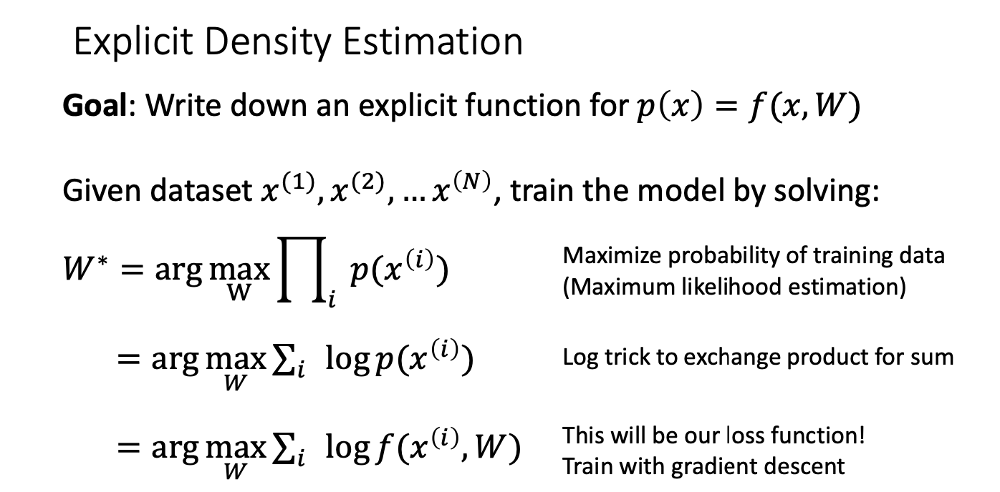
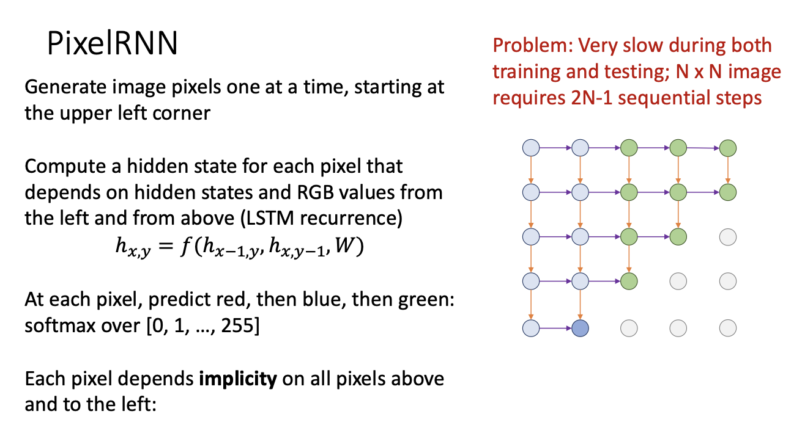
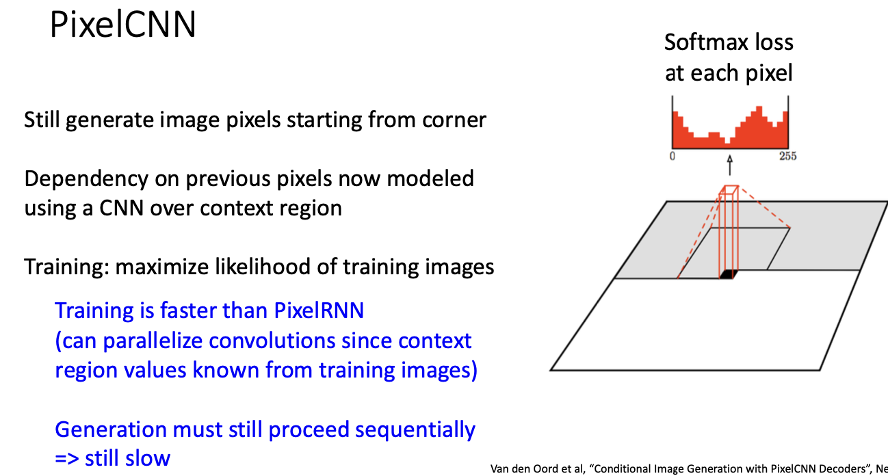
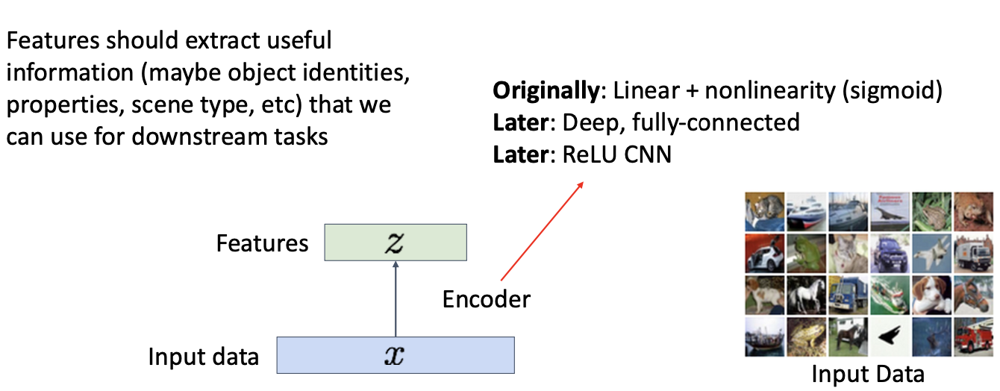
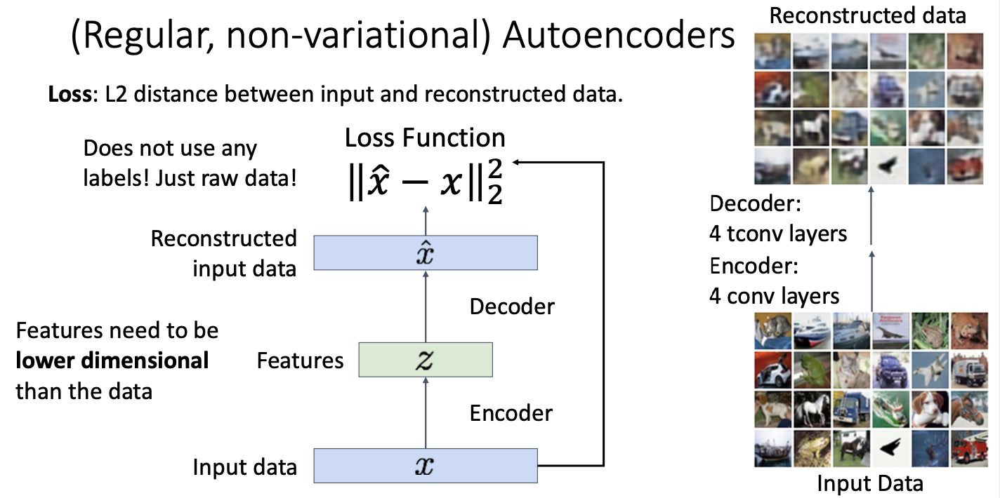
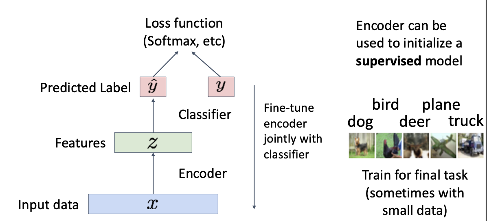
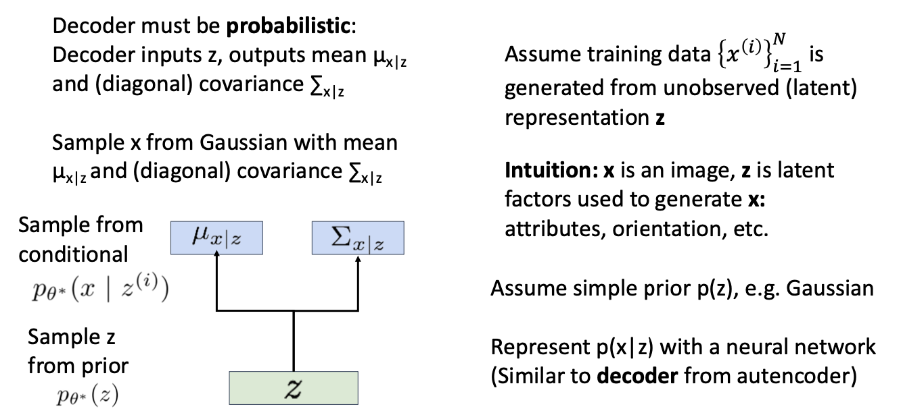
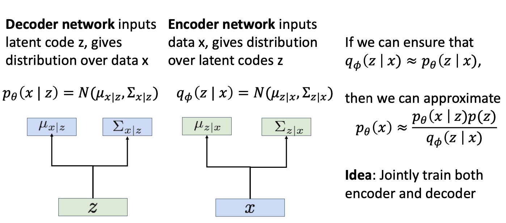

# Generative Models

**Supervised vs Unsupervised Learning**

Refer to Slides.

#### **Discriminative vs Generative Models**

> Details see slides.

**Discriminative Model:** Learn a probability distribution $p(y|x)$

* Only competitions among different labels.
* No competitions between images.

> Assign labels to data
>
> Feature learning (with labels)

**Shortcomes**

* No way for the model to handle unreasonable inputs : it must give label distributions for all images

**Generative Model**: Learn a probability distribution $p(x)$​

*  All possible images compete with each other for probability mass.
* Evaluation should consider samples which may not appear in training process.

> Detect outliers
>
> Feature learning (without labels) 
>
> Sample to **generate** new data

**Conditional Generative Model:** Learn $p(x|y)$

* Each possible label induces a competition among all images

> Assign labels, while rejecting outliers! 
>
> Generate new data conditioned on input labels

* Bayes's Rule

$p(x|y)=\frac{p(y|x)}{p(y)}p(x)$

We can build a conditional generative model from other components!

* Build conditional Generative Model from **Discriminative Model** & **Generative Model**

### Autoregressive models

* Refer to `《统计学习方法》`,就是优化极大似然函数.

$\begin{align*}p(x) &= p(x_1,x_2,x_3,...x_T)\\ &=p(x_1)p(x_2|x_1)p(x_3|x_1,x_2)....\\&=\Pi_{t=1}^Tp(x_t|x_1,...x_{t-1})\end{align*}$

* We’ve already seen this! Language modeling with an RNN!

#### Pixel RNN

https://arxiv.org/pdf/1601.06759.pdf

* How to get $2N-1$ ? ---- `Diagnal Order`.

#### Pixel CNN

* Training: maximize likelihood of training images $p(x) = \Pi_{i=1}^np(x_i|x_1,...x_{i-1})$

**Pros:**

* Can explicitly compute likelihood $p(x)$

* Explicit likelihood of training data gives good evaluation metric

* Good samples 

**Con:**

* Sequential generation $\to$​ slow

**Improving PixelCNN performance**

* Gated convolutional layers
* Short-cut connections
* Discretized logistic loss
* Multi-scale
* Training tricks - Etc...

### Variational Autoencoders

Variational Autoencoders (VAE) define an **intractable density** that we cannot explicitly compute or optimize.

But we will be able to directly optimize a **lower bound** on the density !

#### (Regular, non-variational) Autoencoders

> Unsupervised method for learning feature vectors from raw data x, without any labels

> **Problem**: How can we learn this feature transform from raw data?

> **Idea**: Use the features to reconstruct the input data with a **decoder** “Autoencoding” = encoding itself

* Somehow **Compress** the input data.

* After training, throw away decoder.

* Encoder can be used to **initialize** a **supervised** model.

Autoencoders learn **latent features** for data without any labels! Can use features to initialize a **supervised** model

* Not probabilistic: No way to sample new data from learned model

#### Variational Autoencoders

* Learn latent features z from raw data.
* Sample from the model to generate new data.

* Assume simple prior $p(z)$ eg. Unit , Gaussian.
* If we could observe the `z for each x`, then could train a **conditional generative model** `p(x|z)`

Basic idea: **maximize likelihood of data**

* We don’t observe **z**, so need to marginalize: $p_{\theta}(x) = \int p_{\theta}(x,z)dz = \int p_{\theta}(x|z)p_{\theta}(z)dz$​

**Problem: Impossible to integrate over all z!**

* Another idea: Try Bayes’ Rule: $\frac{p_{\theta}(x|z)p_{\theta}(z)}{p_{\theta}(z|x)}$

**Problem**: No way to compute this! $p_{\theta}(z|x)$

**Solution:** Train another network **(encoder)** that learns $q_{\Phi}(z|x)\approx p_{\theta}(z|x)$

> Use **encoder** to compute $q_{\Phi}(z|x)\approx p_{\theta}(z|x)$

