# Attention and Transformers

> Log on probability : Preserve precision : 
>
> * 特别小的数字 negative 保留精度
> * 求导easy
> * prevent 梯度消失

## Sequence to Sequence with RNNs

* During training, we feed the gold (aka reference) target sentence into the decoder, regardless of what the decoder predicts. This training method is called Teacher Forcing.
* Use Teacher forcing & feed decoder predictions together. 3:7 ?

#### How to Pass Hidden State?

Problem: Input sequence **bottlenecked through fixed-sized vector**. What if T=1000?

## Attention

### Sequence to Sequence with RNNs and Attention

* Repeat: 

  Use $s_1$ to compute new context vector $c_2$

  Use $c_2$ to compute $s_2$, $y_2$

#### Example

* The decoder doesn’t use the fact that $h_i$ form an ordered sequence – it just treats them as an **unordered set** $\{h_i\}$.

### Image Captioning using spatial features

#### Original Version

**Input**: Image **I**

**Output:** Sequence **y** = $y_1, y_2,..., y_T$

**Encoder**: $h_0$ = $f_W(z)$  where **z** is spatial CNN features $f_W(.)$ is an MLP

**Decoder**: $y_t = g_V(y_{t-1},h_{t-1}, c)$  where context vector c is often $c = h_0$

#### Image Captioning with RNNs and Attention

**Attention idea: New context vector at every time step.Each context vector will attend to different image regions**

This entire process is differentiable:

* model chooses its own attention weights. No attention supervision is required.

Each timestep of decoder uses a different context vector that looks at different parts of the input image.

#### Attention Layer

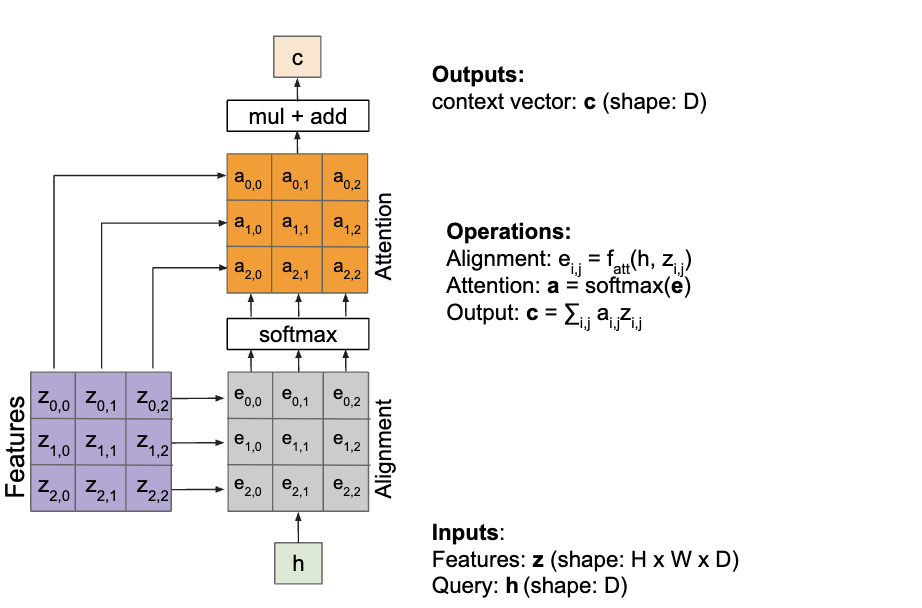
Attention operation is permutation invariant.
- Doesn't care about ordering of the features
- Stretch H x W = N into N vectors

Change $f_{att}$ to a simple dot product
- only works well with key & value transformation trick (will mention in a few slides)

Change $f_{att}(.)$ to a scaled simple dot product
- Larger dimensions means more terms in the dot product sum.
- So, the variance of the logits is higher. Large magnitude vectors will produce much higher logits.
- So, the post-softmax distribution has lower-entropy, assuming logits are IID.
- Ultimately, these large magnitude vectors will cause softmax to peak and assign very little weight to all others
- Divide by √D to reduce effect of large magnitude vectors

Notice that the input vectors are used for both the alignment as well as the attention calculations.
- We can add more expressivity to the layer by adding a different FC layer before each of the two steps.
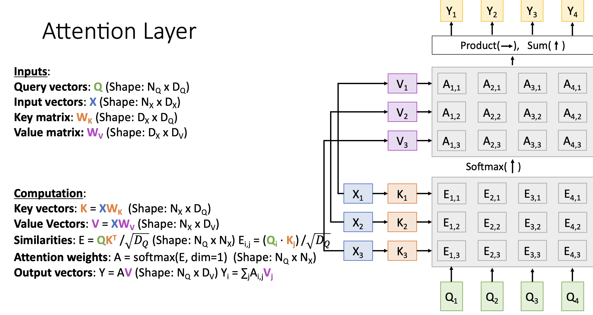
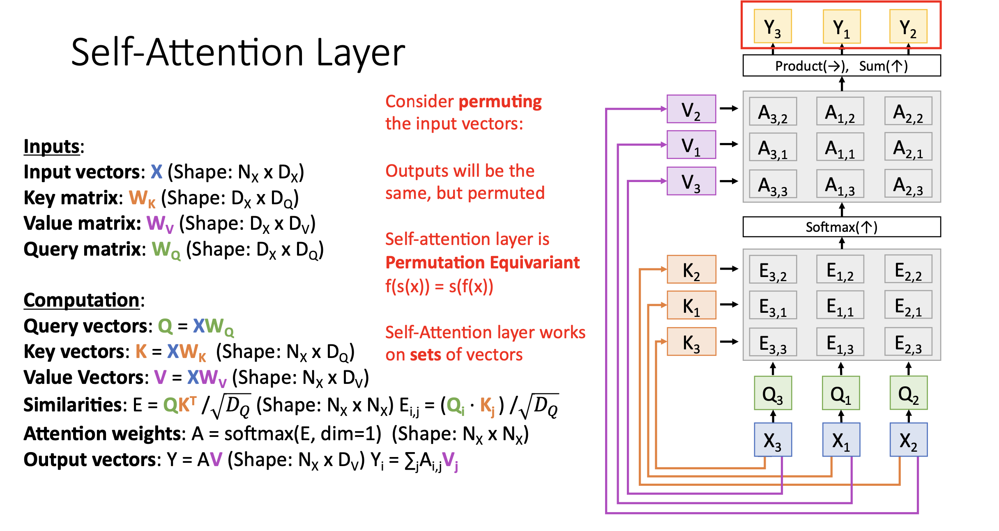
* Self Attention Layer does not **CARE** about the order of the input vectors!
* Use positional encoding to give the model some notion of order.
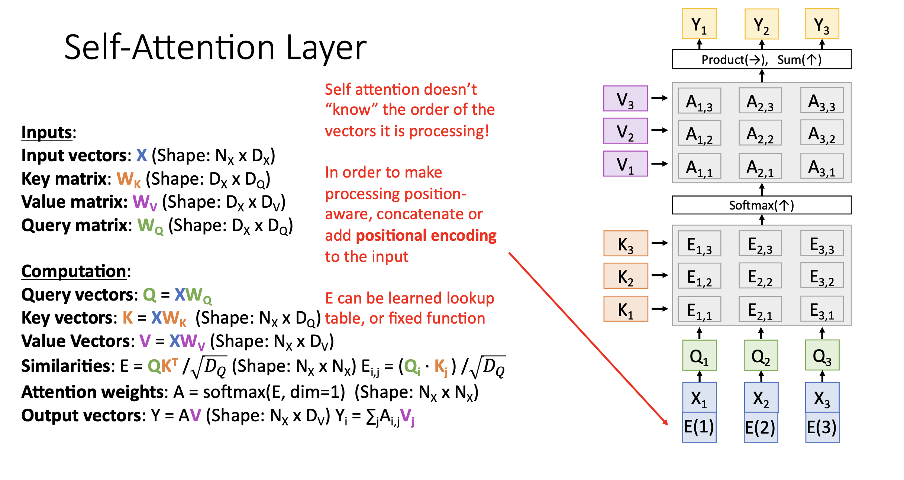 

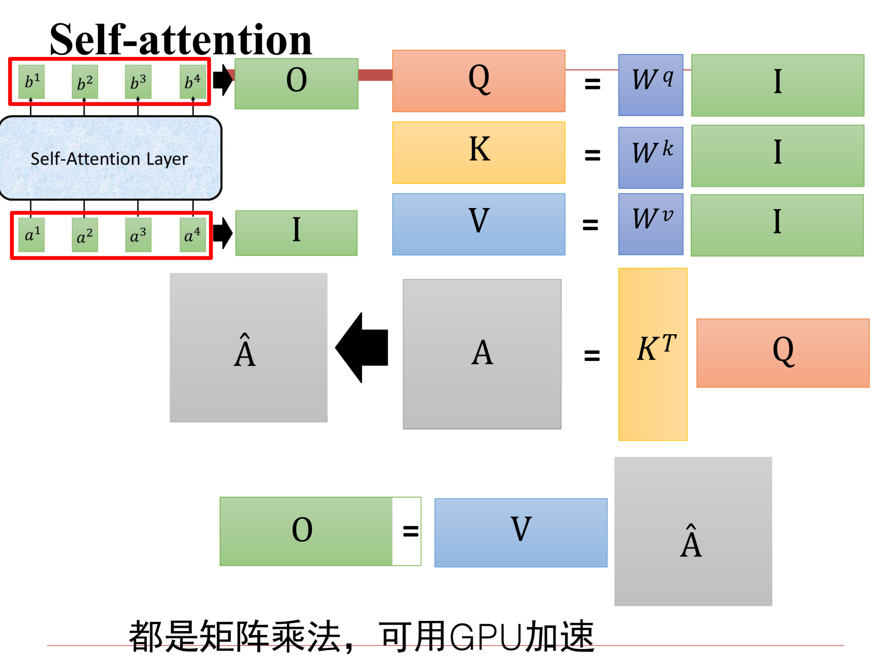

**Desiderata of pos(.) :**

1. It should output a unique encoding for each time-step (word’s position in a sentence)
2. Distance between any two time-steps should be **consistent** across sentences with different lengths.
3. Our model should generalize to longer sentences without any efforts. Its values should be bounded.
4. It must be **deterministic**.
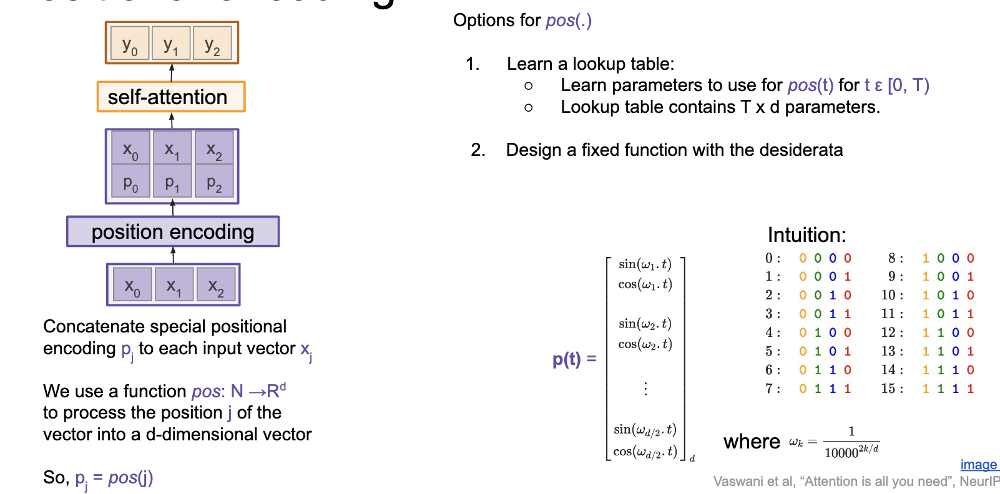

#### Masked Self Attention
- Prevent vectors from looking at future vectors.
- Manually set alignment scores to infinity
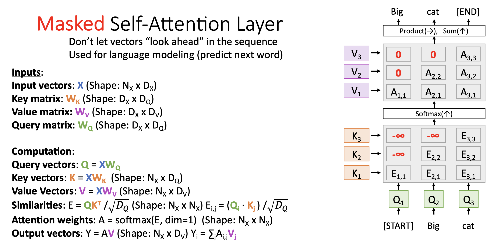
* Commonly used for language modeling tasks

#### Multi-Head Attention

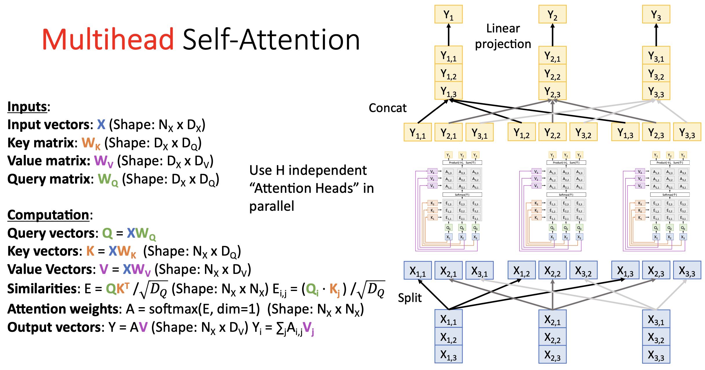
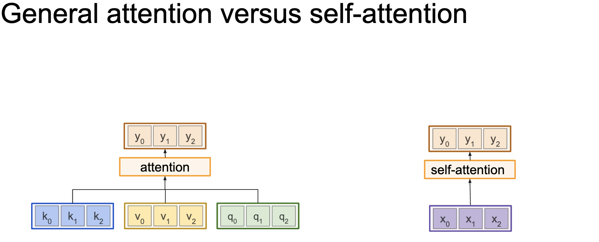
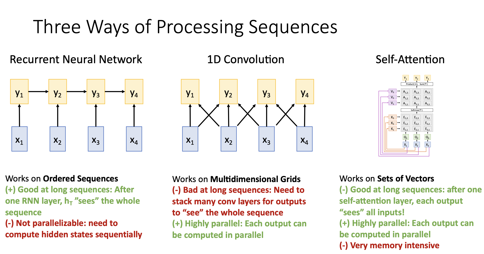

### Transformers
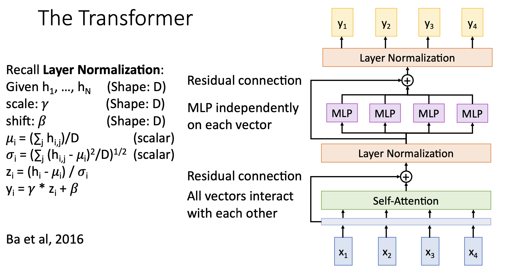
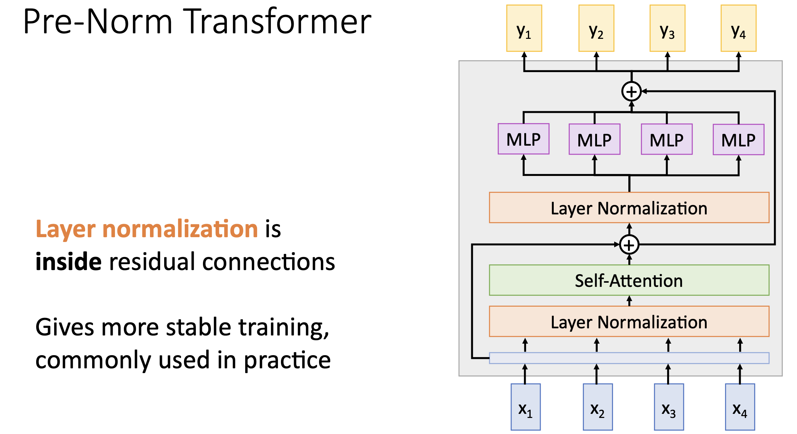

#### Image Captioning with Transformers
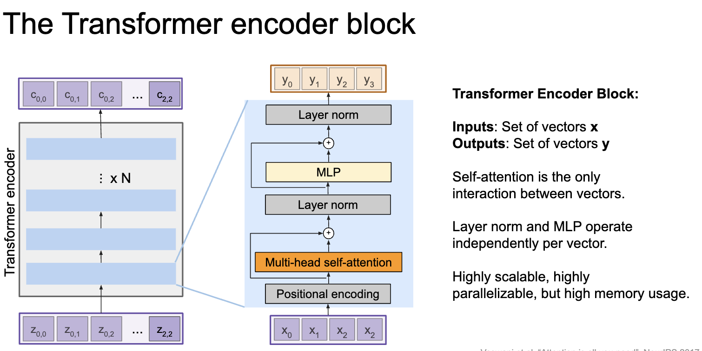
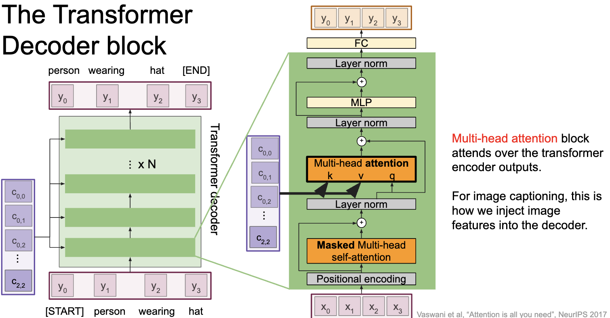

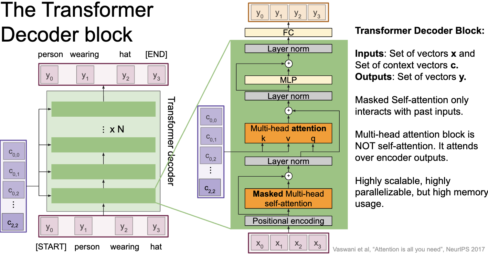
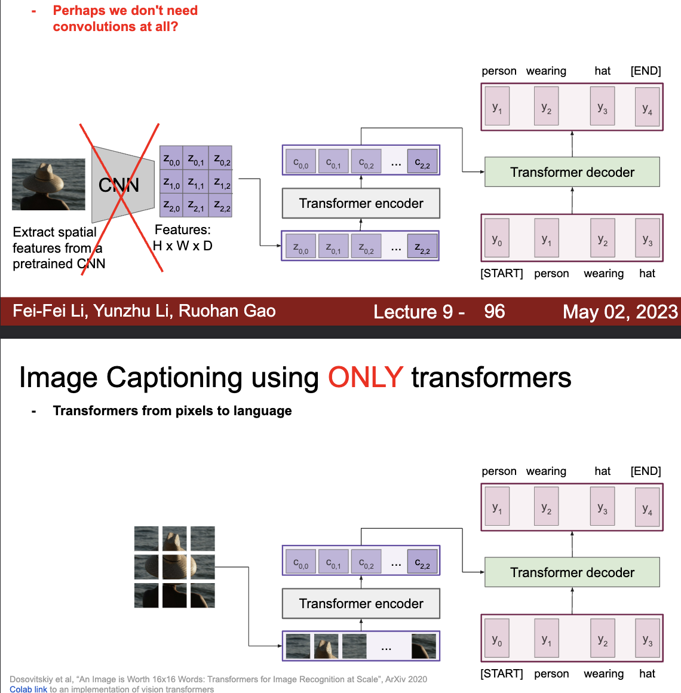

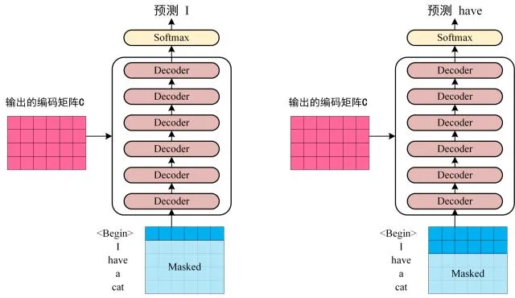

