# Attention and Transformers

> Log on probability : Preserve precision : 
>
> * 特别小的数字 negative 保留精度
> * 求导easy
> * prevent 梯度消失

## Sequence to Sequence with RNNs

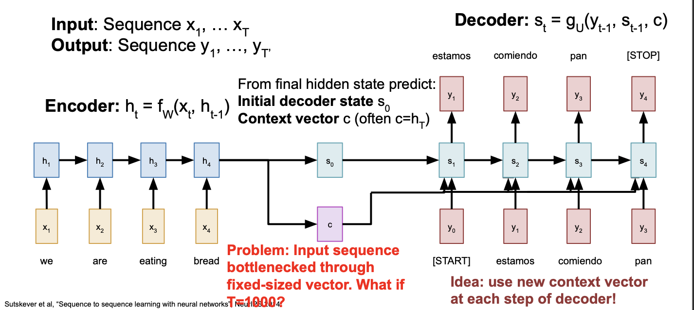

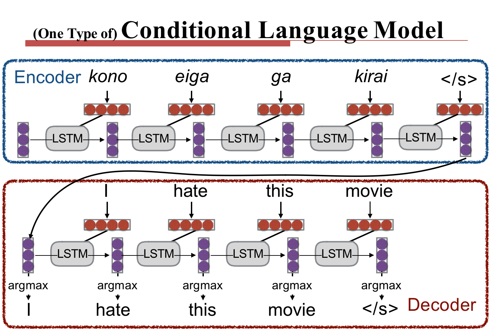

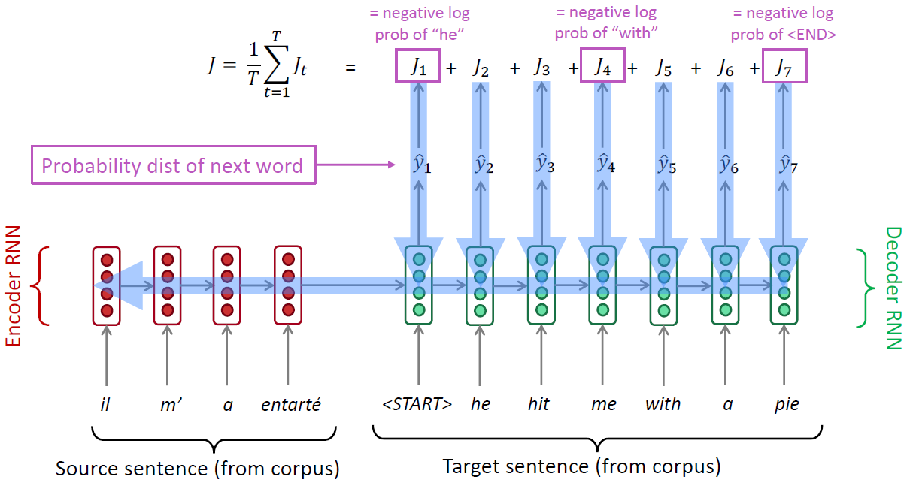

* During training, we feed the gold (aka reference) target sentence into the decoder, regardless of what the decoder predicts. This training method is called Teacher Forcing.
* Use Teacher forcing & feed decoder predictions together. 3:7 ?

#### How to Pass Hidden State?

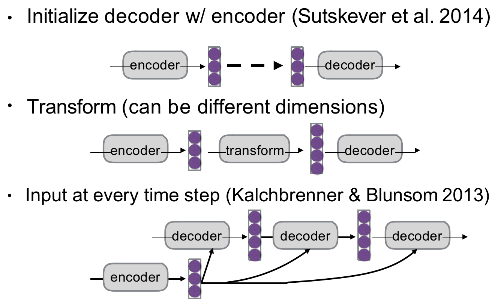

Problem: Input sequence **bottlenecked through fixed-sized vector**. What if T=1000?

## Attention

### Sequence to Sequence with RNNs and Attention

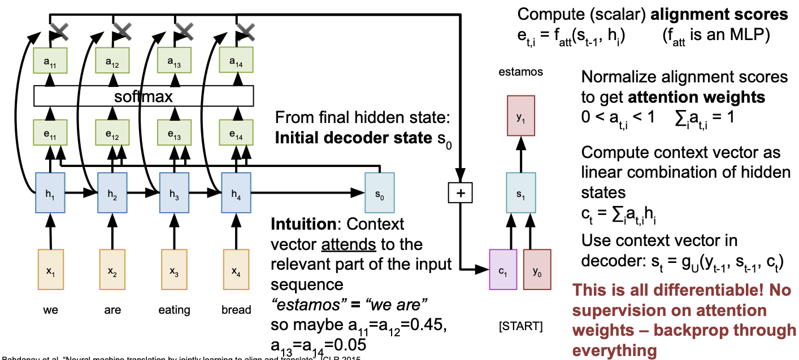

* Repeat: 

  Use $s_1$ to compute new context vector $c_2$

  Use $c_2$ to compute $s_2$, $y_2$

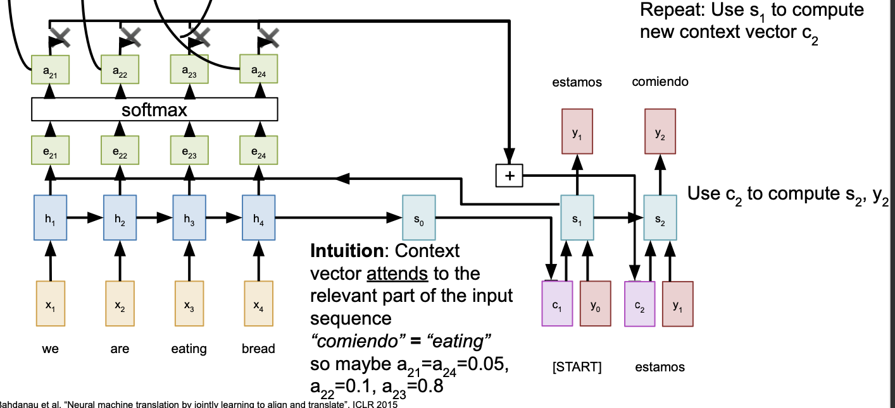

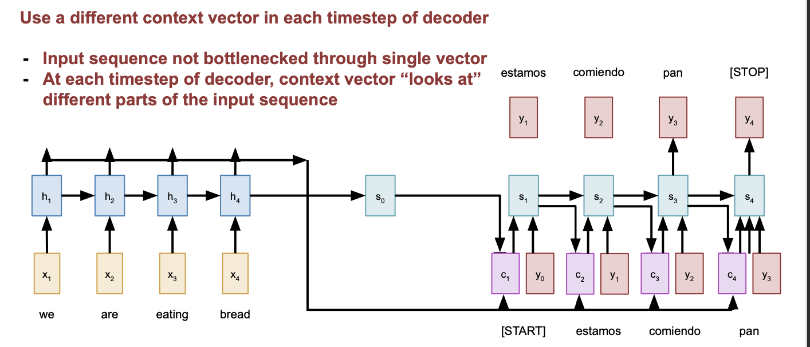

#### Example

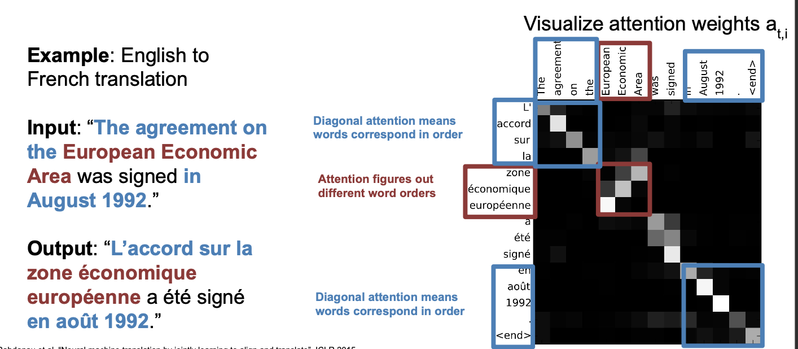

* The decoder doesn’t use the fact that $h_i$ form an ordered sequence – it just treats them as an **unordered set** $\{h_i\}$.

### Image Captioning using spatial features

#### Original Version

**Input**: Image **I**

**Output:** Sequence **y** = $y_1, y_2,..., y_T$

**Encoder**: $h_0$ = $f_W(z)$  where **z** is spatial CNN features $f_W(.)$ is an MLP

**Decoder**: $y_t = g_V(y_{t-1},h_{t-1}, c)$  where context vector c is often $c = h_0$

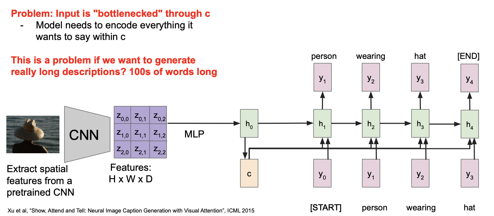

#### Image Captioning with RNNs and Attention

**Attention idea: New context vector at every time step.Each context vector will attend to different image regions**

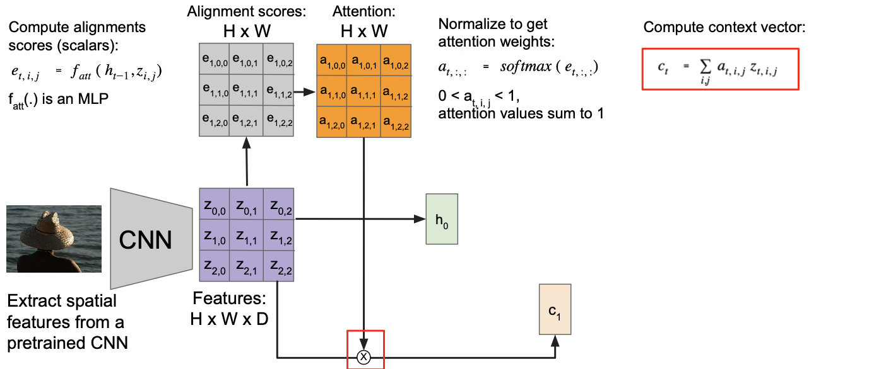

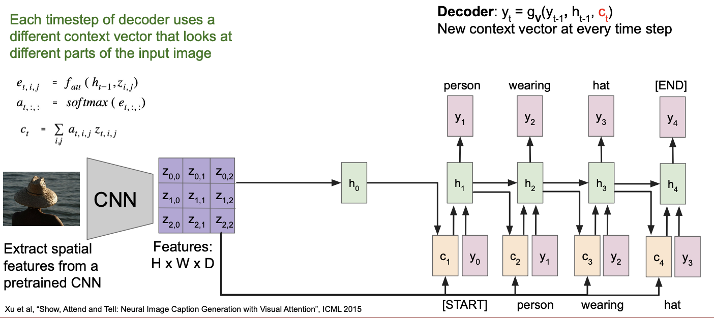

This entire process is differentiable:

* model chooses its own attention weights. No attention supervision is required.

Each timestep of decoder uses a different context vector that looks at different parts of the input image.

#### Attention Layer

