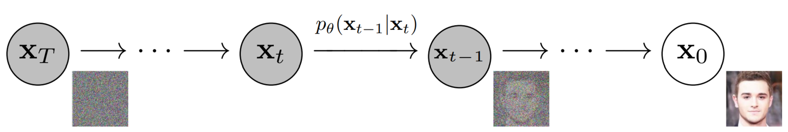

# Diffusion Model Basics

## Mathematical Formulation

### Forward Diffusion Process

The distribution $q$ in the forward diffusion process is defined as Markov Chain given by
$$
q(x_1,...x_T|x_0) = \Pi_{t=1}^T q(x_t|x_{t-1})\ \ (1)\\
q(x_t|x_{t-1}) = \mathcal{N}(x_t;\sqrt{1-\beta_t}x_{t-1},\beta_t I)\ \ (2)
$$

* From (2) we can sample $x_t$ from $q(x_t|x_{t-1})$ by
$$
x_t = \sqrt{1-\beta_t}x_{t-1} + \sqrt{\beta_t}z_t\ \ (3)
$$ where $z_t \sim \mathcal{N}(0,I)$.

We want to sample at any time $t$ from the distribution $q(x_t|x_0)$ without knowing the previous samples $x_{t-1},...,x_1$. 
$$
\alpha_t = 1-\beta_t\ \ (4)\\
\bar{\alpha}_t = \Pi_{i=1}^t \alpha_i\ \ (5)\\
q(x_t|x_0) = \mathcal{N}(x_t;\sqrt{\bar{\alpha}_t}x_0,(1-\bar{\alpha}_t) I)\ \ (6)
$$

* Therefore, we can sample $x_t$ from $q(x_t|x_0)$ by
  $x_t = \sqrt{\bar{\alpha}_t}x_0 + \sqrt{1-\bar{\alpha}_t}z_t$ where $z_t \sim \mathcal{N}(0,I)$.

### Reverse Diffusion Process

The reverse process is a Markov chain where a **neural network** predicts the **parameters for the reverse diffusion kernel** at each timestep. 

## References

1. [what are diffusion models](https://lilianweng.github.io/posts/2021-07-11-diffusion-models/)

2. [An In-Depth Guide to Denoising Diffusion Probabilistic Models DDPM – Theory to Implementation](https://learnopencv.com/denoising-diffusion-probabilistic-models/#forward-diffusion-equation)

