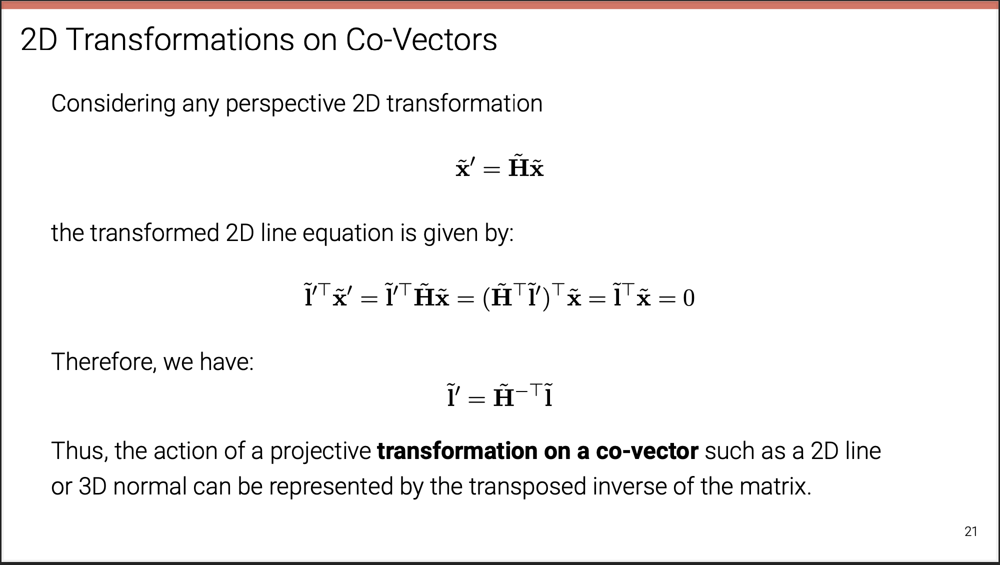
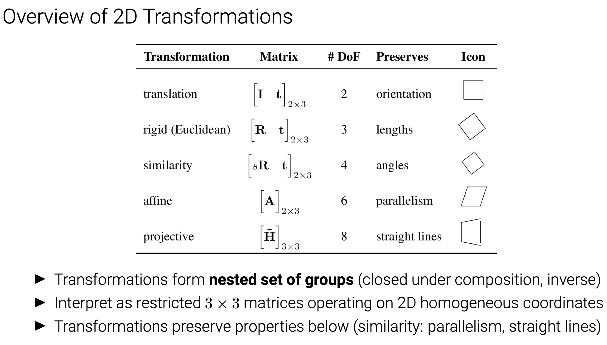
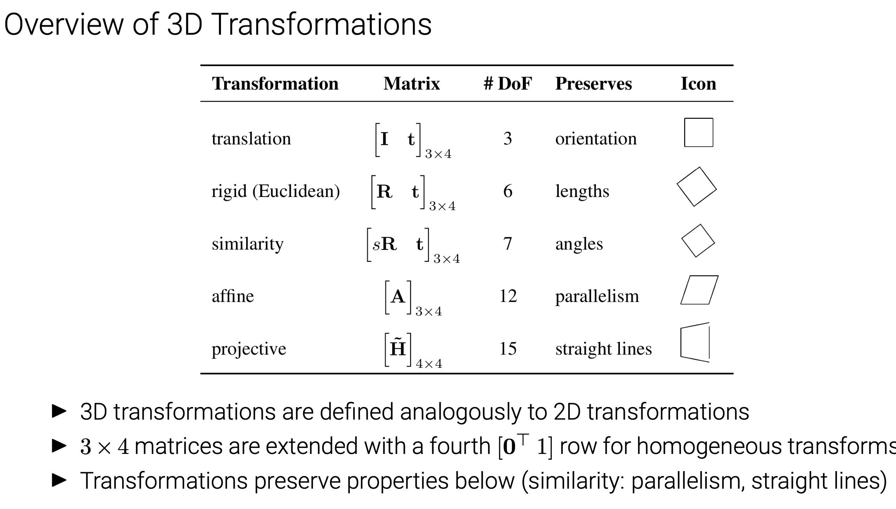
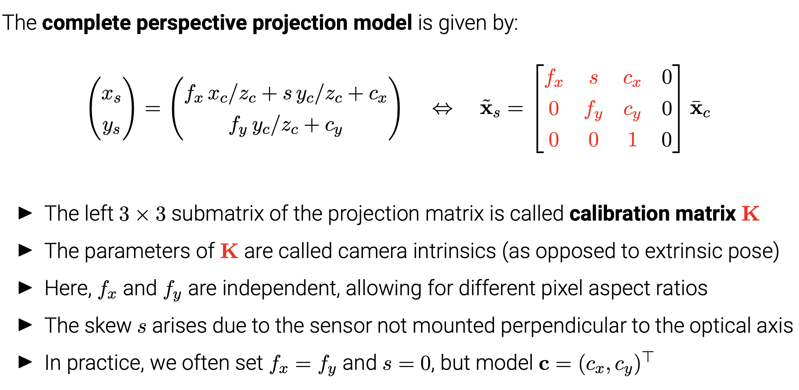
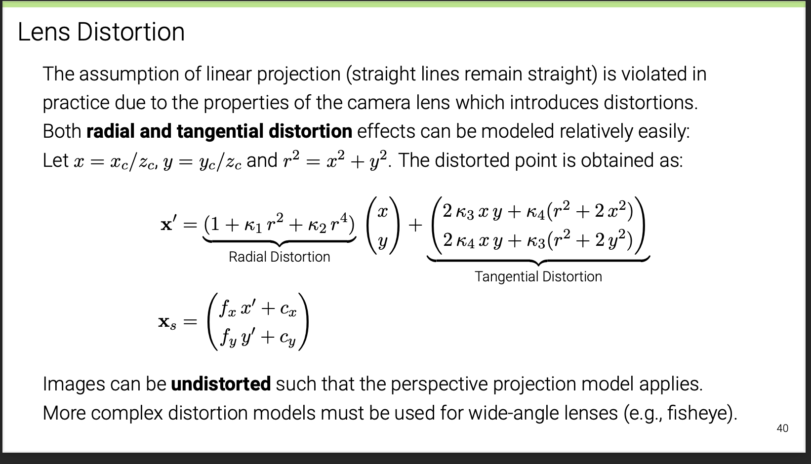
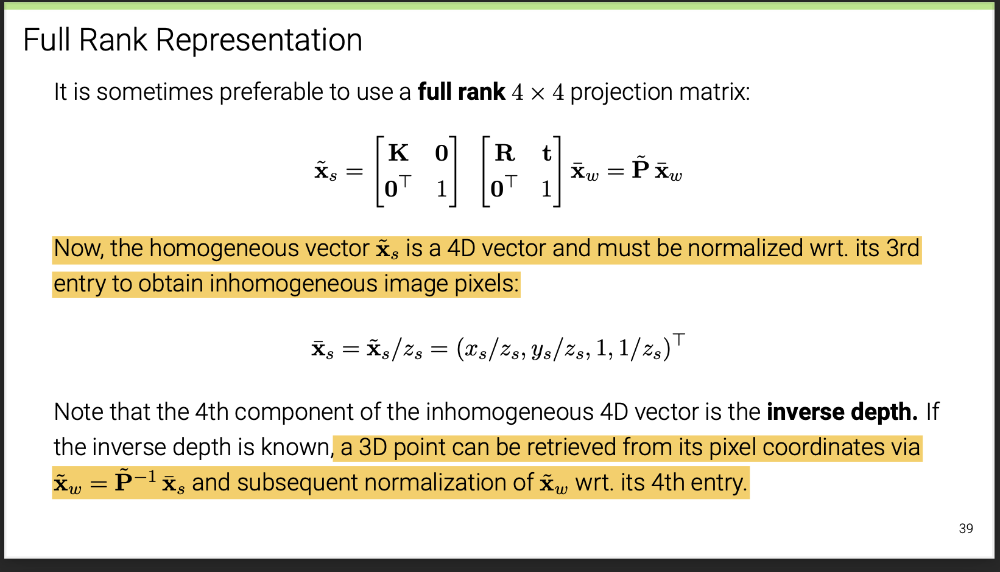
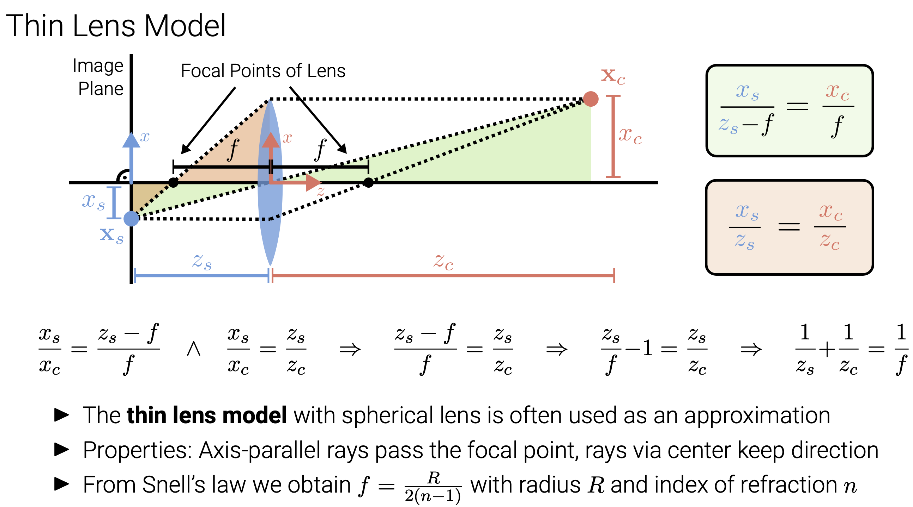
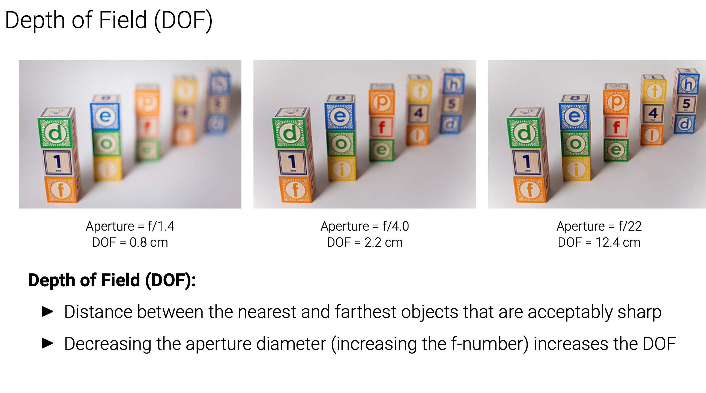

# Lec2 for ML-4360
## 2.1 Primitives & Transformations
### $Homogeneous$ 
* homogeneous coordinates & inhomogeneous coordinates
* argmented vector[one element out of the whole equivalent class],homogeneous vectors,homogeneous vectors
* points at infinity

* In homogeneous coordinates, the intersection of two lines is given by:
$\tilde{x}$=$\tilde{l1}$ × $\tilde{l2}$ 

* the line joining two points can be compactly written as:
$\tilde{l}$=$\tilde{x1}$ × $\tilde{x2}$ 

### $Transformations$​​

* $\tilde{l}'$ = $(\tilde{H}^T)^{-1}$$\tilde{l}$

#### translation **2DOF**

$\begin{bmatrix}I&t\\0^{T}&1\end{bmatrix}$

#### Euclidean **3DOF** 

$RR^T=I \ der(R)=1$​

$\begin{bmatrix}R&t\\0^{T}&1\end{bmatrix}$

正交矩阵$A^TA=I$

* $A^{-1}=A^T$
* $\left|A\right|$ = $+-1$
* A的行（列）向量组为n维单位正交向量组
* 正交变换保持向量的长度与内积不变 $|\sigma\alpha|=|\alpha|$

#### Similarity 4DOF

$\begin{bmatrix}sR&t\\0^{T}&1\end{bmatrix}$​

$RR^{T}=I$

#### Affine: 6DOF

$\begin{bmatrix}A&t\\0^{T}&1\end{bmatrix}$

* arbitrary $2×2$ matrix

* Parallels Remain!

#### Projective :8DOF

* preserve straight lines
*  $\tilde{H}\in R_{3\times 3}$is an arbitrary homogeneous $3 × 3$​ matrix (specified up to scale)

* DOF（2D）:n(n-1)/2

### Direct Linear Transform for Homography Estimation[algorithm DLT
* Please Refer to Structure from Motion

## 2.2 Geometric Image Formation
### Orthographic projection

An **orthographic projection** simply **drops the z component** of the 3D point in camera

coordinates $x_c$ to obtain the corresponding 2D point on the image plane (= screen) $x_s$

* Scaled -- The unit for s is $px/m$ or $px/mm$ to convert metric 3D points into pixels.

  $\bar{x_s}=\begin{bmatrix}s&0&0&0\\0&s&0&0\\0&0&0&1\end{bmatrix}$.

### Perspective projection

#### Chaining Transformations

$\tilde{x}_s=K[R \ t]\bar{x}_w$

> 我的理解：$\bar{x}_s$是真实的相机坐标系下的坐标，与$\tilde{x}_s$差一个系数，如果我们知道这个系数，就可以恢复出$\tilde{x}_s$并根据$\tilde{x}_s$的计算方法恢复出世界坐标系下的坐标$\bar{x}_c$

## 2.3 Photometric Image Formation

### $Rendering\ Equation$
* intensity :power per solid angle
>$dw=\sin\theta$$d\theta$$d\phi$
* Irradiance :power per unit area
>E(x)=d$\Phi(x)$/dA
* Radiannce
>$L(p,w)=d^2\Phi(p,\omega)$/$d\omega$$dAcos\theta$

#### $BRDF$ "$Radiance_{out}/Irradiance_{in}$"
#### $The\ Reflection\ Equation$​

$L_r(p,w_r)=\int_{H^2}f_r(p,w_i\rightarrow w_r)L_i(p,w_i)cos\theta_id_{w_i}$

### Back To Cameras

