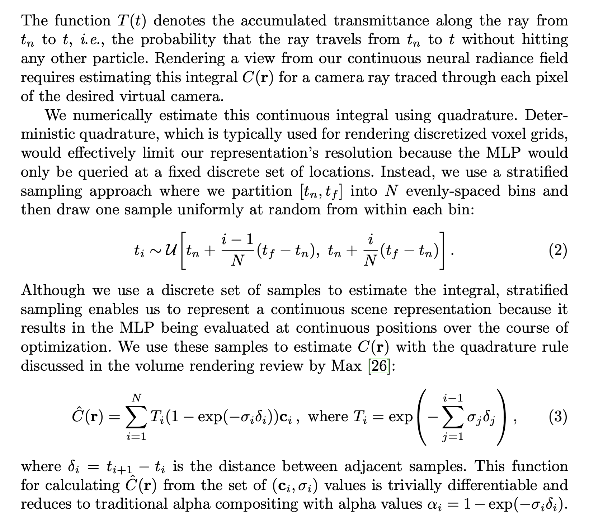

## Implicit Neural Representations

### What is a good **output** representation?

* Voxels

  > Flat surface only in the canonical directions

  

* Points

  > No surface

  

* Meshes

  

  #### Occupancy Networks
  
  

> Also possible: **signed distance field** [Park et al., 2019]

* Equivalent to a neural network for **binary classification**, except that we are interested in the decision boundary which implicitly represents the object’s surface.

$L(\theta,ψ) =  \sum_{j=1}^KBCE(f_θ(p_{ij},z_{i}),o_{ij})+KL[q_ψ(z|(p_{ij},o_{ij})_{j=1:K})∥p0(z)]$​

* BCD ： Binaray Cross-Entropy Loss
* K : Randomly sampled 3D points (K = 2048)
* $q_ψ$: Encoder

#### Representing **Materials** and **Lighting**

**Conditional Surface Light Field**

* model **p,v,l** to a 3D colour value

  > Given any light & view direction, we want to know the color

#### Representing **Motion**

* Extending Occupancy Networks to 4D is hard (curse of dimensionality)
* Represent **shape** at $t = 0$ using a 3D Occupancy Network
* Represent **motion** by **temporally and spatially continuous** vector field
* Relationship between 3D trajectorys and velocity $v$ given by (differentiable) ODE:  $\frac{\partial s(t)}{\partial t} = v(s(t),t)$​

#### Representing **Scenes**

Problems for occupancy network 

* **Global latent code** ⇒ no local information, overly smooth geometry
* **Fully connected architecture** ⇒ does not exploit translation equivariance

Implicit models work well for simple objects but **poorly on complex scenes**

##### Convolutional Occupancy Networks

## Differentiable Volumetric Rendering

### Learning from **Images**

* Given only RGB images

#### Forward Pass (Rendering)

**Secant Method** : A finite-difference approximation of Newton’s method.

#### Backward Pass(Differentiation)

> Comes to Backward Pass

* Image Observation I

* Loss $L(\hat{I},I) = \sum_u||\hat{I}_u-I_u||$​

* Gradient of Loss Function

  $\frac{\partial{L}}{\partial{\theta}} = \sum_u \frac{\partial L}{\partial\hat{I_u}}·\frac{\partial{\hat{I_u}}}{\partial\theta}$​

  $\frac{\partial{\hat{I_u}}}{\partial\theta}=\frac{\partial{t_{\theta}(\hat{p})}}{\partial\theta} +\frac{\partial{t_{\theta}(\hat{p})}}{\partial\hat{p}}·\frac{\partial{\hat{p}}}{\partial\theta}$​

  **Note** : $\hat{p}$ (The Surface Intersection) also depends on $\theta$​ !! 

  * So we have to apply total derivative !!

* Differentiation of $f_{\theta}(\hat{p}=\tau)$ yields :

  $\frac{\partial\hat{p}}{\partial\theta}=-w(\frac{\partial f_{\theta}(\hat{p})}{\partial\hat{p}}·w)^{-1}\frac{\partial f_{\theta}(\hat{p})}{\partial\theta}$​​

  Derivation :

  **Note** $\bold{w}$ is a vector!

  

## Neural Radiance Fields

**Task:** Given a set of images of a scene, render image from novel viewpoint

* A Nerual Network related to a singls scene ! **Like "overfit" the nerual network to a single scene!**

### NeRF Training

$min_{\theta}=\sum_i||render_i(F_{\theta})-I_i||^2$​

Shoot ray, render ray to pixel, minimize **reconstruction error** via backpropagation

* NeRF’s parameters are optimized on **many different views** of a single scene

> From the Paper :

We encourage the representation to be multiview consistent by restricting the network to predict the volume density σ as a function of **only the location x**, while allowing the RGB color c to be predicted as a function of both location and viewing direction. 

> To accomplish this, the **MLP** $F_Θ$ first processes the input 3D coordinate x with 8 fully-connected layers (using ReLU activations and 256 channels per layer), and outputs σ and a 256-dimensional feature vector.
>
>  This feature vector is then concatenated with the camera ray’s viewing direction and passed to one additional fully-connected layer (using a ReLU activation and 128 channels) that output the view-dependent RGB color.

### Volume Rendering with Radiance Fields

> From the Paper :

* The volume density $σ(x)$ can be interpreted as the differential probability of a ray terminating at an infinitesimal particle at location $x$​. 

* The expected color $C(r)$ of camera ray $r(t) = o + td$ with near and far bounds $t_n$ and $t_f$ is:

  

  * $T(t)$​ probability that the ray doesn't hit anything

### Optimizing a Neural Radiance Field

#### Positional encoding

* Having the network $F_Θ$ directly operate on $xyzθφ$​ input coordinates results in renderings that perform poorly at representing high-frequency variation in color and geometry

* (Recap Transformers)

* Pass low-dimensional coordinates through fixed **positional encoding** or **random Fourier features** of varying frequencies controlled by L
* These features let networks **learn high-freq. functions** in low-dim. domains

## Generative Radiance Fields

* Refer to Slides

