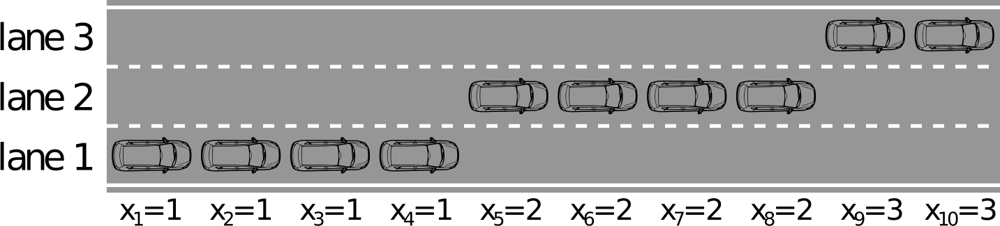

# Probabilistic Graphical Models

## Structured Prediction

### Spatial regularization

$p(D)\propto e^{-\sum_i\phi_{data}(d_i)-\lambda\sum_{(i，j)\in S}\phi_{smooth}(d_i,d_j)}$

- i~j neighbouring pixels (on a 4-connected grid). 
- $\phi_{smooth} $ is a regularization term that encourages neighboring pixels to have similar disparities.

> $\phi_{data}(di) =min(|I(xi, yi) - J(xi - di, yi)|, σ)$
>
> $\phi_{smooth} (di,dj) = min(|di - dj|,τ)$
>
> > where$I$and $J$ are the image pairs
> >
> > $σ$ and $τ$ are truncation thresholds.

- **Structured Prediction:**

> Probabilistic graphical models encode local dependencies of the problem
>
> Deep neural netwoks with image-based outputs (stereo, flow, semantics)

## Markov Random Fields

#### Undirected graphical models (UGM)

- Pairwise (non-causal) relationships
- Can write down model, and score specific configurations of the graph, but no explicit way to generate samples
- Contingency constrains on node configurations

#### cliques

Refers to fully connected subgraphs in a graphical model, particularly in models like Markov Random Fields or Conditional Random Fields.

In this context, a clique is a group of nodes in a graph where every pair of nodes is directly connected.

#### potential

- A **potential**  $φ(x)$is a non-negative function of the variable x
- A **joint potential** $φ(x1, x2, . . . )$ is a non-negative function of a **set** of variables.

#### Definations of an undirected graphical model

$(P(x_1……x_n)=\frac{1}{Z}\prod_{c\in C}\phi_c(x_c)$

$(Z = \sum_{x_1……x_n}\prod_{c\in C}\phi_c(x_c)$

#### Defination of Markov Random Field

- For a set of variables $X ={x_1,...,x_M}$, a **Markov Random Field** is defined as a product of potentials over the **(maximal) cliques** ${(X_k)}_{k=1}^K$of the undirected graph G

  $p(X)=\frac{1}{Z}\prod_{k=1}^K\phi_k(X_k)$

- $Z$  normalizes the distribution and is called **partition function**
- Examples：


#### Properties

$Condition \ One$


##### Marginalizing over c makes a and b dependent

$Proof$


- Explain:take $\sum_c\phi_1(a,c)\phi_2(b,c)$ for example

<table>
  <tr>
    <td>a</td>
    <td>b</td>
    <td>c</td>
    <td>φ1(a,c)</td>
    <td>φ2(b,c)</td>
    <td>φ1(a,c)*φ2(b,c)</td>
    <td>sum</td>
  </tr>
  <tr>
     <td rowspan="2">0</td>
     <td rowspan="2">0</td>
    <td>0</td>
    <td>1</td>
    <td>1</td>
    <td>1</td>
    <td rowspan="2">1</td>
  </tr>
  <tr>
     <td >1</td>
     <td >0</td>
    <td>0</td>
    <td>0</td>
  </tr>
  <tr>
     <td rowspan="2">1</td>
     <td rowspan="2">1</td>
    <td>0</td>
    <td>0</td>
    <td>0</td>
    <td>0</td>
    <td rowspan="2">1</td>
  </tr>
  <tr>
     <td >1</td>
     <td >1</td>
    <td>1</td>
    <td>1</td>
  </tr>
  <tr>
     <td rowspan="2">0</td>
     <td rowspan="2">1</td>
    <td>0</td>
    <td>1</td>
    <td>0</td>
    <td>0</td>
    <td rowspan="2">0</td>
  </tr>
  <tr>
     <td >1</td>
     <td >0</td>
    <td>1</td>
    <td>0</td>
  </tr>
   <tr>
     <td rowspan="2">1</td>
     <td rowspan="2">0</td>
    <td>0</td>
    <td>0</td>
    <td>1</td>
    <td>0</td>
    <td rowspan="2">0</td>
  </tr>
  <tr>
     <td >1</td>
     <td >1</td>
    <td>0</td>
    <td>0</td>
  </tr>
</table>

##### Conditioning on c makes a and b independent

$Proof$


- Global Markov Property

> Markov blanket

#### Hammersley-Clifford Theorem

A probability distribution that has a **strictly positive mass** or density satisfies the **Markov properties** with respect to an undirected graph G if and only if it is a Gibbs random field,

i.e. its density can be **factorized** over the (maximal) cliques of the graph.


## Factor Graphs


$p(X) = \frac{1}{Z}\prod_{k=1}^Kf_k(X_k)_{k=1}^K $

## Belief Propagation

### Inference in Chain Structured Factor Graphs


$p(a, b, c, d) = \frac{1}{Z}f_1(a, b)f_2(b, c)f_3(c, d)f4(d)$

$p(a,b,c) = \sum_{d}p(a,b,c,d)$

$\ \ \ \ \ \ \ \ \ \ \ \ \ \ = \frac{1}{Z}f_1(a,b)f_2(b,c)\underbrace{\sum_{d}f_3(c,d)f_4(d)}_{μ_{d→c}(c)}$

$p(a,b) = \sum_{c}p(a,b,c)$

$\ \ \ \ \ \ \ \ \ \ = \frac{1}{Z}f_1(a,b)\underbrace{\sum_{c}f_2(b,c)μ_{d→c}(c)}_{μ_{c→b}(b)}$

$……$

Belief Propagation assumes a singly-connected graph G = (V,E), which means it has $|V|−1 = O(|V|)$ many edges (in contrast to $|V|(|V| − 1)/2 = O(|V|^2)$ of a fully connected graph). 

That simplifies the computation of any marginal distribution significantly

### Inference in Tree Structured Factor Graphs

#### Factor-to-Variable Messages


#### Variable-to-Factor Messages 


### Sum-Product Algorithm

#### Belief Propagation:

- Algorithm to compute all messages efficiently
- Assumes that the graph is singly-connected (chain, tree)

#### Algorithm:

- Initialization
- Variable to Factor message
- Factor to Variable message
- Repeat until all messages have been calculated
- Calculate the desired marginals from the messages

#### Log Representation


#### Max-Product Algorithm

* Example: Chain

  $\begin{align*}\underset{\text{a,b,c,d}}{\text{max}}p(a,b,c,d)&= \underset{\text{a,b,c,d}}{\text{max}}f_1(a,b)f2(b,c)f_3(c,d)\\&=\underset{\text{a,b,c}}{\text{max}}f_1(a,b)f2(b,c)\underbrace{\underset{\text{d}}{\text{max}}f_3(c,d)}_{\mu_{d->c}(c)}\\&=……\\ &=\underset{\text{a}}{\text{max}}\mu_{b->a}(a)\end{align*}$

  

#### Loopy Belief Propagation

* Messages are also well defined for loopy graphs!
* Simply apply them to loopy graphs as well
* We loose exactness (⇒ approximate inference)
*  Even no guarantee of convergence [Yedida et al. 2004] I But often works surprisingly well in practice


### Summary


## Examples	

#### Example 1: Vehicle Localization

**#** **Max-Product Belief Propagation on chain structured Markov Random Fields for Vehicle Localization**

Let's consider an autonomous vehicle driving on a highway and tracking a vehicle in front in order to initiate an overtaking maneuver. Let $x_t\in\{1,2,3\}$ denote the lane the vehicle in front is driving on at time $t\in\{1,\dots,10\}$. Unfortunately, the sensor readings are noisy as depicted below.


Selecting the most likely lane at each time $t$ independently (green) leads to wrong estimates for $t=\{3,7,10\}$. To solve this problem, and recover the correct situation depicted below



we can integrate prior knowledge and infer the most likely situation using max-product belief propagation. A sensible prior would favor staying on the same lane over changing one lane at a time over changing two lanes at a time. This prior can be integrated via a pairwise, chain-structured Markov Random Field (also called: Hidden Markov Model or HMM) where pairwise factors between adjacent frames modulate transition likelihoods:


$$g_\theta(x_i,x_{i+1}) = \begin{bmatrix}0.8 & 0.2 & 0.0\\ 0.2 & 0.6 & 0.2 \\ 0.0 & 0.2 & 0.8\end{bmatrix}$$

$$ p_\theta({\bf x}) \propto \prod_{1}^{10} f_i(x_i)\prod_{1}^{9}g_{\theta}(x_i, x_{i+1})$$

* Coding

```python
# import modules
import numpy as np
import matplotlib.pyplot as plt
from scipy import misc

# plot function
# input: Nx3 matrix of values & title string
def plot(vals,title=''):
    plt.close()
    vals /= np.tile(np.sum(vals,1),(3,1)).transpose()
    f, axarr = plt.subplots(1,10,figsize=(10,2))
    plt.suptitle(title, fontsize=16, fontweight='bold')
    for i in range(vals.shape[0]):
        axarr[i].barh([0,1,2],np.array([1,1,1]),color='white',edgecolor='black',linewidth=2)
        axarr[i].barh([0,1,2],vals[i],color='red')
        axarr[i].axis('off')
    plt.show()
    
# unary: Nx3 matrix specifying unary likelihood of each state
unary = np.array([[0.7,0.1,0.2],[0.7,0.2,0.1],[0.2,0.1,0.7],[0.7,0.2,0.1],
                  [0.2,0.6,0.2],[0.1,0.8,0.1],[0.4,0.3,0.3],[0.1,0.8,0.1],
                  [0.1,0.1,0.8],[0.1,0.5,0.4]])
# pairwise: 3x3 matrix specifying transition probabilities (rows=t -> columns=t+1)
pairwise = np.array([[0.8,0.2,0.0],[0.2,0.6,0.2],[0.0,0.2,0.8]])

# model parameters (number of variables/states)
[num_vars,num_states] = unary.shape

# compute messages
msg = np.zeros([num_vars-1, num_states]) # (num_vars-1) x num_states matrix
for i in range(num_vars-2, -1, -1):
    if i == num_vars-2:
        msg[i, :] = np.max(pairwise*unary[i+1, :], 1)
    else:
        msg[i, :] = np.max(pairwise*unary[i+1, :]*msg[i+1, :],1)
# calculate max-marginals (num_vars x num_states matrix) and MAP estimates (num_vars x 1 matrix)
max_marginals = np.zeros([num_vars,num_states])
map = np.zeros(num_vars, dtype=int)
for i in range(num_vars):
    if i == 0:
        max_marginals[i,:] = msg[i, :]
    if i == num_vars-1:
        max_marginals[i,:] = pairwise[map[i-1],:]*unary[i,:]
    else:
        max_marginals[i,:] = pairwise[map[i-1],:]*unary[i,:]*msg[i, :]
    map[i] = np.argmax(max_marginals[i, :])
# plot max-marginals
plot(max_marginals,'Max Marginals')

# print MAP state
print("MAP Estimate:")
print(np.argmax(max_marginals,axis=1))
```


#### Example 2: Image Denoising

# Image Denoising

You are given a noisy binary image ($10 \times 10$ pixels) which you want to denoise.


Make use of the Ising model for that purpose where neighboring pixels are encouraged to take the same value:
$$p(x_1,\dots,x_{100}) \propto \exp \left\{\sum_{i=1}^{100} \psi_i(x_i) + \sum_{i\sim j} \psi_{ij} (x_i,x_j) \right\}$$

Here, $i$ is the pixel index and $i\sim j$ are neighboring pixels on a 4-connected grid. The unary term $\psi_i(x_i) = [x_i = o_i]$ models the observation at pixel $i$, and the pairwise term is the Ising prior $\psi_{ij}(x_i,x_j) = \alpha \cdot [x_i = x_j]$, where $\alpha$ controls the strength of the interaction/smoothing. 

Because we have large number of variables in this exercise, we use logarithm factors to avoid potential numerical underflow issues.

**Inputs:**
* `num_vars`, `num_states`, `factors`, `msg_fv`, `msg_vf`, `ne_var`

**Outputs:**
* `max_marginals`: `num_vars` x `num_states` array of estimated max-marginals
* `map_est`: array comprising the estimated MAP state of each variable

**Algorithm Pseudocode:**

* For `N=30` iterations do:
 * Update all unary factor-to-variable messages: $\lambda_{f\rightarrow x}(x) = f(x)$
 * Update all pairwise factor-to-variable messages: $\lambda_{f\rightarrow x}(x) = \max_y \left[f(x,y)+\lambda_{y\rightarrow f}(y)\right]$
 * Update all variable-to-factor messages: $\lambda_{x\rightarrow f}(x) = \sum_{g\in\{ ne(x)\setminus f\}}\lambda_{g\rightarrow x}(x)$
   
* Calculate Max-Marginals: $\gamma_x(x) = \sum_{g\in\{ ne(x)\}}\lambda_{g\rightarrow x}(x)$
* Calculate MAP Solution: $x^* = \underset{x}{\mathrm{argmax}} ~ \gamma_x(x)$


> CODE

```python
# import modules
import numpy as np
import matplotlib.pyplot as plt
import imageio

# load and plot input image
img = imageio.imread('gfx/image.png')/255
plt.imshow(img,interpolation='nearest');
plt.gray()
plt.show()

# model parameters
[h,w] = img.shape # get width & height of image
num_vars = w*h    # number of variables = width * height
num_states = 2    # binary segmentation -> two states

# initialize factors (list of dictionaries), each factor comprises:
#   vars: array of variables involved
#   vals: vector/matrix of factor values
factors = []
# add unary factors
for u in range(w):
  for v in range(h):
    factors.append({'vars':np.array([v*w+u]), 'vals':np.array([1-img[v,u],img[v,u]])})
    
# add pairwise factors
alpha = 0.4 # smoothness weight
E = alpha*np.array([[1,0],[0,1]]) # energy matrix for pairwise factor
for u in range(w):
  for v in range(h):
    if v<h-1:
      factors.append({'vars':np.array([v*w+u,(v+1)*w+u]), 'vals':E})
    if u<w-1:
      factors.append({'vars':np.array([v*w+u,v*w+u+1]), 'vals':E})
# initialize all messages
msg_fv = {} # f->v messages (dictionary)
msg_vf = {} # v->f messages (dictionary)
ne_var = [[] for i in range(num_vars)] # neighboring factors of variables (list of list)

# set messages to zero; determine factors neighboring each variable
for [f_idx,f] in enumerate(factors):
    for v_idx in f['vars']:
        msg_fv[(f_idx,v_idx)] = np.zeros(num_states) # factor->variable message
        msg_vf[(v_idx,f_idx)] = np.zeros(num_states) # variable->factor message
        ne_var[v_idx].append(f_idx) # factors neighboring variable v_idx

# status message
print("Messages initialized!")

# run inference
for it in range(30):
  
    # for all factor-to-variable messages do
    for [key,msg] in msg_fv.items():
        
        # shortcuts to variables
        f_idx = key[0] # factor (source)
        v_idx = key[1] # variable (target)
        f_vars = factors[f_idx]['vars'] # variables connected to factor
        f_vals = factors[f_idx]['vals'] # vector/matrix of factor values 

        # unary factor-to-variable message
        if np.size(f_vars)==1:
            msg_fv[(f_idx,v_idx)] = f_vals

        # pairwise factor-to-variable-message
        else:

            # if target variable is first variable of factor
            if v_idx==f_vars[0]:
                msg_in = np.tile(msg_vf[(f_vars[1],f_idx)],(num_states,1))
                msg_fv[(f_idx,v_idx)] = (f_vals+msg_in).max(1) # max over columns

            # if target variable is second variable of factor
            else:
                msg_in = np.tile(msg_vf[(f_vars[0],f_idx)],(num_states,1))
                msg_fv[(f_idx,v_idx)] = (f_vals+msg_in.transpose()).max(0) # max over rows
                
        # normalize
        msg_fv[(f_idx,v_idx)] = msg_fv[(f_idx,v_idx)] - np.mean(msg_fv[(f_idx,v_idx)])

    # for all variable-to-factor messages do
    for [key,msg] in msg_vf.items():
        
        # shortcuts to variables
        v_idx = key[0] # variable (source)
        f_idx = key[1] # factor (target)

        # add messages from all factors send to this variable (except target factor)
        # and send the result to the target factor
        msg_vf[(v_idx,f_idx)] = np.zeros(num_states)
        for f_idx2 in ne_var[v_idx]:
            if f_idx2 != f_idx:
                msg_vf[(v_idx,f_idx)] += msg_fv[(f_idx2,v_idx)]
                
        # normalize
        msg_vf[(v_idx,f_idx)] = msg_vf[(v_idx,f_idx)] - np.mean(msg_vf[(v_idx,f_idx)])
        
# calculate max-marginals (num_vars x num_states matrix)
max_marginals = np.zeros([num_vars,num_states])
for v_idx in range(num_vars):
    
    # add messages from all factors sent to this variable
    max_marginals[v_idx] = np.zeros(num_states)
    for f_idx in ne_var[v_idx]:
        max_marginals[v_idx] += msg_fv[(f_idx,v_idx)]
    #print max_marginals[v_idx]

# get MAP solution
map_est = np.argmax(max_marginals,axis=1)

# plot MAP estimate
plt.imshow(map_est.reshape(h,w),interpolation='nearest');
plt.gray()
plt.show()
```

