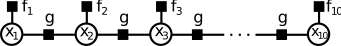

# Probabilistic Graphical Models

## Structured Prediction

### Spatial regularization 

$p(D)\propto e^{-\sum_i\phi_{data}(d_i)-\lambda\sum_{(i，j)\in S}\phi_{smooth}(d_i,d_j)}$

* $i$~$j$ neighbouring pixels (on a 4-connected grid). 

- $\phi_{smooth} $ is a regularization term that encourages neighboring pixels to have similar disparities. 
- $\phi_{data}(d_i) =min(|I(xi, yi) - J(xi - di, yi)|, σ)$
- $\phi_{smooth} (di,dj) = min(|di - dj|,τ)$

> where $I$and $J$ are the image pairs. $σ$ and $τ$ are truncation thresholds.

- **Structured Prediction:**

Probabilistic graphical models encode local dependencies of the problem

Deep neural netwoks with image-based outputs (stereo, flow, semantics)

## Markov Random Fields

### Undirected graphical models (UGM)

- Pairwise (non-causal) relationships
- Can write down model, and score specific configurations of the graph, but no explicit way to generate samples
- Contingency constrains on node configurations

### cliques

Refers to fully connected subgraphs in a graphical model, particularly in models like Markov Random Fields or Conditional Random Fields.

In this context, a clique is a group of nodes in a graph where every pair of nodes is directly connected.

### potential

- A **potential**  $φ(x)$is a non-negative function of the variable x
- A **joint potential** $φ(x1, x2, . . . )$ is a non-negative function of a **set** of variables.

### Definations of an undirected graphical model

$P(x_1……x_n)=\frac{1}{Z}\prod_{c\in C}\phi_c(x_c)$

$Z = \sum_{x_1……x_n}\prod_{c\in C}\phi_c(x_c)$

### Defination of Markov Random Field

- For a set of variables $X ={x_1,...,x_M}$, a **Markov Random Field** is defined as a product of potentials over the **(maximal) cliques** ${(X_k)}_{k=1}^K$of the undirected graph G

  $p(X)=\frac{1}{Z}\prod_{k=1}^K\phi_k(X_k)$

- $Z$​  normalizes the distribution and is called **partition function**

**Examples**：

### Properties

$Condition \ One$

#### Marginalizing over c makes a and b dependent

$Proof$

- Explain:take $\sum_c\phi_1(a,c)\phi_2(b,c)$ for example

<table>
  <tr>
    <td>a</td>
    <td>b</td>
    <td>c</td>
    <td>φ1(a,c)</td>
    <td>φ2(b,c)</td>
    <td>φ1(a,c)*φ2(b,c)</td>
    <td>sum</td>
  </tr>
  <tr>
     <td rowspan="2">0</td>
     <td rowspan="2">0</td>
    <td>0</td>
    <td>1</td>
    <td>1</td>
    <td>1</td>
    <td rowspan="2">1</td>
  </tr>
  <tr>
     <td >1</td>
     <td >0</td>
    <td>0</td>
    <td>0</td>
  </tr>
  <tr>
     <td rowspan="2">1</td>
     <td rowspan="2">1</td>
    <td>0</td>
    <td>0</td>
    <td>0</td>
    <td>0</td>
    <td rowspan="2">1</td>
  </tr>
  <tr>
     <td >1</td>
     <td >1</td>
    <td>1</td>
    <td>1</td>
  </tr>
  <tr>
     <td rowspan="2">0</td>
     <td rowspan="2">1</td>
    <td>0</td>
    <td>1</td>
    <td>0</td>
    <td>0</td>
    <td rowspan="2">0</td>
  </tr>
  <tr>
     <td >1</td>
     <td >0</td>
    <td>1</td>
    <td>0</td>
  </tr>
   <tr>
     <td rowspan="2">1</td>
     <td rowspan="2">0</td>
    <td>0</td>
    <td>0</td>
    <td>1</td>
    <td>0</td>
    <td rowspan="2">0</td>
  </tr>
  <tr>
     <td >1</td>
     <td >1</td>
    <td>0</td>
    <td>0</td>
  </tr>
</table>
#### Conditioning on c makes a and b independent

$Proof$

#### Global Markov Property

#### Local Markov Property

* Markov blanket

#### Hammersley-Clifford Theorem

A probability distribution that has a **strictly positive mass** or density satisfies the **Markov properties** with respect to an undirected graph G if and only if it is a Gibbs random field,

i.e. its density can be **factorized** over the (maximal) cliques of the graph.

## Factor Graphs

$p(X) = \frac{1}{Z}\prod_{k=1}^Kf_k(X_k)_{k=1}^K$​

### Example

## Belief Propagation

### Inference in Chain Structured Factor Graphs

$p(a, b, c, d) = \frac{1}{Z}f_1(a, b)f_2(b, c)f_3(c, d)f4(d)$

$p(a,b,c) = \sum_{d}p(a,b,c,d)$

$\ \ \ \ \ \ \ \ \ \ \ \ \ \ = \frac{1}{Z}f_1(a,b)f_2(b,c)\underbrace{\sum_{d}f_3(c,d)f_4(d)}_{μ_{d→c}(c)}$

$p(a,b) = \sum_{c}p(a,b,c)$

$\ \ \ \ \ \ \ \ \ \ = \frac{1}{Z}f_1(a,b)\underbrace{\sum_{c}f_2(b,c)μ_{d→c}(c)}_{μ_{c→b}(b)}$

$……$

* Belief Propagation assumes a singly-connected graph $G = (V,E)$, which means it has $|V|−1 = O(|V|)$ many edges (in contrast to $|V|(|V| − 1)/2 = O(|V|^2)$ of a fully connected graph). 
* That simplifies the computation of any marginal distribution significantly

### Inference in Tree Structured Factor Graphs

**Factor-to-Variable Messages**

**Variable-to-Factor Messages**

### Sum-Product Algorithm

#### Belief Propagation:

- Algorithm to compute all messages efficiently
- Assumes that the graph is singly-connected (chain, tree)

#### Algorithm:

- Initialization
- Variable to Factor message
- Factor to Variable message
- Repeat until all messages have been calculated
- Calculate the desired marginals from the messages

#### Log Representation

#### Max-Product Algorithm

* Example: Chain

  $\begin{align*}\underset{\text{a,b,c,d}}{\text{max}}p(a,b,c,d)&= \underset{\text{a,b,c,d}}{\text{max}}f_1(a,b)f2(b,c)f_3(c,d)\\&=\underset{\text{a,b,c}}{\text{max}}f_1(a,b)f2(b,c)\underbrace{\underset{\text{d}}{\text{max}}f_3(c,d)}_{\mu_{d->c}(c)}\\&=……\\ &=\underset{\text{a}}{\text{max}}\mu_{b->a}(a)\end{align*}$

  

#### Loopy Belief Propagation

* Messages are also well defined for loopy graphs!
* Simply apply them to loopy graphs as well
* We loose exactness (⇒ approximate inference)
*  Even no guarantee of convergence [Yedida et al. 2004] I But often works surprisingly well in practice

### Summary

* **REFER To PPT**

## Examples	

#### Example 1: Vehicle Localization

**Max-Product Belief Propagation on chain structured Markov Random Fields for Vehicle Localization**

Let's consider an autonomous vehicle driving on a highway and tracking a vehicle in front in order to initiate an overtaking maneuver. Let $x_t\in\{1,2,3\}$ denote the lane the vehicle in front is driving on at time $t\in\{1,\dots,10\}$. Unfortunately, the sensor readings are noisy as depicted below.

Selecting the most likely lane at each time $t$ independently (green) leads to wrong estimates for $t=\{3,7,10\}$. To solve this problem, and recover the correct situation depicted below

we can integrate prior knowledge and infer the most likely situation using max-product belief propagation. A sensible prior would favor staying on the same lane over changing one lane at a time over changing two lanes at a time. This prior can be integrated via a pairwise, chain-structured Markov Random Field (also called: Hidden Markov Model or HMM) where pairwise factors between adjacent frames modulate transition likelihoods:

$$g_\theta(x_i,x_{i+1}) = \begin{bmatrix}0.8 & 0.2 & 0.0\\ 0.2 & 0.6 & 0.2 \\ 0.0 & 0.2 & 0.8\end{bmatrix}$$

$$ p_\theta({\bf x}) \propto \prod_{1}^{10} f_i(x_i)\prod_{1}^{9}g_{\theta}(x_i, x_{i+1})$$

* Coding (Refer to HW)

#### Example 2: Image Denoising

You are given a noisy binary image ($10 \times 10$ pixels) which you want to denoise.

Make use of the Ising model for that purpose where neighboring pixels are encouraged to take the same value:
$$p(x_1,\dots,x_{100}) \propto \exp \left\{\sum_{i=1}^{100} \psi_i(x_i) + \sum_{i\sim j} \psi_{ij} (x_i,x_j) \right\}$$

Here, $i$ is the pixel index and $i\sim j$ are neighboring pixels on a 4-connected grid. The unary term $\psi_i(x_i) = [x_i = o_i]$ models the observation at pixel $i$, and the pairwise term is the Ising prior $\psi_{ij}(x_i,x_j) = \alpha \cdot [x_i = x_j]$, where $\alpha$ controls the strength of the interaction/smoothing. 

Because we have large number of variables in this exercise, we use logarithm factors to avoid potential numerical underflow issues.

**Inputs:**
* `num_vars`, `num_states`, `factors`, `msg_fv`, `msg_vf`, `ne_var`

**Outputs:**
* `max_marginals`: `num_vars` x `num_states` array of estimated max-marginals
* `map_est`: array comprising the estimated MAP state of each variable

**Algorithm Pseudocode:**

* For `N=30` iterations do:
 * Update all unary factor-to-variable messages: $\lambda_{f\rightarrow x}(x) = f(x)$
 * Update all pairwise factor-to-variable messages: $\lambda_{f\rightarrow x}(x) = \max_y \left[f(x,y)+\lambda_{y\rightarrow f}(y)\right]$
 * Update all variable-to-factor messages: $\lambda_{x\rightarrow f}(x) = \sum_{g\in\{ ne(x)\setminus f\}}\lambda_{g\rightarrow x}(x)$
   
* Calculate Max-Marginals: $\gamma_x(x) = \sum_{g\in\{ ne(x)\}}\lambda_{g\rightarrow x}(x)$
* Calculate MAP Solution: $x^* = \underset{x}{\mathrm{argmax}} ~ \gamma_x(x)$

* CODE  : Refer to HW

## Applications of Graphical Models

### Stereo Reconstruction

* Depth varies slowly except at object discontinuities which are sparse

* [Matching cost computed directly]$f_{data}(d_i)$  can be obtained by like: $Siamese Network$​​ (in ex02).
* Adding Pairwise connections.

* To minimize the **ENERGY**

* Add **Truncated penalty**

* $\lambda$​ -- "tradeoff"

#### Non-local Priors

* Despite we have introduced the smoothness regularizaer.Due to Very Strong violation of matching assumptions.

  Very **LOCAL** pairwise terms cannot deal with some cases (like reflections)

* Add Object Semantics & 3D Consistency

#### Summary

* Block matching suffers from **ambiguities**

* Choosing window size is problematic (tradeoff)

* Incorporating **smoothness constraints** can resolve some of the ambiguities and allows for choosing small windows (no bleeding artifacts)

* Can be formulated as **MAP inference in a discrete MRF**
* MAP solution can be obtained using belief propagation, graph cuts, etc. 
* Integrating recognition cues can further regularize the problem

### Multi-View Reconstruction

**Representation**

* Voxel

**Voxel occupancy**: This concept describes whether a voxel is occupied by a solid entity. In many tasks such as 3D reconstruction, object detection, SLAM (Simultaneous Localization and Mapping), etc., voxel occupancy is crucial. Typically, a voxel is either occupied by a solid entity or empty (occupied by other objects or background in space). In representations of voxel occupancy, a common method is binary, where a voxel is considered occupied when it's 1 and empty otherwise.

**Voxel appearance**: This concept describes the visual properties of a voxel, i.e., how it appears in images or voxel grids. It may include color, texture, brightness, etc. 

**Image Formation Process**

* Actually quite simple --  **only the first occupied can appear**

**Probabilistic Model**

* Joint Distribution:   $p(\bold{O},\bold{A})=\frac{1}{Z}\Pi_{v\in\bold{V}}φ_v(o_v)\Pi_{r\in\bold{R}}ψ_r(o_r, a_r)$​

  * Unary Potentails : $φ_v(o_v) = γ^{o_v} (1 − γ)^{(1−o_v)}$ 

    Most voxels are empty ⇒ $γ$​ < 0.5

  * Ray Potentials :

     * We know $I_r$ ?
     
     

* If first occupied voxel $a_i^r$ similar to the corresponding pixel , $ψ(o_r,a_r)$ will increase

**Depth Distribution For Single Ray**

* Let : $o_1=0\ ……o_{k-1}=0\ o_k=1$​​
* Message from and to the unary factors $\mu_{φ_i\to o_i}$  $\mu_{o_i\to φ_i}$  and $\mu_{o_i\to ψ_i}$ can be easilly computed.

* Occupancy message

  

​	Thus, resulting in **[DERIVATION SEE PAPER BELOW]**

​	$\mu_{ψ\to o_1}(o_1=1)=\int_{a_1}v(a_1)\mu(a_1)da_1$​

​	$\mu_{ψ\to o_1}(o_1=0)=\sum_{j=2}^N\mu(o_j=1)\Pi_{k=2}^{j-1}\mu(o_k=0)\rho_j$

​	$\rho_j=\int _{a_j}v(a_j)u(a_j)da_j$		

​	More General :**[see PAPER]**

* Appearance messages **[see PAPER]**

**Bayes Optimal Depth Estimation**

* Consider a single ray r in space
* Let $d_k$ be the distance from the camera to voxel $k$ along ray $r$
* Depth $D∈\{d_1,...,d_N\}$:distance to closest occupied voxel

*  **Optimal depth estimate:**

  

  

  * $p(D=d_i)∝\mu(o_i=1)\Pi_{j=1}^{i-1}\mu(o_j=0)\rho_i$ [Derivation see PPT & Paper]

* Requires **marginal depth distribution** $p(D)$ along each ray

<iframe src="https://drive.google.com/viewerng/viewer?url=https://www.cvlibs.net/publications/Ulusoy2015THREEDV.pdf&amp;embedded=true" allowfullscreen="" frameborder="0" height="780" width="600" title="" class="eo n ff dy bg" scrolling="no" style="box-sizing: inherit; top: 0px; width: 680px; height: 884px; left: 0px;"></iframe>

### Optical Flow

* Motion Field Vs Optical Flow

**Motion field:**

* 2D motion field representing the **projection of the 3D motion** of points in the scene onto the image plane
* Can be the result of camera motion or object motion (or both)

**Optical flow:** 

*  2D velocity field describing the **apparent motion** in the image(i.e., the displacement of pixels looking “similar”)  
* Optical flow $\ne$ motion field! Why?

#### Determining Optical Flow

* A single observation is not enough to determine flow

* $\lambda$ positive

Solution: **linearize** the brightness constancy assumption

$f(x,y)≈f(a,b)+ \frac{\partial f(a,b)}{∂x} (x−a)+ \frac{\partial f(a,b)}{∂y} (y−b)$​

Thus , we have
$I(x + u(x, y), y + v(x, y), t + 1) \approx I(x,y,t)+I_x(x,y,t)u(x,y)+I_y(x,y,t)v(x,y)+I_t(x,y,t)$

$E(u,v) \approx \iint [(I_x(x,y,t)u(x,y)+I_y(x,y,t)v(x,y)+I_t(x,y,t))^2+\lambda(||\triangledown u(x,y||)^2+||\triangledown v(x,y||)^2]dxdy$

which leads to the following discretized objective:

* The HS results are quite plausible already
* However, the flow is very smooth, i.e., to overcome ambituities we need to set $λ$ to
a high value which oversmooths flow discontinuities. Why?
* We use a quadratic penalty for penalizing changes in the flow
* This does not allow for discontinuities in the flow field
* In other words, **it penalizes large changes too much** and causes oversmoothing

#### Robust Estimation of Optical Flow
* Gibbs Energy
$E(u,v) \approx \iint [(I_x(x,y,t)u(x,y)+I_y(x,y,t)v(x,y)+I_t(x,y,t))^2+\lambda(||\triangledown u(x,y||)^2+||\triangledown v(x,y||)^2]dxdy$

* Both assumptions are invalid (e.g., discontinuities at object boundaries). Why?
>The text points out the invalidity of two assumptions. Firstly, the assumption of having a smooth probability distribution in the image at object boundaries is invalid because object boundaries typically exhibit discontinuities, whereas Gaussian distributions assume continuity.
* Gaussian distributions correspond to squared loss functions
> Gaussian distributions correspond to quadratic loss functions. This means that using Gaussian distributions to model smoothness is equivalent to using squared terms in the loss function, which is somewhat sensitive to outliers.
* Squared loss functions are not robust to outliers!
>Squared loss functions are not sufficiently robust to outliers. This means that in the presence of outliers, using squared loss functions may lead to larger errors, as they heavily influence the process of minimizing the error.
* Outliers occur at object boundaries (violation of smoothness/regularizer)
>Outliers typically occur at object boundaries, violating the assumptions of smoothness and regularization. Object boundaries usually have sharp transitions, so outliers may occur in these areas.
* Outliers occur at specular highlights (violation of photoconsistency/data term)
>Outliers may also occur at specular highlights, violating the assumptions of photoconsistency and data terms. Specular highlights often result in very high brightness or intensity in image regions, which may differ significantly from the surrounding areas, thus being considered outliers.

## Learning in Graphical Models
### Conditional Random Fields
$p(x_1,...,x_{100})= \frac{1}{\bold{Z}}exp\{\sum_iψ_i(x_i)+λ\sum_{i\to j}ψ_{ij}(x_i,x_j)\}$
* How to estimate the parameters , say $\lambda$

### Parameter Estimation
* Refer to PPT
### Deep Structured Models
* Refer to PPT