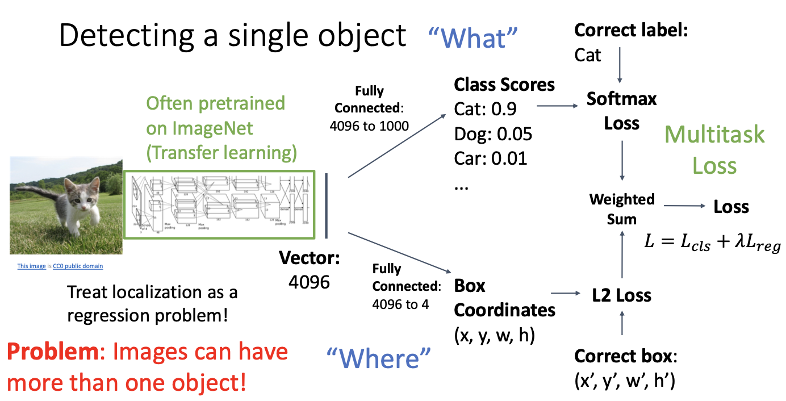
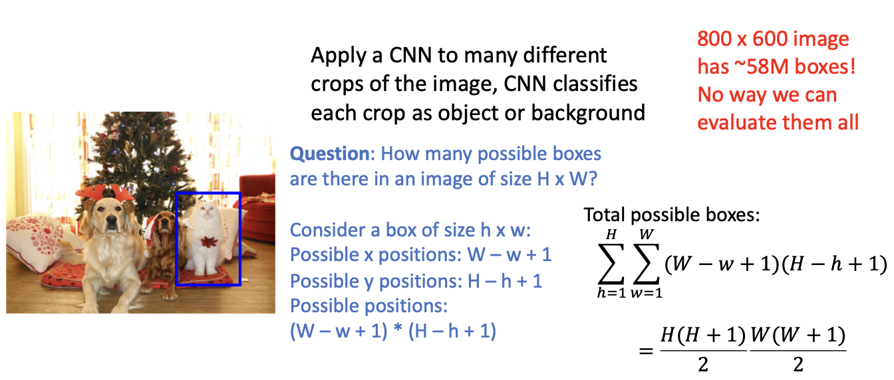
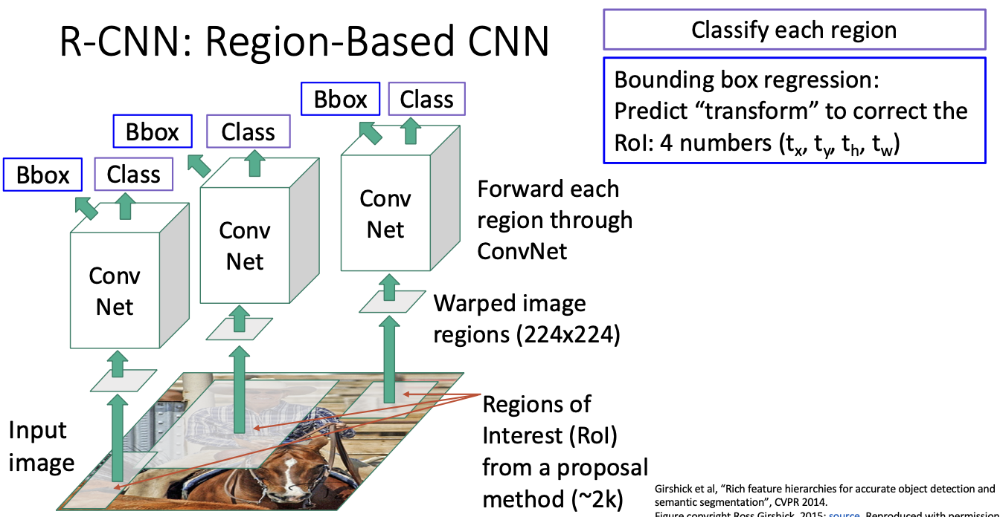
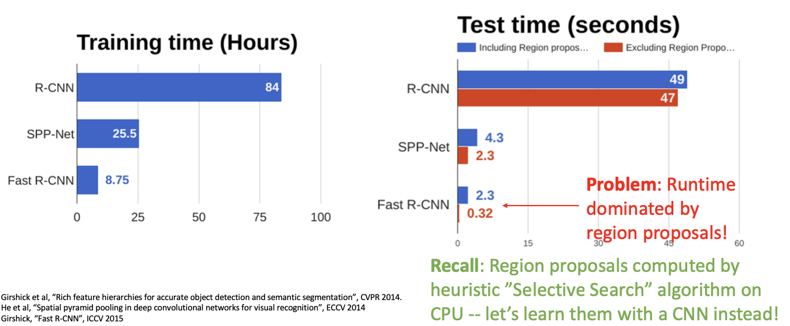
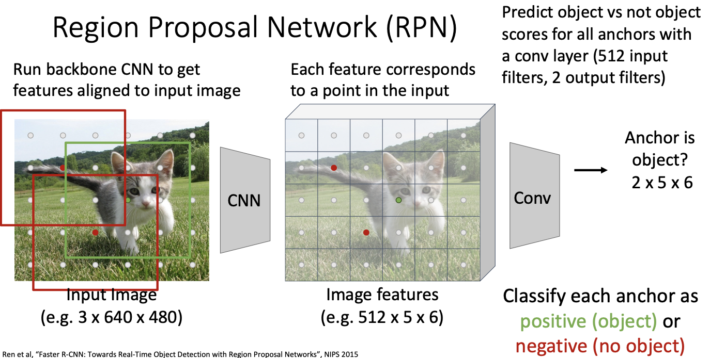
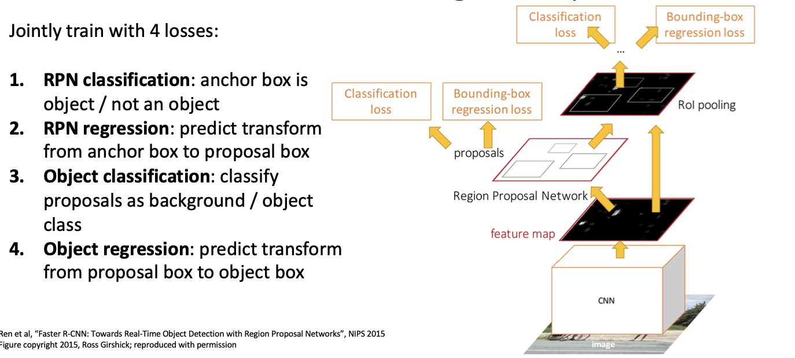
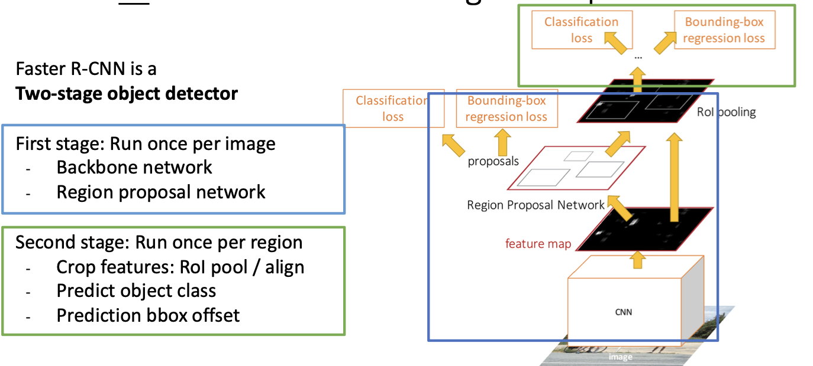
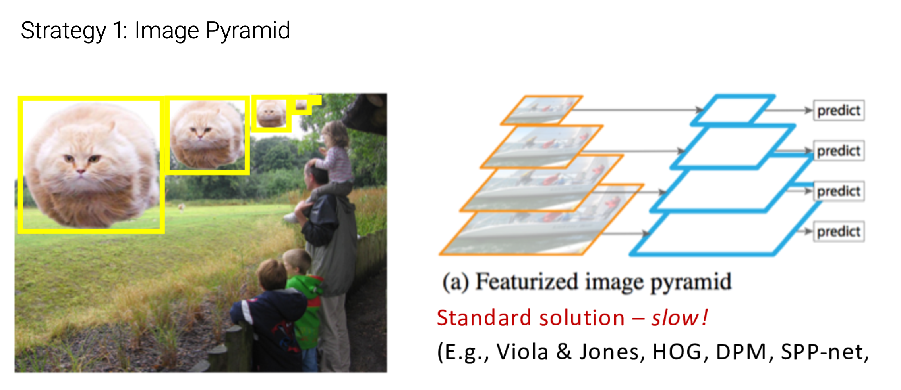
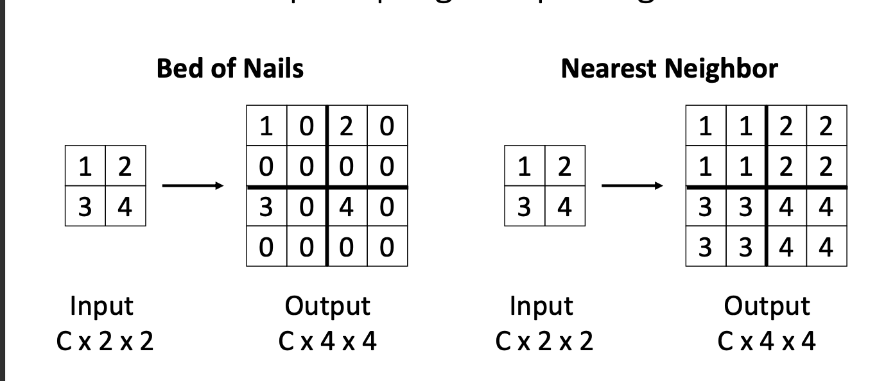

## Object Detection

**Input**: Single RGB Image

**Output**: A set of detected objects:

* Category label (from fixed, known set of categories)
* Boundingbox (four numbers: $x, y, width, height$​)

**Challenges**

- **Multiple outputs**: Need to output variable numbers of objects per image
-  **Multiple types of output**: Need to predict **what** (category label) as well as **where** (bounding box)
-  **Large images**: Classification works at 224x224; need higher resolution for detection, often ~800x600

* Refer to Slides

### Detecting a single object

### Detecting Multiple Objects

####  Sliding Window

* Apply a CNN to many different crops of the image, CNN classifies each crop as object or background

* We should consider all possible sizes and possible positions

* Really Bad!!

> Solutions

**Region Proposals**

- Find a small set of boxes that are likely to cover all objects 
- Often based on **heuristics**: e.g. look for “blob-like” image regions
- Relatively fast to run; e.g. Selective Search gives 2000 region proposals in a few seconds on CPU

#### R-CNN

* Use MultiTask Loss

* Bbox : Modify the **Region Proposals**

##### Overlapping Boxes

* When transform is 0, output = proposal 

  $L_2$ regularization encourages leaving proposal unchanged.

* Scale / Translation invariance: 

  Transform encodes **relative** difference between proposal and output; important since $CNN$ doesn’t see absolute size or position after cropping

  

##### R-CNN Training

* Categorize each region proposal as positive, negative, or neutral based on overlap with ground-truth boxes:

> Positive: > 0.5 IoU with a GT box
>
> Negative: < 0.3 IoU with all GT boxes
>
> Neutral: between 0.3 and 0.5 IoU with GT boxes

* Crop pixels from each positive and negative proposal, resize to 224 x 224

##### R-CNN Test-Time

* Run proposal method.
* Run CNN on each proposal to get class scores, transforms.
* Threshold class scores to get a set of detections.

##### Comparing Boxes

##### Overlapping Boxes

**Problem**: Object detectors often output many overlapping detections:

**Solution**: Post-process raw detections using **Non-Max Suppression (NMS)**

> Select next highest-scoring box
>
> Eliminate lower-scoring boxes with  IoU > threshold (e.g. 0.7)
>
> If any boxes remain, GOTO 1

**Problem**: NMS may eliminate ”good” boxes when objects are highly overlapping... 

> no good solution =(

* Difficult to Tell From vey close objects / same object  overlapping

##### Evaluating Object Detectors

* Precision : Frcation of our detections that are actually True
* Recall : Fraction of the Ground Truths that we hit .

#### Fast R-CNN

**R-CNN** Problem: Very slow! Need to do 2000 forward passes through CNN per image

**Idea**: Overlapping proposals cause a lot of repeated work: same pixels processed many times. Can we avoid this?

* Per-Region network is relatively lightweight

* Most of the computation happens in backbone network; 

  > this saves work for overlapping region proposals.

* Refer to Slides (Example)

**How to crop features?**

##### Cropping Features: RoI Pool

* Problem: Slight misalignment due to snapping; different-sized subregions is weird

##### Cropping Features: RoI Align

* Refer To Slides [Object Detectors]

#### Region Proposal Network (RPN)

* For positive anchors, also predict a transform that converting the anchor to the GT box (like R-CNN) Predict transforms with **conv**

* Positive anchors: >= 0.7 IoU with some GT box (plus highest IoU to each GT)
* Negative anchors: < 0.3 IoU with all GT boxes. Don’t supervised transforms for negative boxes.
* Neutral anchors: between 0.3 and 0.7 IoU with all GT boxes; ignored during training
* At test-time, sort all K*5*6 boxes by their positive score, take top 300 as our region proposals

#### Dealing With Scale

* We need to detect objects of many different scales. How to improve *scale invariance* of the detector?

  > Classic idea: build an *image pyramid* by resizing the image to different scales, then process each image scale independently.
  >
  > 

  **Problem**: Expensive! Don’t share any computation between scales.

* Multiscale Features

  

* Feature Pyramid Network

  

##### Single-Stage Detectors: RetinaNet

* Refer to Slides
* Refer to Lec16

## Segmentation

### Semantic Segmentation

* Label each pixel in the image with a category label
* Don’t differentiate instances, only care about pixels

**Simple Idea : Sliding Window**

**Use Fully Convolutional Network**

* Design a network as a bunch of convolutional layers to make predictions for pixels all at once!

  > Dose not have any pooling layers or fully connected layers.

**Problem #1**: Effective receptive field size is linear in number of conv layers: 

* With L $3\times3$ conv layers, receptive field is $1+2L$​

> Let's say we have L 3x3 convolutional layers. In a CNN, each neuron in a convolutional layer is connected to a small region of neurons from the previous layer, which is its receptive field. For a 3x3 convolutional kernel, the receptive field size is 3x3.
>
> Now, consider L 3x3 convolutional layers. In the first layer, the receptive field of each neuron is 3x3. In the second layer, the receptive field of each neuron relative to the input image will cover a larger area, which is the combination of receptive fields from the previous layer. Similarly, in the third layer, the receptive field relative to the input image will be even larger.
>
> Therefore, as the number of layers increases, the influence of each layer on the input image gradually expands. Assuming each convolutional layer has a stride of 1, and there are no pooling layers or padding, after L 3x3 convolutional layers, the receptive field size relative to the input image for each neuron will be 1 plus twice the number of convolutional layers, denoted as 1+2L.

**Problem #2:** Convolution on high res images is expensive! Recall ResNet stem aggressively downsamples

#### In-Network Upsampling: “Unpooling”

* Simple Idea

* Bilinear Interpolation

  > Refer to Slides

* Max Unpooling

  > Refer to Slides

* Learnable Upsampling: Transposed Convolution

  * Convolution with stride > 1 is “Learnable Downsampling”
  * Can we use stride < 1 for “Learnable Upsampling”?

   

  * 1D Example - Refer to Slides
  * Convolution as Matrix Multiplication (1D Example)

### Instance Segmentation

* Detect all objects in the image, and identify the pixels that belong to each object (Only things!)

* **Approach:** Perform object detection, then predict a segmentation mask for each object!

  

* Refer to Slides

### Mask R-CNN

