# Structure Form Motion

## preliminarynaries

### Point Features

- **Point features** describe the appearance of **local, salient regions** in an image
- They can be used to **describe and match images** taken from different viewpoints
- They form the **basis of sparse 3D reconstruction methods** covered in this lecture
- Features should be **invariant** to **perspective** effects and **illumination**
- The same point should have **similar vectors** independent of pose/viewpoint
- Plain RGB/intensity patches will not have this property, we need something better

### Scale Invariant Feature Transform (SIFT)
**Reference to https://medium.com/@deepanshut041/introduction-to-sift-scale-invariant-feature-transform-65d7f3a72d40**
https://www.qixinbo.info/2021/10/26/sift/
- SIFT constructs a **scale space** by iteratively filtering the image with a Gaussian
- Adjacent scales are subtracted, yielding **Difference of Gaussian (DoG)** images
- **Interest points** (=blobs) are detected as **extrema** in the resulting scale space

#### (1) Scale

$L(x,y,σ)=G(x,y,σ)∗I(x,y)$

> Note ：卷积
>
> 连续形式：
>
> $(f∗g)(n)=\int_{-\infty }^{\infty}f(\tau )g(n-\tau)d\tau$
>
> 离散形式：
>
> $(f∗g)(n)=\sum_{\tau=-\infty }^{\infty}f(\tau)g(n-\tau)$
>
> 对图像的处理函数（如平滑，或者边缘提取），也可以用一个g矩阵来表示，如：
>
> $g=\begin{bmatrix} &b_{-1,-1} &b_{-1,0} &b_{-1,1}\\ &b_{0,-1} &b_{0,0} &b_{0,1} \\ &b_{1,-1} &b_{1,0} &b_{1,1} \end{bmatrix}$
>
> $f(x,y)=a_{x,y}$
>
> $g(x,y)=b_{x,y}$
>
> 按卷积的定义，二维离散形式的卷积公式应该是：
>
> $(f∗g)(u,v)=∑_i∑_jf(i,j)g(u-i,v-j)=\sum_{i} \sum_{j} a_{i,j} b_{u-i,v-j}$
>
> 
>
> 首先我们在原始图像矩阵中取出（u,v)处的矩阵：
>
> $f=\begin{bmatrix} &a_{u-1,v-1} &a_{u-1,v} &a_{u-1,v+1}\\ &a_{u,v-1} &a_{u,v} &a_{u,v+1} \\ &a_{u+1,v-1} &a_{u+1,v} &a_{u+1,v+1} \end{bmatrix}$
>
> 然后将图像处理矩阵翻转
>
> - 原始矩阵：
>
> 
>
> - 翻转后的矩阵：
>
> $(g^{'}=\begin{bmatrix} &b_{1,1} &b_{1,0} &b_{1,-1}\\ &b_{0,1} &b_{0,0} &b_{0,-1} \\ &b_{-1,1} &b_{-1,0} &b_{-1,-1} \end{bmatrix}$

#### (2)Construct the Gaussian Pyramid

- Apply Gaussian blur at different scales to the image.
- Downsample the image, typically reducing it by half in the horizontal and vertical directions before sampling.
- To reflect the continuity of scale space ,Gaussian pyramids perform Gaussian blurring in addition to simple downsampling.
- Different parameters are used for Gaussian blurring on each image in each level of the pyramid, resulting in multiple Gaussian-blurred images within each level of the pyramid. Here, each level of the pyramid with multiple images is referred to as a "group" (Octave).
- Each level of the pyramid contains one group of images, and it's easy to see that the number of groups is equal to the number of levels in the pyramid. Each image within a group is referred to as a "layer" (Interval) in that group.
- IGaussian pyramids consist of multiple groups, and each group contains multiple layers.
- The scales between the layers within a group are different (meaning different Gaussian parameters σ are used),and the scale difference between adjacent layers is a factor of k.
- If each group has S layers, then $k = 2^{1/S}$. The bottommost image in the previous group is obtained by downsampling the image with a scale of 2σ from the previous group by a factor of 2 (Gaussian pyramids are built from the bottom-up).

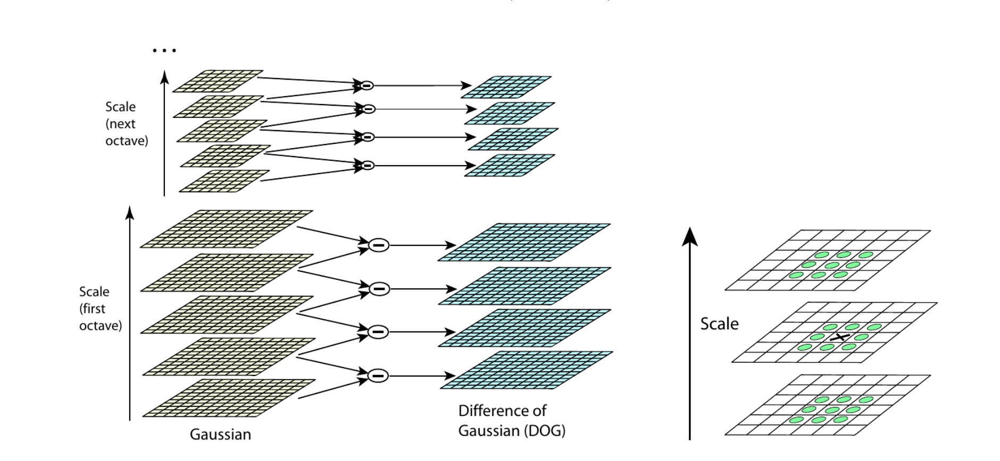

#### (3)Difference of Gaussian (DoG)

Image feature points are composed of local extrema in the DoG (Difference of Gaussians) scale space. To find these extrema in the DoG space, each pixel is compared with all of its neighboring points to determine whether it is larger or smaller than its neighboring points in both the image domain and scale domain. As shown in the figure below, the central detection point is compared with its 8 neighboring points at the same scale and 18 points corresponding to the upper and lower adjacent scales, totaling 26 points to ensure the detection of extrema in both the two-dimensional image space and scale space. If a point is the maximum or minimum value among these 26 points in the DoG scale space at the current layer and the two neighboring layers, it is considered a feature point in the image at that scale.
#### （4）Keypoint Localization
Key0points generated in the previous step produce a lot of keypoints. Some of them lie along an edge, or they don’t have enough contrast. In both cases, they are not as useful as features. So we get rid of them. 
The approach is similar to the one used in the Harris Corner Detector for removing edge features. For low contrast features, we simply check their intensities.

They used Taylor series expansion of scale space to get a more accurate location of extrema, and if the intensity at this extrema is less than a threshold value (0.03 as per the paper), it is rejected. DoG has a higher response for edges, so edges also need to be removed. They used a 2x2 Hessian matrix (H) to compute the principal curvature.

Detailed explanation:

* Keypoint Filtering:
Keypoints generated in the previous step might include features along edges or those with low contrast, which may not be sufficiently prominent or useful.
For features with low contrast, their intensities are examined. If the intensity is below a specified threshold (as mentioned in the paper, 0.03), the feature is excluded.

* Taylor Series Expansion:
Utilizing a Taylor series expansion of the scale space to obtain a more accurate location of extrema, improving the precision of keypoint localization.
Intensity Check and Exclusion:
For extrema identified through the Taylor series expansion, their intensities are checked. If the intensity falls below the set threshold, they are excluded.

* Edge Removal:
Due to the higher response of the Difference of Gaussians (DoG) for edges, further removal of edge features is necessary.
A **2x2 Hessian matrix** is employed to calculate the principal curvature. If the principal curvature is **small**, indicating the point may lie along an edge, it can be excluded.
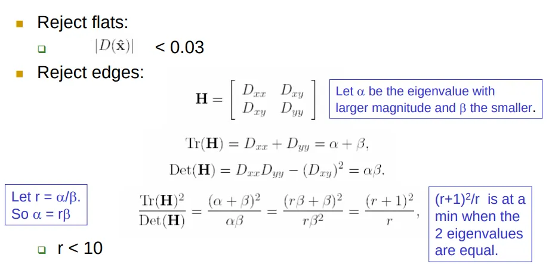
($f=\frac{\lambda_1\lambda_2}{\lambda_1+\lambda_2}$) for the Harris operator
Which means f is large indicates an edge

#### (5) Orientation Assignment
Now we have legitimate keypoints. They’ve been tested to be stable. We already know the scale at which the keypoint was detected (it’s the same as the scale of the blurred image). 
So we have **scale invariance**. The next thing is to assign an orientation to each keypoint to make it rotation invariance.

A neighborhood is taken around the keypoint location depending on the scale, and the gradient magnitude and direction is calculated in that region. 
An orientation histogram with 36 bins covering 360 degrees is created. Let's say the gradient direction at a certain point (in the “orientation collection region”) is 18.759 degrees, then it will go into the 10–19-degree bin. And the “amount” that is added to the bin is proportional to the magnitude of the gradient at that point. Once you’ve done this for all pixels around the keypoint, the histogram will have a peak at some point.
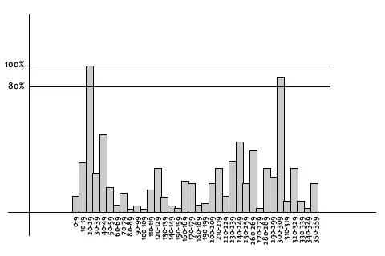
The highest peak in the histogram is taken and any peak above 80% of it is also considered to calculate the orientation. It creates keypoints with same location and scale, but different directions. It contributes to the stability of matching.
#### (6)Keypoint descriptor
At this point, each keypoint has a **location**, **scale**, **orientation**. Next is to compute a descriptor for the local image region about each keypoint that is highly distinctive and invariant as possible to variations such as changes in viewpoint and illumination.

To do this, a 16x16 window around the keypoint is taken. It is divided into 16 sub-blocks of 4x4 size.
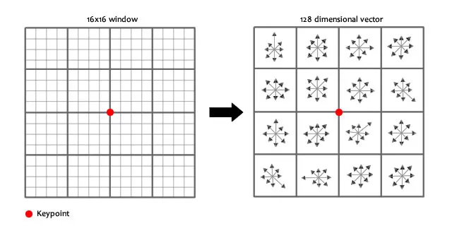
For each sub-block, 8 bin orientation histogram is created.
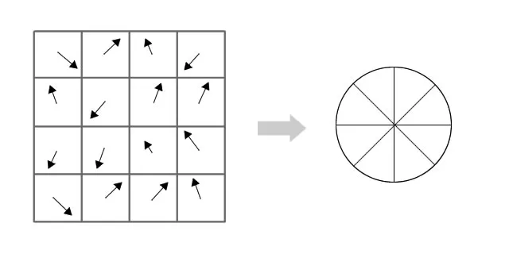

So 4 X 4 descriptors over 16 X 16 sample array were used in practice. 4 X 4 X 8 directions give 128 bin values. It is represented as a feature vector to form keypoint descriptor. This feature vector introduces a few complications. We need to get rid of them before finalizing the fingerprint.

* Rotation dependence 
  The feature vector uses gradient orientations. 
  Clearly, if you rotate the image, everything changes. All gradient orientations also change. 
  To achieve rotation independence, the keypoint’s rotation is **subtracted** from each orientation. Thus each gradient orientation is relative to the keypoint’s orientation.
* Illumination dependence 
  If we threshold numbers that are big, we can achieve illumination independence. So, any number (of the 128) greater than 0.2 is changed to 0.2. This resultant feature vector is normalized again. And now you have an illumination independent feature vector!
#### （7）Keypoint Matching
* Feature Descriptor Extraction: 
  For each detected feature point, SIFT calculates the gradient direction histogram in its surrounding neighborhood and arranges these histograms into a 128-dimensional vector, acting as the feature descriptor of this feature point. This step is based on the detection of keypoints, ensuring the scale and rotation invariance of the descriptor.
* Feature Matching: 
  A feature descriptor is used to find the nearest neighbor in the feature descriptor set of another image. The nearest neighbor distance measurement often uses Euclidean distance, meaning the smaller the distance, the higher the match. If no obvious nearest neighbor can be found, this feature point will be discarded and not used for further matching.
* Discarding Mismatches: 
  To enhance the reliability of matches, SIFT employs a ratio test to discard potential mismatches. This criterion involves the ratio of the distance of the nearest neighbor to that of the second nearest neighbor of a feature descriptor. If this ratio exceeds a predetermined threshold (such as 0.8), then the nearest neighbor is deemed a mismatch and should be discarded.
## Epipolar Geometry

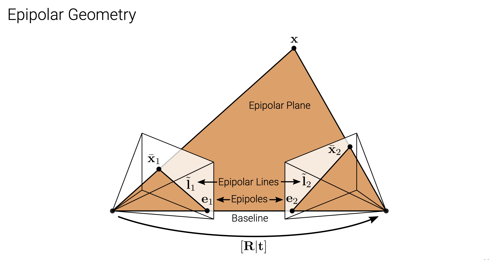

- Let R and t denote the relative pose between **two perspective cameras** 

- A 3D point x is projected to pixel $\bar{x}_1$in image 1 and to pixel $\bar{x_2}$ in image 2 

- The 3D point x and the two cameracenters span the **epipolar plane** 

- The correspondence of pixel $\bar{x}_1$ in image 2 must lie on the **epipolar line** $\widetilde{l2}$in image 2 

- All epipolar lines pass through the **epipole**

- Equations:

- Let $Ki ∈ R_{3×3}$denote the **camera matrix** of camera i.

- Let $\widetilde{x}i$= $K^{-1} x ̄_i$denote the **local ray direction** of pixel $x ̄_i$ in camera i.

- We have: 

- $x~_2 ∝ x_2 = Rx_1+t ∝ Rx~_1+st$

- Taking the **cross product** of both sides with t we obtain:

- $[t]×x~2 ∝ [t]×R x~1$

- Taking the **dotproduct** of both sides with$x~^⊤_2$yields (triple product):

- $x~^⊤_2 [t]×R x~1 ∝ x~^⊤_2 [t]×x~2 = 0 ⇒ x~^⊤_2 [t]×R x~1 = 0$

- We arrive at the **epipolar constraint**with **essential matrix:**

- $x~^⊤_2 E~ x~ _1 = 0 \ \ \widetilde{E} = [ t ] × R$

- $\widetilde{E}$ maps a point $x~_1$ in image 1 to the corresponding **epipolar line in image 2** $\widetilde{l}_2=\widetilde{E} x~ 1$

- Similarly, by transposition, we obtain the **epipolar line in image 1:**$\widetilde{l}_1 = \widetilde{E}^⊤ x~ 2$

- For any point $x~1$in the first image, the corresponding **epipolar line** $\widetilde{l}_2 = \widetilde{E}x~_1$in the second image passes through the so-called **epipole** $\tilde{e}_2$ which therefore satisfies $\widetilde{e}^⊤_2 \ \widetilde{l}_2 = \widetilde{e}^⊤_2 \widetilde{E}x~_1 = 0$ for all $x~_1.$

- It follows that:$\widetilde{e}^⊤_2 \widetilde{E} = 0$Thus,$e~^⊤_2$is the **leftnull-space** (left singular vector with singular value 0)of$\widetilde{E}$.Further:$\widetilde{E}e~_1 = 0$ Thus,$e~^⊤_1$ is the **rightnull-space** (right singular vector with singular value 0)of  $\widetilde{E}.$

- Recover R & t

- Derivation

  $\widetilde{x_{2i}}^T \widetilde{E} \widetilde{x_{1i}}=0$

- $\widetilde{E}=\begin{pmatrix} e_{11} & e_{12} & e_{13} \\ e_{21} & e_{22} & e_{23} \\ e_{31} & e_{32} & e_{33} \end{pmatrix} \ \ \ \ \ \ \ \ E = \begin{pmatrix} e_{11} \\ e_{12} \\ e_{13} \\ e_{21} \\ e_{22} \\ e_{23} \\ e_{31} \\ e_{32} \\ e_{33} \end{pmatrix}$$\Rightarrow x_1x_2e_{11} + y_1x_2e_{12} + x_2e_{13}+ x_1y_2e_{21} + y_1y_2e_{22} + y_2e_{23}+ x_1e{31} + y_1e_{32} + e_{33 }= 0$

- As $\widetilde{E}$ is homogeneous we use **singular value decomposition** to constrain the scale.

- Note that some terms are products of two image measurements and hence amplify measurement noise asymmetrically. Thus, the **normalized 8-point algorithm** whitens the observations to have zero-mean and unit variance before the calculation and back-transforms the matrix recovered by SVD accordingly.

- SVD Method

- Rearranging the product, so E is on the left hand side:$\widetilde{x_2}^T\widetilde{E}\widetilde{x_1} =\begin{pmatrix} x_{11}x_{12} & y_{11}x_{12} & x_{12}&x_{11}y_{12}&y_{11}y_{12}&y_{12}&x_{11}&y_{11}&1 \\ …… \\ x_{i1}x_{i2} & y_{i1}x_{i2} & x_{i2}&x_{i1}y_{i2}&y_{i1}y_{i2}&y_{i2}&x_{i1}&y_{i1}&1 \\…… \\x_{81}x_{82} & y_{81}x_{82} & x_{82}&x_{81}y_{82}&y_{81}y_{82}&y_{82}&x_{81}&y_{81}&1\end{pmatrix} \begin{pmatrix} e_{11} \\ e_{12} \\ e_{13} \\ e_{21} \\ e_{22} \\ e_{23} \\ e_{31} \\ e_{32} \\ e_{33} \end{pmatrix} =0$$\Rightarrow AE = 0$

- If there are more than 8 point correspondences, the system is usually over-determined and an exact solution is not possible. Instead, we solve a least squares problem for **AE**

- $min(||AE||),||E||=1$

<iframe src="https://drive.google.com/viewerng/viewer?url=https%3A//www.cs.cmu.edu/%7E16385/s17/Slides/11.5_SVD.pdf&amp;embedded=true" allowfullscreen="" frameborder="0" height="780" width="600" title="" class="eo n ff dy bg" scrolling="no" style="box-sizing: inherit; top: 0px; width: 680px; height: 884px; left: 0px;"></iframe>

Credits to Carnegie Mellon University and Kris Kitani, http://www.cs.cmu.edu/~16385/s17/Slides/11.5_SVD.pdf

- Properties of the \(\widetilde{E}\)

  - by readjustment:

  - $\widetilde{E} =\begin{bmatrix} u0&u1&u2 \end{bmatrix}\begin{bmatrix} s&0&0\\0&s&0\\0&0&s \end{bmatrix} \begin{bmatrix}v0^T\\v1^T\\v2^T \end{bmatrix} =U\sum V^T$

  - $s=\frac{\lambda_1+\lambda_2}{2}$   $\lambda_1\ge \lambda_2\ge\lambda_3$

- Proof

- 证明本质矩阵E EE奇异值具有$[σ,σ,0]^ T$的形式，只需证明矩阵$E^TE$的特征值具有\([\lambda, \lambda, 0]^T\)的形式。由于矩阵 $EE^T$与 $E^{T}E$有相同的非零特征值，所以证明内在性质也等价于证明矩阵\(EE^T\)的特征值具有$[\lambda, \lambda, 0]^T$的形式

- 具体证明见https://blog.csdn.net/weixin_44387324/article/details/119182590

- Thus we have

   $W=\begin{bmatrix} 0&-1&0\\1&0&0\\0&0&1 \\ \end{bmatrix} \\ t_x=UW\sum U^T \\ R=UW^{-1}V^T \\E=U\sum V^T$

- Fundamental matrix (if Ki unknown):

- $\widetilde{x_2}^T\widetilde{E}\widetilde{x_1}=\bar{x_2}^T\widetilde{F}\bar{x_1}$

- $\widetilde{F} = K_2^{-1}\widetilde{E} K_1^{-1}$

## Triangulation

- Let $x~^s_i = \widetilde{P}_ i x~_w$ denote the projection of a 3D world point $x~_w$ onto the image of the i’th camera $x~^s_i$.

- Consider the cross product $x ̄^s_i × \widetilde{P}_ix~_w =0$.

- Using $p~^⊤_{ik}$ to denote the k’th row of the i’th camera’s projection matrix $\widetilde{P_i}$, we obtain:

- $\begin{bmatrix}x^s_i\widetilde{p}_{i3}^T - \widetilde{p}_{i1} \\ y^s_i\widetilde{p}_{i3}^T - \widetilde{p}_{i2} \end{bmatrix}\widetilde{x}_w=0$

- $\bar{x}_i^s=(x_i^s,y_i^s,1)$

- Stacking N ≥ 2 observations of a point, we obtain a linear system $Ax~_w = 0.$As $x~_w$ is homogeneous this leads to a constrained least squares problem. The solution to this problem is the **right singular vector** corresponding to the smallest singular value of A. This is the **Direct Linear Transformation** we are already familiar with from Lecture 2.

- Proof https://blog.csdn.net/u011178262/article/details/86729887

- **Reprojection Error Minimization:**

While DLT often works well, it is not invariant to perspective transformations.The gold standard is to minimize the reprojection error using numerical methods:

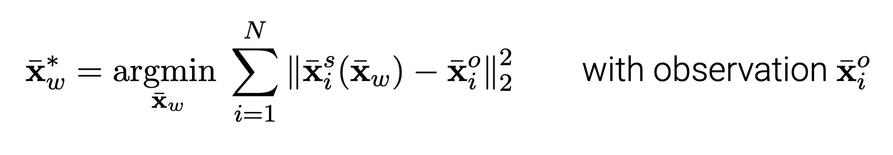

- This allows to take measurement noise appropriately into account
- The minimum can also be obtained in closed form as the solution of a sixth degree polynomial, see Hartley & Zisserman, Section 12.5 for details.

## Factorization

### Orthographic Factorization

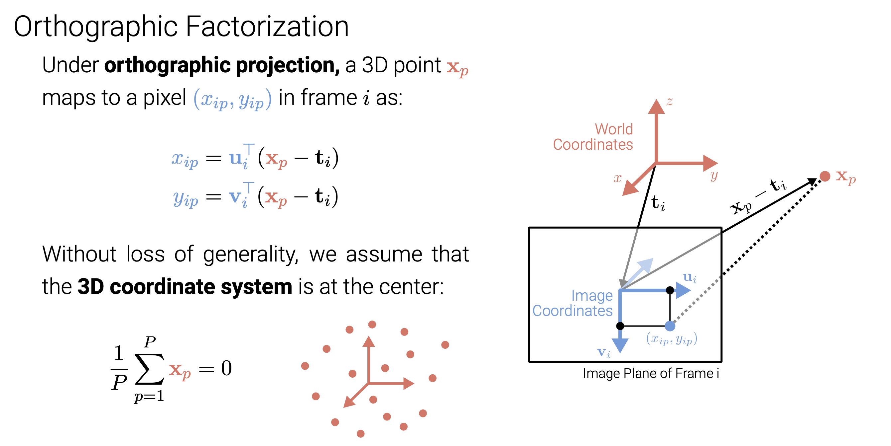

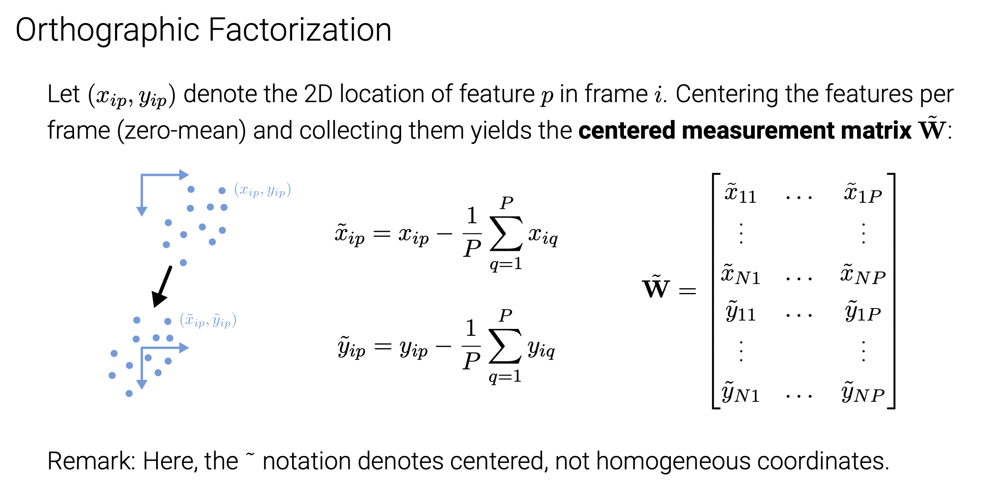

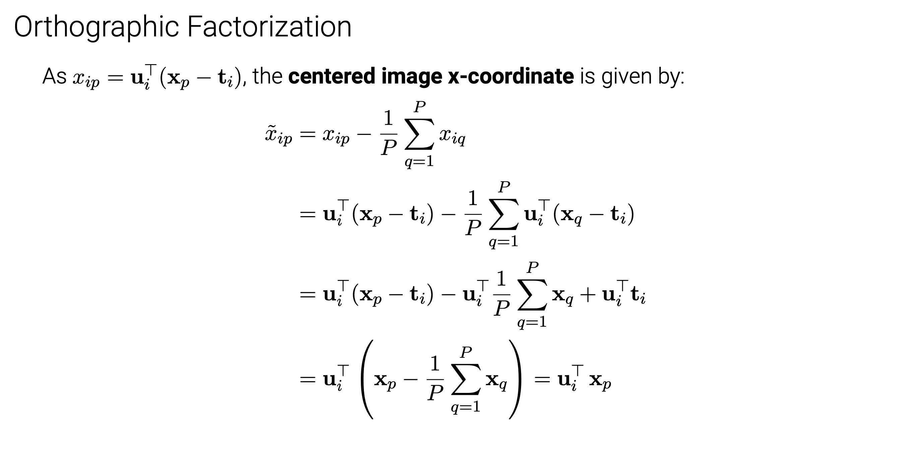

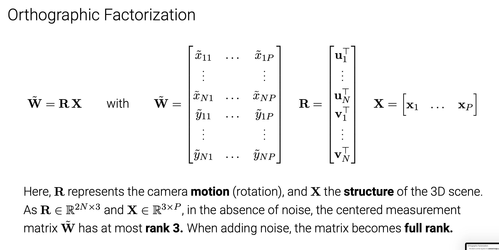

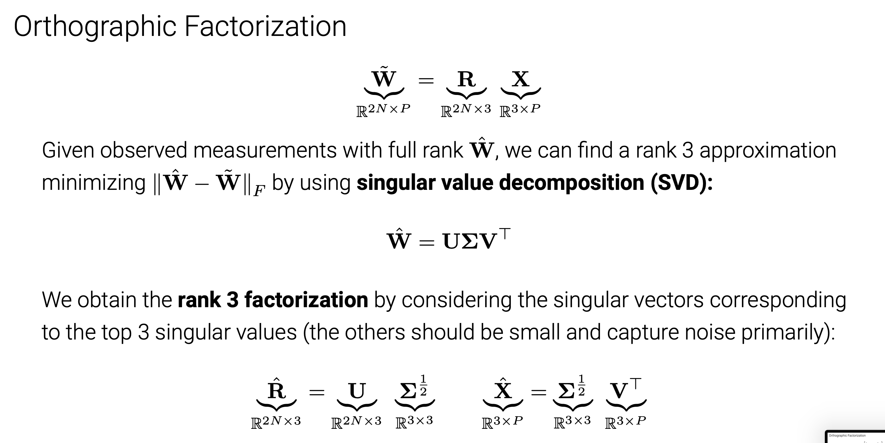

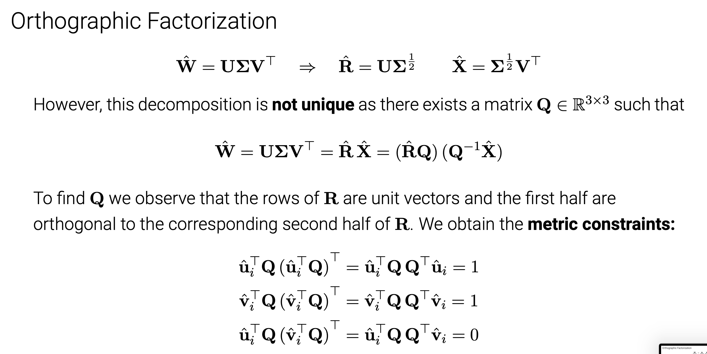

#### **Algorithm:**

1.Take measurements $\hat{W}$

2.Compute SVD $\hat{W} = UΣV^⊤ $and keep the top 3 SVs

3.Define$\hat{R} =UΣ^{\frac{1}{2}}$ and $\hat{X} =\sum^{\frac{1}{2}}V^T$

4.Compute $QQ^⊤$ and from this Q

5.Compute$R=\hat{R}Q$and$X=Q^{-1}\hat{X}$

Remarks:

- Advantage: **closed form solution** (determined up to an arbitrary global rotation)
- Disadvantage: **complete feature tracks** required (⇒ cannot handle occlusions)
- Solution: Apply to subsets of features/frames and propagate (see T&K, Sec. 5)

## Bundle Adjustment

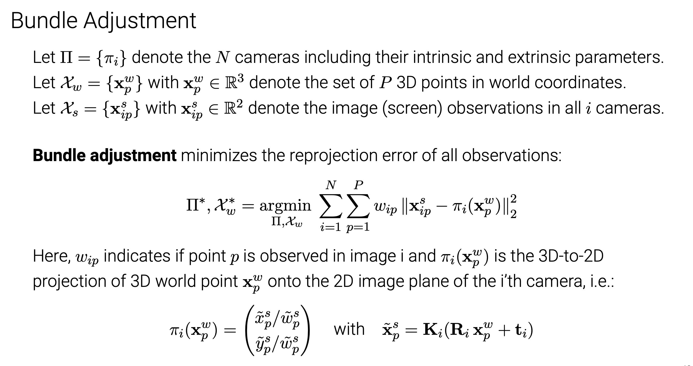

### Appendix

- CNN https://www.zhihu.com/question/52668301/answer/1231346589