## Shape-from-Shading

### Recap: Rendering Equation

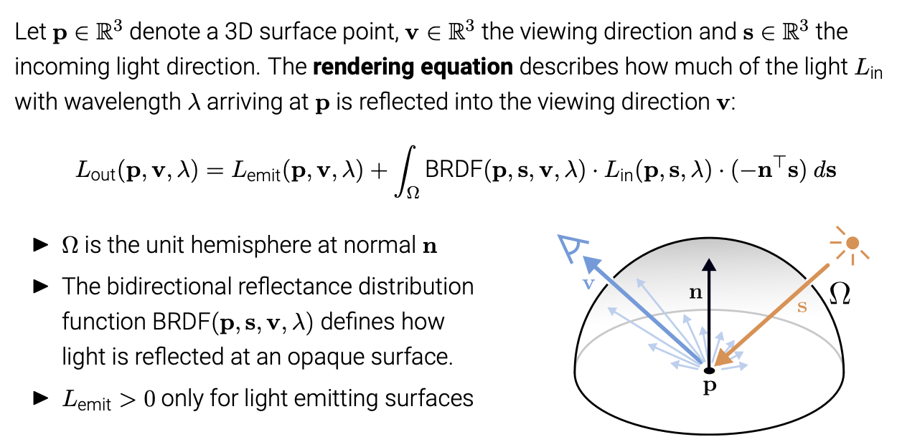

* $BRDF$ : $Radience_{out}/Irradiance_{in}$​

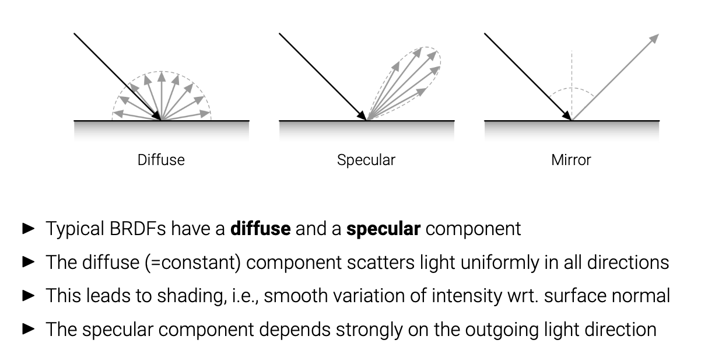

#### Simplifying the Rendering Equation

Dropping the dependency on λ and p for notational simplicity, and considering a **single point light source** located in direction s, the rendering equation simplifies as follows:

$L_{out}(v)=BRDF(s,v)·L_{in}·(-n^{T}·s)$ 

Assuming a purely **diffuse material** with albedo (=diffuse reflectance) BRDF(s, v) = ρ ， further simplifies to the following equation (Lout becomes independent of v): $L_{out} = ρ · L_{in} · (−n^⊤·s)$

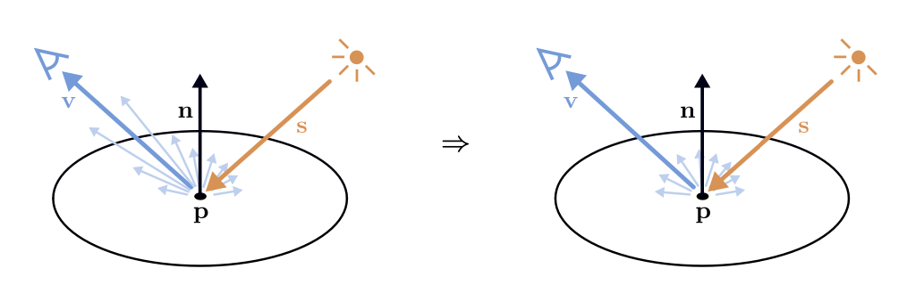

For simplicity, we further eliminate the **minus sign** by reversing the orientation (definition) of the light ray s and obtain:

$L_{out} = ρ · L_{in} · n^⊤s$

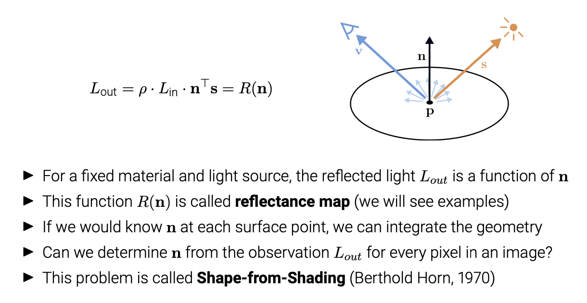

### Shape-from-Shading

**Gradient Space Representation**

* 2 degrees of freedom of $\vec{n}$​

​	$(p,q)=(-\frac{\partial z}{\partial x},-\frac{\partial z}{\partial y})$

​	$\vec{n}=\frac{(p,q,1)^T}{\sqrt{p^2+q^2+1}}$

* Assuming $ρ · L_{in} = 1$, the **reflectance** becomes:

  $R(n)=n^Ts=\frac{ps_x+qs_y+s_z}{1+\sqrt{p^2+q^2+1}}=R(p,q)$

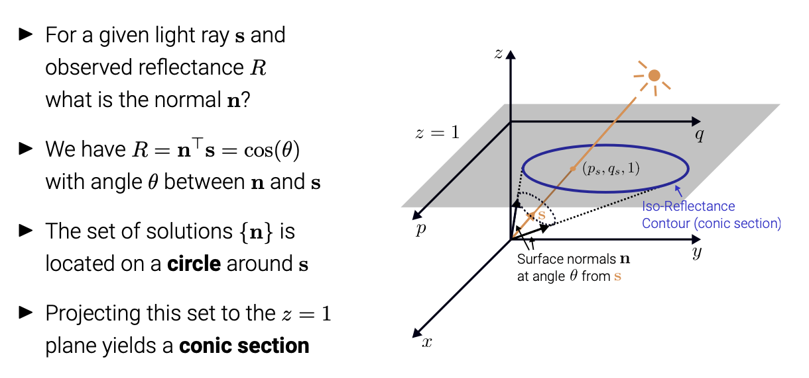

**Reflectance Map**

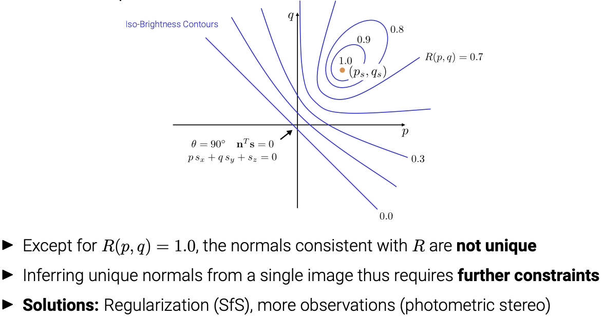

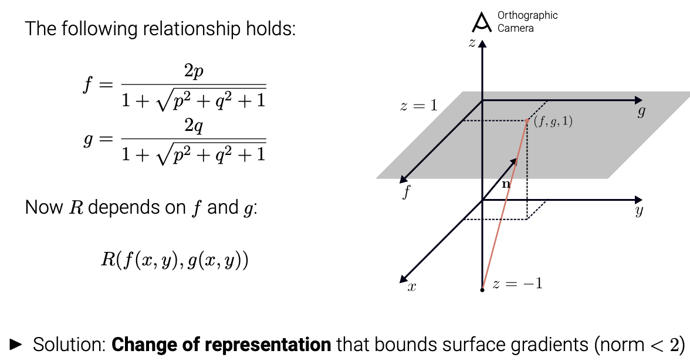

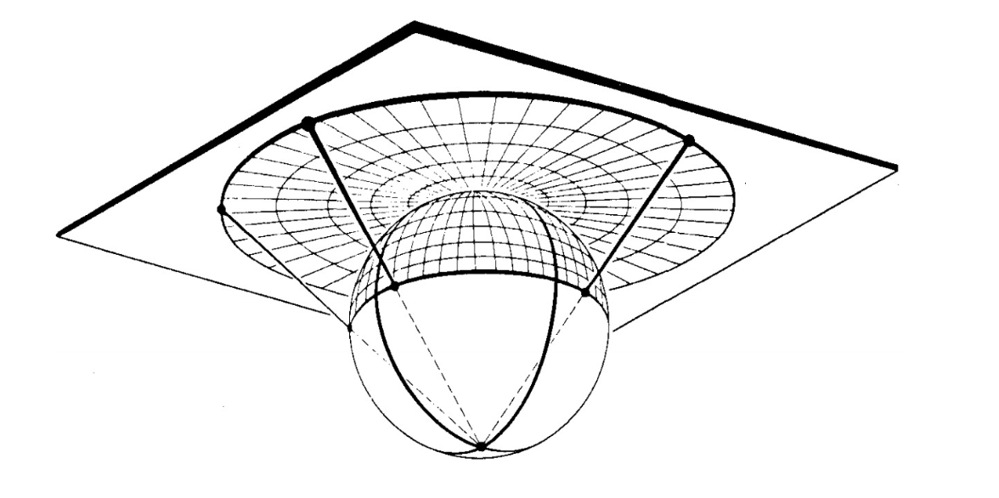

* The stereographic mapping projects each point on the surface of the sphere, along a ray from one pole, onto a plane tangent to the opposite pole.

**Shape-from-Shading Formulation**

* **Assumption:** image irradiance (=intensity) should equal the reflectance map:$I(x, y) = R(f(x, y), g(x, y))$

* **SfS thus minimizes:**

  $E_{image}(f,g)=\iint (I(x,y)-R(f,g))^2dxdy$​

* **Goal:** Penalize errors between image irradiance and reflectance map

  However, as we have seen, this problem is ill-posed (unknowns > observations)

**Numerical Shape-from-Shading**

To constrain this ill-posed problem, SfS exploits two additional constraints:

* Smmothness:

  **Goal: **Penalize rapid changes in surface gradients $f$ and $g$

​	$E_{smooth}(f,g)=\iint (f_x^2+f_y^2+g_x^2+g_y^2)dxdy$ with gradients $f_x=\frac{\partial f}{\partial x}$ $f_y=\frac{\partial f}{\partial y}$​​

* Occluding Boundaries:

  **Goal:** Constrain normals at occluding boundaries where they are known

​	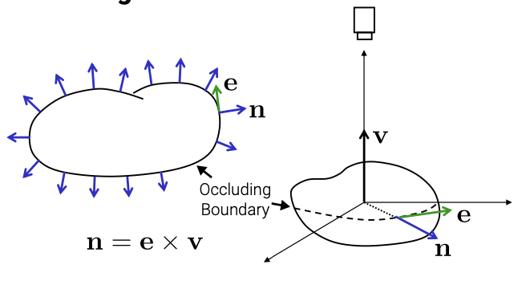

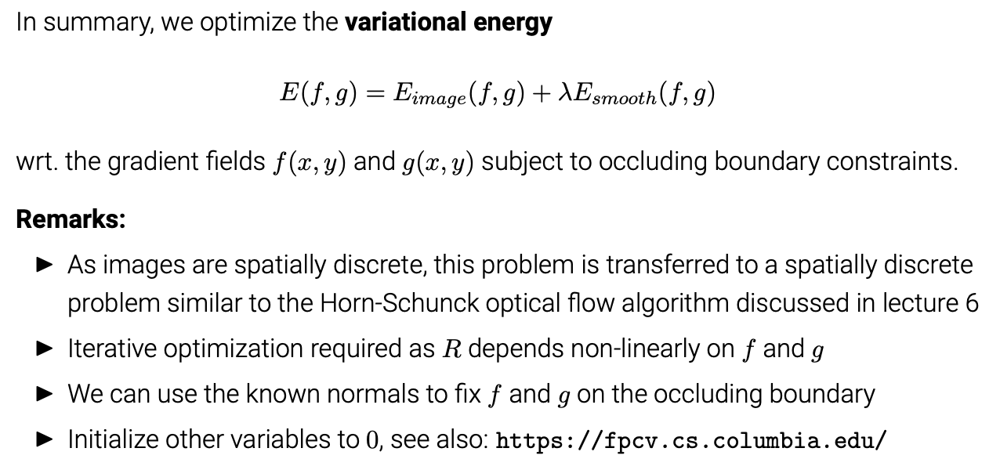

#### Surface Integration

Given the **surface gradients** (from above methods) $(p,q)=(-\frac{\partial z}{\partial x},-\frac{\partial z}{\partial y})$ how can we **recover the 3D surface** / depth map?

Assuming a smooth surface, we can solve the following **variational problem**

$E(z)=\iint[(\frac{\partial z}{\partial x}+p)^2+(\frac{\partial z}{\partial y}+q)^2]dxdy $​​ 

efficiently using the discrete **Fast Fourier Transform** (Frankot and Chellappa, 1988).

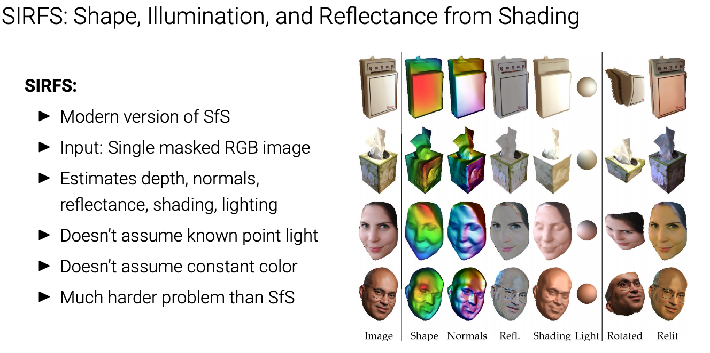

## Photometric Stereo

* Instead of smoothness constraints, add **more observations per pixel**

* Take **K images** of the object from **same viewpoint** (e.g., with a tripod) but with different (known) point light source each

  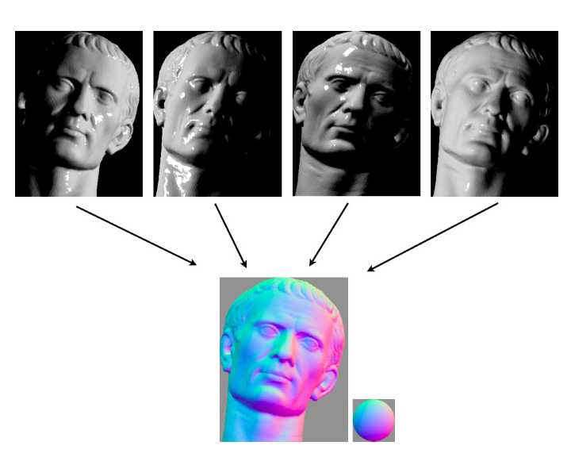

* Per-pixel estimation of **normal** and **albedo** or **material**

* Also assumes far camera/light

#### Reflectance Maps

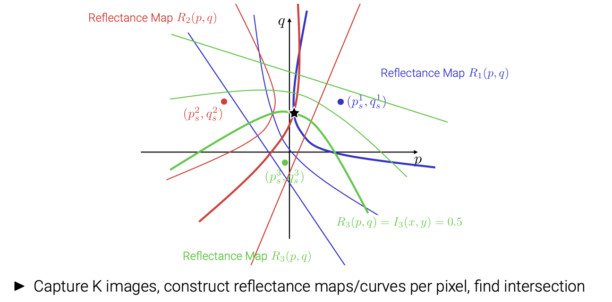

#### Photometric Stereo Formulation

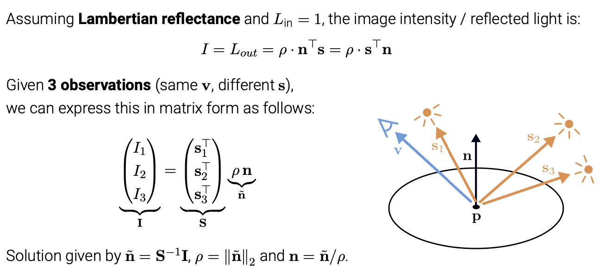

* If $s_3 = αs_1 + βs_2$

   i.e., if all three light sources $s_1, s_2, s_3$ and the origin $p$ lie on a 3D plane, the linear system becomes rank-deficient and thus there exists no unique solution $\tilde{n} = S^{-1}I$​.

* Better results can be obtained by using **more images** (by averaging noise):

  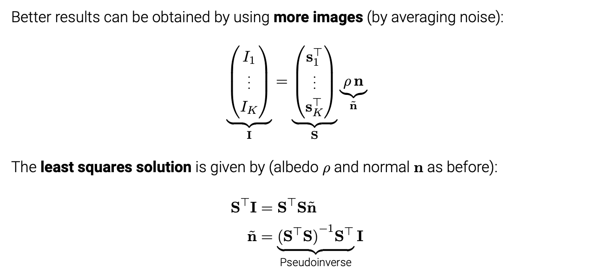

#### Photometric Stereo Algorithm

1. Compute **surface normals and albedo** values (per pixel) 
2. **Integrate depth** from surface normals
3. **Relight** the object (here: with uniform albedo)

* For color images, apply PS to each channel separately to obtain color albedo
* Deviations from Lambertian assumption and global illumination cause errors

#### Deep Uncalibrated Photometric Stereo（not single light ray)

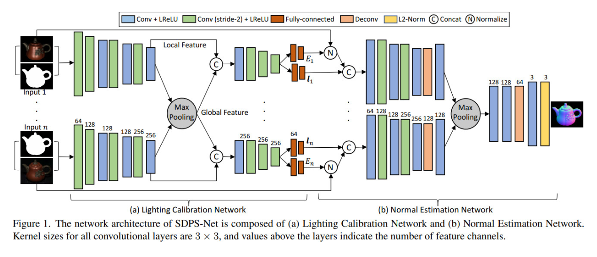

## Shape-from-X

Refer to PPT

## Volumetric Fusion

#### Representation

* Explicit 

  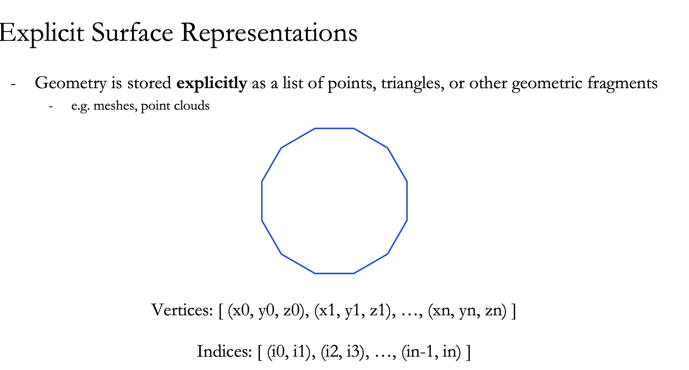

* Implicit

  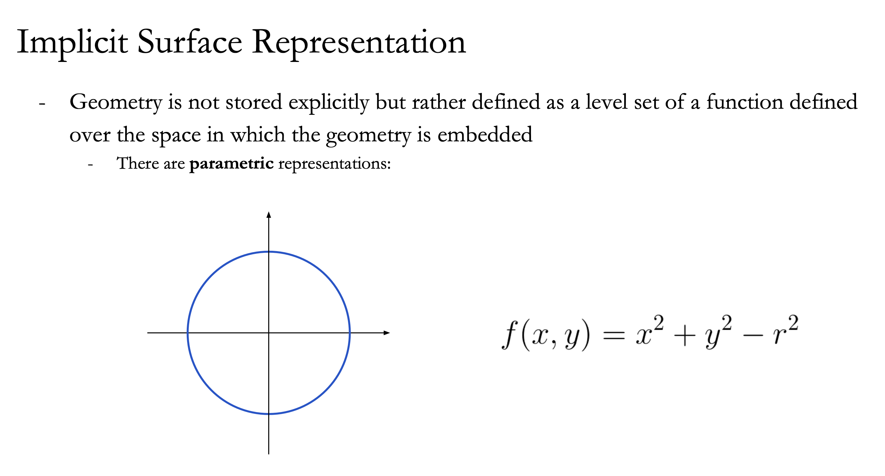

  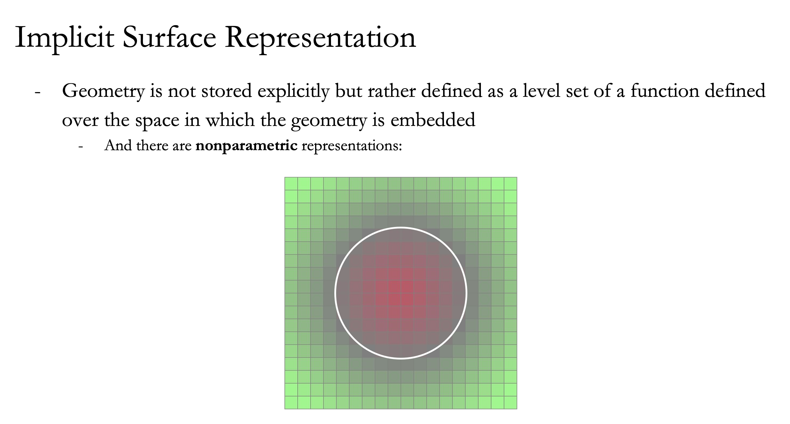

**3 Steps:**

* Depth-to-SDF Conversion 
* Volumetric Fusion
* Mesh Extraction

#### Depth-to-SDF Conversion

As the distance to surface is unknown, approximate it with **distance along ray**

* Take the voxel center that intersect with a particular ray and meaure the distance

  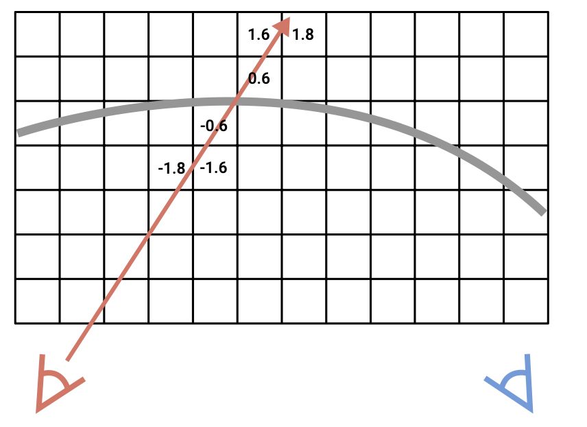

This approximation is good only in the vincinity of the surface (often suffices)

#### Volumetric Fusion

* Orthographic Example

  After conversion, calculate average of the discrete SDF fields

  The implicit surface will be an average of the two original ones

  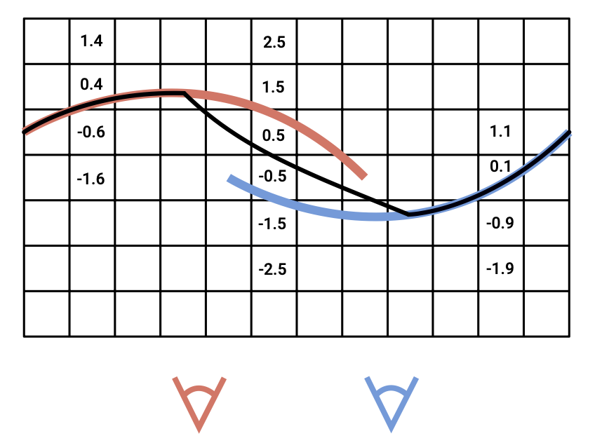

* Formulation

  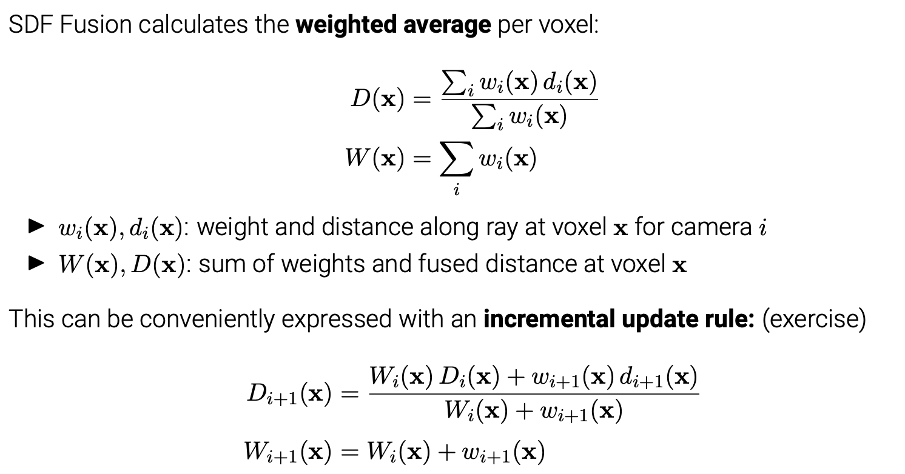

  * Thus constant time

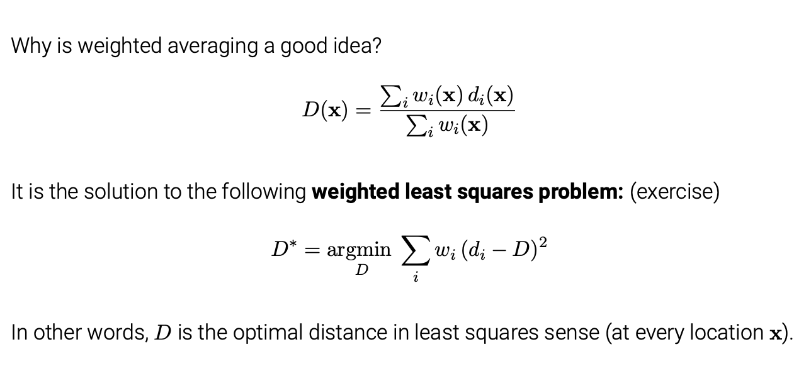

#### Mesh Extraction

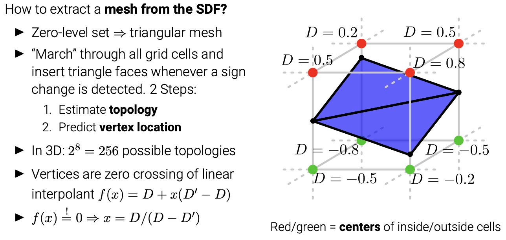

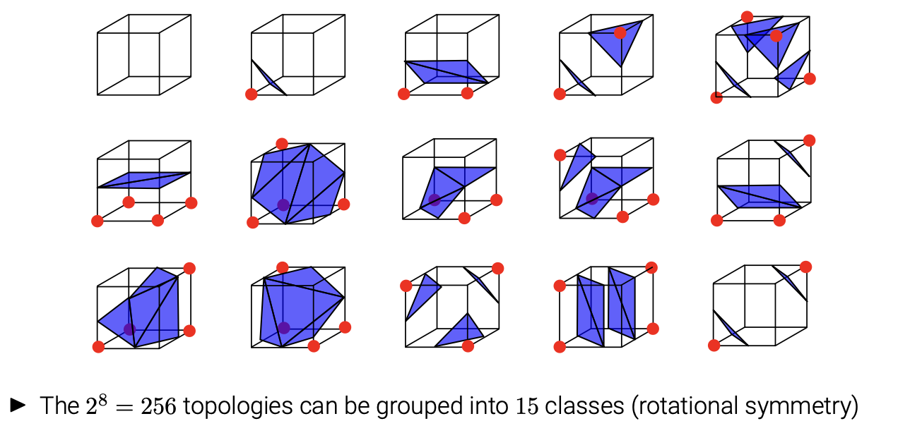

### Applications

#### KinectFusion

#### DynamicFusion

#### OctNetFusion

#### Deep Marching Cubes

