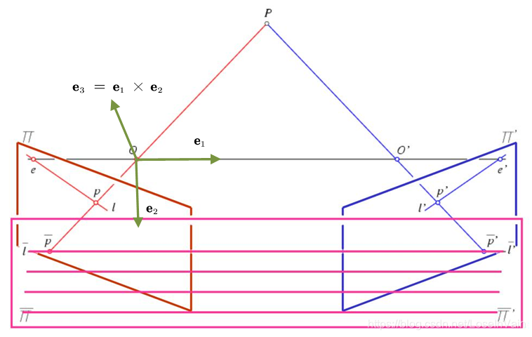
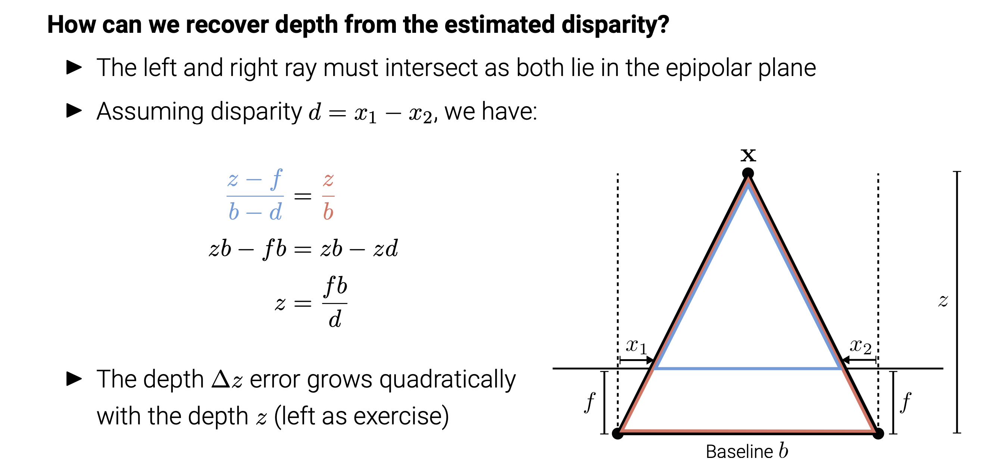
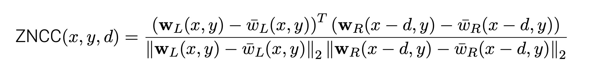
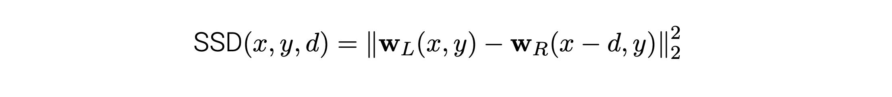
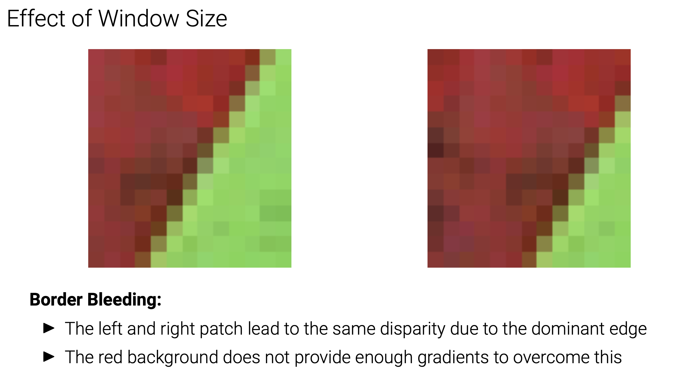
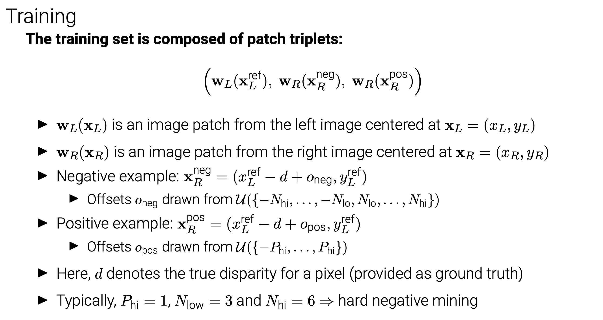

# Stereo Reconstruction

## Preliminaries

### Epipolar Geometry

- A point$\bar{x}$in the left image must be located on the epipolar line$\widetilde{l}_2$
- This reduces correspondence search to a (much simpler) **1D problem** I For VGA images: ～640 instead of ～300k hypotheses (factor 480 less)

#### Image Rectification

**What if both cameras face exactly the same direction?**

- Image planes are co-planar ⇒ Epipoles at infinity, epipolar lines parallel.
- Correspondences search along **horizontal scanlines** (simplifies implementation)
- Let$K1 = K2 = R = I$ and$t = (t,0,0)^⊤$

- $\bar{x_2}^T\tilde{E}\bar{x_1}=\bar{x_2}^T \begin{bmatrix}0&0&0\\0&0&-t\\0&t&0\end{bmatrix}\bar{x1}=ty1-ty2=0$

- Thus $y1=y2$

**What if the images are not in the required setup?**

- There is a trick: We can rewarp them through **rotation,** mapping both image planes to a common plane parallel to the baseline, this is called
- For this rotation around the camera center, the 3D structure must not be known

**How can we make epipolar lines horizontal?**

- Step1:Estimate$\tilde{E}$ , decompose into $t$and $R$

- Step2: Find $R_{rect}$

  > Choose $OO^′=t=(t_x,t_y,t_z)^T$
  >
  > $e_1=\frac{T}{∣∣T∣∣}$
  >
  > $e_2=\frac{1}{\sqrt{T_x^2+T_y^2}}(-Ty,Tx,0)^T= [(0, 0, 1)^⊤]×r_1$
  >
  > $e_3=e_2$ x $e_1$
  >
  > $\Rightarrow R_{rect}=\begin{bmatrix}e_1^T\\e_2^T\\e_3^T\end{bmatrix}$

- Step3:Adjust $\tilde{x}_i$

  > Warp pixels in the first image as follows: $\tilde{x}_1^{'}= KR_{rect}K_1^{-1}x ̄_1$
  >
  > Warp pixels in the second image as follows: $\tilde{x}_2^{'}=KRR_{rect}K_2^{-1}x ̄_2$
  >
  > NOTE ：Different coordinate systems result in different perception of $R_{rect}$,Thus the $R_{rect}^{'}=RR_{rect}$
  >
  > K is a shared projection matrix that can be chosen arbitrarily (e.g., K = K1)
  >
  > In practice, the inverse transformation is used for warping (i.e. query the source)

#### Disparity to Depth

### Block Matching

- Choosedisparityrange[0,D]
- For all pixels x = (x, y) compute the best disparity ⇒ winner-takes-all (WTA)
- Do this for both images and apply left-right consistency check to remove outliers

#### Zero Normalized Cross-Correlation

#### Sum of squared differences (SSD)

#### Assumption Violations

- Block matching assumes that all pixels inside the window are displaced by d

- This is called the **fronto-parallel assumption** which is often invalid

- **Slanted surfaces** deform perspectively when the viewpoint changes

- **Effect of Window Size**

- Small windows lead to matching ambiguities and noise in the disparity maps

- Larger windows lead to smoother results, but loss of details and border bleeding

  - **Border Bleeding:**

  

- **Left-Right Consistency Test:**

### Siamese Networks

#### Training

#### Loss Function

**Hinge Loss:**$L = max(0, m + s_- - s_+)$

- $s_- / s_+$ is the score of the network for the negative/positive example

- The loss is zero when the similarity of the positive example is greater than the similarity of the negative example by at least margin m

- The network is trained by **minimizing** a **hinge loss**. 

- The loss is computed by considering pairs of examples centered around the same image position where one example belongs to the positive and one to the negative class.

- Let $s_+$be the output of the network for the positive example, $s_-$ be the output of the network for the negative example

- Let m, the margin, be a positive real number.

- The hinge loss for that pair of examples is defined as $L = max(0, m + s_- - s_+)$ The loss is zero when the similarity of the positive example is greater than the similarity of the negative example by at least the margin m.

- Set the margin to 0.2 in our experiments.

#### Paper

<iframe src="https://drive.google.com/viewerng/viewer?url=https%3A//www.jmlr.org/papers/volume17/15-535/15-535.pdf&amp;embedded=true" allowfullscreen="" frameborder="0" height="780" width="600" title="" class="eo n ff dy bg" scrolling="no" style="box-sizing: inherit; top: 0px; width: 680px; height: 884px; left: 0px;"></iframe>

https://www.jmlr.org/papers/volume17/15-535/15-535.pdf

### Spatial Regularization

- Add Pairwise terms: Smoothness between adjacent pixels in addition to matching costs;

- Potts: $ψ_{smooth}(d, d^′) = [d\ne d^′]$

- Truncated$l_1:ψ+{smooth}(d,d^′)=min(|d-d^′|,τ)$

- Paper 

  https://dash.harvard.edu/bitstream/handle/1/3637107/Mumford_StatRangeImage.pdf?sequence=3&isAllowed=y

### End-to-End Learning

**End to End learning** in the context of AI and ML is a technique where the model learns all the steps between the initial input phase and the final output result. This is a deep learning process where all of the different parts are simultaneously trained instead of sequentially.

##### DISPNET

##### GCNET

##### STEREO MIXTURE DENSITY NETWORKS (SMD-NETS)