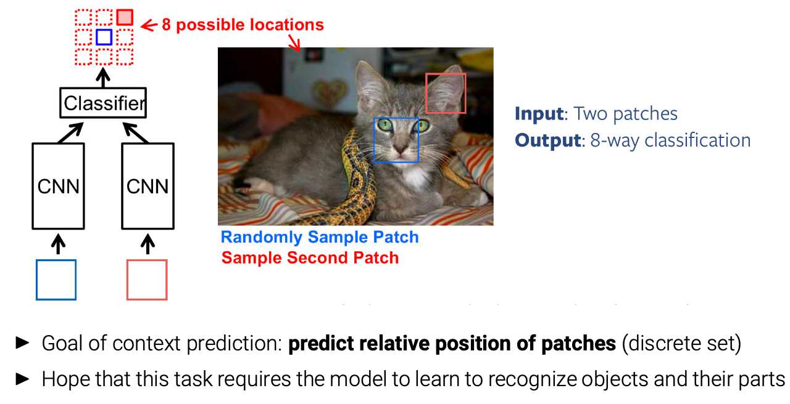

## Preliminaries

* Refer to Slides

**Idea of self-supervision:**

* Obtain labels from raw unlabeled data itself 
* Predict parts of the data from other parts

## Task-specific Models

### Unsupervised Learning of Depth and Ego-Motion

####  Depth Estimation Network

> Specifically, at training time, we have access to two images $I^l$ and $I^r$ , corresponding to the left and right color images from a calibrated stereo pair, captured at the same moment in time. 
>
> Instead of trying to directly predict the depth, we attempt to find the **dense correspondence field** $d_r$ that, when applied to the left image, would enable us to reconstruct the right image. We will refer to the reconstructed image $I^l(d_r)$ as $\tilde{I}^r$​. Similarly, we can also estimate the left image given the right one, $\tilde{I}^l =I^r(d_l)$.
>
>  Assuming that the images are rectified , $d$ corresponds to the image disparity - a scalar value per pixel that our model will learn to predict. Given the baseline distance $b$ between the cameras and the camera focal length $f$, we can then trivially recover the depth $\hat{d}$ from the predicted disparity, $\hat{d}=bf/d$​​​.

**Simultaneously** infer both disparities (left-to-right and right-to-left), using only the left input image, and obtain better depths by enforcing them to be consistent with each other.

* Naively learning to generate the right image by sampling from the left

#### Digging Into Self-Supervised Monocular Depth Estimation

### Unsupervised Learning of Optical Flow

* Refer to Slides and Paper.

## Pretext Tasks

A **pretext** (adj: pretextual) is an excuse to do something or say something that is not accurate. **Pretexts** may be based on a half-truth or developed in the context of a misleading fabrication. **Pretexts** have been used to conceal the true purpose or rationale behind actions and words

### Visual Representation Learning by Context Prediction

* Care has to be taken to **avoid trivial shortcuts** (e.g., **edge continuity**)

*  A network can predict the **absolute image location** of randomly sampled patches In this case, the relative location can be inferred easily. Why is this happening?

  > 

* **Aberration:** Color channels shift with respect to the image location

  > Solution: Random dropping of color channels or projection towards gray

### Visual Representation Learning by Solving Jigsaw Puzzles

* Refer to Slides and Paper

## Contrastive Learning

Can we find a more general pretext task?

* Pre-trained features should represent **how images relate** to each other
* They should also be **invariant to nuisance factors** (location, lighting, color)
* Augmentations generated from one reference image are called “views”

I Given a chosen **score function** $s(·, ·)$, we want to learn an encoder f that yields **high score for positive pairs** $(x, x+)$ and **low score for negative pairs** $(x, x−)$:$s(f(x), f(x+)) ≫ s(f(x), f(x−))$

* Remaining Refer To Slides and Paper

### Barlow Twins

* Refer to Slides and Paper

