## Image Format

Digital image can be represented as a **2D** array or matrix.

* Grayscale:Each pixel in a grayscale image is represented by a **byte** (8 bits), which covers **256** degrees by **[0..255]** 

* Colour image: Each pixel in a color image is represented by **3 bytes (24 bits)**, which are for R (red), G (Green) and B (Blue), respectively.

> 目的：存储图像
>
> 信息图像特点：以像素为单位，矩形区域信息量大
>
> 有些文件格式与操作系统有关：windows、unix、mac编码方式：**无压缩、无损压缩、有损压缩**

### 1.BMP的文件格式：

​	BMP（Bitmap）是一种常见的图像文件格式，是Windows系统的一种标准文件格式。BMP 位图文件默认的文件扩展名是 bmp 或者 dib。大多数情况下，BMP 图像采用**非压缩**方式；然而，它也支持图像压缩，例如 RLE 格式。下面介绍BMP文件的具体文件结构。

> BMP 图像每一行扫描由表示图像像素的连续的字节组成，每一行以四字节对齐（以0补齐）。图像的扫描行是由底向上存储的，这就是说，阵列中的第一个字节表示位图左下角的像素，而最后一个字节表示位图右上角的像素。

```C

// 定义BMP文件头的大小为54个字节，通常情况下固定不变
#define HEADERSIZE 54

// 定义几种不同数据类型的别名，以便在代码中使用更具可读性的名称
typedef unsigned char byte;
typedef unsigned short word;
typedef unsigned int dword;

// 使用#pragma pack(1)指令设置结构体的字节对齐方式为1字节
#pragma pack(1)

// 定义BMP文件头的结构体
typedef struct {
    word bfType;          // BMP文件的类型标识，通常为"BM"
    dword bfSize;         // BMP文件的大小，以字节为单位
    word reserved1;       // 保留字段，设置为0
    word reserved2;       // 保留字段，设置为0
    dword bfOffset;       // 位图数据的偏移量，即文件头的大小
} BMPHeader;

// 定义BMP信息头的结构体
typedef struct {
    dword size;           // 信息头的大小，通常为40字节
    int width;            // 图像的宽度，以像素为单位
    int height;           // 图像的高度，以像素为单位
    word planes;          // 颜色平面数，通常为1
    word bitCount;        // 每个像素的位数
    dword compression;    // 压缩类型
    dword imageSize;      // 位图数据的大小，以字节为单位
    int xPixelsPerMeter;  // 水平分辨率，每米的像素数
    int yPixelsPerMeter;  // 垂直分辨率，每米的像素数
    dword colorsUsed;     // 使用的颜色数
    dword colorsImportant; // 重要颜色数
} BMPInfoHeader;

// 定义调色板中的一个颜色的结构体
typedef struct {
    byte blue;     // 蓝色分量
    byte green;    // 绿色分量
    byte red;      // 红色分量
    byte reserved; // 保留字段，通常设置为0
} pallete;

// 定义包含BMP文件头、BMP信息头、调色板和位图数据的完整BMP图像的结构体
typedef struct {
    BMPHeader bmph;         // BMP文件头
    BMPInfoHeader bmpih;    // BMP信息头
    pallete colours[256];   // 调色板，通常用于8位颜色索引图像
    byte *bitmap;           // 位图数据
} BMP;
```

#### (1)BMP文件整体结构：

##### <center></center>

BMP 文件 大体上分为四个部分:图像文件头（Image file header）、图像信息头（Image information header）、调色板（Palette）、图像数据字节阵列（Image data）

* 对用到调色板的位图，图像数据为该像素颜色在调色板中的索引值
* 对于真彩色图，图像数据就是实际的 R、G、B 值。

#### (2)BMP图像文件头（Image file header）

<table>
  <font face="Times New Roman">
  <tr>
    <td>Start</td> 
    <td>Size(Byte)</td> 
    <td>Name</td> 
    <td>Purpose</td> 
  </tr>
  <tr>
    <td>1</td> 
    <td>2</td> 
    <td>bfType</td> 
    <td>Must always be set to 'BM'(0x4D42) to declare that this is a .bmp-file</td> 
  </tr>
  <tr>
    <td>3</td> 
    <td>4</td> 
    <td>bfSize</td> 
    <td>Specifies the size of the file in bytes.</td> 
  </tr>
  <tr>
    <td>7</td> 
    <td>2</td> 
    <td>bfReserved1</td> 
    <td>Must always be set to zero.</td> 
  </tr>
  <tr>
    <td>9</td> 
    <td>2</td> 
    <td>bfReserved2</td> 
    <td>Must always be set to zero.</td> 
  </tr>
  <tr>
    <td>11</td> 
    <td>4</td> 
    <td>bfOffBits</td> 
    <td>Specifies the offset from the beginning of the file to the bitmap data</td> 
  </tr>
</table>

* $bfOffbits$  说明从文件头开始到实际的图象数据之间的字节的偏移量。这个参数是非常有用的，因为位图信息头和调色板的长度会根据不同情况而变化，所以你可以用这个偏移值迅速的从文件中读取到**位数据**。

#### (3)BMP图像信息头（image information header）

<table>
  <font face="Times New Roman">
  <tr>
    <td>Size(Byte)</td> 
    <td>Name</td> 
    <td>Purpose</td> 
  </tr>
  <tr>
    <td>4</td> 
    <td>biSize</td> 
    <td>Number of bytes to define BITMAPINFOHEADER structure</td> 
  </tr>
  <tr>
    <td>4</td> 
    <td>biWidth</td> 
    <td>Image width (number of pixels)</td> 
  </tr>
  <tr>
    <td>4</td> 
    <td>biHeight</td> 
    <td>Image height (number of pixels). </td> 
  </tr>
  <tr>
    <td>2</td> 
    <td>biPlane</td> 
    <td>Number of planes. Always be 1.</td> 
  </tr>
  <tr>
    <td>2</td> 
    <td>biBitCount</td> 
    <td>Bits per pixel (Bits/pixel), which is 1, 4, 8, 16, 24 or 32. </td> 
  </tr>
  <tr>
    <td>4</td> 
    <td>biCompression</td> 
    <td>Compression type. Only non-compression is discussed here: BI_RGB.</td> 
  </tr>
  <tr>
    <td>4</td> 
    <td>biSizeImage</td> 
    <td>Image size with bytes. When biCompression=BI_RGB, biSizeImage=0.</td> 
  </tr>
  <tr>
    <td>4</td> 
    <td>biXPelsPerMeter</td> 
    <td>Horizontal resolution, pixels/meter.</td> 
  </tr>
  <tr>
    <td>4</td> 
    <td>biYPelsPerMeter</td> 
    <td>Vertical resolution, pixels/meter</td> 
  </tr>
  <tr>
    <td>4</td> 
    <td>biClrUsed</td> 
    <td>Number of color indices used in the bitmap (0->all the palette items are used).</td> 
  </tr>
  <tr>
    <td>4</td>
    <td>biClrImportant</td>
    <td>Number of important color indices for image display. 0->all items are important.</td>
  </tr>
  </font>
</table>

* 注明  $biHeight$ 可以表示图像是否倒置，$biHeight$ 为正数表示倒置（inverted）， 负数表示正常（upright)，大多数BMP文件是倒置的位图，即 $biHeight$>0
* biClrUsed说明位图实际使用的彩色表中的颜色索引数（设为0的话，则说明使用所有调色板项
* biClrImportant说明对图象显示有重要影响的颜色索引的数目，如果是0，表示都重要

#### (4)调色板（Palette）

* 调色板的大小为$N*4$ (bytes)。调色板中的每一项用1 字节表示蓝色分量、1 字节表示绿色分量、1 字节表示红色分量、1 字节用于填充符 (设置为 0)

> 有一个长宽各为200个象素，颜色数为16色的彩色图，每一个象素都用R、G、B三个分量表示
>
> 因为每个分量有256个级别，要用8位(bit)，即一个字节(byte)来表示，所以每个象素需要用3个字节。整个图象要用200×200×3，约120k字节，可不是一个小数目呀！如果我们用下面的方法，就能省的多。
>
> 因为是一个16色图，也就是说这幅图中最多只有16种颜色，我们可以用一个表：表中的每一行记录一种颜色的R、G、B值。这样当我们表示一个象素的颜色时，只需要指出该颜色是在第几行，即该颜色在表中的索引值。举个例子，如果表的第0行为255，0，0(红色)，那么当某个象素为红色时，只需要标明0即可
>
> 这张R、G、B的表，就是我们常说的调色板(Palette)，另一种叫法是颜色查找表LUT(Look Up Table)，似乎更确切一些。Windows位图中便用到了调色板技术。其实不光是Windows位图，许多图象文件格式如pcx、tif、gif等都用到了。所以很好地掌握调色板的概念是十分有用的。

#### (5)图像数据字节阵列（Image data）

* 图像数据字节阵列存储了调色板的索引号，或者取决于颜色深度的RGB值

* 其大小取决于图像大小和颜色深度。

(1)每一行的字节数必须是4的整倍数，如果不是，则需要补齐(append zero)

(2)一般来说，.bMP文件的数据从下到上，从左到右的

* 也就是说，从文件中最先读到的是图象最下面一行的左边第一个象素，然后是左边第二个象素……接下来是倒数第二行左边第一个象素，左边第二个象素……依次类推 ，最后得到的是最上面一行的最右一个象素。

* You do not need to turn around the rows manually. The API functions which also display the bitmap will do that for you automatically.

  | 6 bytes that represent a row in the bitmap: | A0 37 F2 8B 31 C4           |
  | ------------------------------------------- | --------------------------- |
  | must be saved as:                           | A0 37 F2 8B 31 C4 **00 00** |

#### 2.BMP文件的读入和存储

利用 C 语言中的 *fopen* *fread* *fwrite* 进行读入、写出即可

在读入与写出的过程中，需要注意 BMP文件信息的调整，例如由24位彩色BMP转为灰色图时，需要注意调色板、位深等的调整。

```C
FILE *inputFile = fopen("input.bmp", "rb");
 // 检查文件是否成功打开
if (!inputFile) {
    printf("Unable to open input BMP file.\n"); // 输出错误信息
    return 0; // 退出程序
}
printf("successfully loaded!"); // 成功加载的提示信息
BMP bmp; // 创建一个BMP结构体变量用于存储BMP文件的信息和数据
// 从文件中读取BMP文件头和信息头
fread(&(bmp), HEADERSIZE, 1, inputFile);
int width = bmp.bmpih.width; // 获取图像的宽度
int height = bmp.bmpih.height; // 获取图像的高度
// 如果图像大小为0，则计算图像数据大小
if (bmp.bmpih.imageSize == 0) {bmp.bmpih.imageSize = bmp.bmph.bfSize - bmp.bmph.bfOffset;}
// 为位图数据分配内存
bmp.bitmap = (byte*)malloc(sizeof(byte) * (bmp.bmph.bfSize - HEADERSIZE));
// 从文件中读取位图数据
fread(bmp.bitmap, bmp.bmph.bfSize - HEADERSIZE, 1, inputFile);
fclose(inputFile); // 关闭文件
```

## Visual Intelligence and Pattern Analysis

### History

#### 针孔成像

* 投影便成为倒立的；物距越远,像越小；物距越近,像越大

* 如前面提到的情况，光圈孔径大的时候，会导致模糊；那是不是可以尽量缩小光圈的孔径呢？

  NO.如果孔径太小，可通过的光线就很少，导致光强太弱，同时当孔径小到一定程度时，会产生衍射现象。

#### Lenses

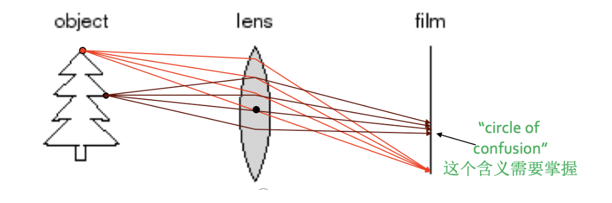

* 通过使用透镜可以会聚更多的光线到一个成像点，只是只有在特殊的位置上才能达到这个目标，即大家以前就学习过的透镜聚焦

* 位于合适距离的物体点可以成清晰像，其他的点则会产生弥散圆 通过改变镜头的形状可以改变聚焦时的物体点所需要的距离
* 弥散圆(circle of confusion) ：在焦点前后，光线开始聚集和扩散，点的影像变模糊，形成一个扩大的圆
* 如果弥散圆的直径小于人眼的鉴别能力，在一定范围内实际影像产生的模糊是不能辨认的。不能辨认的直径叫做容许弥散圆。焦点前后各有一个容许弥散圆
* 对于6寸照片，观察距离25－30cm ，大概是底片对角线1/1000-1/1500.

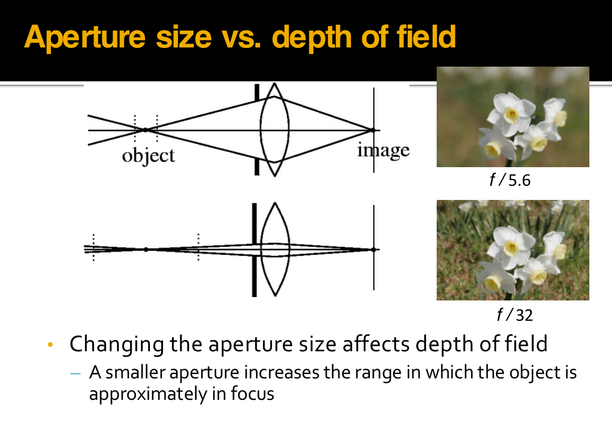

* 光圈的大小与景深有密切关系：焦点前后各有一个容许弥散圆，他们之间的距离叫做**景深**

  景深随镜头的焦距、光圈值、拍摄距离而变化

  (1)镜头光圈：光圈越大，景深越小；光圈越小，景深越大

  (2)镜头焦距：镜头焦距越长，景深越小；焦距越短，景深越大

  (3)拍摄距离：距离越远，景深越大；距离越近，景深越小

  For a given subject framing and camera position, the DOF is controlled by the lens aperture diameter, which is usually specified as the f-number, the ratio of lens focal length to aperture diameter. 

  Reducing the aperture diameter (increasing the f-number) increases the DOF; **however**, it also reduces the amount of light transmitted, and increases diffraction, placing a practical limit on the extent to which DOF can be increased by reducing the aperture diameter.

### Digital camera

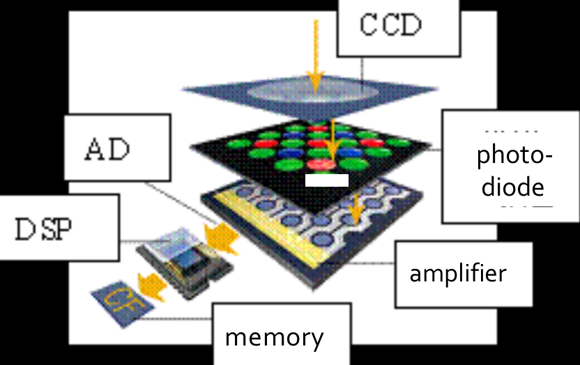

* 拍摄景物时，景物反射的光线通过数码相机的镜头透射到CCD上
* 当CCD曝光后，光电二极管受到光线的激发而释放出电荷，生成感光元件的电信号

* CCD控制芯片利用感光元件中的控制信号线路对发光二极管产生的电流进行控制，由电流传输电路输出，CCD会将一次成像产生的电信号收集起来，统一输出到放大器。
* 经过放大和滤波后的电信号被传送到ADC，由ADC将电信号（模拟信号）转换为数字信号，数值的大小和电信号的强度与电压的高低成正比，这些数值其实也就是图像的数据。
* 此时这些图像数据还不能直接生成图像，还要输出到DSP（数字信号处理器）中，在DSP中，将会对这些图像数据进行色彩校正、白平衡处理，并编码为数码相机所支持的图像格式、分辨率，然后才会被存储为图像文件。
* 当完成上述步骤后，图像文件就会被保存到存储器上,我们就可以欣赏了。

### Physical meaning of color

Colorful view is generated by the interactions between light and objects, e.g., reflection, refraction, scattering, transmission, absorption, and diffraction.

色彩场景是由光与物体之间的交互过程产生的。如：反射、折射、散射、传播、吸收以及衍射等等

色彩可以分为彩色（chromatic color）和消色（achromatic color）两大类

* 彩色是指红、黄、蓝等单色以及它们的混合色，彩色物体对光谱各波长的反射具有选择性，所以它们在白光照射下呈现出不同的颜色
* 消色，又称非彩色，也就是我们通常所说的灰度，是指白色，黑色以及各种深浅不同的灰色。消色物体对光谱各波长的反射没有选择性，它们是中性色

### Light and Colour

色觉(colour vision)是指不同波长的光线作用于视网膜而在大脑中引起的感觉

* 人眼可见光线的波长是390nm～780nm，一般可辨出包括紫、蓝、青、绿、黄、橙、红7种主要颜色在内的120～180种不同的颜色

* 视网膜是人眼中最重要的组成部分，就像相机里的感光底片，专门负责感光成像。视网膜上分布着两种视觉细胞，一种为杆状体，另一种为锥状体

  > 杆状体细胞比较多，大约有上亿个，它对光极为灵敏，但没有区分色彩的能力
  >
  > 锥状体细胞则只有六、七百万个，它要在较强的照度下才能激发，它的存在使我们能够辨别各种不同的颜色

* $\lambda:\ Red>Green>Blue$ 

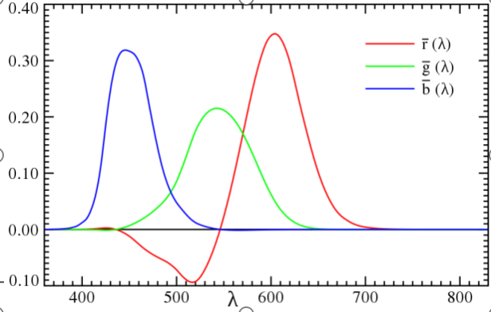

### Three-primary colors

视网膜上存在三种分别对红绿蓝光波长特别敏感的视锥细胞或相应的感应色素，不同波长的光进入眼睛后，与之相符或相近的视锥细胞发生不同程度的兴奋，于是在大脑产生相应的色觉；若三种视锥细胞受到同等程度的刺激，那么产生消色

#### Perception priority and sensitivity

* Priority: Under the same setting, human notices first the hue (H) (色调)changes, then the saturation (S) (饱和度), then the lightness value (V) (亮度).

* Sensitivity: Human eyes are the most sensitive to the **lightness changes** and have the best resolution, which is responsible for the eyes’ HDR capacity

  人眼对于亮度的变化最为敏感，分辨能力最强。恰好与人眼的高动态能力相匹配。

### Definition of color space

* Device dependent color space model:RGB CMY HSV (HSV more similar to human's sensation)
* Device independent color space model:Most of them are defined by CIE :CIE XYZ, CIE $L^*a^*b$, CIE YUV

#### RGB color model

RGB color model is a unit cube in a Cartesian coordinates system.

* The magnitudes of each **primary color** are equivalent on the main diagonal line, which lead to the white color from darkness to brightness, i.e., grayscale. **(0,0,0)-dark, (1,1,1)-bright**. 

* The other 6 corners are respectively red, yellow, cyan, blue and magenta.(红、黄、绿、青、蓝和品红)

* RGB is a subset of CIE primary color space. 

* RGB is usually used in Color cathode ray tube and Color raster graphics display (computer , TV). 

  RGB颜色模型通常用于彩色阴极射线管和彩色光栅图形显示器（计算机和电视机采用）

#### CMY color model

* 彩色印刷或者彩色打印的纸张不能发射光线，因而印刷机或打印机就只能使用一些能够吸收特定光波而反射其他光波的油墨或者颜色

* 油墨或颜料的3种基色是以红、绿、蓝三色的补色 : 青（Cyan）、品红（Magenta）、黄（Yellow）为基色

* 用CMY模型产生的颜色称为相减色，是因为它减掉了为视觉系统识别颜色所需要的反射光
* CMY空间与RGB空间互补，也就是用白色减去RGB空间中的某一颜色值就等于同样颜色在CMY空间中的值

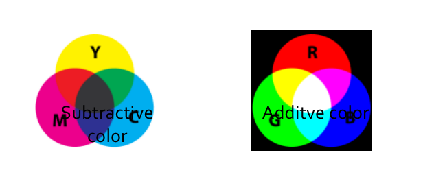

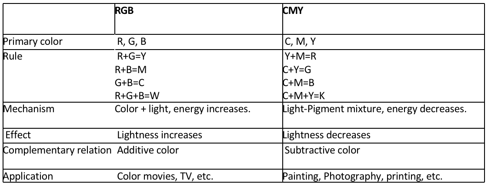

#### HSV color

HIS/HSV color space is defined based on human visual system. 

色调（Hue)、色饱和度（Saturation）和亮度（Intensity，或者Value）

* Hue, Saturation, Intensity/ValueHIS can be depicted as a **cone**
* Top surface of cone: $V=1$, which includes R=1, G=1, B=1. 
* Hue: around the axis: RED-- $0^o$ , GREEN-- $120^o$ , BLUE-- $240^o$
* Saturation: along the radial direction.
* Bottom point of cone: $V=0$，$H =null, S=null$, for darkness.
* Center of the top surface: $S=0, V=1, H=null$, for brightness.

Advantages:

* Close to human color vision. 
* When using RGB or CMY, if you want to change hue, you must adjust R, G, and B at the same time. But using HSV, you DON’T have to do that. Only ONE channel is adjusted. 
* HSV color model is a **uniform color space**, linearly distributed. The color difference perception is proportional to Euclidean distance on the HSV cone volume.

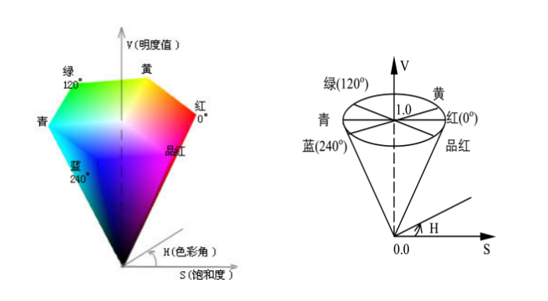

#### CIE color model 

##### CIE color model

* A series of color models according to the response of human eyes to RGB, which are carefully measured.

Device independent:

* Such color models are used to define device-independent color. 
* Help people to reproduce color consistently on different devices such as scanner, monitor, and printer. CIE color modelsCIE XYZ, CIE $L^*a^*b$ CIE YUV etc.

##### CIE XYZ

XYZ concept is based on the three-primary color theory, which describes human eyes have RGB receptors and all other color are mixture of RBG. 

* Computed by using functions$\overline{x(\lambda)},\overline{y(\lambda)},\overline{z(\lambda)}$ 

* $Y_{xy}$color space given in 1931: Y->luminance, x,y are color coordinates computed based XYZ.
* Describes the color range human can perceives. 

##### CIE $L^*a^*b$

* Defined in 1976
* Modification of CIE XYZ
* Overcomes the un-proportional problem in Yxy color space: $x,y$ distance does not reflect the color difference you observe.
* L: lightness **a: green to red**    **b: blue to yellow**
* L,a, b can be adjust separately. 

> * 是CIE XYZ颜色模型的改进型，以便克服原来的Yxy颜色空间存在的在x，y色度图上相等的距离并不相当于我们所觉察到的相等色差的问题
> * 它的“L”（明亮度），“a”（绿色到红色）和“b”(蓝色到黄色)代表许多的值
> * 与XYZ比较，CIE $L^*a^*b*$ 颜色更适合于人眼的感觉
> * 颜色的亮度（L）、灰阶和饱和度（a,b）可以单独修正，这样，图像的整个颜色都可以在不改变图像或其亮度的情况下，发生改变。

##### CIE YUV

在现代彩色电视系统中，通常采用三管彩色摄像机或彩色CCD（电荷耦合器件）摄像机，它把摄得的彩色图像信号，经分色，分别放大校正得到RGB，再经过矩阵变换电路得到亮度信号Y和两个色差信号R－Y、B－Y，最后发送端将亮度和色差三个信号分别进行编码，用同一信道发送出去,这就是我们常用的YUV颜色空间

采用YUV颜色空间的重要性是它的亮度信号Y和色度信号U、V是分离的

* 如果只有Y信号分量而没有U、V分量，那么这样表示的图就是黑白灰度图
* 彩色电视采用YUV空间正是为了用亮度信号Y解决彩色电视机与黑白电视机的兼容问题，使黑白电视机也能接收彩色信号。

### Transformation between color spaces

##### RGB<->CMY

$RGB->CMY\\		C = 255 – R\\		M = 255 – G\\		Y = 255 – B\\$

##### RGB<->HSV 

Search in table:

* CIE has defined transformation tables

  $RGB<->XYZ\\HSV<->XYZ$

* Compute directly

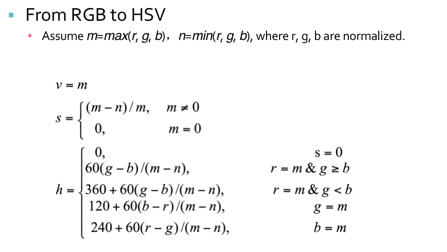

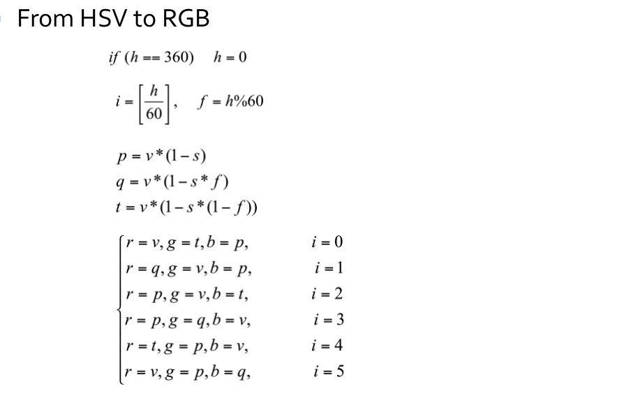

##### RGB<->CIE XYZ in a computable way

$\begin{gathered}\begin{bmatrix} X  \\ Y \\ Z\end{bmatrix}=\begin{bmatrix} 0.608 & 0.714 & 0.200  \\0.299& 0.587&0.133 \\0.000 &0.066& 1.112\end{bmatrix}\begin{bmatrix} R \\ G\\ B\end{bmatrix}\quad\end{gathered}$

##### CIE XYZ<->CIE L*a*b*

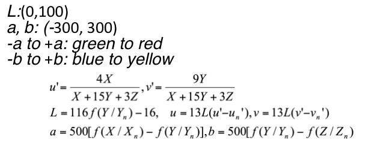

##### RGB 和 YUV 的相互转化

RGB（红绿蓝）和YUV是两种颜色表示方式，常用于图像和视频处理中。RGB是一种直接表示颜色的方式，其中红色（R）、绿色（G）和蓝色（B）分量的值决定了颜色的具体外观

* RGB可以浮点表示方式：取值范围为 `0.0 ~ 1.0`
* 或以整数表示：取值范围为 `0 ~ 255` 或者 `00 ~ FF`。RGB 颜色模型 通常用于彩色阴极射线管和彩色光栅图形显示器(计算机和电视机采用)。

* YUV是一种颜色空间，基于 `YUV` 的颜色编码是流媒体的常用编码方式，这种表达方式起初是为了彩色电视与黑白电视之间的信号兼容；其中：Y：表示明亮度（Luminance 或 Luma），也称灰度图。U、V：表示色度（Chrominance 或 Chroma），作用是描述影像的色彩及饱和度，用于指定像素的颜色。

</table>

* RGB转化为YUV的公式如下：

  $\begin{gathered}\begin{bmatrix} Y  \\ U \\ V\end{bmatrix}=\begin{bmatrix} 0.299 & 0.587 & 0.114  \\ −0.147& −0.289 &0.435 \\0.615 &−0.515& −0.100\end{bmatrix}\begin{bmatrix} R \\ G\\ B\end{bmatrix}\quad\end{gathered}$

* YUV 转化为RGB的公式如下：

$\begin{gathered}\quad\quad\begin{bmatrix} R  \\ G \\ B\end{bmatrix}=\begin{bmatrix} 1.0000 &0.0000& 1.3707  \\1.0000& −0.3376 &-0.6980 \\ 1.0000&1.7324& 0.0000\end{bmatrix}\begin{bmatrix} Y \\ U\\ V\end{bmatrix}\quad\end{gathered}$

</table>

* 由BMP彩色图转为灰度图时，只需将RGB转为YUV，并只保留 Y分量 即可得到灰度图在调节BMP图片亮度时，只需将RGB转为YUV，改变 Y 分量的值，随后将 YUV 转回 RGB 即可得到被更改过亮度的图片

### JPEG Format

* File extension: .JPEG, .JFIF, .JPG,  .JPE

* Compression format for static image :

  As a counterpart of Moving Picture Expert Group. 

  Lossy encoding method

  Allow user to make balance between image quality and image size. 

* Encoding based on transformation, e.g. Discrete Cosine Transformation (DCT)JPEG2000 is based on wavelet. 

* Different manipulations for high-frequency signal and low-frequency signal.

#### Compression Strategy

Compression strategy: **According to the requirement of compression ratio, remove information from high frequency to low frequency. **

Advantages:

* High frequency information occupies much more memory. Hence, high frequency removal leads to high compression ratio
* Low frequency information preserves the principle structure and color distribution of object, which is the key factors of an image. 
* Suitable for internet based visual media.

> 压缩策略：**根据压缩比要求，从高频到低频逐步削减信息**
>
> * 高频信息占用存储空间大，减少高频信息更容易获得高压缩比
> * 低频信息可以保留物体的基本轮廓和色彩分布，最大限度维持图像质量
> * 适合用于互联网

* 人眼对于一个相对较大范围的区域，辨别色彩细微差异能力比较强（低频），但对于高频区域，却表现一般
* 受此启发，人们可以对高频部分进行量化，也就是说，把频域上的每个分量，除以针对该分量的常数，然后四舍五入取整，这样一般会把高频分量变为0
* 但这样操作就要求针对每一个分量设置一个常数值，所以就最终形成了量化表。

More specifically,refer to the PPT(Chapter I)

#### Disadvantages

* Not for line drawing, text, symbol, icon, etc.. 
* Its lossy compression leads to unavoidable artifacts.

不适合用于线条画、文字、图标等，其有损压缩会导致这类对象的瑕疵严重

#### TIFF format

#### GIF format

### Chains

Chains are used for description of object borders

Chains can be represented using static data structures (e.g., 1D arrays); their size is the longest length of the chain expected.

#### Run length encoding (RLE)

RLE is run-length encoding. It is used to encode the location of foreground objects in segmentation. Instead of outputting a mask image, you give a list of start pixels and how many pixels after each of those starts is included in the mask.

* In binary images, run length coding records only areas that belong to the object in the image,the area is then represented as a list of lists. 
* Each row of the image is described by a sublist, the first element of which is the row number. **Subsequent terms are coordinate pairs; the first element of a pair is the beginning of a run and the second is the end. **
* There can be several such sequences in the row. 

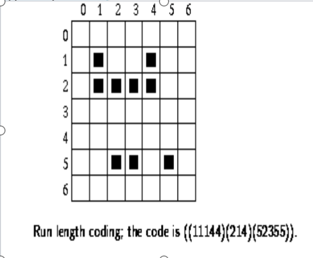

