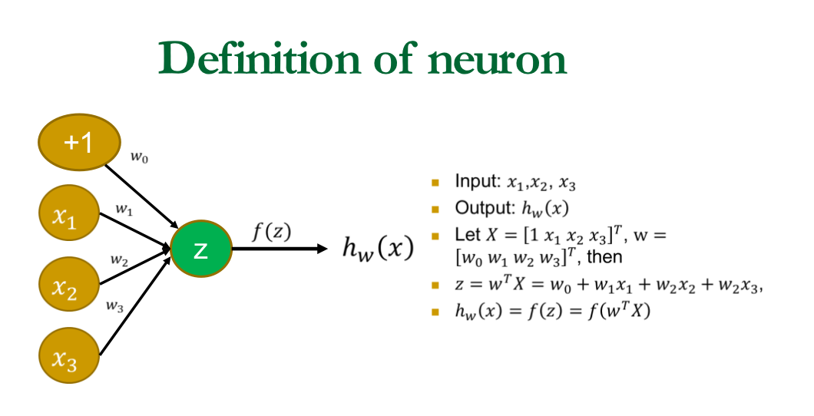
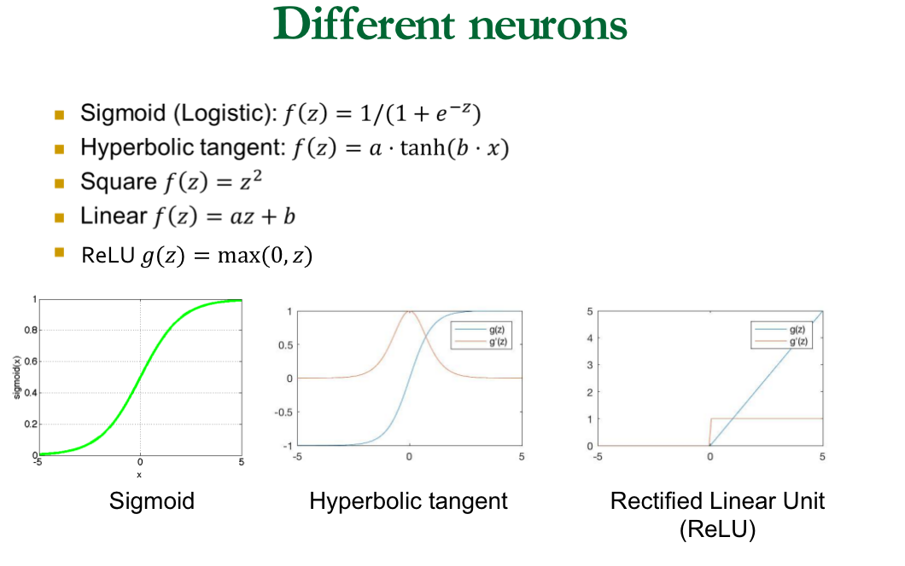
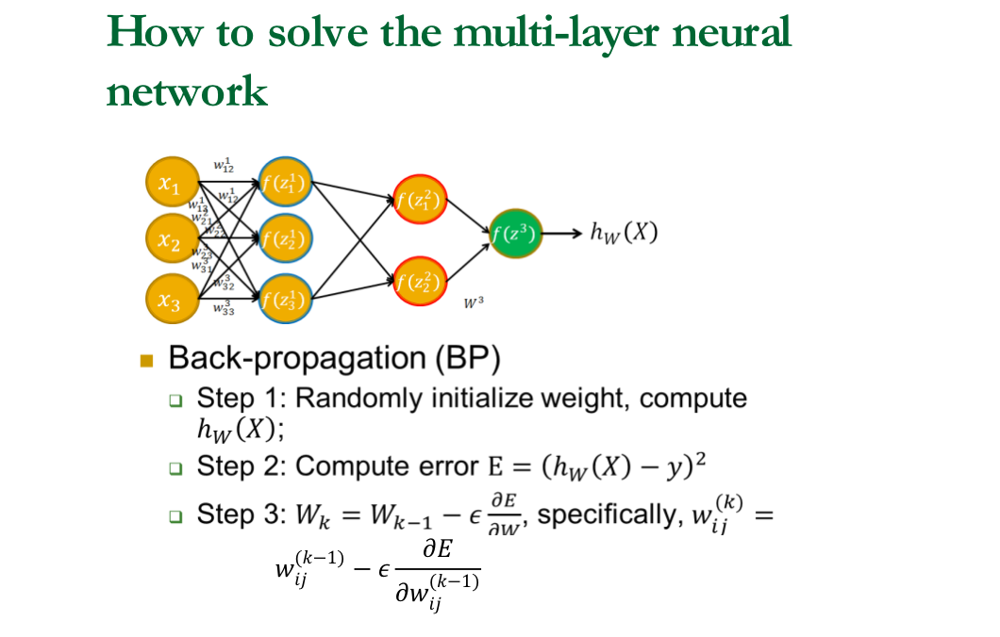
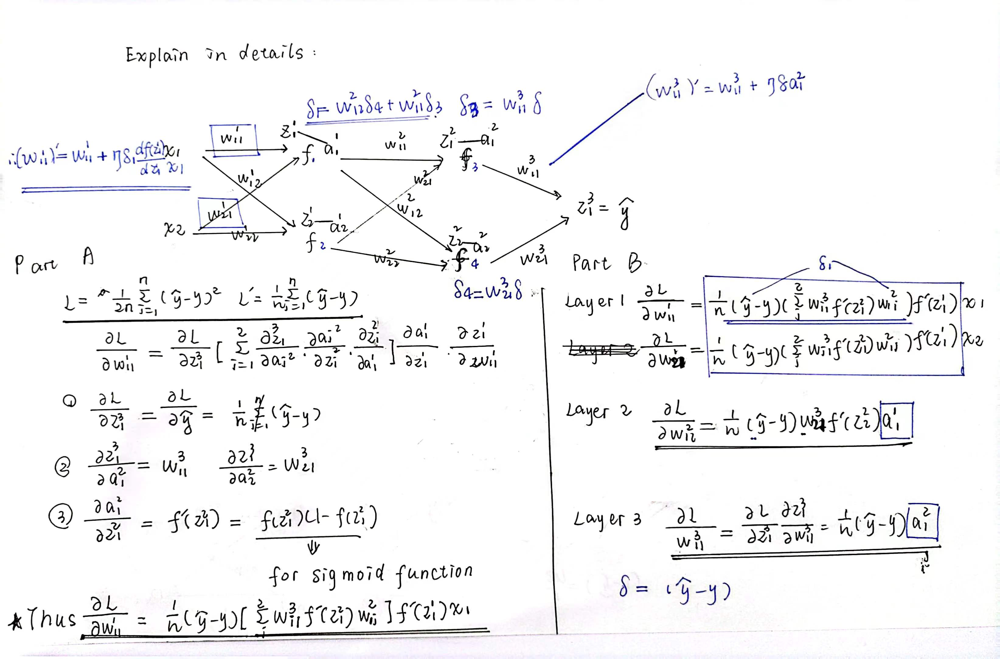
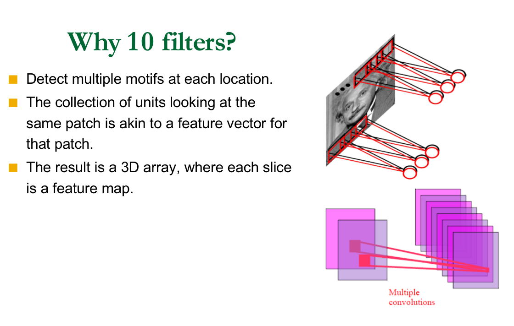
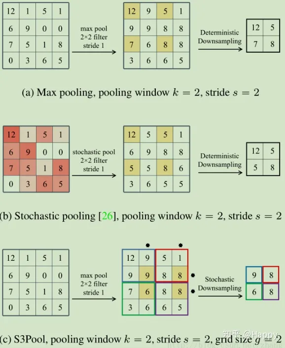
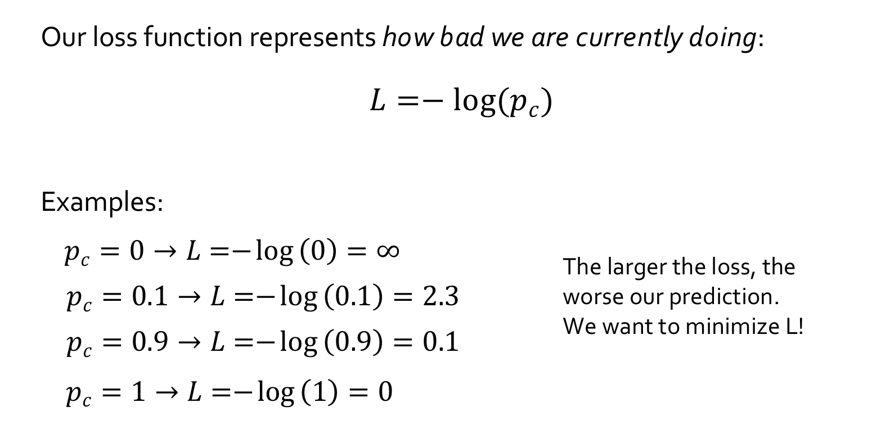

* CNNs have won several competitions
  * ImageNet, Kaggle Facial Expression, Kaggle Multimodal Learning, German Traffic Signs, Handwriting, ….

* CNNs are deployed in many practical applications
  * Image recognition, speech recognition, Google’s and Baidu’s photo taggers

* xCNNs are applicable to array data where nearby values are correlated
  * Images, sound, time-frequency representations, video, volumetric images, RGB-Depth images, …

* CNN is one of the few deep models that can be trained in supervised way.
* Easy to understand and implement.

## What is the neural ?

## Multilayer neural network

* And return to repeat step 1-3 until error is smaller than threshold

## Back propagation

https://towardsdatascience.com/understanding-backpropagation-algorithm-7bb3aa2f95fd

http://galaxy.agh.edu.pl/%7Evlsi/AI/backp_t_en/backprop.html

* Proof https://towardsdatascience.com/backpropagation-the-natural-proof-946c5abf63b1

* $\eta$ 学习率

>学习率低，收敛慢，容易掉到坑里陷入局部最优；学习率高，可能使得收敛过程不稳定，来回震荡，一直不收敛
>
>idea:
>
>- 设置不同的学习率，看哪种情况最好
>- 设计一个自适应学习率。此时学习率不再固定，可以通过外在条件算(梯度，学习要有多快，特征权重的大小...)

## Deep Learning For Image Understanding

### Advantages for convolution

> Example:
>
> * 200x200 image
> * 10 filters of size 10x10
> * 10 feature maps of size 200x200 
> * 400,000 hidden units with 10x10 
> * fields=1000 parameters

> 为什么引入CNN可以大规模减少权数参数训练量因为CNN通过
>
> 1） 局部连接（Local Connectivity）
>
> 2） 权值共享（Shared Weights）
>
> 3） 池化（Pooling）
>
> * 来降低参数量

### Pooling

CNN池化可以通过池化层来降低卷积层输出的特征维度，在有效减少网络参数的同时还可以防止过拟合现象

https://zhuanlan.zhihu.com/p/78760534

## CNN in Detail

* 步长？

* Refer to the PPT !
* 传统图像分类：分段；深度学习图像分类：端到端
* 交叉商

* Minimize Loss - Gradient Descent.

