Many mathematicians tried to find a way to approximate a complex function by some simple functions for many years. Apart from the theoretical concern, this technique is invaluable for many practical applications.

Before the invention of differential calculus, this problem kept open. 

## Fourier Transform

* British mathematician Taylor invented a method to represent one analytic function by infinite linear combination of power functions.
* In the middle of 18th century, Fourier found that the infinite linear combination of trigonometric functions could represent a general function in a finite interval, when he was studying the heat propagation problem.

??? Fourier
    $\begin{align*}f(x)&=\frac{1}{2}a_0+\sum_{n=1}^{\infty}a_ncos(nx)+\sum_{n=1}^{\infty}b_nsin(nx)\\ a_0 &= \frac{1}{\pi}\int_{-\pi}^{\pi}f(x)dx\\a_n &= \frac{1}{\pi}\int_{-\pi}^{\pi}f(x)cos(nx)dx\\b_n &= \frac{1}{\pi}\int_{-\pi}^{\pi}f(x)sin(nx)dx \end{align*}$

> Just like Calculus invented by Newton, Fourier analysis is another mathematical tool
>
> * BIOM: fake iris detection
> * CS: anti-aliasing in computer graphics

### Complex Numbers

* Magnitude-Phase（vector）$x=|x|e^{j\phi(x)}$ where $|x|=\sqrt{a^2+b^2}\ \phi(x)=tan^{-1(\frac{b}{a})}$

* Basic Properties

  > $xy=|x|e^{j\phi(x)}|y|e^{j\phi(y)}=|x||y|e^{j(\phi(x)+\phi(y))}$
  >
  > $|x|=|x^*|$ 
  >
  > $\phi(x)=-\phi(x^*)$
  >
  > $xx^*=|x|^2$

* Euler’s formula $e^{j\theta}=cos\theta + isin\theta$

??? "Basic Properties"

    
 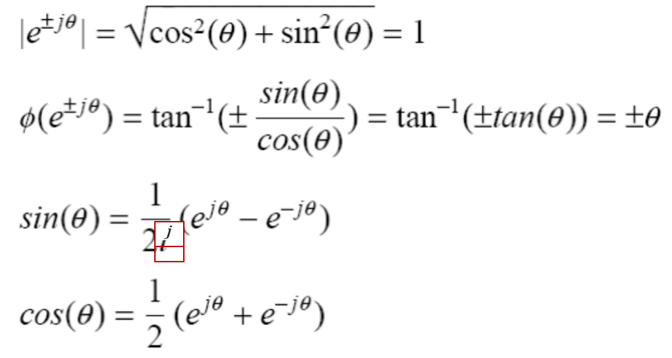 
  

### Image Transform

Many times, image processing tasks are best performed in **transformed domain** other than the **spatial domain**.

Key steps:

(1) Transform the image

(2) Carry out the task(s) in the transformed domain.

(3) Apply inverse transform to return to the spatial domain.

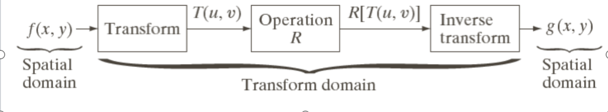

#### Transformation Kernels

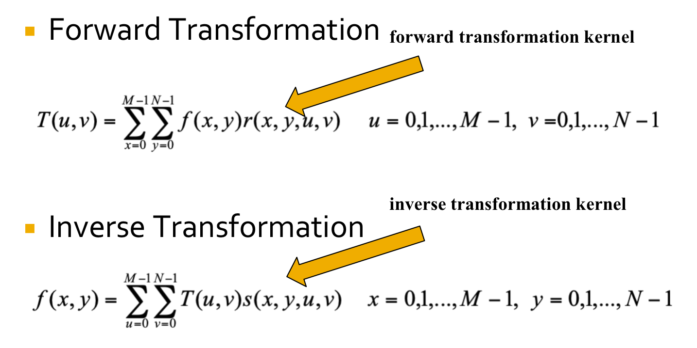

### Continuous Fourier Transform (FT)

* $1-D$

  Transforms a signal (i.e., function) from the spatial domain to the frequency domain.

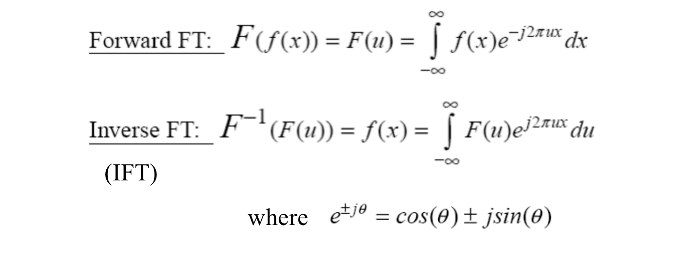

* Example: Removing undesirable frequencies

To remove certain frequencies, set their **corresponding F(u) coefficients** to zero!

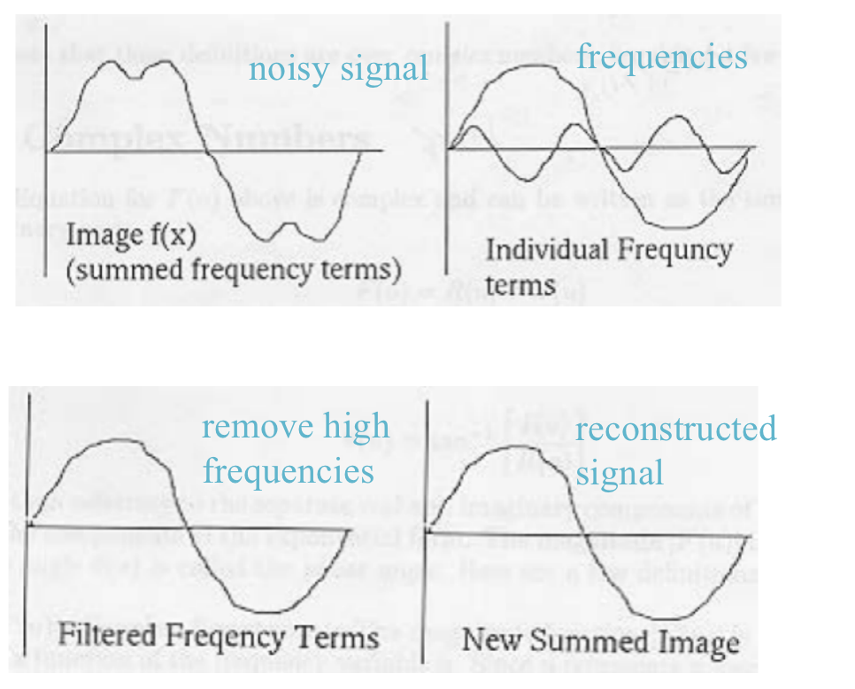

* How do frequencies show up in an image?

  > Low frequencies correspond to slowly varying information (e.g., continuous surface).
  >
  > High frequencies correspond to quickly varying information (e.g., edges)

* $2-D$

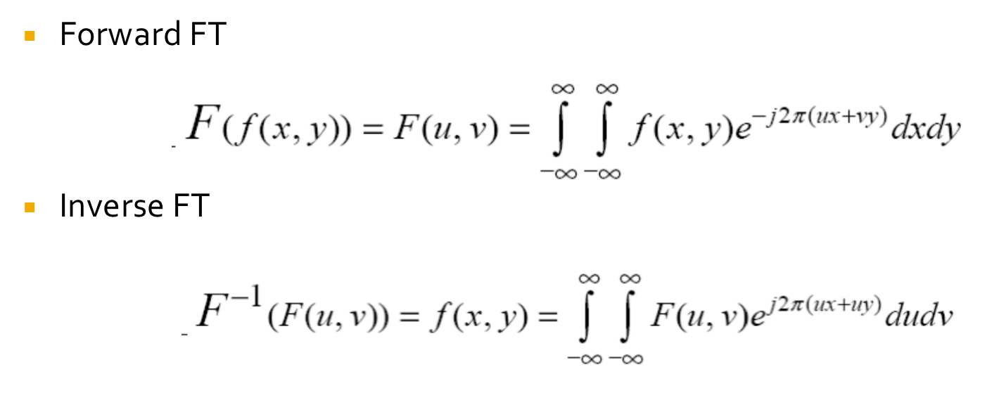

### Discrete Fourier Transform (DFT)

* $2-D$

二维离散傅立叶变换定义为

![{\displaystyle S(j\omega _{1},j\omega _{2})=\sum _{m=-\infty }^{\infty }\sum _{n=-\infty }^{\infty }s[n,m]e^{-j(\omega _{1}n+\omega _{2}m)}}](https://wikimedia.org/api/rest_v1/media/math/render/svg/54cbeb7d98a54a60545e0e63a522b6d80c39ca98)

二维离散傅立叶逆变换定义为

![{\displaystyle s[n,m]={\frac {1}{4\pi ^{2}}}\int _{-\infty }^{\infty }\int _{-\infty }^{\infty }S(j\omega _{1},j\omega _{2})e^{j(\omega _{1}n+\omega _{2}m)}\,d\omega _{1}\,d\omega _{2}}](https://wikimedia.org/api/rest_v1/media/math/render/svg/58db6f096f814ad493d5214cd8b24b5eef502bf7)

为了方便，我们可将上述两式改为向量形式

其中  。

??? "For Images"

    
 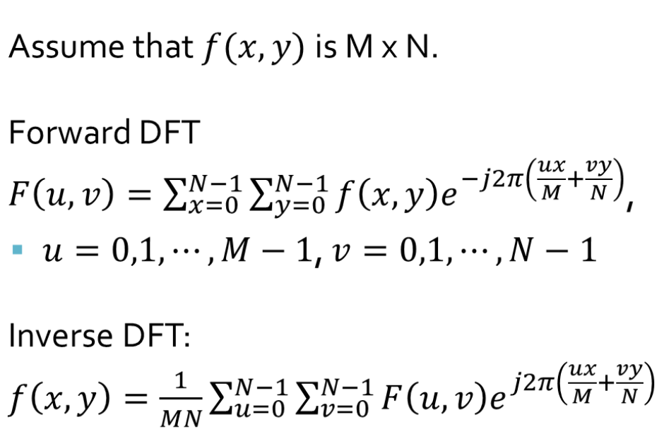 
  

$(u,v)$-- 相位

$F(u,v)$-- 幅值

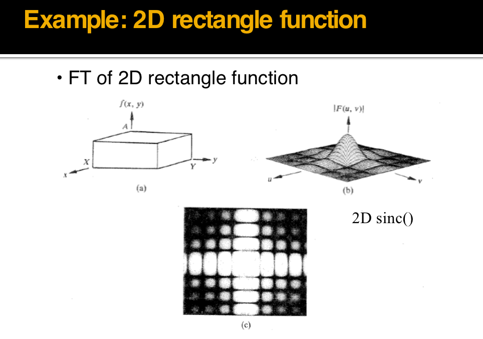

### Fast Fourier Transform（FFT）

Speed up the discrete Fourier Transform

There are many repetitive work in the computation.

Cooley and Tukey presented in 1965:

* Divide the original N-points sequence into several short sequence successively
* Compute the Discrete Fourier Transform of these short sequences
* Make up the wanted transform value
* Computational workload: $2N^2\rightarrow2Nlog_2N$

#### FFT Principle

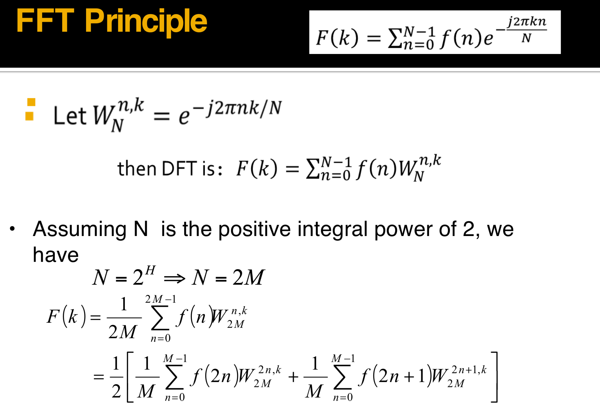

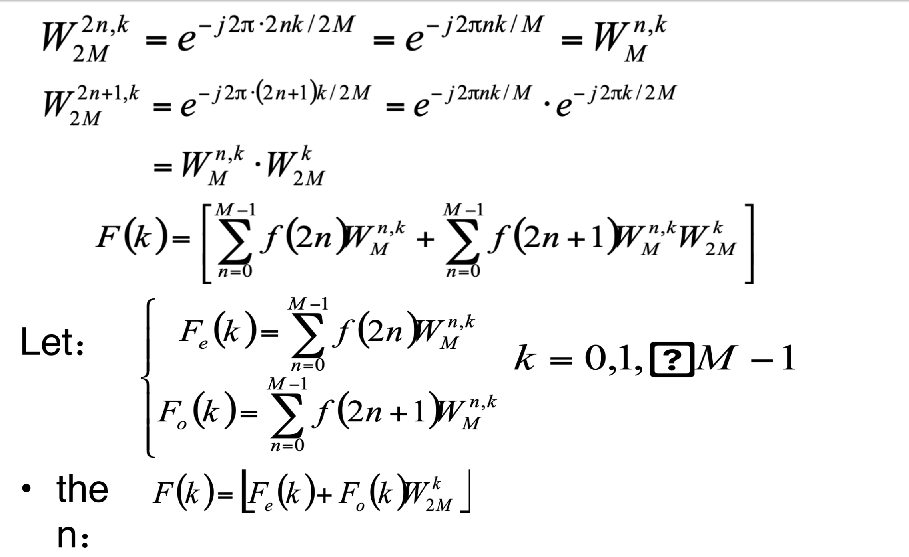

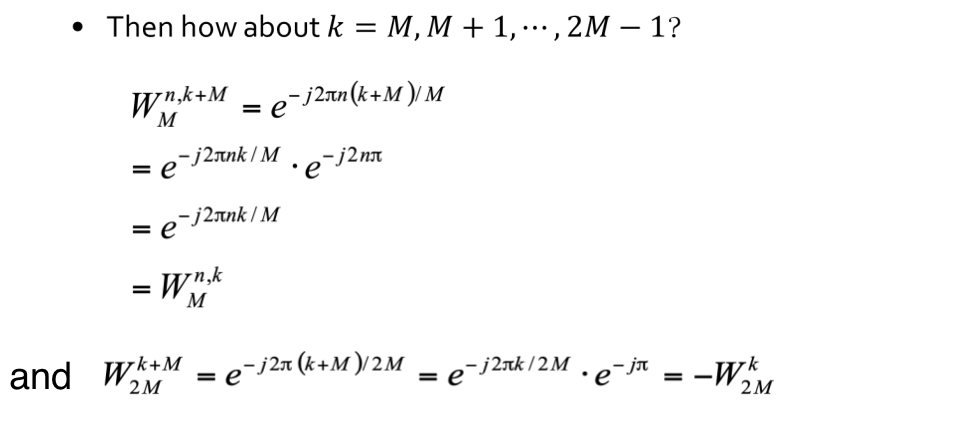

**HENCE   $F(k+M)=\lfloor F_e(k)-F_o(k)W_{2M}^k\rfloor$  **

意义：对一个长度为 N 的序列进行傅立叶变换可以通过将其分成两半计算，对第一部分的计算需要通过计算两个长度为 N/2 长度序列的傅立叶变换式进行，然后利用这两个长度为 N/2 的序列可以得到第二部分的值。

#### Magnitude and Phase of DFT

Hint: use inverse DFT to reconstruct the image by magnitude or phase only information

* magnitude determines the contribution of each component!

* **phase** determineswhich components are present!
