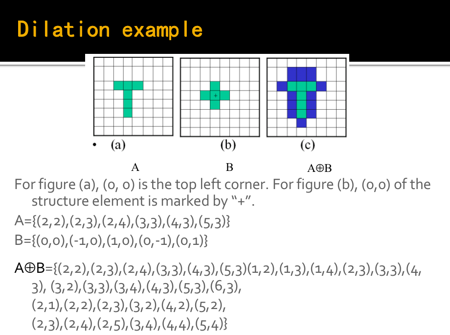
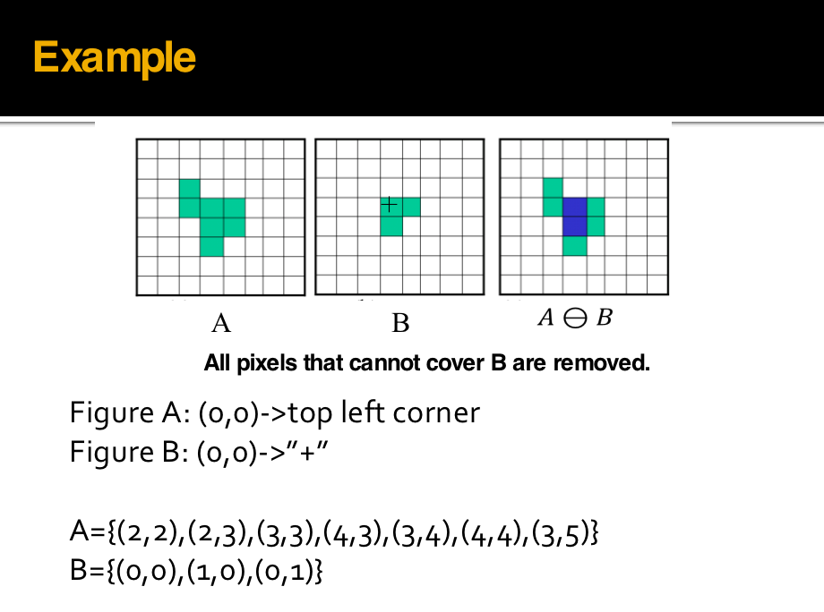
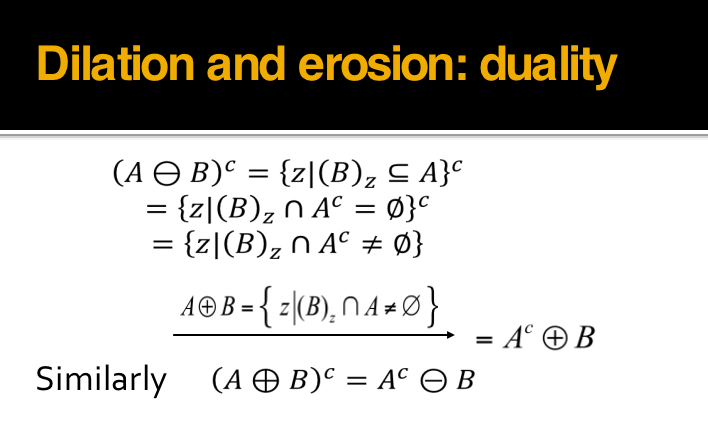
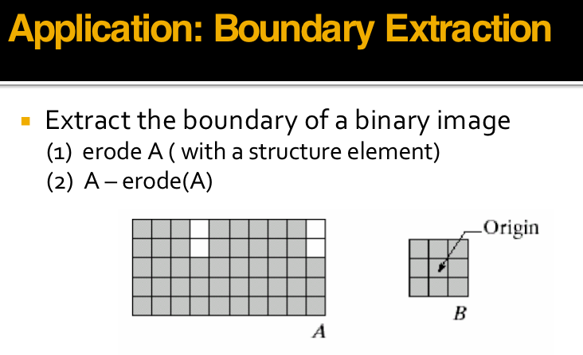
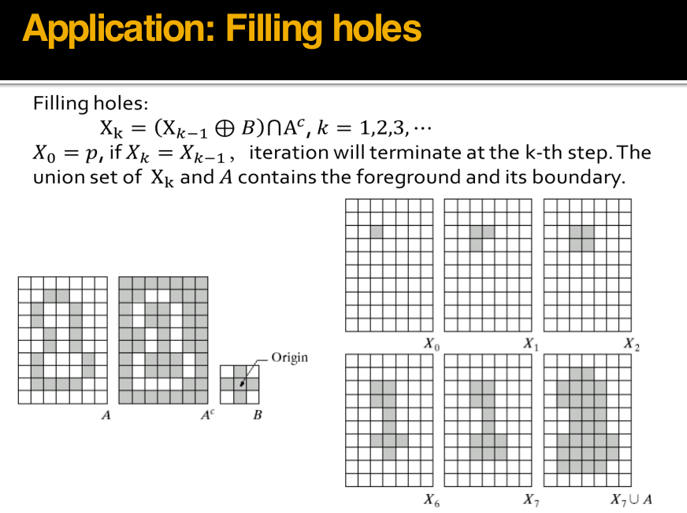
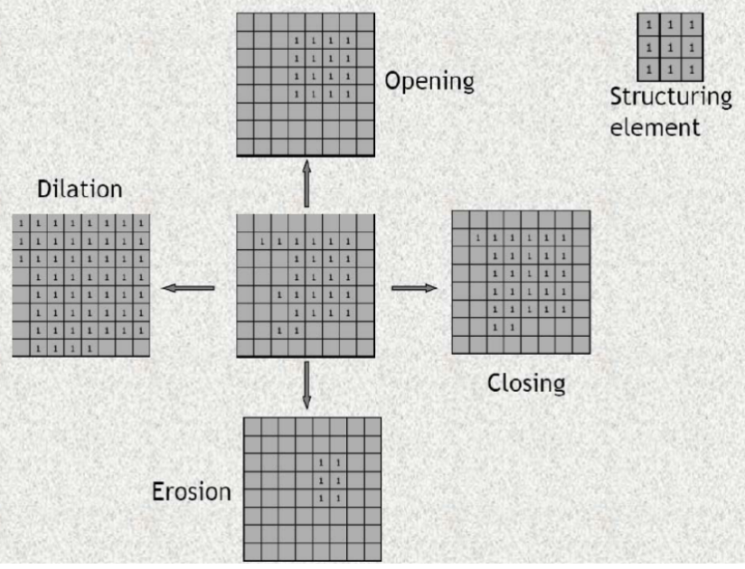
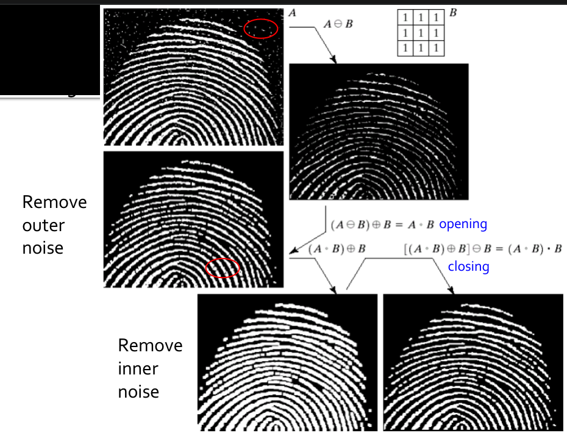

# Binary Image and Morphological Operation

## Binary image

优点：更小的内存需求 运行速度更快 为二值图像开发的算法往往可以用于灰度级图像 更便宜 缺点：应用范围毕竟有限； 更无法推广到三维空间中表现力欠缺，不能表现物体内部细节无法控制对比度

### 图像二值化：

##### （1）二值图像

二值图像（Binary Image）中，像素值限定为 $0$ 或 $1$（编程中一般用 $0$ 和$255$ 来构造二值图像)。

* 优点：占用更少内存、更高效，有时可应用于灰度图像，同时更加便宜。
* 缺点：应用领域有限，不能用于三维数据，表达能力较弱，难以传达视觉细节，也不能控制对比度。

##### （2）大津算法（Otsu's algorithm）

在把灰度图转换为二值图像的时候，一个基本的想法是找到一个合适的阈值（Threshold），像素点值比阈值大的设为$255$，比阈值小的设为$0$。即为如下：

$\left\{  
             \begin{array}{**lr**}     
             I(x,y) = 0\ if\ I(x,y)\leq Threshold  \\
             I(x,y) = 255\ if\ I(x,y)\geq Threshold \\   
             \end{array}  
\right.$

* 而大津算法就是一种自动确定该合适阈值的方法，旨在找到一个阈值，将图像分成两个类别（前景和背景），以使两个类别内的方差最小，同时两个类别之间的方差最大，步骤如下。

> a.统计像素点的最大值和最小值
>
> b.对于**每个**可能的阈值，计算分成两个类别后的背景和前景的内部协方差和外部协方差。
>
> c.选择最大外部和最小内部协方差对应的 threshold作为二值化阈值。
>
> d.应用选择的阈值将图像分割成前景和背景。

其中，**最大外部方差**和**最小内部方差**是等价的，我们选择找到最大外部方差，推导过程如下：

设图像尺寸为$M\ *\ N$，其二值化的最佳阈值为$T$，该阈值将图像分为背景和目标两个类别。其中属于背景的像素点数量为$N0$,属于目标的像素点数量为$N1$,背景像素点数占整幅图像的比例$\omega0$,其灰度均值$μ0$,目标像素点数占整幅图像的比例为$ω1$,其灰度均值为$μ1$ ，整幅图像的灰度均值为$\mu$。

$\omega_0=\frac{N0}{M*N}\\$   $\omega_1=\frac{N1}{M*N}$   $N0+N1=M*N\\$   $\omega0\ + \omega1\ = 1\\$

$\mu = \frac{\mu0*N0+\mu1*N1}{M*N}=\mu0\omega0\ + \mu1\omega1\\$

$类内方差(Within-class\ variance)公式:$

$\sigma_{Withen}^{2}=\omega_{0} \sigma_{0}^{2}+\omega_{1} \sigma_{1}^{2} \\$

$类间方差(Between-class\ variance)的公式:\sigma_{Between}^{2}=\sigma^{2}-\sigma_{Within}^{2}\\$

$有此可推导得到$

$\sigma_{Between}^{2}=\omega_{0}(\mu_{0}-\mu)^{2}+\omega_{1}(\mu_{1}-\mu)^{2}$

$\ \ \ \ \ \ \ \ \ \ \ \ \ =\omega0(\mu0-\omega0\mu0-\omega1\mu1)^{2}+\omega1(\mu1-\omega0\mu0-\omega1\mu1)^{2}$
$\ \ \ \ \ \ \ \ \ \ \ \ \ =\omega0(\omega1\mu0-\omega1\mu1)^{2}+\omega1(\omega0\mu1-\omega0\mu0)^{2}\\$
$\ \ \ \ \ \ \ \ \ \ \ \ =(\omega0\omega1^{2}+\omega1\omega0^{2})(\mu1-\mu0)^{2}\\$

$\ \ \ \ \ \ \ \ \ \ \ \ =\omega0\omega1(\mu0-\mu1)^{2}\\$

* 即在计算最大外部和最小内部方差时，只需判断$\omega0\omega1(\mu0-\mu1)^{2}$取得最大值即可

Step 1: 确定原始图像中像素的最大值和最小值

Step 2: 最小值加1作为**初始threshold**对原始图像进行二值化操作

Step 3: 根据对应关系确定前景和背景，分别计算当前threshold下的内部协方差和外部协方差

Step 4: 回到Step 2直到达到像素最大值

Step 5：找到最大外部和最小内部协方差对应的threshold.

* 前述thresholding策略推广到彩色图像，同时考虑rgb三个通道，我们就可以针对特定的色彩进行thresholding操作，

#### 改进

* 局部自适应操作设定一个局部窗口，在整个图像上滑动该窗口
* 对于每一窗口位置，确定针对该窗口的threshold

* 相比全局大津法，我们依次枚举灰度图中的每个像素$（i,j)$，以用户输入一个整数为边长，在$(i - length / 2, j - length / 2, i + length / 2, j + length / 2, i, j)$这个正方形中进行大津法，得到阈值后**仅对**$(i,j)$点进行二值化处理。

* 相比全局大津法，局部大津法耗时显著增加。

## Morphological Operation

​	数学形态学（也称图像代数）是一种用于分析图像形态和结构的工具。其基本思想是通过利用结构元素来度量和提取形状，从而实现对图像的分析和识别。图像形态学操作基于集合论，可以简化图像，去除不需要的结构，同时保留主要的形状特征。在这里有四种形态学操作符：膨胀、腐蚀、开运算和闭运算。

​	在下面的介绍中，我们的 A 指二值图像; B 指二值模板，称为结构元(structure element)。

### 膨胀

​	形态学的膨胀操作是图像处理中的一种基本操作，通常用于增强图像中的特定目标或结构，使其更加显著和容易检测。膨胀操作的主要思想是利用一个称为结构元素的小窗口或模板，沿着图像的各个方向扫描，并根据结构元素与图像的重叠程度来改变图像的像素值。

​	膨胀操作的结果通常是增强了原始图像中的目标或特定结构。这是因为它可以将目标区域扩展，填充空洞，使边缘更加清晰。因此，膨胀操作可用于改善图像中的特定特征，使它们更容易检测和分析。
$$
A⊕B=\{ z|(B)_z ∩A\ne∅ \}
$$

* Dilation: Bridging gaps in images

* 由B对A膨胀所产生的二值图象D是满足以下条件的点(x,y)的集合：

  如果B的**原点**平移到点(x,y)，那么它与A的交集非空。 

### 腐蚀

​	形态学的腐蚀操作是图像处理中的一种基本操作，通常用于减小图像中的特定目标或结构，从而弱化或消除一些特征。腐蚀操作的主要思想是利用一个称为结构元素的小窗口或模板，沿着图像的各个方向扫描，并根据结构元素与图像的重叠程度来改变图像的像素值。

​	腐蚀操作的结果通常是减小了原始图像中的目标或特定结构。这是因为它可以去除小的特征、缩小目标区域或消除噪声。腐蚀操作可用于弱化图像中的特定特征，使其更容易检测和分析。
$$
A⊖B=\{(x,y)|(B)_{xy} ⊆A\}
$$

* 由B对A腐蚀所产生的二值图象E是满足以下条件的点(x,y)的集合：

  如果B的原点平移到点(x,y)，那么B将**完全包含于A中**

### Duality

#### Application: Boundary Extraction

#### Application: Filling holes！

### 开操作

​	形态学的开操作是一种常见的图像处理操作，它结合了腐蚀（erosion）和膨胀（dilation）操作，通常用于去噪和分割图像中的目标。开操作的主要思想是首先对图像执行腐蚀操作，然后再对其执行膨胀操作，这个过程通常使用一个特定的结构元素进行。

​	开操作在图像处理中常用于去除噪声、分割目标、减小目标区域的不规则性以及减小目标之间的干扰。它也有助于改善二值化图像的质量，以便后续的分析和特征提取。
$$
A ◦ B = (A ⊖ B) ⊕ B
$$

* 用来在纤细点处分离物体，消除小物体、平滑其边界的同时并不明显改变其面积。 

### 闭操作

​	形态学的开操作是一种常见的图像处理操作，它结合了腐蚀（erosion）和膨胀（dilation）操作，通常用于去噪和分割图像中的目标。开操作的主要思想是首先对图像执行腐蚀操作，然后再对其执行膨胀操作，这个过程通常使用一个特定的结构元素进行。

​	闭操作在图像处理中常用于去除小孔、连接断开的线条、填充不规则目标的内部空洞、增强图像中的连通区域，平滑其边界的同时并不明显改变其面积。它也有助于改善二值化图像的质量，以便后续的分析和特征提取。
$$
A • B = (A ⊕ B) ⊖ B
$$

