

## Visibility enhancement

### logarithmic operation

为了增强图像的可视信息，对图像中的像素进行基于对数的操作
$L_d =  \frac{log{({L_{w}+1})}}{log{({L_{max}+1})}}$
其中，$L_d$是显示亮度，$L_w$是真实世界亮度，$L_{max}$是场景中的最亮值。

* 这个映射能够确保不管场景的动态范围是怎么样的，其最大值都能映射到 1(白)，其他的值能够比较平滑地变化。

### Grayscale perception

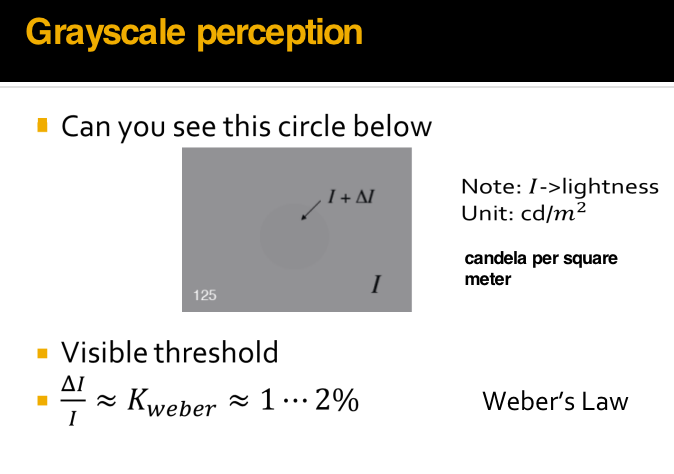

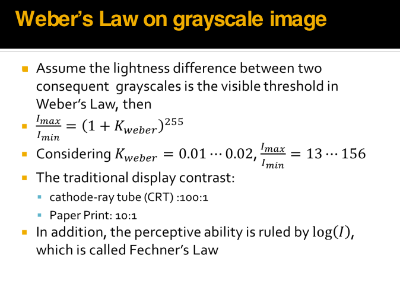

### Histogram equalization

#### (1)直方图

##### a.灰度直方图

* 灰度直方图是一种统计图，它表示给定图像中不同灰度级的像素数占总像素数的比例。
* 计算公式如下：
$p(r_k)=\frac{n_k}{MN}$

$r_k - 像素的灰度级$

$n_k - 具有灰度rk的像素的个数$

$MN - 图像中总的像素个数$

$\sum_{k=0}^{MN-1}P(r_k)=1$
##### b.彩色直方图
* 彩色直方图表示给定图像中不同 R、G、B等级的像素数占总像素数的比例,计算方法与灰度直方图类似

  

##### （2）直方图均衡化

直方图均衡化（Histogram Equalization）是一种用于增强数字图像对比度的图像处理技术。它通过重新分布图像的像素值，使直方图变得更均匀，从而改善图像的视觉质量

直方图均衡化常被用于提高图像的可视性、分析性能和自动图像处理应用中。例如，过曝光图像的灰度级集中在高亮度范围内，而曝光不足将使图像灰度级集中在低亮度范围内。采用直方图均衡化，可以把原始图像的直方图变换为均匀分布(均衡)的形式，这样就增加了像素之间灰度值差别的动态范围，从而达到增强图像整体对比度的效果

换言之，直方图均衡化的基本原理是:对在图像中像素个数多的灰度值(即对画面起主要作用的灰度值)进行**展宽**，而对像素个数少的灰度 值(即对画面不起主要作用的灰度值)进行归并，从而增大对比度，使图像清晰，达到增强的目的

尽管直方图均衡化具有显著的优点，但它也有一些限制。它可能导致图像出现噪点或过度增强细节，特别是在噪音存在的情况下

* 此外，均衡化可能改变图像的整体亮度，这可能不适用于所有图像

* 连续情况的转换$T$:

  

  - 设 r 为转换前的灰度级， s 为变换前后的灰度级

  - $0 ≤ r,s ≤ 1$ [对应$(0,255)$]

  - P(r) 和 P(s) 是对应于 r 和 s 的概率。转换规则为:

    * T(r)是单调递增函数，$0≤r≤1$且$0≤T(r)≤1$

    * 逆变换 r = $T^{-1}(s)$也是一个单调递增函数 考虑到灰度变换不会改变位置和像素数
    * 我们有
    $\int_0^rP(r)dr = \int_0^sP(s)ds=\int_0^s 1*ds = s = T(r)$

    $Thus: T(r)=\int_0^rP(r)dr$
      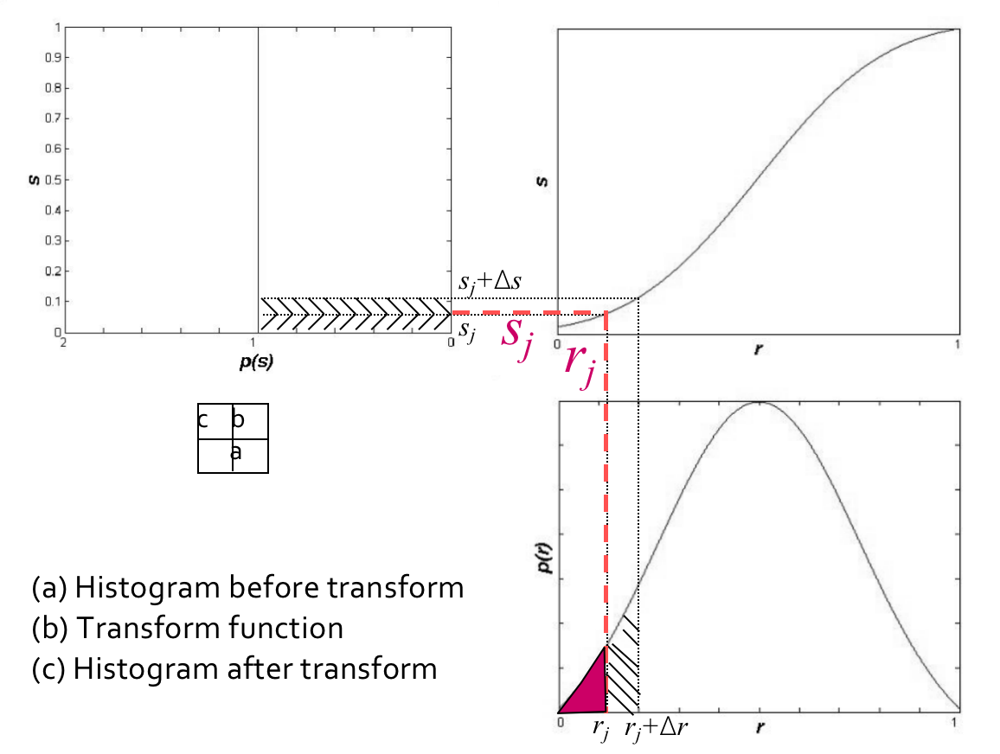

* 离散情况的转换 $T$:

设一幅图像的像素总数为n，分L个灰度级，$n_k$为第k个灰度级出现的像素数，则第$k$个灰度级出现的概率为：
$$
P(r_k)= \frac{n_k}{n}(0≤n_k ≤1,k=0,1,2,...,MN−1)
$$

* 离散灰度直方图均衡化的转换公式为
  $$
  s_k = T(r_k)=\sum_{i=0}^kP(ri)=\frac{1}{n}\sum_{i=0}^{k}ni
  $$

> 对于原直方图中的任意一个灰度级$r_k$，只需将灰度级为$[0,r_k]$以内的所有像素个数的和除以图像的像素总数，就可以得到转换之后的对应灰度级$s_k$

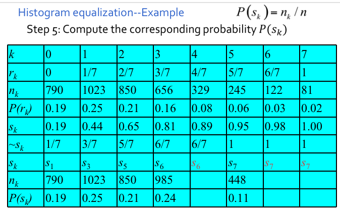

* Problem

按照均衡化的要求，在均衡化后的结果直方图中，各灰度级发生的概率应该是相同的，如右上图所示连续灰度级均衡化结果那样。但是，右下图中离散灰度级均衡化后，各灰度级出现的概率并不完全一样。为什么？

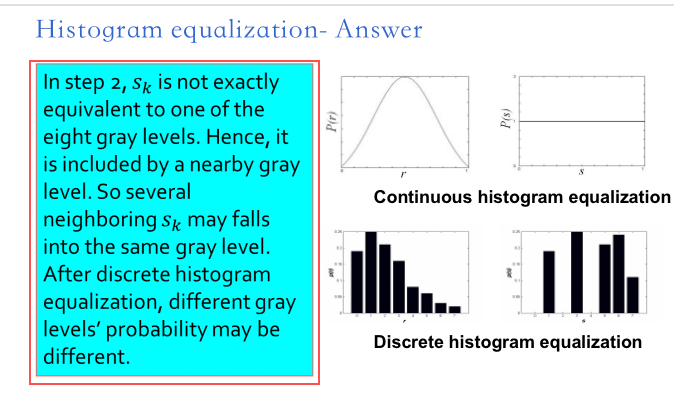

* 步骤2中，所得的$s_k$不可能正好等于8级灰度值中的某一级，因此需要就近归入某一个灰度级中

  这样，相邻的多个$s_k$就可能落入同一个灰度级，需要在步骤3时将处于同一个灰度级的像素个数累加,因此，离散灰度直方图均衡化操作以后，每个灰度级处的概率密度（或像素个数）并不完全一样。 

### Histogram fitting

* 所谓直方图匹配，就是修改一幅图像的直方图，使得它与另一幅图像的直方图匹配或具有一种预先规定的函数形状
* 直方图匹配的目标，是突出我们感兴趣的灰度范围，使图像质量改善
* 利用直方图均衡化操作，可以实现直方图匹配过程。

#### Steps

* Step 1 : Base on the equation $s=T(r)=\int_0^rP(r)dr$ map r in the original histogram to be s
* Step 2 : Based on equation $v=T(z)=\int_0^zP(z)dz$ map the gray level z in the resulted histogram to be $v$
* Step 3 : obtain $z=G^{-1}(v)$  from $v=G(z)$ beacuse s and v have the same distribution obtain $z=G^{-1}(s)$ corresponding $r$ 

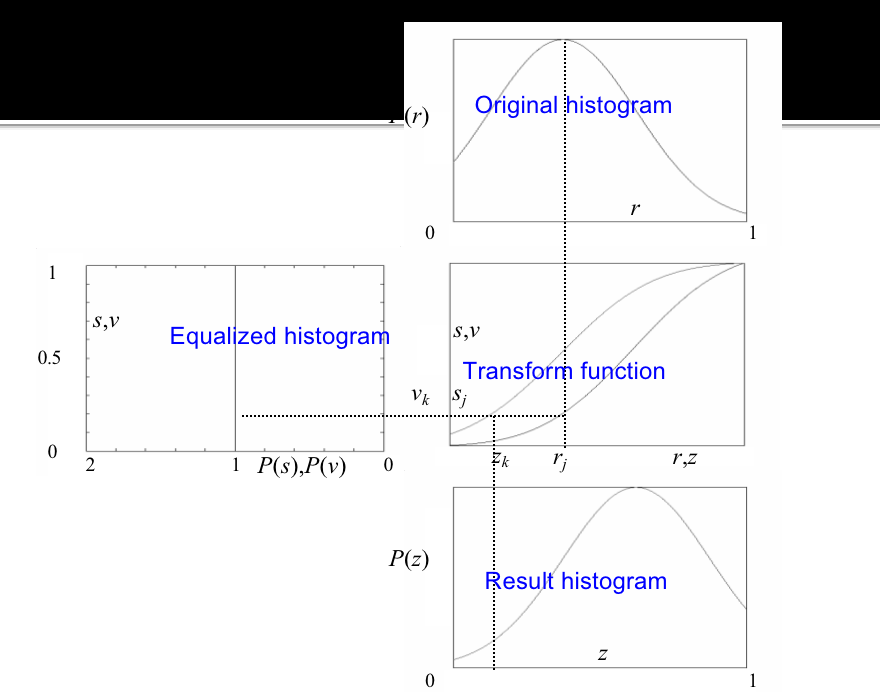

* Simple version:

  在步骤1和2中，分别计算获得两张表（参见直方图均衡化中的算例），从中选取一对$v_k、s_j$，使$v_k = s_j$，并从两张表中查出对应的$z_k$、$r_j$

  这样，原始图像中灰度级为$r_j$的所有像素都映射成灰度级$z_k$，最终得到所期望的图像。

### Histogram transform

#### Linear histogram transform

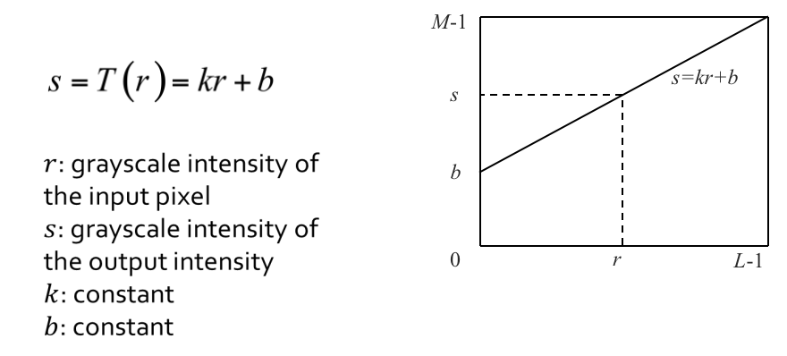

* Contrast stretching

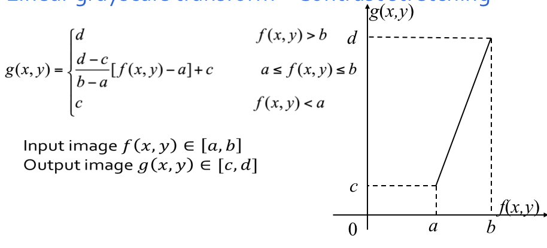

* Piecewise linear grayscale transform

 Linear grayscale transform by using a piecewise function, which strengthen the region of interest, weaken the region of no-interest.

 利用分段直方图变换，可以将感兴趣的灰度范围线性扩展，同时相对抑制不感兴趣的灰度区域

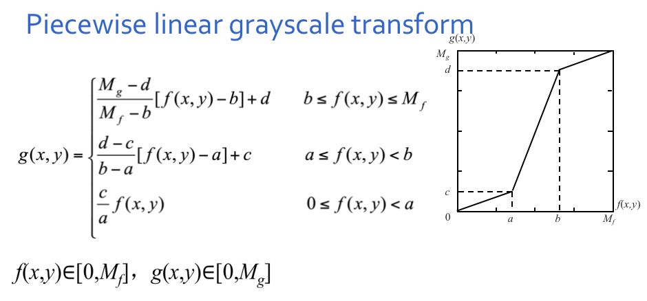

#### Nonlinear histogram transform

Logarithmic function and Exponential function are two popular nonlinear transform functions.

> Logarithmic

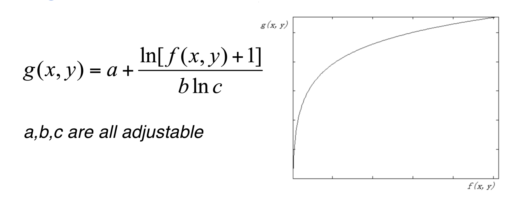

* Stretch low grayscale region
* Compress high grayscale region 

> Expoential

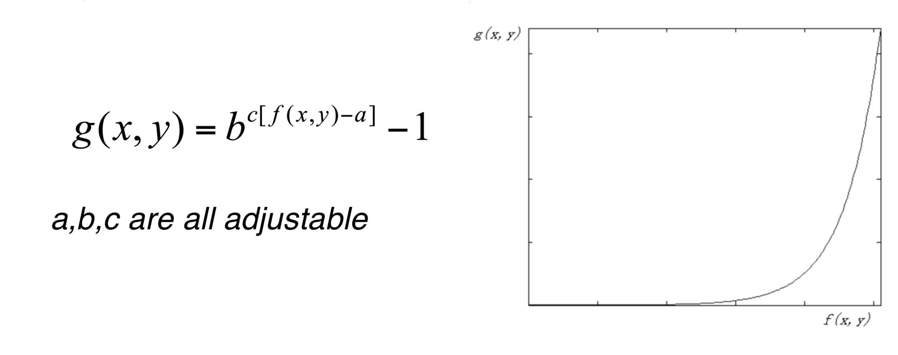

* Stretch high grayscale region
* Compress low grayscale region 

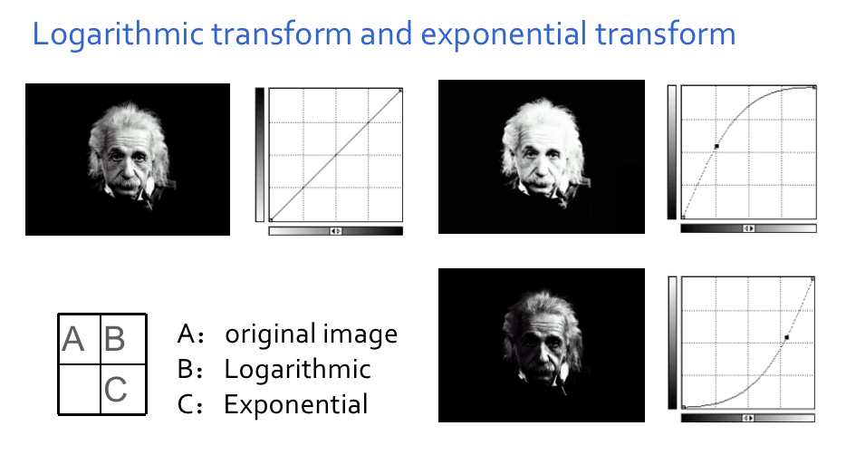

## Geometric transform

### 1.基本几何变化

#### 平移（Translation）
> 将图像沿水平和竖直方向移动，从而产生新图像的过程。 

> 平移后的景物与原图像相同，但“画布”一定是扩大了，否则就会丢失信息。

* 矩阵表示
$\begin{bmatrix}x^{'}\\y^{'}\\1\end{bmatrix}=\begin{bmatrix}1&0&x_0\\0&1&y_0\\0&0&1\end{bmatrix}\begin{bmatrix}x\\y\\1\end{bmatrix}$

#### 旋转（Rotation）
* 绕原点旋转$\theta$角，得到新图像的过程
  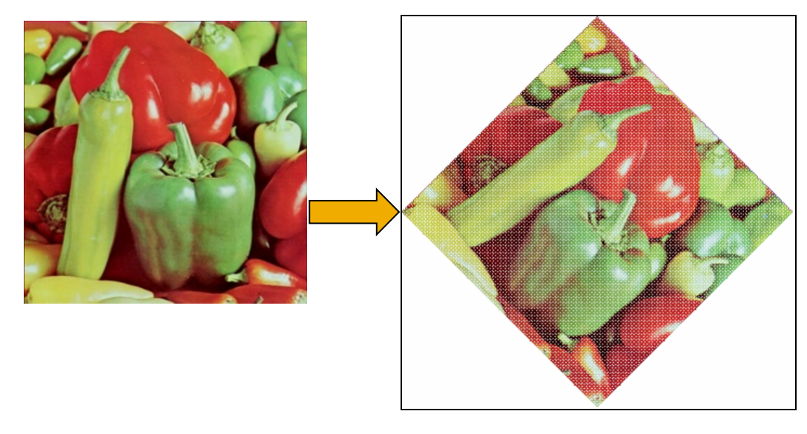
* 注意：旋转变换的过程中，图像中会产生空洞，用插值法补全(行插值——按顺序寻找每一行中的空洞像素，设置其像素值与同一行中前一个像素的像素值相同。)
* 矩阵表示
  $\begin{bmatrix}x^{'}\\y^{'}\\1\end{bmatrix}=\begin{bmatrix}cos\theta&-sin\theta&0\\sin\theta&cos\theta&0\\0&0&1\end{bmatrix}\begin{bmatrix}x\\y\\1\end{bmatrix}$
  

##### （3）缩放 (Scale)

将图像乘以一定系数，从而产生新图像的过程
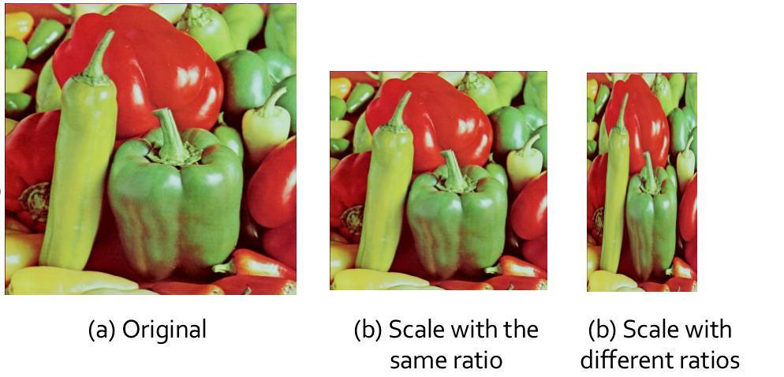

* 沿x轴方向缩放c倍（c>1时为放大，0<c<1时为缩小）

  沿y轴方向缩放d倍（d>1时为放大，0<d<1时为缩小）

  *  当c=d时，图像等比缩放；否则为非等比缩放，导致图像变形。
  * 缩小 ：按一定间隔选取某些行和列的像素构成缩小后的新图像；
  * 放大  ：新图像出现空行和空列，可采用插值的方法加以填补，但存在“马赛克”现象。

* 矩阵表示
  $\begin{bmatrix}x^{'}\\y^{'}\\1\end{bmatrix}=\begin{bmatrix}c&0&0\\0&d&0\\0&0&1\end{bmatrix}\begin{bmatrix}x\\y\\1\end{bmatrix}$
  

#### 图像剪切 (Shear)

图像的错切变换实际上是景物在平面上的非垂直投影效果

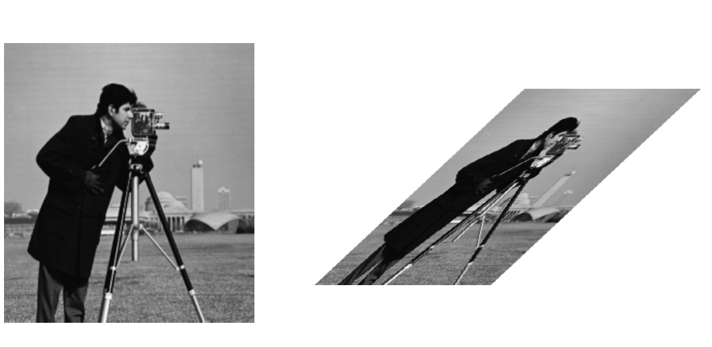
$Shear\ on\ x-axis:\left\{\begin{aligned}&a(x, y) = x + d_xy \\&b(x, y) = y\end{aligned}\right.$
$Shear\ on\ y-axis:\left\{\begin{aligned}&a(x, y) = x  \\&b(x, y) = y+d_yx\end{aligned}\right.$

* 矩阵表示
  $\begin{bmatrix}x^{'}\\y^{'}\\1\end{bmatrix}=\begin{bmatrix}1&d_x&0\\d_y&1&0\\0&0&1\end{bmatrix}\begin{bmatrix}x\\y\\1\end{bmatrix}$

#### 镜像变换 (Mirror)

绕x轴或y轴翻转，从而产生与原图像对称的新图像的过程

* 矩阵表示
$\begin{bmatrix}x^{'}\\y^{'}\\1\end{bmatrix}=\begin{bmatrix}s_x&0&0\\0&s_y&0\\0&0&1\end{bmatrix}\begin{bmatrix}x\\y\\1\end{bmatrix}$

* 当$S_x$ =$1$，且$S_y$ =$-1$时实现绕x轴的镜像变换
* 当$S_x$ = $-1$，且$S_y$ =$1$时实现绕y轴的镜像变换

#### 复合几何变换
$$\begin{bmatrix}x^{'}\\y^{'}\\1\end{bmatrix}=\begin{bmatrix}a&b&c\\d&e&f\\g&h&1\end{bmatrix}\begin{bmatrix}x\\y\\1\end{bmatrix}$$

### 插值

#### 最邻近插值 (Nearest neighbor)

* 最邻近插值，即输出像素的灰度值等于离它所映射到的位置最近的输入像素的灰度值。

> 为了计算几何变换后新图像中某一点$P’$处的像素值，可以首先计算该几何变换的逆变换，计算出 $P’$ 所对应的原图像中的位置 $P$
>
> 通常情况下，$P$ 的位置不可能正好处在原图像的某一个像素位置上(即 $P $点 的坐标通常都不会正好是整数)
>
> 寻找与 $P$ 点最接近的像素$Q$，把 $Q$ 点的像素值作为新图像中 $P’$点的 像素值。

* $Steps$
  $(x^{'},y^{'})\Rightarrow{\text{Inverse Transtion}}(x,y)\\  \Rightarrow{\text{rounding operation}}(x_{int},y_{int})\\  \Rightarrow{\text{assign value}}I_{new}(x^{'},y^{'})=I_{old}(x_{int},y_{int})\\$
  
* 当图像中包含明显的几何结构时，结果将不太光滑连续，从而在图像中产生人为的痕迹

#### 线性插值 (Linear interpolation)

* 在一维情况下，已知x1和x2处的灰度值分别为g1和g2，则x3处的灰度值g3为： 
  $$
  g_3 = \frac{g_2-g_1}{x_2-x_1}(x_3-x_1)+g1
  $$

* 在二维情况下，称为双线性插值

  * 注：可由一维的情况推导而来，得到双线性方程g(x,y)为
    $$
    g(x,y)=\frac{(y_1-y)(x_1-x)}{(y_1-y_0)(x_1-x_0)}g(0,0)+\frac{(y_1-y)(x-x_0)}{(y_1-y_0)(x_1-x_0)}g(1,0)+\frac{(y-y_0)(x_1-x)}{(y_1-y_0)(x_1-x_0)}g(0,1)+\frac{(y-y_0)(x-x_0)}{(y_1-y_0)(x_1-x_0)}g(1,1)
    $$
    即满足$g(x,y)=ax+by+cxy+d$的形式

  * 已知图像的正方形网格上四个点A、B、C、D的灰度，求P点的灰度:

    * 定义双线性方程$g(x,y)=ax+by+cxy+d $
    * 分别将$A\ B\ C\ D$四点的位置和灰度代入方程，得到方程组
    * 解方程组，解出$a\ b\ c\ d$四个系数
    * 将P点的位置代入方程，得到P点的灰度

#### 径向基函数插值[Radial Basis Function (RBF) based interpolation]

* 径向基函数$\phi(x)$

  * 最常见为高斯函数$φ(r)=e^{\frac{−r^2}{2σ^2}}$　

  * Multiquadrics:$\phi(r)=\sqrt{1+\frac{r^2}{\sigma^2}}$　

  * Linear: $\phi(r)=r$

  * Cubic:$\phi(r)=r^3$

    ……

* 插值函数
  $\hat{f}(x)=\sum_{i=1}^Nw_i\phi(||x-x_i||)$ where $w_i=\frac{\phi(|x-c_i|)}{\sum_{i=1}^n\phi(|x-c_i|)}$
  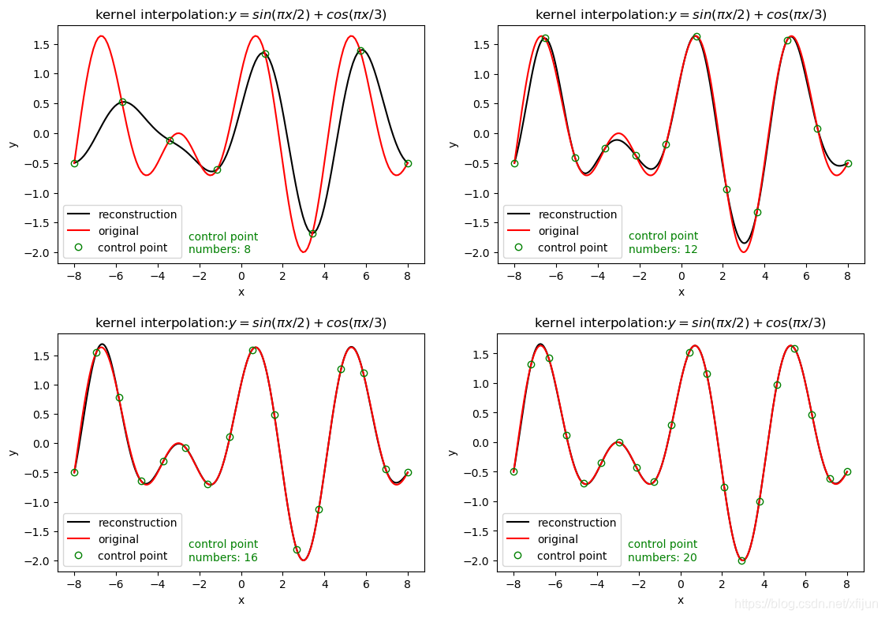

