

# Feature detection

## Feature detection:  the math

Consider shifting the window $W$ by $(u,v)$

$\begin{align*}Error(u,v)&=\sum_{(x,y)\in W}[I(x+u,y+v)-I(x,y)]^2\\ &\approx\sum_{(x,y)\in W}[I(x,y)+\frac{\partial I}{\partial x}u+\frac{\partial I}{\partial y}v-I(x,y)]^2\\ &\approx\sum_{(x,y)\in W}[u,v]\begin{bmatrix}I_x^2&I_xI_y\\I_yI_x&I_y^2\end{bmatrix}\begin{bmatrix}u\\v\end{bmatrix} \\ \end{align*}$

* Which directions will result in the largest and smallest E values?

  We can find these directions by looking at the eigenvectors of H $(\begin{bmatrix}I_x^2&I_xI_y\\I_yI_x&I_y^2\end{bmatrix})$

Eigenvalues and eigenvectors of H

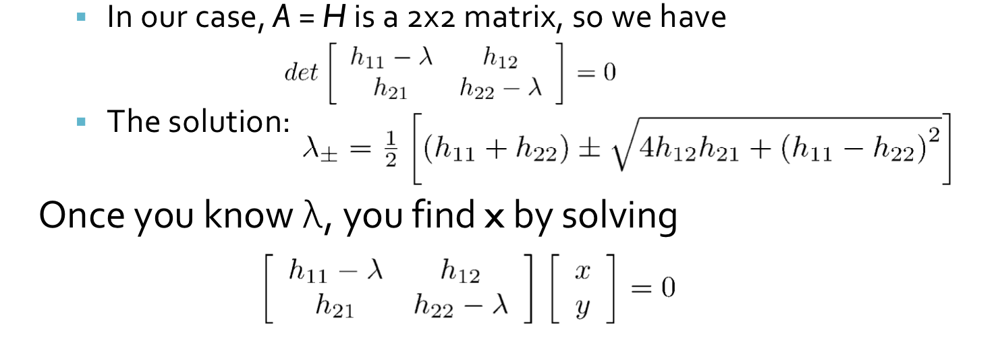

* Define shifts with the smallest and largest change (E value)
* $x_+$ = direction of largest increase in E. 
* $\lambda_+$ = amount of increase in direction x+       $Hx_{+}=\lambda_{x_+}x_+$
* $x_-$ = direction of smallest increase in E. 
* $\lambda_-$ = amount of increase in direction x- .      $Hx_{-}=\lambda_{x_-}x_-$

Since $H$ is symmetric ,so $H=R^{-1}\begin{bmatrix}\lambda_1&0\\0&\lambda_2\end{bmatrix}R$

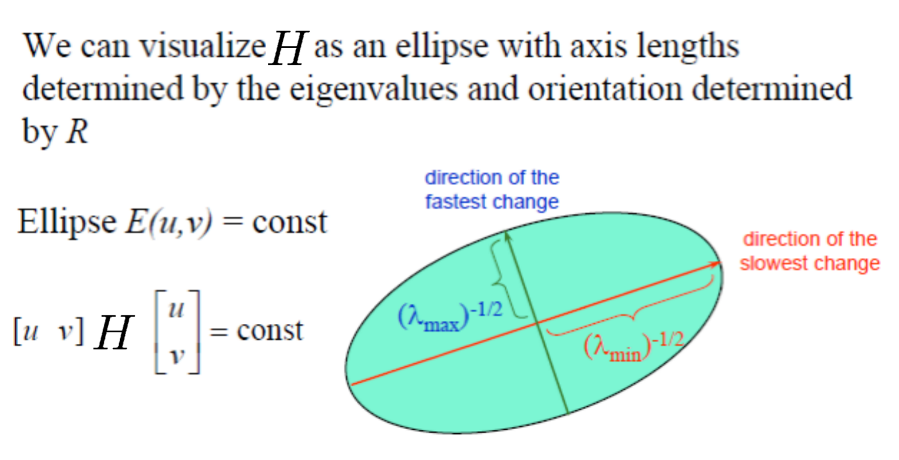

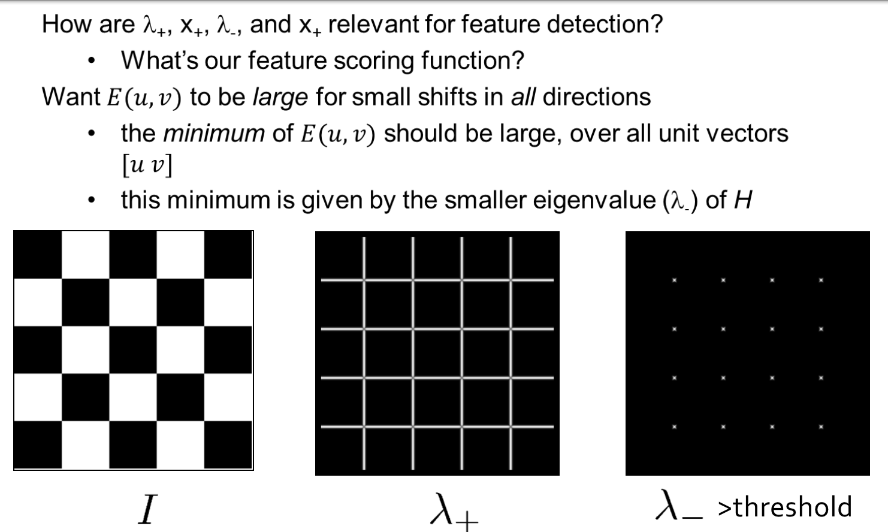

* Compute the gradient at each point in the image
* Create the $H$ matrix from the entries in the gradient
* Compute the eigenvalues. 
* Find points with large response ($\lambda_-$ > threshold)
* Choose those points where $\lambda_-$ is a local maximum as features

## The Harris operator

- $\lambda_-$  is a variant of the **Harris operator** for feature detection

$f=\frac{\lambda_1\lambda_2}{\lambda_1+\lambda_2}=\frac{determinant(H)}{trace(H)}$

* The trace is the sum of the diagonals, i.e., $trace(H) = h_{11} + h_{22}$
* Very similar to $\lambda_-$ but less expensive (no square root)
* Called the “Harris Corner Detector” or “Harris Operator”Lots of other detectors, this is one of the most popular

### Some Properties

* Rotation Invariance

* Partial Invariance to additive and multiplicative intensity changes

* Not invariance to scaling. !!!

## Scale Invariant Detection

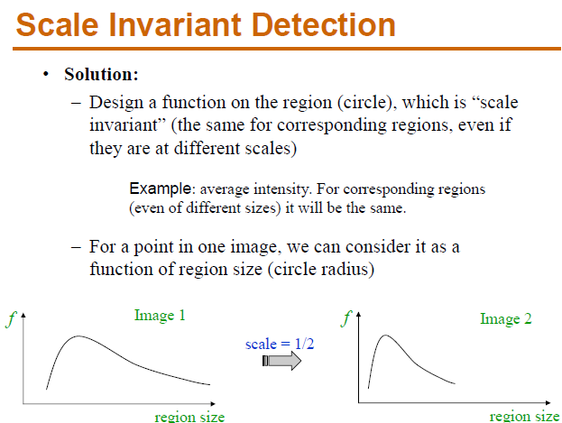

* Eg. Take a local $MAXIMUM$

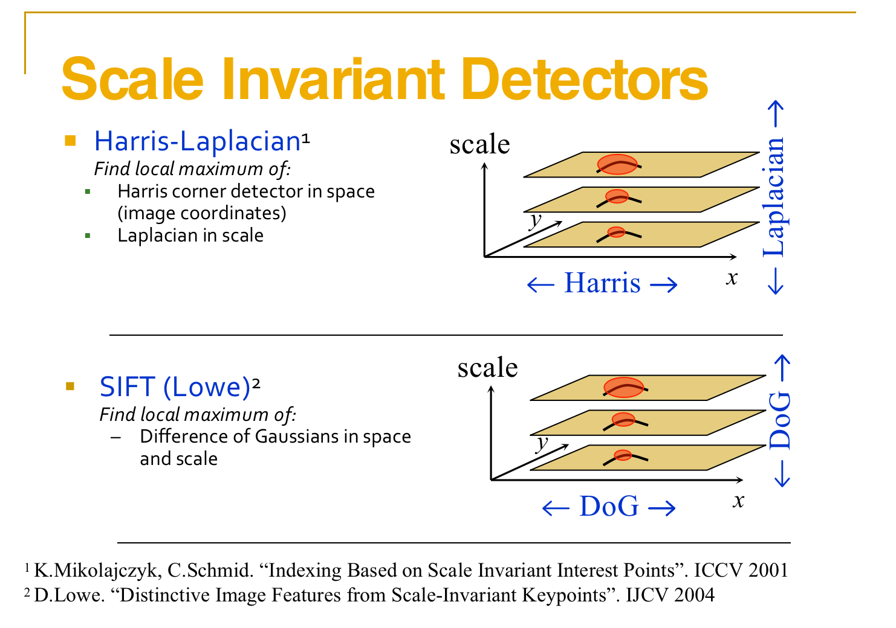

### Harris-Laplacian

We define the characteristic scale as the scale that produces peak of Laplacian response

**Stage 1: Initialization--Multiscale Harris Corner Detection**

1. **Image Pyramid Construction:** Begin by constructing a scale-space pyramid of the image, generating different scales by applying Gaussian smoothing and downsampling.
2. **Computation of Harris Corner Response:** At each scale, calculate the corner response using the Harris corner detection method. This typically involves computing local gradients at each pixel position, forming the autocorrelation matrix, calculating the corner response function, and identifying **local maxima** as keypoints.
3. **Non-Maximum Suppression:** For **each scale**, perform non-maximum suppression to eliminate redundant keypoints in the corner response function, retaining only the keypoints corresponding to local maxima.

**Stage 2: Scale Selection Based on Laplacian**

1. **Laplacian Scale Selection:** 

   The Laplacian is an operator used to detect edges and texture variations in an image by computing the second derivative at each point. 

   In the context of scale selection, the Laplacian serves to measure the changes in the image at different scales.

   * Example: Consider an image containing a circle. As you view this circle at different scales, its edges will exhibit varying degrees of change. By applying the Laplacian at different scales, we can observe **the intensity of edge variations.**

   The optimal scale for a keypoint is where the **maximum edge response occurs**, indicating that the details of the keypoint are most pronounced at that scale.

2. **Keypoint Filtering:** 

   For the same corner, **even with changes in scale**, the corner remains **detectable**, indicating robustness in terms of repeatability.

   The content within the feature scale range of the same corner in images of different sizes should be consistent. 

   Therefore, the pixel locations within the feature scale range of corners in images of varying scales are proportional to the scale.(不同尺寸图片中的相同角点的特征尺度范围中的内容要相同，因此，不同尺度的图片的角点的特征尺度范围内的像素点与尺度成比例关系。)

##### Local Extrema Detection

* Maxima and minima
* Compare $x$ with its 26 neighbors at 3 scales

#### Orientation

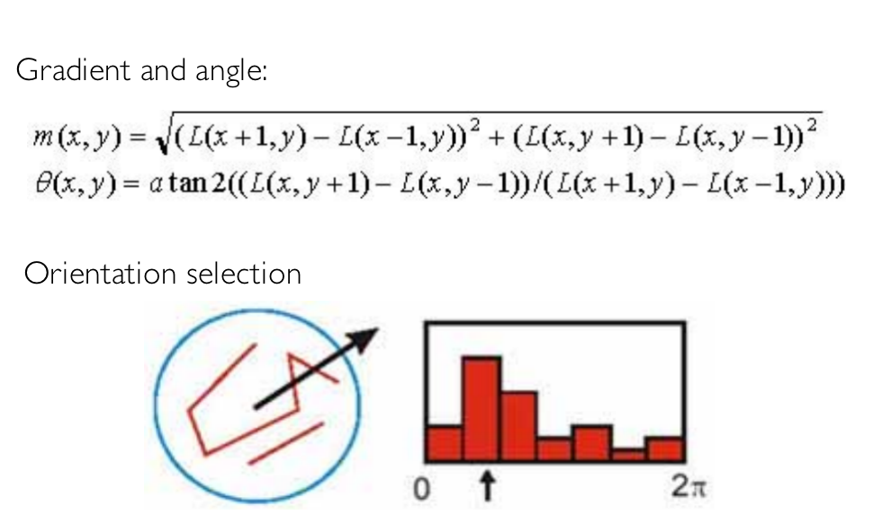 

### SIFT

> Let's illustrate the construction process of a Gaussian pyramid with a simple example. We assume that each group contains S layers, and the scale differences within each group are achieved through downsampling by a factor of 2 and using different Gaussian blur parameters σ.
>
> 1. **Initial Image:** Suppose we have an initial image, labeled as Group 0, containing image A.
> 2. **Group 1:**
>    - We apply Gaussian blur to image A in Group 0, obtaining image B in Group 1. The Gaussian blur parameter here is σ1.
>    - Next, we downsample (reduce by half) image B, resulting in image C in Group 1.
> 3. **Group 2:**
>    - We apply Gaussian blur to image B in Group 1, obtaining image D in Group 2. The Gaussian blur parameter here is σ2.
>    - We then downsample image D, obtaining image E in Group 2.
> 4. **Group 3:**
>    - Gaussian blur is applied to image D in Group 2, resulting in image F in Group 3. The Gaussian blur parameter here is σ3.
>    - Image F is then downsampled, resulting in image G in Group 3.
>
> This process can be repeated iteratively, and each round of Gaussian blur and downsampling constructs one level of the pyramid. Within each group, we have S images at different scales (determined by different Gaussian blur parameters), and each image, obtained by downsampling, aligns with the corresponding image from the previous group in terms of scale.
>
> This ensures that the construction of the pyramid is "bottom-up," reflecting the features of the image at different scales.

* **REFER TO ML-4360 Structure from motion **

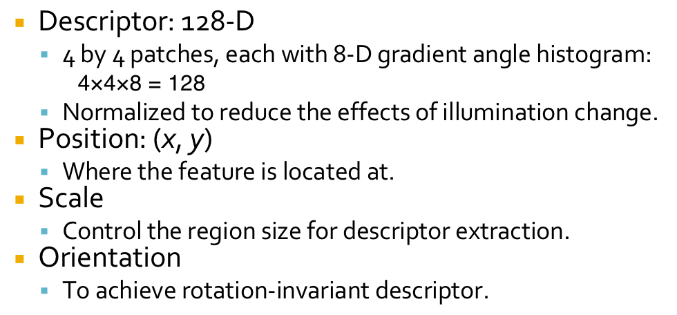

### Visual Word Generation

Based on the collected images we detect their interest points with Difference of Gaussian, and extract the SIFT descriptors. 

The extracted descriptors are then clustered to generate the vocabulary tree with the hierarchical **k-means clustering**. In this experiment we generated a visual vocabulary containing 32357 visual words

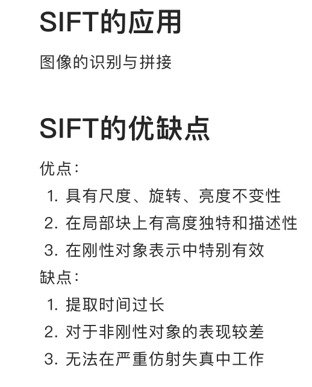

## SURF detectors and descriptors

Reference to https://medium.com/@deepanshut041/introduction-to-surf-speeded-up-robust-features-c7396d6e7c4e

* speeded up robust features

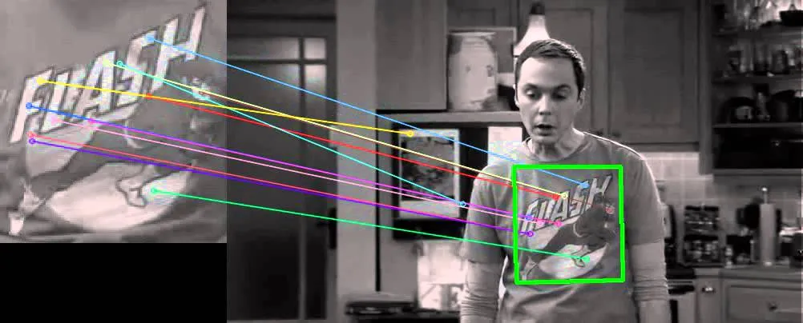

### (1)Feature Extraction

**Basic Hessian matrix approximation.**

#### a.Integral images

The Integral Image or [*Summed-Area Table*](http://en.wikipedia.org/wiki/Summed_area_table) was introduced in 1984. The Integral Image is used as a quick and effective way of calculating the sum of values (pixel values) in a given image — or a rectangular subset of a grid (the given image). It can also, or is mainly, used for calculating the average intensity within a given image.

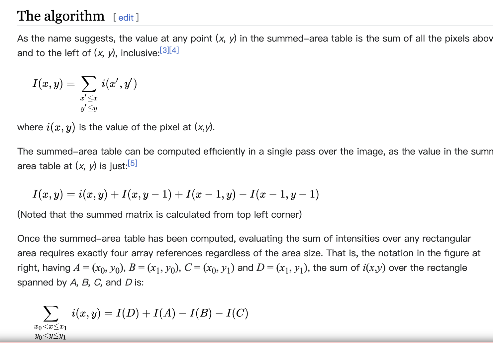

#### b.Hessian matrix-based interest points

$SURF$ uses the Hessian matrix because of its good performance in computation time and accuracy. Rather than using a different measure for selecting the location and the scale (Hessian-Laplace detector), surf relies on the **determinant of the Hessian matrix** for both. 

For **adapt to any scale**, we filtered the image by a Gaussian kernel, so given a point $X = (x, y)$, the Hessian matrix $H(x, σ)$ in x at scale σ is defined as:

$H(\vec{x},\sigma)=\begin{bmatrix}L_{xx}(x,\sigma)&L_{xy}(x,\sigma)\\ L_{xy}(x,\sigma)&L_{yy}(x,\sigma)\end{bmatrix}$

where $L_{xx}(x, σ)$ is the convolution of the **Gaussian second order derivative** with the image $I$ in point $x$, and similarly for $L_{xy} (x, σ)$ and $L_{yy} (x, σ)$. 

Gaussians are optimal for scale-space analysis but in practice, they have to be discretized and cropped. This leads to a loss in repeatability under image rotations around odd multiples of $π /4$. This weakness holds for Hessian-based detectors in general. **Nevertheless**, the detectors still perform well, and the slight decrease in performance does not outweigh the advantage of fast convolutions brought by the discretization and cropping.

After Lowe’s success with **LoG approximations(SIFT)**, SURF pushes the approximation(both convolution and second-order derivative) even further with box filters. These approximate second-order Gaussian derivatives and can be evaluated at a very low computational cost using **integral images** and independently of size, and this is part of the reason why SURF is fast.

* eg.

  

  $d^2L(x)/dx^2=(L(x+1)-L(x))-(L(x)-L(x-1))=-2*L(x)+L(x+1)+L(x-1)$

  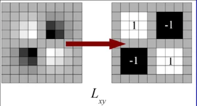

  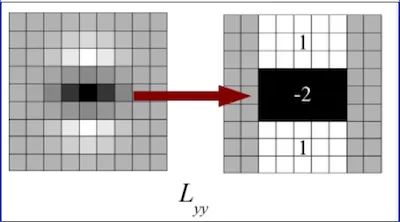
  
  The $9 × 9$ box filters in the above images are approximations for Gaussian second order derivatives with σ = 1.2.
  
  We denote these approximations by $D_{xx}, D_{yy}, and D_{xy}$. 
  
  Now we can represent the determinant of the Hessian (approximated) as:$det(H_{approx})=D_{xx}D_{yy}-(wD_{xy})^2$   $w=0.9 (Bay’s\ suggestion)$

#### c.Scale-space representation

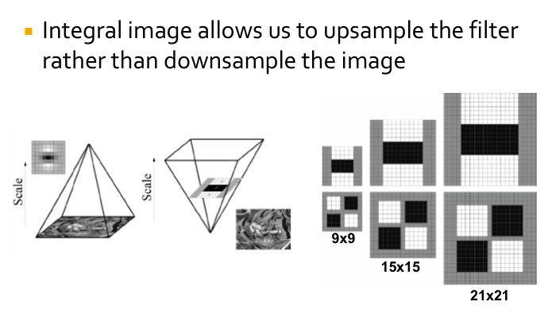

> SURF can be considered as a faster feature extraction method compared to SIFT.
>
> It processes the original image **directly** using box filters at different **scales**, eliminating the need to **build multiple layers** of a pyramid like SIFT. This makes SURF computationally more efficient, especially in scenarios where large-scale image databases or real-time applications are involved.

> * 我的理解，因为盒子滤波可以用同样处理在一张图上完成象征着改变尺度（对不同尺度的操作）（比如上图就是在做对已经（对原图）降采样后图片，的二阶微分)
>
> If you use a 9x9 box filter on a 36x36 image, and you start from the center of the filter, moving the width of the filter at each step, you would end up with a 4x4 grid, deriving 16 new coordinate detection points. This is because 36 divided by 9 equals 4, thus, you can get 4 coordinate points in each direction. 
>
> However, this is just a logical understanding, and the actual results may vary due to the details of filter processing, such as edge handling, stride of the filter, and other factors.

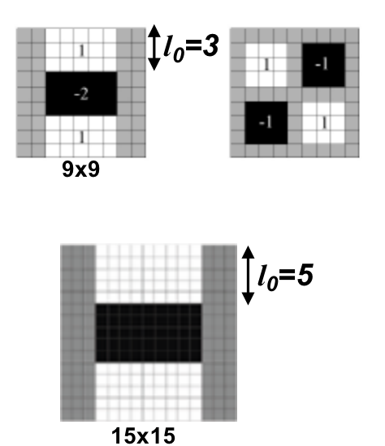

> 这里可以看到一个问题，找到的局部最大值如果放回原图的尺度，其实是对应着一个区域的，那么如何确定一个精确的坐标呢？

To locate the precise position of feature points, we apply a **Taylor expansion** to the Hessian matrix at the local maximum points. This approximates a smooth surface depicting the variation of image intensity around the feature points. Then, we identify the peak of this smooth surface. Compared to the original discrete maximum point, the location of this peak is more accurate. Hence, we refer to it as the true location of the feature point.

##### Interpolation

For each local maximum, need to interpolate to get true location (to overcome discretization effects)

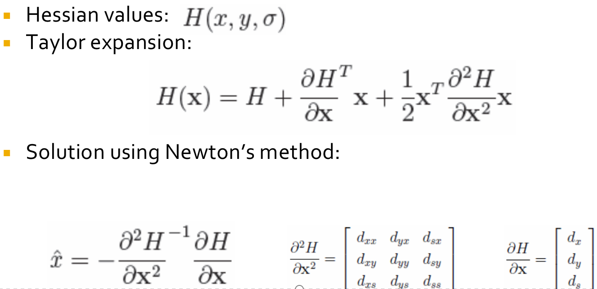

### (2)Feature Description

#### Orientation Assignment

1. First calculate the Haar-wavelet responses in $x$ and $y$-direction, and this in a circular neighborhood of radius $6*s$ around the keypoint, with $s$ the **scale** at which the keypoint was detected. 

   Also, the sampling step is scale dependent and chosen to be s, and the wavelet responses are computed at that current scale s. 

   Accordingly, at high scales the size of the wavelets is big. Therefore integral images are used again for fast filtering.

2. Then we calculate the sum of vertical and horizontal wavelet responses in a scanning area, then change the scanning orientation (add $π/3$), and re-calculate, until we find the orientation with **largest sum value**, this orientation is **the main** orientation of feature descriptor.

#### Descriptor Components

Now it’s time to extract the descriptor

1. The first step consists of constructing a square region centered around the keypoint and oriented along the orientation we already got above. The size of this window is 20s.

2. Then the region is split up regularly into smaller **4 × 4** square sub-regions. For each sub-region, we compute a few simple features at **5×5** regularly spaced sample points. 

   For reasons of simplicity, we call **dx** the **Haar wavelet response** in the horizontal direction and **dy** the Haar wavelet response in the vertical direction (filter size 2s). 

   To increase the robustness towards geometric deformations and localization errors, the responses **dx** and **dy** are first weighted with a Gaussian (σ = 3.3s) centered at the keypoint.

Then, the wavelet responses **dx** and **dy** are summed up over each subregion and form a first set of entries to the feature vector.

In order to bring in information about the polarity of the intensity changes, we also extract the sum of the absolute values of the responses, **|dx|** and **|dy|**. 

Hence, each sub-region has a four-dimensional descriptor vector $\vec{v}$ for its underlying intensity structure $V = (∑ dx, ∑ dy, ∑|dx|, ∑|dy|)$.

This results in a descriptor vector for all 4×4 sub-regions of **length 64.**

* (In $SIFT$, our descriptor is the **128-D vector**, so this is part of the reason that SURF is faster than Sift).

### Image Stitching

Procedure

* Detect feature points in both images. --Build SIFT descriptors
* Find correponding pairs -- Match SIFT descriptors (Euclidean distance)
* Use these pairs to align the images --  Fitting the transformation
* RANSAC
* Image Blending

### RANSAC

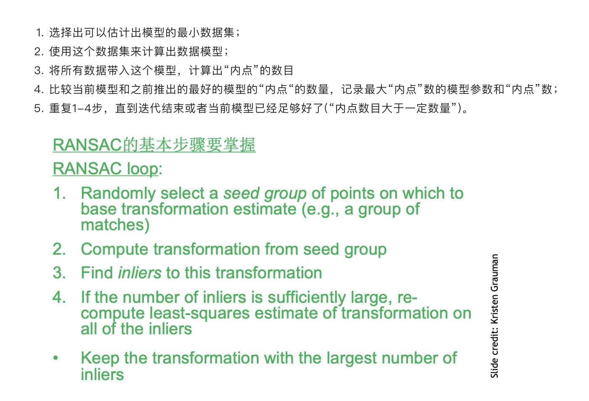

A further refinement of matches.--**RANdom SAmple Consensus **

In short words, $RANSAC$ fits $N$ models using different random sample *S* of the whole available data each time. Then, for each model it evaluates its performance *P* (i.e. number of inliers or outliers) and chooses the best one. Note that RANSAC doesn’t determine what method should you use to find model parameters.(least squares for example)

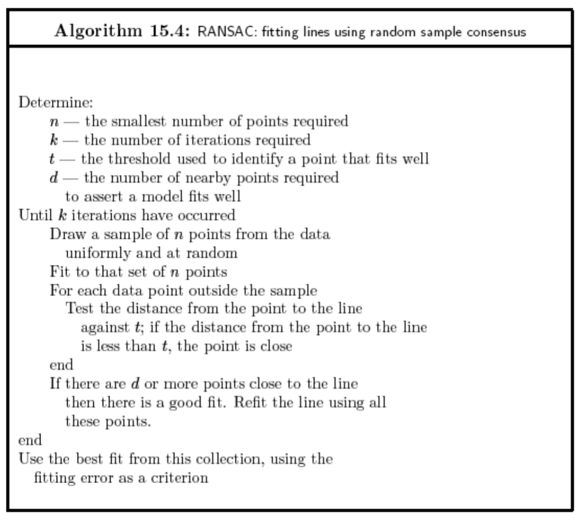

* How many samples are needed?

  * Suppose $w$ is fraction of inliers (points from line).

  * $n$ points needed to define hypothesis (2 for lines)

  * $k$ samples chosen.

    Prob. that a single sample of n points is correct $w^n$

    Prob. that all k samples fail is: $(1-w^n)^k$

    * Choose k high enough to keep this below desired failure rate.

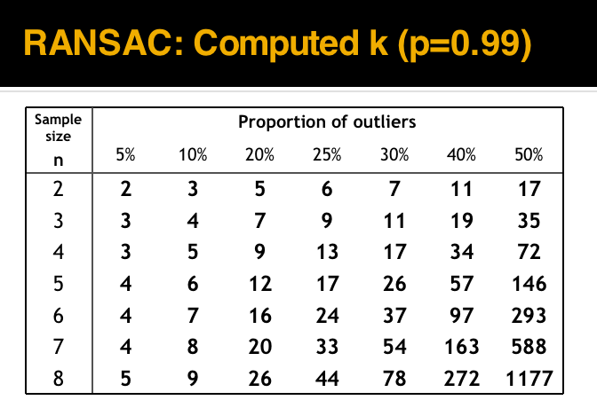

* k-- iterations

* RANSAC divides data into inliers and outliers and yields estimate computed from minimal set of inliers.Improve this initial estimate with **estimation over all inliers** (e.g. with standard least-squares minimization).

* But this may change inliers, so alternate fitting with re-classification as inlier/outlier.

#### Pros:

* General method suited for a wide range of model fitting problems
* Easy to implement and easy to calculate its failure rate

#### Cons:

* Only handles a moderate percentage of outliers without cost blowing up
* Many real problems have high rate of outliers (but sometimes selective choice of random subsets can help)

A voting strategy, the Hough transform, can handle high percentage of outliers

### Image Blending

#### Image Pyramids

* An image pyramid can be constructed by repeatedly downsampling (or upsampling) an image and creating a set of images at different resolutions. 

* The resulting images are referred to as “levels” of the pyramid, with the highest resolution image at the top and the lowest resolution image at the bottom.

#### Gaussian Pyramids

This type of pyramid is constructed by repeatedly applying a Gaussian blur filter to an image and downsampling it by a factor of **two**. The resulting images are smoother and have lower resolution than the original image because Gaussians are **low pass filters**.

#### Laplacian Pyramid

This type of pyramid is constructed by **subtracting** a downsampled version of an image from the original image. 

* The resulting images are high-pass filtered versions of the original image, which highlight the **fine details and edges**.

#### Procedure

• Build Laplacian pyramid for both images: $L_A, L_B$.

• Build Gaussian pyramid for mask: $G$.

• Build a combined Laplacian pyramid: $L(j) = G(j) LA(j) + (1-G(j)) LB(j).$

• Collapse $L$ to obtain the blended image.

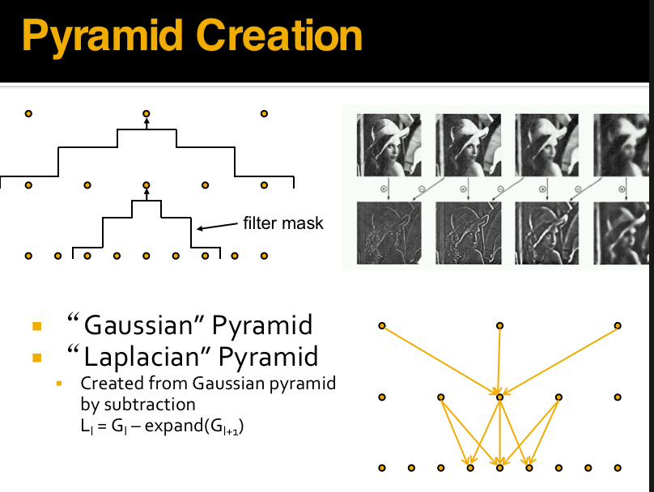

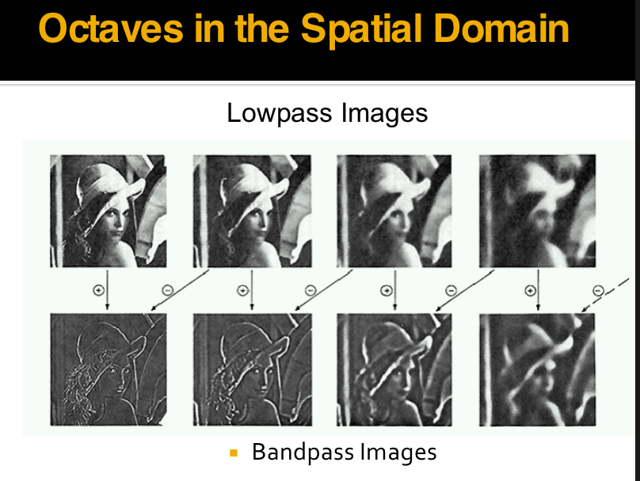

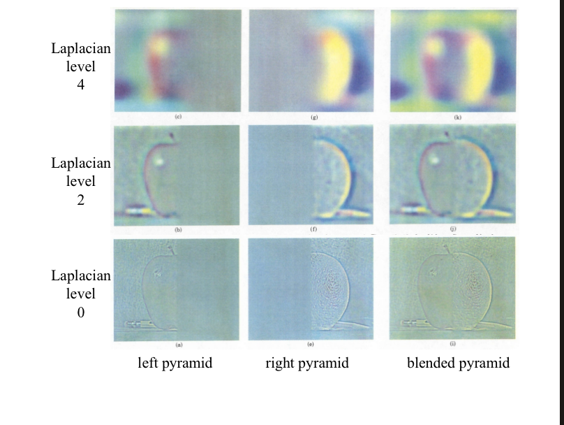

