# 滤波

## 卷积

$L(x,y,σ)=G(x,y,σ)∗I(x,y)$

连续形式：$(f∗g)(n)=\int_{-\infty }^{\infty}f(\tau )g(n-\tau)d\tau$

离散形式：$(f∗g)(n)=\frac{1}{M}\sum_{\tau=0 }^{M-1}f(\tau)g(n-\tau)$

### Properties

$f(x)*h(x)=h(x)*f(x)\\ f*(g+h)=f*g+f*h\\f*(g*h)=(f*g)*h$

### Examples

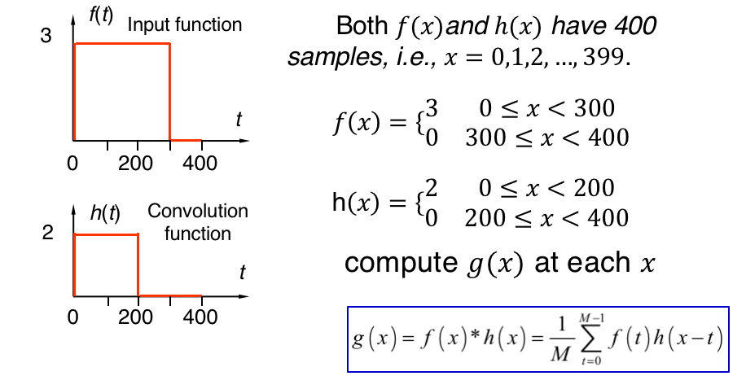

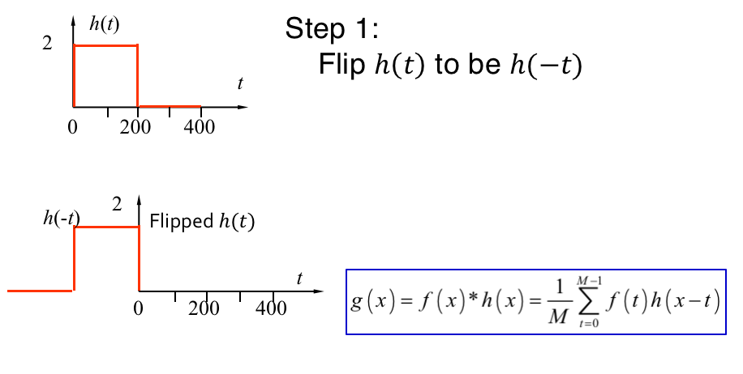

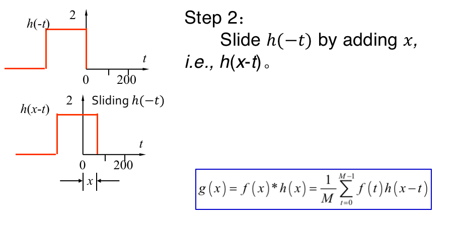

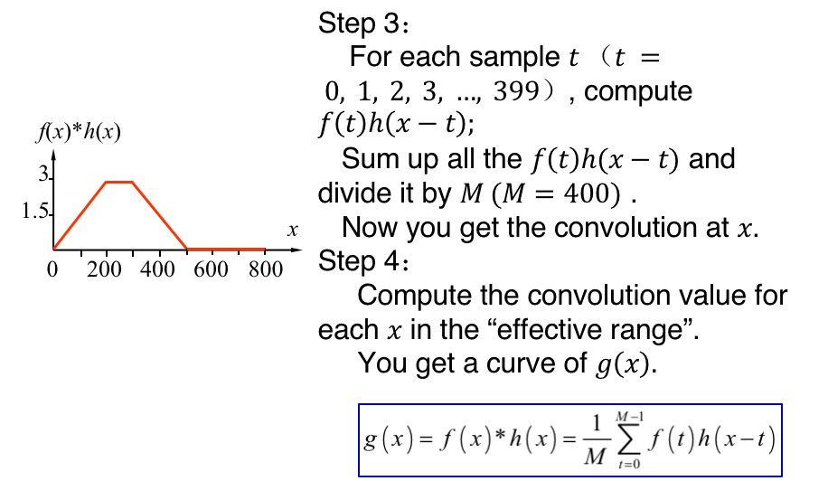

* Effective range：       

  Covers all the points that $h(t)$ go through during the sliding operation.        

  In this example, the effective range of x is from 0 to 799.

## 基本概念

 滤波器是一个大小为 $M\times N$ 的窗口，其中窗口中的元素对应于原始图像中的相应像素进行操作，结果保存为新图像中的像素

滤波也被称作:遮罩 (mask)、内核 (kernel)、模板 (template) 等。滤波器中的元素是系数而不是像素值，它们表示应用于原始图像中像素的权重。在待处理图像中逐点移动掩模，在每一点(x,y)处，滤波器在该点的响应通过实现定义的关系来计算。对于线性空间滤波，其响应由滤波器系数与滤波掩模扫过区域的对应像素值的乘积之和给出。 

通常，掩模的长宽都为**奇数**

* 假设分别为$2a+1$和$2b+1$。当窗口中心处于像素$(x,y)$处时，新的像素值为：$g(x,y)=\sum_{s=-a}^a\sum_{t=-b}^b w(s,t)f(x+s,y+t)$.对图像f中所有像素都与掩模进行运算之后，最终产生一幅新图像g  (这实际上是一种卷积操作)

 图像在传输过程中，由于传输信道、采样系统质量较差，或受各种干扰的影响，而造成图像毛糙，此时，就需对图像进行平滑处理。平滑可以抑制高频成分，但也使图像变得模糊。  平滑空间滤波器用于模糊处理和减少噪声。模糊处理经常用于预处理，例如，在提取大的目标之前去除图像中一些琐碎的细节，桥接直线或曲线的缝隙。

## 平滑线性空间滤波器

 平滑线性空间滤波器的输出是包含在滤波掩模邻域内像素的简单平均值。因此，这些滤波器也称为均值滤波器。

* 简单平均(simple mean)，表示窗口中每一个像素对响应的贡献是一样的, 滤波窗口：$\frac{1}{9} \times \begin{bmatrix}1&1&1 \\ 1&1&1\\ 1&1&1\end{bmatrix}$

* 加权平均(weighted mean)，表示窗口中的像素对相应的贡献有大小之分，滤波窗口：$\frac{1}{16} \times \begin{bmatrix}1&2&1 \\ 2&4&2\\ 1&2&1\end{bmatrix}$

* General Equation

其中，滤波器大小为$(2a+1) ×(2b+1)$，$w$为滤波器，$f$为输入图像，$g$为输出图像。

* 滤波掩模的大小与图像的平滑效果有直接的关系

  当掩模比较小时，可以观察到在整幅图像中有轻微的模糊

  当掩模大小增加，模糊程度也随之增加

* 为了对感兴趣物体得到一个粗略的描述而模糊一幅图像，这样，那些较小物体的强度与背景混合在一起了，较大物体变得像“斑点”而易于检测。掩模的大小由那些即将融入背景中去的物件尺寸来决定。 

## 统计滤波器

统计滤波器是一种**非线性**的空间滤波器，它的响应是基于窗口内图像区域中像素值的排序，由统计排序结果决定的值代替中心像素的值。      

* 统计滤波器中最常见的例子就是中值滤波器。
* 用像素邻域内灰度的中值代替该像素的值
* 提供了优秀的去噪能力，比小尺寸的线性平滑滤波器的模糊程度明显要低
* 对处理脉冲噪声（也称为椒盐噪声）非常有效，因为这种噪声是以黑白点叠加在图像上的。 

* 为了对一幅图像上的某个点作中值滤波处理。必须先将掩模内欲求的像素及其邻域的像素值排序，确定出中值，并将中值赋予该像素点

中值$ξ$ --数值集合中，有一半数值小于或等于$ξ$，还有一半大于或等于$ξ$

为了对一幅图像上的某个点作中值滤波处理,必须先将掩模内欲求的像素及其邻域的像素值排序，确定出中值，并将中值赋予该像素点

* 常用$n\times n$的中值滤波器去除那些相对于其邻域像素更亮或更暗，并且其区域小于$n^2/2$（滤波器区域的一半）的孤立像素集

## Sharpening spatial filter

 拉普拉斯锐化是一种图像处理技术，旨在突出图像中的边缘和细节，使图像看起来更加锐利。这种技术使用拉普拉斯算子（Laplacian operator）或拉普拉斯滤波器对图像进行卷积操作，以增强图像中的高频信息。

### (1)拉普拉斯算子 

一阶微分算子:$\frac{\partial{f}}{\partial{x}}$$= f(x + 1) − f(x) $

二阶微分算子:$\frac{\partial^2{f}}{\partial{x}^2}$$= f(x + 1) +f(x-1)− 2f(x)$

* 对于函数f(x,y)，首先定义一个二维列向量：

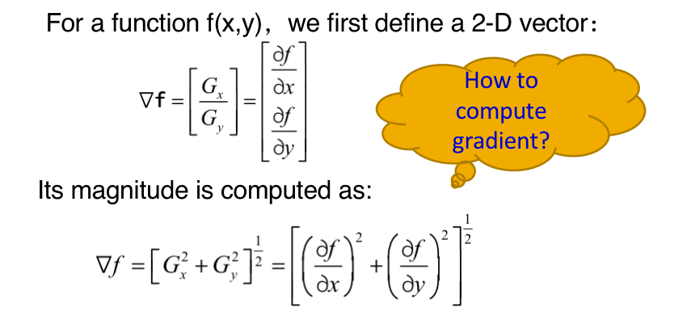

* 对整幅图像计算梯度时，运算量会很大，因此，在实际操作中，常用绝对值代替平方与平方根运算近似求梯度的模值 $\triangledown f \approx |G_x|+|G_y|$

* 离散形式

$\ \ \ \triangledown^2f=f(x+1,y)+f(x-1,y)+f(x,y+1),F(x,y-1)-4f(x,y)$

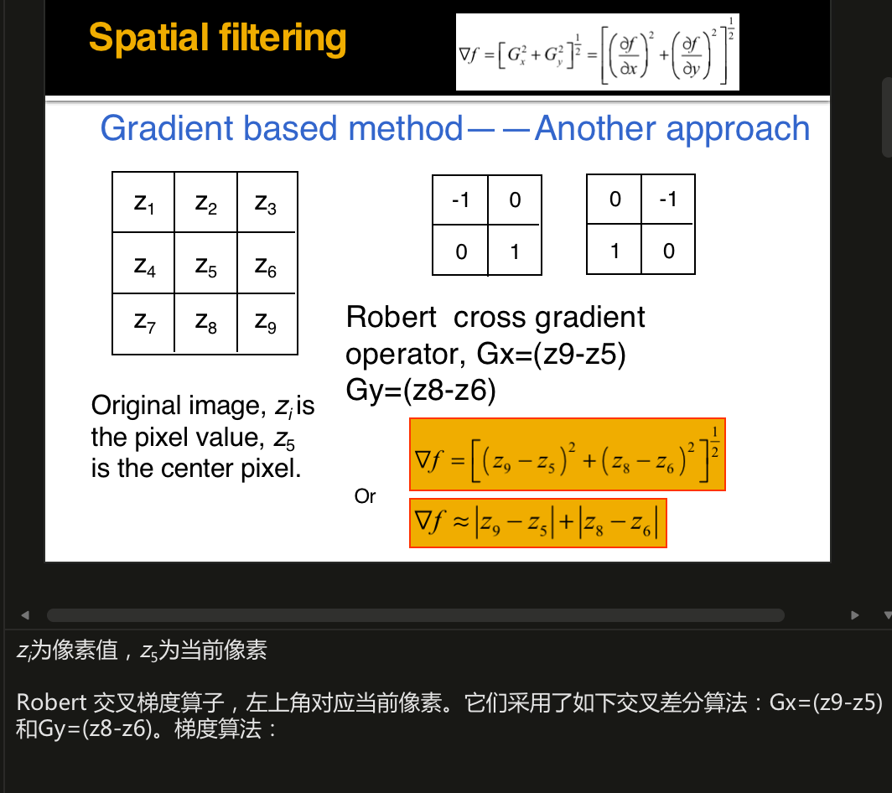

* Laplacian operator is defined as $\triangledown^2 f=\frac{\partial^2f}{\partial x ^2}+\frac{\partial^2f}{\partial y ^2}$
* Along x axis $\frac{\partial^2{f}}{\partial{x}^2}= f(x + 1,y) +f(x-1,y)− 2f(x,y)$
* Along y axis  $\frac{\partial^2{f}}{\partial{y}^2}= f(x,y+1) +f(x,y-1)− 2f(x,y)$
* discrete Laplacian operator  $\triangledown^2f=f(x+1,y)+f(x-1,y)+f(x,y+1),F(x,y-1)-4f(x,y)$

### (2)拉普拉斯变换图像锐化

* 掩模

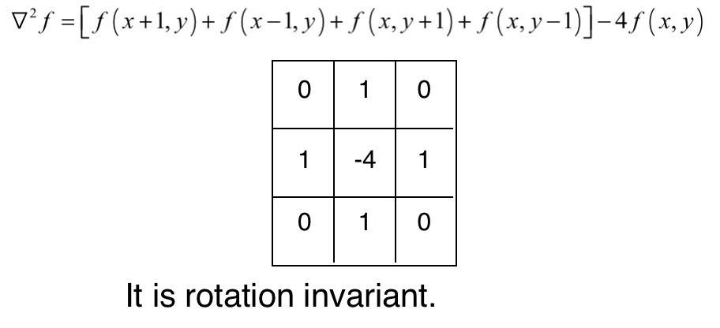

> 如果考虑对角线元素

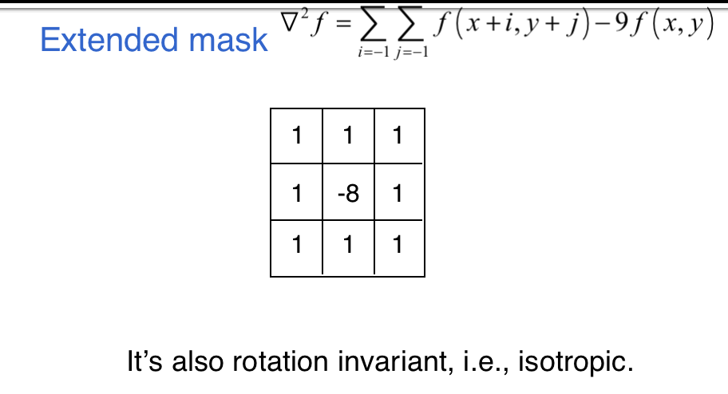

* 由于拉普拉斯算子是一种导数算子，它的使用会突出显示图像中的强度不连续性，而不强调具有缓慢 变化的强度级别的区域。这将倾向于生成具有灰色边缘线和其他不连续性的图像，所有这些图像都叠加在黑暗、无特征的背景上。只需将拉普拉斯图像添加到原始图像中，即可“恢复”背景特征，同时仍保持拉 普拉斯图像的锐化效果

* 也就是说，如果使用的定义具有负中心系数，则我们减去而不是添加拉普拉斯图像以获得锐化结果

* 因此，我们使用拉普拉斯函数进行图像锐化的基本方法是:

$g(x,y)=\left\{\begin{array}{ll}f(x,y)-\triangledown^2f(x,y)& if\ the\ center\ of\ the\ mask\ is\ negative \\ f(x,y)+\triangledown^2f(x,y)& if\ the\ center\ of\ the\ mask\ is\ positive  \end{array} \right.$

* 将原始图像和拉普拉斯图像叠加在一起的简单方法可以保护拉普拉斯锐化处理的效果，同时又能复原背景信息。  

## 高斯滤波

   高斯滤波是一种常用的图像处理滤波器，其主要目的是对图像进行平滑处理。它的名称来源于所使用的滤波核（卷积核）是一个二维高斯函数。高斯滤波在去除图像中的噪声、模糊处理、边缘检测等方面有着广泛的应用。

   高斯滤波的核心思想是对图像中的每个像素点进行加权平均，其中权值是由二维高斯函数确定的。这意味着离中心像素越远的像素对中心像素的影响越小，这种权值的分布符合高斯分布。通过调整高斯函数的标准差$σ$，可以控制权值的分布范围，从而调整滤波效果。

#### (1)数学表达

* 一般情况下，二维高斯函数表示为$f(x,y)=\frac{1}{\sqrt{2\pi}\sigma_x}e^{-\frac{(x-\mu_x)^2}{2\sigma_x^2}}\cdot \frac{1}{\sqrt{2\pi}\sigma_y}e^{-\frac{(y-\mu_y)^2}{2\sigma_y^2}}$

在图像滤波中,一般情况下$μ_x = μ_y = 0$因此二维高斯函数可表示为$f(x,y)=\frac{1}{2\pi\sigma^2}e^{-\frac{x^2+y^2}{2\sigma^2}}$

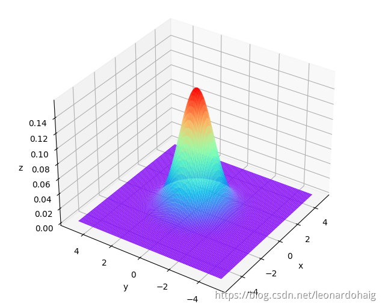

#### (2)滤波过程

* 高斯核的求解：

  将各个位置的坐标代入到高斯函数中,得到的值就是初步的高斯核

* 归一化：

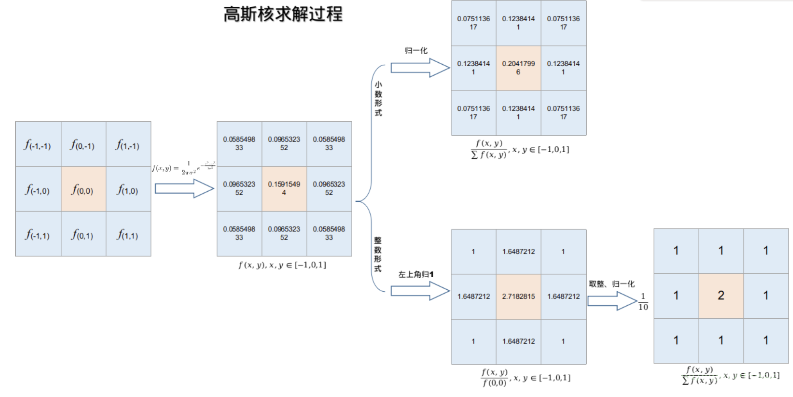

#### (3) 分离实现高斯滤波

利用高斯函数进行卷积(高斯滤波)的过程具有可分离性。

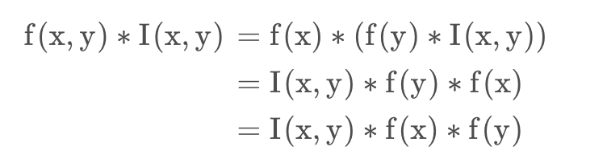

## 双边滤波

   双边滤波（Bilateral filter）是一种非线性的滤波方法，是结合图像的空间邻近度和像素值相似度的一种折衷处理，同时考虑空域信息和灰度相似性，达到保边去噪的目的。具有简单、非迭代、局部的特点

* 去噪，平滑，保留边缘

   双边滤波器的好处是可以**做边缘保存**（edge preserving），一般用高斯滤波去降噪，会较明显地模糊边缘，对于高频细节的保护效果并不明显。双边滤波器顾名思义比高斯滤波多了一个高斯方差sigma－d，它是基于空间分布的高斯滤波函数，所以在边缘附近，离的较远的像素不会太多影响到边缘上的像素值，这样就保证了边缘附近像素值的保存。但是由于保存了过多的高频信息，对于彩色图像里的高频噪声，双边滤波器不能够干净的滤掉，只能够对于低频信息进行较好的滤波

* **引入了快速傅立叶变换才实现了加速!**

### Brute-force Implementation

* Nonlinear 

* Complex, spatially varying kernels

* Cannot be pre-computed

* Brute-force implementation is slow > 10min

#### (1)数学推导

$h(x)=k_r^{−1}(x)∫^{+∞}_{−∞}∫^{+∞}_{−∞}f(ξ)c(ξ,x)s(f(ξ),f(x))dξ$

$c(ξ,x)=\frac{1}{2\pi\sigma_s^2}e^{-\frac{||ξ-x||^2}{2\sigma_s^2}}$

$s(f(ξ),f(x))=\frac{1}{2\pi\sigma_r^2}e^{-\frac{||f(ξ)-f(x)||^2}{2\sigma_r^2}}$

* $Which$ $is$ $BF[I]p=\frac{1}{W_p}\sum_{q\in S}G_{\sigma_s}(||p-q||)G_{\sigma_r}(|O_p-I_q|)I_q$  !!!

* $\frac{1}{W_p}$为归一化因子

#### (2)参数设置

* $σ_s$ 越大，图像越平滑，趋于无穷大时，每个权重都一样，类似均值滤波.

  $σ_s$ 越小，中心点权重越大，周围点权重越小，对图像的滤波作用越小，趋于零时，输出等同于原图.

* $σ_r$ 越大，边缘越模糊，极限情况为$σ_r$ 无穷大，值域系数近似相等(忽略常数时，将近为 $e_0 = 1$)，与高斯模板(空间域模板)相乘后可认为等效于高斯滤波.

  $σ_r$ 越小，边缘越清晰，极限情况为 $σ_r$ 无限接近 0，值域系数除了中心位置，其他近似为 0(接近 $e_∞ = 0$)，与高斯模板(空间域模板)相乘进行滤波的结果等效于原图像.

#### How to Set the Parameters

Depends on the application. For instance:

* space parameter: proportional to image size 

  e.g., 2% of image diagonal 

* intensity parameter: proportional to edge amplitude

  e.g., mean or median of image gradients 

* independent of resolution and exposure

* Iterating the Bilateral Filter

### Bilateral Filtering Color Images

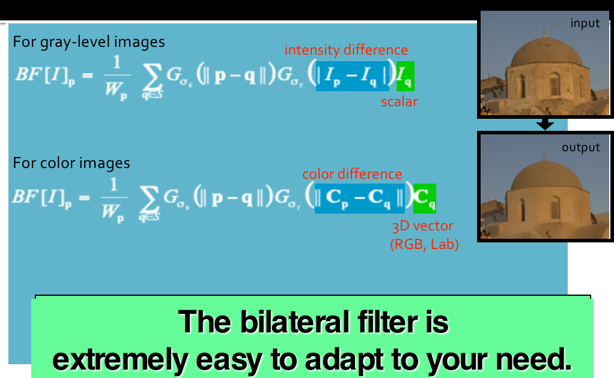

#### Denoising

* **Small** spatial sigma (e.g. 7x7 window)

* Adapt intensity sigma to noise level 
* Maybe not best denoising method, but best simplicity/quality trade-off
* No need for acceleration (small kernel)But the denoising feature in e.g. Photoshop is better

#### Tone mapping

* Match limited contrast of the medium
* Preserve details

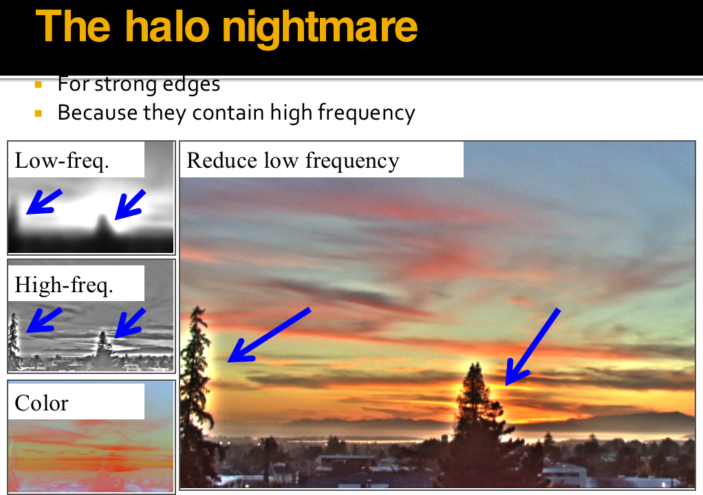

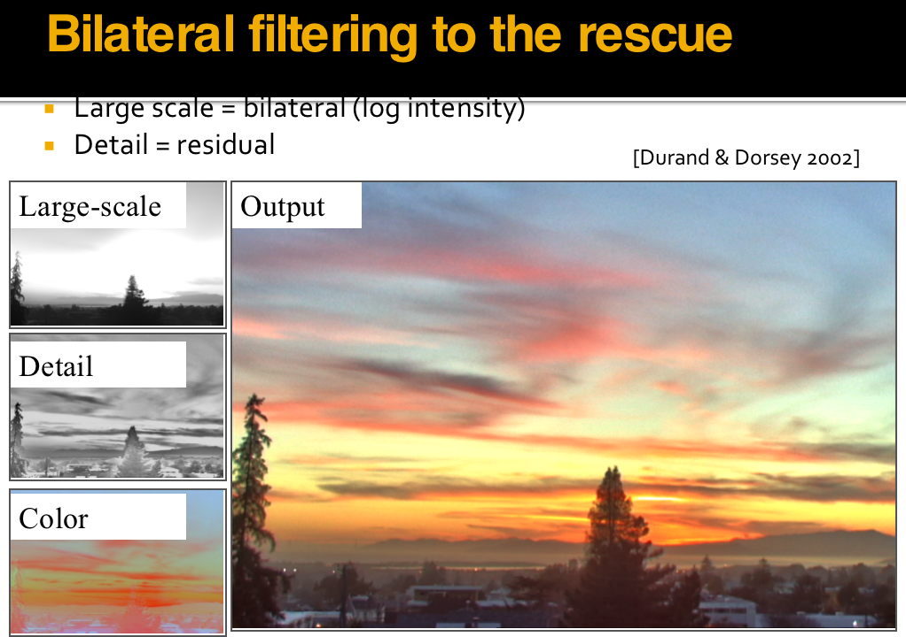

### Disadvantages

* Nonlinear
* Vompex spatially varying kernels
* Connot be pre-computed
* Brute-force implementation is slow
* 梯度翻转

### A Fast Approximation of the bilateral filter using a signal processing approach

#### PreKnowledge

卷积定理告诉我们，在频域中，卷积等价于相乘。所以，在频域中，图像 F*(*u*,*v*) 与滤波核 Hb(u,v)的卷积结果 G(u,v)可以表示为：

$G(u,v)=F(u,v)⋅H_b(u,v)$

参考 https://blog.csdn.net/xijuezhu8128/article/details/111304006

其基本思想就是将非线性的双边滤波改成可分离的线性操作和非线性操作。换句话说，原来的双边滤波在图像不同位置应用不同的权重，也就是**位移改变卷积**，他们通过增加一个维度，也就是将灰度值作为一个新的维度，将双边滤波表达成3D空间中的线性位移不变卷积，最后再执行非线性的归一化操作。

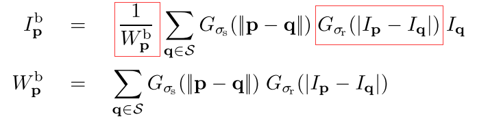

#### Derivation

**(1） 首先将原始双边滤波公式等式左右皆左乘$W_p^b$，并将两个公式通过二维向量表达成单个公式：**

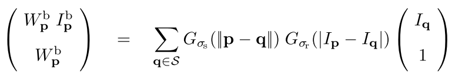

**（2）等式右侧乘以$W_q$，$W_q$=1：**

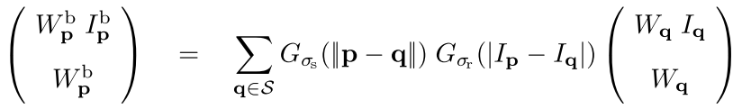

上图中，如果忽略等式右侧的$G_{\sigma_r}(|I_p-I_q|)$这一项，那么该等式表达的就是经典的高斯滤波

可以简写为以下卷积的形式：$\begin{pmatrix}W^bI^b\\W^b\end{pmatrix}=G_{\sigma_r}*\begin{pmatrix}WI\\W\end{pmatrix}$

**（3）增维，增加强度维（也就是灰度值）：**

使用$Kronecker$函数，$\delta$只在$0$点为$1$，其他为0

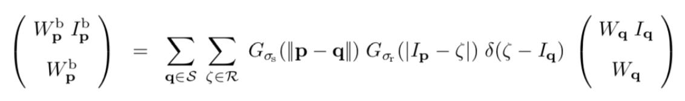

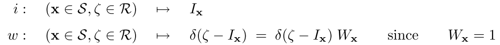

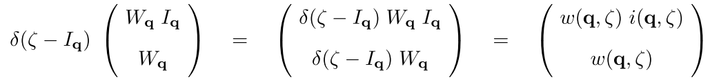

THUS

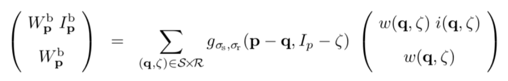

上式可以表达为在点（$p$, $I_p$）位置处三维卷积的形式：

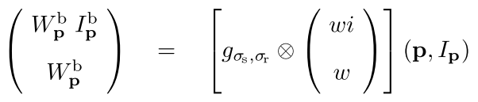

**（5）整个流程：线性卷积+非线性归一化**

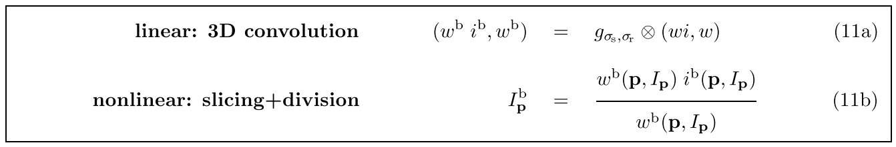

在这个过程中，主要的加速来自于在频域中执行卷积操作。频域卷积通常比时域卷积更快，尤其是在使用快速傅里叶变换（FFT）等高效算法时。

## Guided Filter

* 保持梯度是bilateral（保持的是梯度的绝对值）做不到的，因为会有梯度翻转现象（Preserves edges, but not gradients）而导向滤波可以避免这一缺点

  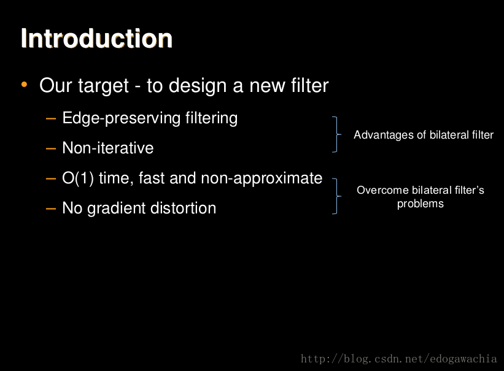

引入 guided image $I$

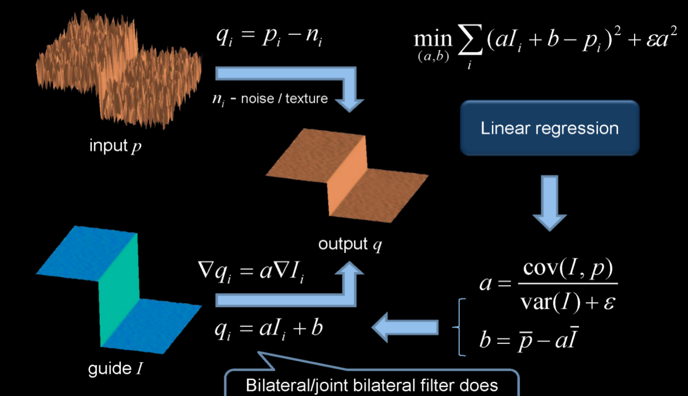

* 保持梯度，so $q_i(output\ image)=aI_i(guided\ image)+b$

* Use Lagrange multiplier method , we can get $a=\frac{cov(I,p)}{var(I)+\epsilon} \ \ \ b=\bar{p}-a\bar{I}$

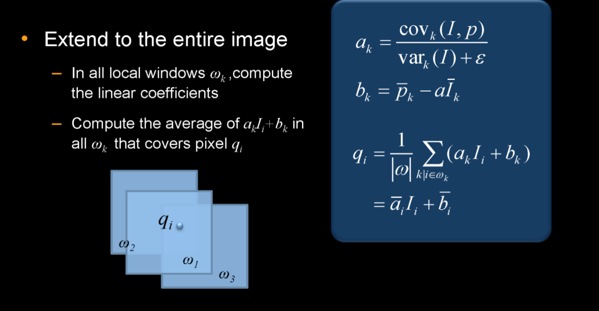

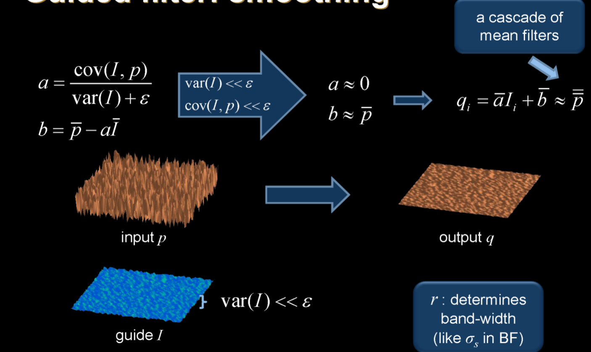

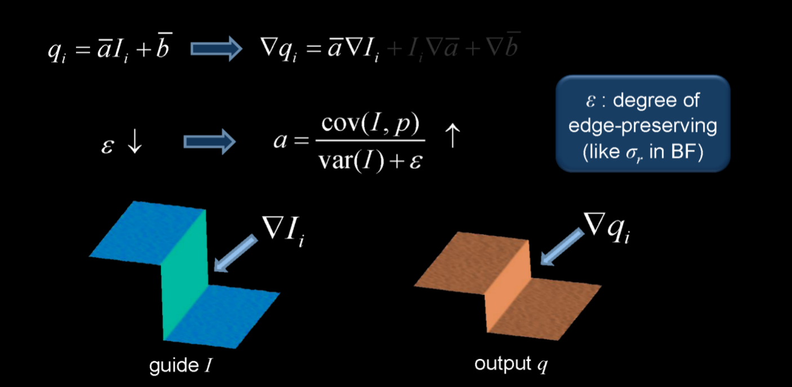

* $\epsilon$ -- Degree of edge preserving !!

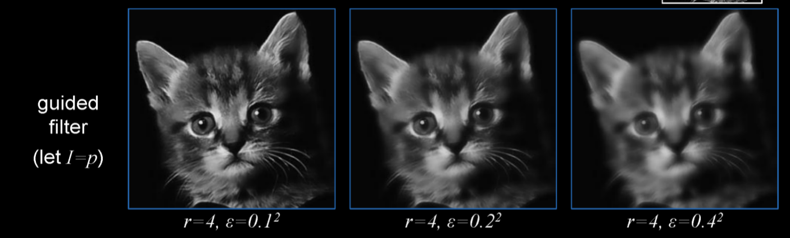

* **No Distortion**

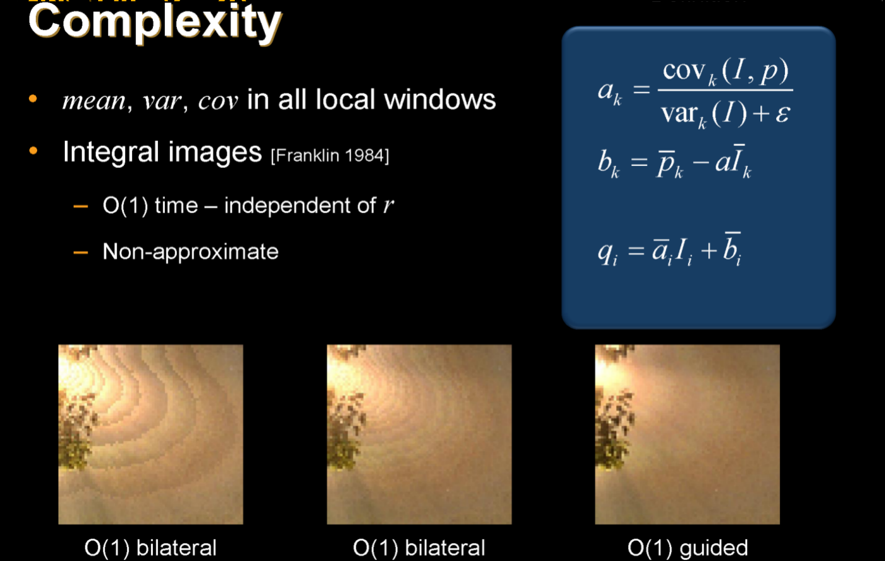

* Limitation : **LOCAL FILTER**

对边缘的定义不清淅，而且边缘是 context-dependent 的。肉眼中的边界，可能不被认为是边界，最终还是会出现 halo 的现象。

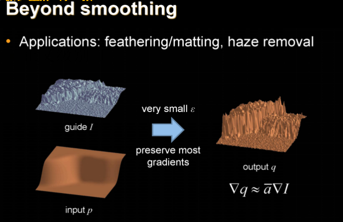

## Sparse Norm Filter

https://note.hobbitqia.cc/dip/dip9/#core-algorithm

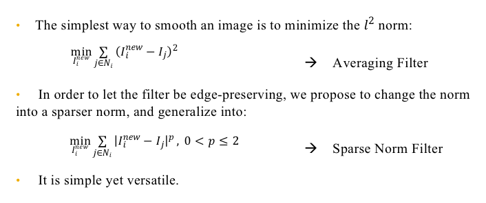

#### p=1

$l^1$ norm filter is the **median filter**(中值滤波)

* Because the diffusion in SNF is **non-local**, it is less likely to be trapped as in gradient descent based algorithms.

#### p=2

$l^2$ norm mean filter(均值滤波)

